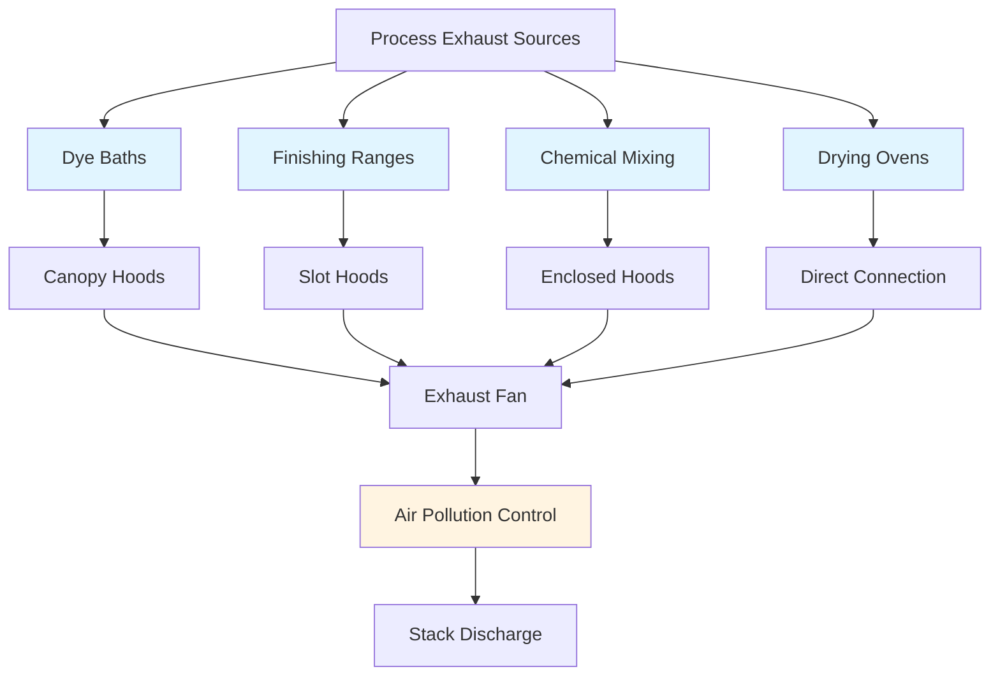
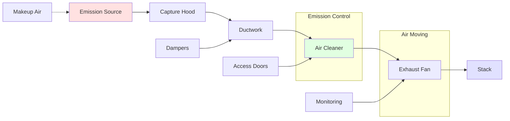

Process exhaust systems in textile dyeing and finishing facilities control chemical vapors, dye aerosols, heat, and humidity from processing equipment. Proper exhaust design protects worker health, maintains product quality, and ensures regulatory compliance with OSHA PELs and ACGIH TLVs.

## Exhaust System Requirements

### Dye Bath Exhaust

Dye baths generate steam, chemical vapors, and aerosols during high-temperature processing. Exhaust hoods must capture emissions at the source before dispersal into the workspace.

**Capture velocity calculations:**

$$V_c = \frac{Q}{A} = \frac{Q}{10 \times X^2 + A_{hood}}$$

where:
- $V_c$ = capture velocity (fpm)
- $Q$ = exhaust flow rate (cfm)
- $X$ = distance from hood face to emission source (ft)
- $A_{hood}$ = hood face area (ft²)

**Required capture velocities by contaminant:**

| Contaminant Type | Capture Velocity | ACGIH Classification |
|------------------|------------------|----------------------|
| Steam and moisture | 50-100 fpm | Low toxicity vapor |
| Dye powder dispersion | 100-200 fpm | Moderate toxicity particulate |
| Solvent vapors | 200-500 fpm | High toxicity vapor |
| Acid/alkali mists | 100-200 fpm | Corrosive aerosol |

### Chemical Vapor Control

Finishing chemicals including formaldehyde resins, softeners, and flame retardants require dedicated exhaust during application and curing.

**Vapor generation rate:**

$$G = \frac{M \times VP \times MW}{R \times T}$$

where:
- $G$ = generation rate (lb/hr)
- $M$ = chemical application rate (gal/hr)
- $VP$ = vapor pressure (mmHg)
- $MW$ = molecular weight (lb/lbmol)
- $R$ = gas constant (10.73 psia·ft³/lbmol·°R)
- $T$ = absolute temperature (°R)

**Required exhaust rates:**

$$Q_{exhaust} = \frac{G \times SF}{C_{max} \times \rho_{air}}$$

where:
- $Q_{exhaust}$ = exhaust flow rate (cfm)
- $SF$ = safety factor (typically 2-5)
- $C_{max}$ = maximum allowable concentration (ppm or mg/m³)
- $\rho_{air}$ = air density (0.075 lb/ft³ at standard conditions)

## Local Exhaust Hood Design

### Hood Types and Applications

### Canopy Hood Sizing

For open dye baths and processing tanks:

$$Q = V_c \times P \times (H + D)$$

where:
- $Q$ = exhaust flow rate (cfm)
- $V_c$ = capture velocity (50-100 fpm for steam)
- $P$ = tank perimeter (ft)
- $H$ = hood height above source (ft)
- $D$ = tank depth (ft)

**Canopy hood overhang requirements:**

| Tank Dimension | Minimum Overhang | Recommended Overhang |
|----------------|------------------|----------------------|
| < 3 ft | 6 inches | 12 inches |
| 3-6 ft | 12 inches | 18 inches |
| > 6 ft | 18 inches | 24 inches |

### Slot Hood Design

For finishing ranges and continuous processes:

$$Q = 50 \times V_{slot} \times L \times W_{slot}$$

where:
- $V_{slot}$ = slot velocity (2000-3000 fpm)
- $L$ = slot length (ft)
- $W_{slot}$ = slot width (typically 1.5-3 inches)

**Slot spacing and plenum design:**

$$S = \sqrt{\frac{2 \times V_{slot}^2}{\rho \times \Delta P}}$$

where:
- $S$ = slot spacing (ft)
- $\Delta P$ = static pressure across slots (in. w.g.)
- $\rho$ = air density (lb/ft³)

## Exhaust System Components

### Duct Velocity Requirements

Minimum transport velocities prevent settling and maintain capture:

| Material Type | Minimum Velocity | Design Velocity |
|---------------|------------------|-----------------|
| Vapors and gases | 1000 fpm | 1500-2000 fpm |
| Fine dusts (dye powder) | 2000 fpm | 2500-3000 fpm |
| Heavy dusts | 3500 fpm | 4000-4500 fpm |
| Sticky aerosols | 2500 fpm | 3000-3500 fpm |

### Static Pressure Calculations

**Total system pressure loss:**

$$SP_{total} = SP_{hood} + SP_{duct} + SP_{fittings} + SP_{cleaner} + SP_{discharge}$$

**Hood entry loss:**

$$SP_{hood} = \frac{V_d^2 \times C_e}{4005}$$

where:
- $SP_{hood}$ = hood static pressure (in. w.g.)
- $V_d$ = duct velocity (fpm)
- $C_e$ = entry loss coefficient (0.25-1.78 depending on hood type)

**Duct friction loss:**

$$SP_{duct} = \frac{f \times L \times V_d^2}{4005 \times D}$$

where:
- $f$ = friction factor (0.02-0.04 for galvanized steel)
- $L$ = duct length (ft)
- $D$ = duct diameter (ft)

## Emission Control Equipment

### Scrubber Selection

Chemical vapors and acid mists require wet scrubbing:

**Scrubber efficiency:**

$$\eta = 1 - e^{-\frac{K \times L \times A}{Q}}$$

where:
- $\eta$ = collection efficiency
- $K$ = mass transfer coefficient
- $L$ = scrubber height (ft)
- $A$ = cross-sectional area (ft²)

**Liquid-to-gas ratio:**

| Contaminant | L/G Ratio | Typical Range |
|-------------|-----------|---------------|
| Acid vapors | 5-20 gal/1000 cfm | 10-15 recommended |
| Alkaline mists | 3-10 gal/1000 cfm | 5-8 recommended |
| Solvent vapors | 10-30 gal/1000 cfm | 15-20 recommended |
| Dye aerosols | 8-15 gal/1000 cfm | 10-12 recommended |

### Carbon Adsorption

For volatile organic compounds (VOCs) from finishing chemicals:

**Bed depth calculation:**

$$D = \frac{Q \times C \times t}{A \times \rho_{carbon} \times W_c}$$

where:
- $D$ = bed depth (ft)
- $C$ = inlet concentration (lb/ft³)
- $t$ = service time (hours)
- $\rho_{carbon}$ = carbon density (25-30 lb/ft³)
- $W_c$ = carbon capacity (typically 0.2-0.4 lb VOC/lb carbon)

## Makeup Air Requirements

Exhaust systems require balanced makeup air to prevent building depressurization:

$$Q_{makeup} = Q_{exhaust} - Q_{infiltration}$$

Maintain building pressure at -0.02 to -0.05 in. w.g. relative to outdoors to contain odors while ensuring adequate makeup air delivery.

**Makeup air temperature:**

$$T_{supply} = T_{room} - \frac{Q_{exhaust} \times (T_{room} - T_{outdoor})}{Q_{makeup} \times \eta_{heat}}$$

where $\eta_{heat}$ accounts for heat recovery efficiency if applicable.

## Design Standards and References

**ACGIH Industrial Ventilation Manual:** Provides hood design criteria, capture velocities, and duct sizing methodology for chemical processes.

**ASHRAE Industrial Ventilation Applications:** Details specific requirements for textile processing exhaust including heat and moisture loads.

**NFPA 91:** Standard for exhaust systems handling flammable vapors common in solvent-based finishing processes.

Proper process exhaust design requires detailed analysis of emission sources, chemical properties, production rates, and regulatory requirements. System performance verification through hood face velocity measurements and worker exposure monitoring ensures adequate protection.
