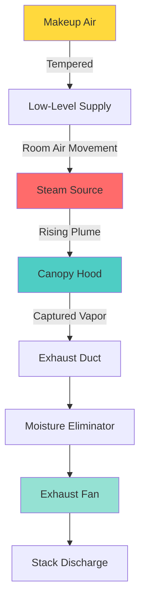
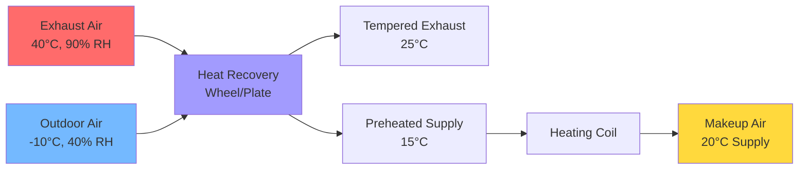

## Overview

Steam and moisture removal in textile dyeing and finishing operations presents critical challenges due to high-temperature saturated vapor releases, condensation risks, and the need for continuous makeup air to maintain production conditions. Proper exhaust system design prevents condensation damage to equipment, maintains worker comfort, and ensures process quality.

## Steam Vapor Generation Rates

### Moisture Load Calculations

Total moisture removal requirements combine evaporative losses from equipment and fugitive emissions:

$$Q_{total} = Q_{evap} + Q_{fugitive} + Q_{process}$$

where:
- $Q_{evap}$ = evaporative moisture load (kg/hr)
- $Q_{fugitive}$ = fugitive steam releases (kg/hr)
- $Q_{process}$ = direct process steam venting (kg/hr)

For dyeing equipment operating at elevated temperatures:

$$Q_{evap} = A \cdot h_{fg} \cdot \frac{(P_{sat,T} - P_{partial})}{P_{atm}}$$

where:
- $A$ = exposed water surface area (m²)
- $h_{fg}$ = latent heat of vaporization (2257 kJ/kg at 100°C)
- $P_{sat,T}$ = saturation pressure at liquid temperature (kPa)
- $P_{partial}$ = partial pressure of water vapor in air (kPa)
- $P_{atm}$ = atmospheric pressure (kPa)

### Equipment-Specific Moisture Release

| Equipment Type | Operating Temp (°C) | Moisture Release (kg/hr) | Notes |
|----------------|---------------------|--------------------------|-------|
| Jet Dyeing Machine | 130-140 | 150-300 | High-pressure vessel with periodic venting |
| Beam Dyeing | 100-120 | 80-150 | Lower pressure, continuous evaporation |
| Jigger Dyeing | 90-100 | 60-120 | Open bath with significant surface evaporation |
| Washing Ranges | 60-90 | 100-200 | Multiple baths with spray operations |
| Stenters (Dryers) | 140-180 | 300-600 | Maximum moisture removal requirement |
| Continuous Washers | 70-85 | 120-180 | Hot water with detergent spray |

## Exhaust System Design

### Canopy Hood Configuration

Hood capture efficiency depends on proper sizing above heat sources:

$$V_{hood} = 1.4 \cdot P \cdot H \cdot \sqrt{T_{plume} - T_{amb}}$$

where:
- $V_{hood}$ = required hood airflow (m³/s)
- $P$ = perimeter of hood opening (m)
- $H$ = distance from source to hood (m)
- $T_{plume}$ = plume temperature (K)
- $T_{amb}$ = ambient temperature (K)

### Ventilation Rate Requirements

| Application | ACH | Exhaust Rate (cfm/ft²) | Hood Face Velocity (fpm) |
|-------------|-----|------------------------|--------------------------|
| Dyeing Machine Area | 15-20 | 2.0-3.0 | 100-150 |
| Washing Equipment | 20-25 | 2.5-4.0 | 125-175 |
| Stenter Dryers | 25-40 | 4.0-6.0 | 150-200 |
| Finishing Area | 12-18 | 1.5-2.5 | 100-125 |
| Chemical Mixing | 20-30 | 3.0-4.5 | 150-200 |

ASHRAE Industrial Ventilation recommendations specify minimum 100 fpm hood face velocity for effective steam capture with non-hazardous moisture loads.

## Condensation Prevention

### Dewpoint Management

Condensation occurs when duct interior surface temperature falls below the dewpoint of transported vapor. Critical prevention strategies include:

1. **Duct Insulation**: Minimum R-8 thermal resistance for exhaust ducts in conditioned spaces
2. **Slope Requirements**: 2% minimum slope toward drainage points
3. **Condensate Drains**: Install at all low points and vertical rises

Condensation rate on uninsulated ducts:

$$\dot{m}_{cond} = \frac{h_{conv} \cdot A_{duct} \cdot (T_{vapor} - T_{surface})}{h_{fg}}$$

where:
- $\dot{m}_{cond}$ = condensation rate (kg/s)
- $h_{conv}$ = convective heat transfer coefficient (W/m²·K)
- $A_{duct}$ = duct interior surface area (m²)
- $T_{vapor}$ = vapor temperature (K)
- $T_{surface}$ = duct surface temperature (K)

### Moisture Eliminator Efficiency

Install moisture eliminators upstream of fans when relative humidity exceeds 90%:

$$\eta_{eliminator} = 1 - e^{-\frac{L \cdot v}{d_p^2}}$$

where:
- $\eta_{eliminator}$ = collection efficiency (fraction)
- $L$ = eliminator depth (m)
- $v$ = face velocity (m/s)
- $d_p$ = droplet diameter (μm)

## Makeup Air Systems

### Heat Recovery Considerations

Makeup air must balance exhaust while preventing excessive building pressurization:

$$Q_{makeup} = Q_{exhaust} - Q_{infiltration}$$

Typical makeup air ratio: 85-95% of exhaust volume to maintain slight negative pressure (-0.02 to -0.05 in. w.g.) preventing steam migration to adjacent areas.

### Heating Load Calculation

Winter makeup air heating load:

$$Q_{heating} = \dot{m}_{air} \cdot c_p \cdot (T_{supply} - T_{outdoor})$$

where:
- $Q_{heating}$ = heating load (kW)
- $\dot{m}_{air}$ = makeup air mass flow (kg/s)
- $c_p$ = specific heat of air (1.006 kJ/kg·K)
- $T_{supply}$ = desired supply temperature (typically 20°C)
- $T_{outdoor}$ = outdoor design temperature (°C)

For a facility exhausting 50,000 cfm at -20°C outdoor design conditions, makeup air heating load reaches approximately 1,750 kW (5.0 million BTU/hr), representing substantial operating cost.

## Design Recommendations

**Hood Placement**: Position canopy hoods 0.9-1.2 m above steam sources with minimum 0.15 m overhang on all sides.

**Duct Velocity**: Maintain 15-20 m/s (3,000-4,000 fpm) to prevent condensate accumulation and ensure drainage to collection points.

**Material Selection**: Use stainless steel (304 or 316) for ducts exposed to saturated steam and chemical vapors.

**Fan Selection**: Specify fan wheel and housing materials resistant to moisture and elevated temperatures (60-80°C typical).

**Controls**: Implement variable frequency drives on exhaust fans with dewpoint or humidity sensors to modulate airflow based on actual moisture generation.

## References

ASHRAE Industrial Ventilation Handbook provides detailed hood design criteria and capture velocity requirements for textile processing applications with high moisture loads.