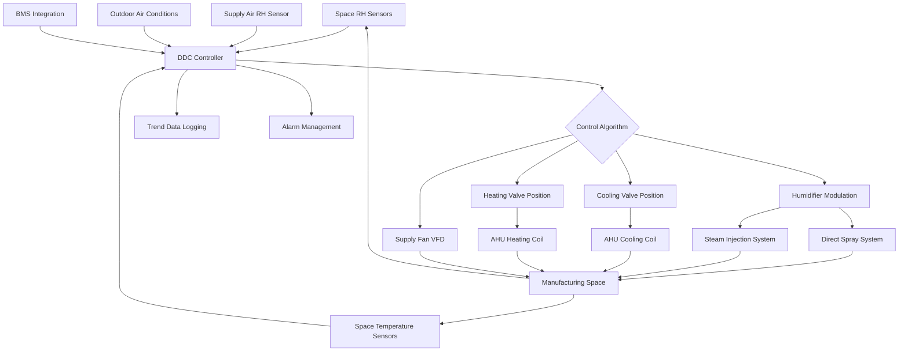
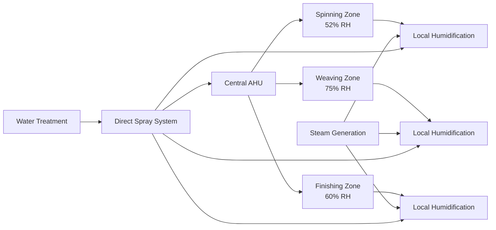

Humidity control represents the most critical environmental parameter in textile manufacturing, directly affecting fiber properties, processing efficiency, production quality, and economic performance. Unlike most industrial applications where humidity is a secondary concern, textile processing demands precision moisture control within narrow tolerances throughout production stages.

## Critical Importance of Humidity Control

Textile fibers exhibit hygroscopic behavior, meaning their moisture content equilibrates with surrounding air conditions. This moisture regain directly influences fiber tensile strength, elasticity, electrical conductivity, and dimensional stability. Insufficient humidity causes static electricity accumulation, increased fiber breakage, poor dye uptake, and dimensional instability. Excessive humidity promotes microbial growth, equipment corrosion, and condensation issues.

The economic impact of improper humidity control is substantial. Production losses from fiber breakage in spinning operations can reach 15-25% under low humidity conditions. Static electricity generation below 40% RH causes fiber clinging, lapping around machinery, and compromised yarn quality. Each 1% decrease in relative humidity below optimal levels can reduce production efficiency by 2-3% in spinning operations.

## Humidity Requirements by Process

Different textile processes require specific humidity conditions based on fiber type and processing stage. The following table presents ASHRAE-referenced humidity requirements:

| Process Stage | Temperature (°F) | Relative Humidity (%) | Tolerance (±%) |
|---------------|------------------|----------------------|----------------|
| Cotton Spinning | 75-82 | 50-55 | 2.5 |
| Wool Spinning | 65-70 | 60-65 | 2.5 |
| Synthetic Spinning | 70-75 | 35-40 | 2.5 |
| Weaving Cotton | 75-80 | 70-80 | 5.0 |
| Weaving Wool | 70-75 | 60-70 | 5.0 |
| Weaving Synthetic | 72-78 | 45-55 | 5.0 |
| Winding/Warping | 70-75 | 60-65 | 2.5 |
| Dyeing | 75-85 | 65-75 | 5.0 |
| Finishing | 70-80 | 55-65 | 5.0 |
| Inspection | 70-75 | 65 | 2.5 |

Cotton processing requires higher humidity due to its hygroscopic nature and tendency toward static buildup. Synthetic fibers, being less hygroscopic, require lower humidity but face greater static electricity challenges. Wool processing demands moderate conditions to prevent fiber damage while maintaining workability.

## Psychrometric Calculations for Moisture Control

The moisture addition required for textile facility humidification is calculated using psychrometric relationships:

$$\dot{m}_w = \dot{V} \cdot \rho_{air} \cdot (\omega_2 - \omega_1)$$

Where:
- $\dot{m}_w$ = moisture addition rate (lb/hr)
- $\dot{V}$ = airflow rate (CFM)
- $\rho_{air}$ = air density (lb/ft³)
- $\omega_1$ = inlet humidity ratio (lb moisture/lb dry air)
- $\omega_2$ = required humidity ratio (lb moisture/lb dry air)

The humidity ratio at specific conditions is determined from relative humidity:

$$\omega = 0.622 \cdot \frac{RH \cdot P_{sat}}{P_{atm} - RH \cdot P_{sat}}$$

Where:
- $RH$ = relative humidity (decimal)
- $P_{sat}$ = saturation pressure at dry-bulb temperature (psia)
- $P_{atm}$ = atmospheric pressure (psia)

For a typical cotton spinning facility operating at 78°F and requiring 52% RH with outdoor conditions at 78°F and 30% RH, supplying 100,000 CFM:

$$\omega_1 = 0.622 \cdot \frac{0.30 \times 0.459}{14.7 - 0.30 \times 0.459} = 0.0058 \text{ lb/lb}$$

$$\omega_2 = 0.622 \cdot \frac{0.52 \times 0.459}{14.7 - 0.52 \times 0.459} = 0.0101 \text{ lb/lb}$$

$$\dot{m}_w = 100,000 \times 60 \times 0.075 \times (0.0101 - 0.0058) = 1,935 \text{ lb/hr}$$

## Humidification System Technologies

Multiple humidification technologies serve textile applications, each with distinct performance characteristics:

**Direct Spray Humidifiers** atomize water directly into airstreams using high-pressure nozzles (800-3,000 psi). These systems provide rapid moisture addition with minimal temperature change, achieving adiabatic saturation effectiveness of 85-95%. The evaporative cooling effect reduces sensible cooling loads by approximately 850 BTU per pound of water evaporated.

**Steam Injection Systems** introduce clean steam from dedicated boilers or heat exchangers into supply air or directly into manufacturing spaces. Steam humidification provides isothermal moisture addition without cooling effects, critical for temperature-sensitive processes. Steam consumption follows:

$$\dot{m}_{steam} = \dot{m}_w \cdot \frac{h_{fg}}{h_{steam} - h_{water}}$$

**Ultrasonic Atomization** generates fine water droplets (1-5 micron) through high-frequency vibration, enabling rapid evaporation and uniform distribution. These systems operate efficiently at low pressure but require demineralized water to prevent white dust formation from dissolved solids.

**Wetted Media Evaporative Systems** pass air through water-saturated porous media, providing adiabatic humidification with filtration benefits. Evaporative effectiveness typically reaches 70-85% with minimal maintenance requirements.

## Control System Architecture

Precise humidity control requires integrated measurement, control logic, and modulating actuators operating continuously.

The control sequence implements cascaded proportional-integral-derivative (PID) loops:

$$u(t) = K_p \cdot e(t) + K_i \int_0^t e(\tau)d\tau + K_d \frac{de(t)}{dt}$$

Where:
- $u(t)$ = control output signal
- $e(t)$ = error between setpoint and measured value
- $K_p$, $K_i$, $K_d$ = proportional, integral, derivative gains

Primary control monitors space relative humidity with typical gains of $K_p = 5$, $K_i = 0.5$, $K_d = 1$ for stable response without oscillation. Secondary loops compensate for temperature variations and outdoor condition changes.

## Zoning and Distribution Strategies

Large textile facilities require strategic zoning to accommodate varying humidity requirements across process areas.

Central air handling systems provide base conditioning with localized supplemental humidification addressing specific zone requirements. This hybrid approach optimizes energy consumption while maintaining precision control. Distribution ductwork requires vapor barriers and proper insulation to prevent condensation in high-humidity zones, typically requiring 2-inch closed-cell insulation with vapor retarder facing for ducts carrying air above 60% RH.

## Energy Optimization Considerations

Humidification represents significant energy consumption in textile facilities, typically accounting for 20-35% of total HVAC energy use. Water heating for direct spray systems requires approximately 1,000 BTU per pound of water raised from 50°F to 90°F optimal spray temperature. Steam generation consumes approximately 1,050 BTU per pound of steam at atmospheric pressure.

Energy recovery from exhaust air through enthalpy wheels or runaround loops recovers 60-75% of sensible and latent energy, substantially reducing humidification loads. High-efficiency spray nozzles minimize compressed air or pump energy while maximizing evaporation effectiveness.

Humidity control in textile manufacturing demands engineering precision, appropriate technology selection, and vigilant operational oversight to maintain fiber quality, production efficiency, and economic viability throughout diverse processing operations.
