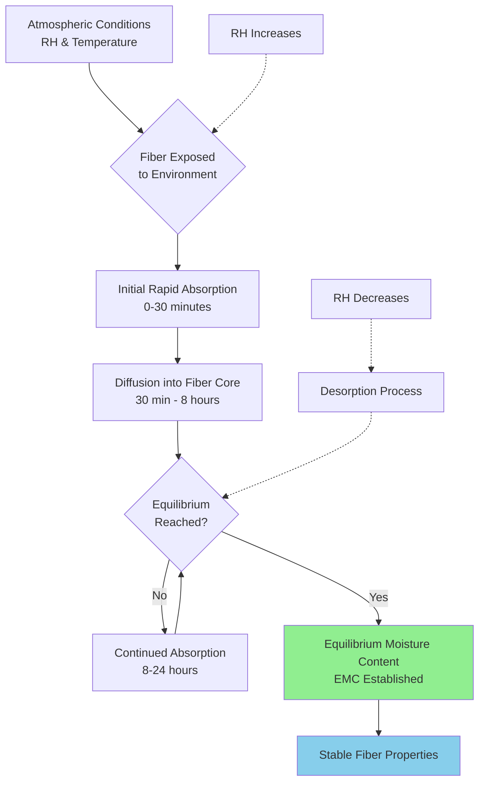
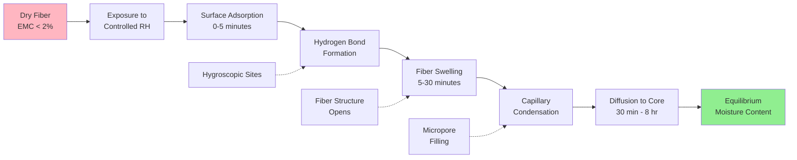

## Fundamentals of Fiber Moisture Pickup

Fiber moisture pickup represents the hygroscopic absorption of water vapor from surrounding air by textile fibers. This phenomenon directly impacts fiber weight, dimensional stability, mechanical properties, and processing efficiency. The moisture content at equilibrium depends on fiber chemistry, ambient relative humidity, and temperature according to sorption isotherm relationships.

Understanding moisture regain is critical for HVAC system design in textile facilities, as improper humidity control causes processing defects, static electricity problems, fiber breakage, and economic losses due to weight variations in finished goods.

## Moisture Regain Definition and Calculation

Moisture regain quantifies the mass of water absorbed by completely dry fiber, expressed as a percentage of the bone-dry fiber weight:

$$R = \frac{W_w - W_d}{W_d} \times 100$$

Where:
- $R$ = moisture regain (%)
- $W_w$ = weight of fiber at specified conditions (lb or kg)
- $W_d$ = bone-dry fiber weight (lb or kg)

The alternative metric, moisture content, references wet weight:

$$MC = \frac{W_w - W_d}{W_w} \times 100$$

The relationship between regain and moisture content:

$$R = \frac{MC}{100 - MC} \times 100$$

For commercial transactions, standard moisture regain values are established at 65% RH and 70°F (21°C), as specified in ASTM D1909.

## Hygroscopic Behavior and Sorption Mechanisms

Textile fibers absorb moisture through multiple physical mechanisms:

**Primary Water**: Directly bonded to polar groups (hydroxyl, amino, carboxyl) via hydrogen bonds. This water is tightly bound and difficult to remove.

**Secondary Water**: Absorbed into fiber structure through capillary condensation in micropores and interfibrillar spaces. Removal occurs more readily than primary water.

**Tertiary Water**: Surface condensation at high relative humidity levels, particularly above 85% RH.

The rate of moisture absorption follows Fickian diffusion principles at lower humidity levels:

$$\frac{\partial C}{\partial t} = D \frac{\partial^2 C}{\partial x^2}$$

Where:
- $C$ = moisture concentration
- $t$ = time
- $D$ = diffusion coefficient (cm²/s)
- $x$ = distance into fiber

The diffusion coefficient increases exponentially with temperature and varies significantly between fiber types.

## Standard Regain Values by Fiber Type

The following table presents commercial moisture regain values at standard atmospheric conditions (65% RH, 70°F):

| Fiber Type | Standard Regain (%) | Typical Range (%) | Hygroscopic Classification |
|------------|--------------------:|------------------:|---------------------------|
| Cotton | 8.5 | 7.0-9.0 | Moderately Hygroscopic |
| Wool | 16.0 | 13.0-18.0 | Highly Hygroscopic |
| Silk | 11.0 | 10.0-12.0 | Highly Hygroscopic |
| Linen (Flax) | 12.0 | 10.0-14.0 | Highly Hygroscopic |
| Rayon (Viscose) | 13.0 | 11.0-14.0 | Highly Hygroscopic |
| Acetate | 6.5 | 6.0-7.0 | Moderately Hygroscopic |
| Nylon 6,6 | 4.5 | 3.5-5.0 | Slightly Hygroscopic |
| Polyester | 0.4 | 0.2-0.6 | Non-Hygroscopic |
| Acrylic | 2.0 | 1.5-2.5 | Slightly Hygroscopic |
| Polypropylene | 0.0 | 0.0-0.1 | Non-Hygroscopic |

## Equilibrium Moisture Content Dynamics

Equilibrium moisture content (EMC) develops when the vapor pressure of water in the fiber equals the partial pressure of water vapor in surrounding air. Time to equilibrium ranges from 4 hours for fine fibers to 24+ hours for dense fiber assemblies.

**Hysteresis Effect**: Fibers exhibit different moisture content during absorption versus desorption at the same relative humidity. Desorption curves show 1-3% higher moisture content than absorption curves, creating a hysteresis loop in sorption isotherms.

## Moisture Absorption Process Flow

## Impact on Textile Processing Operations

**Spinning**: Cotton fibers at 6-7% regain exhibit excessive breakage; optimal spinning requires 7.5-8.5% regain at 55-65% RH. Synthetic blends require lower humidity to prevent differential moisture absorption.

**Weaving**: Warp yarn requires 6-9% moisture for flexibility and strength. Low regain causes brittleness and end breaks. High regain reduces friction and causes slack tension.

**Dyeing**: Fiber moisture content affects dye uptake rate and final color depth. Wet processing requires pre-conditioning to consistent regain levels for uniform results.

**Finishing**: Dimensional stability during finishing depends on equilibrium moisture content matching end-use conditions. Relaxation shrinkage correlates with moisture differential between processing and final environment.

## HVAC Design Implications

ASHRAE Industrial Ventilation guidance (Chapter 30) specifies humidity control requirements:

1. **Cotton Processing**: Maintain 50-65% RH, 75-85°F for optimal 8% regain
2. **Wool Processing**: Maintain 60-70% RH, 65-75°F for 14-16% regain
3. **Synthetic Processing**: Maintain 40-50% RH, 70-80°F to minimize static

**Psychrometric Control Strategy**:

$$q_{humidification} = \dot{m}_{air} \times (W_2 - W_1)$$

Where:
- $q_{humidification}$ = moisture addition rate (lb/hr)
- $\dot{m}_{air}$ = air mass flow rate (lb/hr)
- $W_2$ = target humidity ratio (lb water/lb dry air)
- $W_1$ = supply air humidity ratio (lb water/lb dry air)

Moisture load calculations must account for ventilation air, fiber drying processes, and seasonal variations. Humidification systems require precise control to ±3% RH to maintain consistent regain across production zones.

**Economic Considerations**: A 1% change in moisture regain for 10,000 lb/day cotton production represents 100 lb/day weight variation, significant for commercial transactions based on conditioned weight.

## References

- ASHRAE Handbook - HVAC Applications, Chapter 30: Industrial Ventilation
- ASTM D1909: Standard Tables of Commercial Moisture Regains for Textile Fibers
- Textile Institute Moisture Regain Standards
