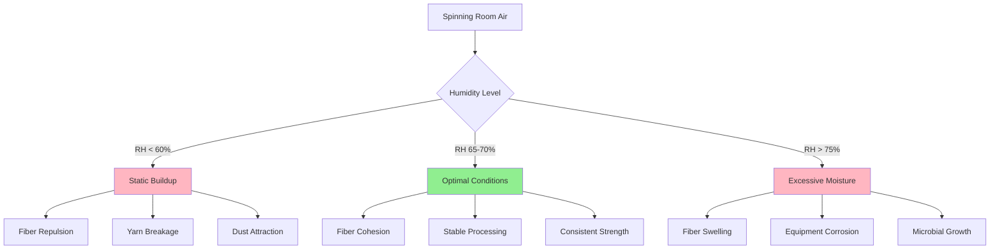
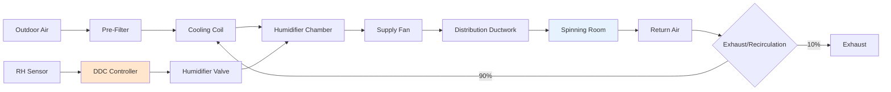

## Optimal Humidity Range for Spinning Operations

Spinning operations require precise humidity control between **65-70% RH** to maintain fiber properties critical for yarn formation. This range optimizes fiber cohesion, minimizes static electricity, and maintains consistent tensile strength across natural and synthetic fibers. Deviations below 60% RH result in increased breakage rates, static buildup, and fiber brittleness, while conditions above 75% RH cause fiber swelling, equipment corrosion, and microbial growth.

The moisture regain of textile fibers directly influences spinning performance. At 65-70% RH and 70-75°F, fibers achieve equilibrium moisture content that provides optimal flexibility without excessive plasticization.

## Fiber Moisture Regain at Standard Conditions

Moisture regain percentage determines fiber behavior during mechanical processing:

$$R = \frac{W_w - W_d}{W_d} \times 100$$

Where:
- $R$ = moisture regain (%)
- $W_w$ = weight of moist fiber (g)
- $W_d$ = oven-dry weight (g)

### Fiber-Specific Humidity Requirements

| Fiber Type | Optimal RH (%) | Temperature (°F) | Regain @ 65% RH (%) | Static Sensitivity |
|------------|---------------|------------------|---------------------|-------------------|
| Cotton | 65-70 | 75-80 | 7.0-8.5 | Moderate |
| Wool | 60-65 | 65-70 | 13.5-16.0 | Low |
| Polyester | 50-60 | 70-75 | 0.4-0.5 | Very High |
| Nylon 6,6 | 55-65 | 70-75 | 4.0-4.5 | High |
| Rayon | 65-70 | 75-80 | 11.0-13.0 | Moderate |
| Acrylic | 50-60 | 70-75 | 1.5-2.5 | Very High |
| Silk | 60-65 | 70-75 | 11.0-11.5 | Low |

ASHRAE Industrial Ventilation and Air Conditioning recommends these conditions for standard spinning operations with ±2% RH tolerance.

## Static Electricity Control

Static charge accumulation increases exponentially when RH drops below 50%. The relationship between surface resistivity and relative humidity follows:

$$\log(\rho_s) = A - B \cdot RH$$

Where:
- $\rho_s$ = surface resistivity (Ω/square)
- $A, B$ = material-specific constants
- $RH$ = relative humidity (decimal)

For polyester at 40% RH, surface resistivity reaches 10¹⁴ Ω/square, causing fiber-to-fiber repulsion and wrap formation on spinning components. At 65% RH, resistivity decreases to 10¹¹ Ω/square, reducing electrostatic discharge events by 95%.

## Fiber Cohesion and Tensile Strength

Moisture content creates hydrogen bonding between fiber molecules, increasing inter-fiber friction necessary for yarn formation. The cohesive force relationship:

$$F_c = \mu \cdot N \cdot (1 + k \cdot M)$$

Where:
- $F_c$ = cohesive force (N)
- $\mu$ = fiber-to-fiber friction coefficient
- $N$ = normal force (N)
- $k$ = moisture sensitivity constant
- $M$ = moisture content (%)

Cotton fibers at 8% moisture content (65% RH) exhibit 40% higher inter-fiber friction compared to 4% moisture content (30% RH), directly improving sliver cohesion during drafting operations.

## HVAC System Requirements

Maintaining 65-70% RH in spinning rooms requires:

**Humidification Capacity:**

$$\dot{m}_w = \frac{\dot{V} \cdot \rho \cdot (W_{target} - W_{supply})}{3600}$$

Where:
- $\dot{m}_w$ = water addition rate (lb/hr)
- $\dot{V}$ = airflow rate (CFM)
- $\rho$ = air density (lb/ft³)
- $W$ = humidity ratio (lb water/lb dry air)

For a 50,000 ft² spinning room with 15 air changes per hour, typical humidification loads range from 800-1,200 lb/hr depending on outdoor air moisture content.

## Control Strategy for Stable RH

**Proportional-Integral Control:**

$$u(t) = K_p \cdot e(t) + K_i \int_0^t e(\tau) d\tau$$

Where:
- $u(t)$ = control signal
- $K_p$ = proportional gain (typically 0.5-1.5)
- $K_i$ = integral gain (typically 0.1-0.3)
- $e(t)$ = error signal (RH setpoint - RH actual)

Dead band control of ±1% RH prevents excessive valve cycling while maintaining conditions within the 65-70% operating window. Sensor placement at breathing height (4-5 ft) in the spinning zone provides accurate feedback, avoiding ceiling stratification effects.

## Critical Design Considerations

**Spatial Distribution:**
Humidity uniformity across the spinning floor must remain within ±3% RH. Large rooms require multiple humidification zones with individual control loops.

**Water Quality:**
Reverse osmosis water (TDS < 50 ppm) prevents mineral deposition on spindles and prevents white dust formation from atomizing humidifiers.

**Energy Recovery:**
Enthalpy wheels recover 60-70% of conditioning energy from exhaust air, reducing annual operating costs by $0.15-0.25/ft² in moderate climates.

**Monitoring:**
Continuous RH monitoring at 8-12 locations per 10,000 ft² ensures early detection of system failures before yarn quality degradation occurs.

ASHRAE Industrial Ventilation standards specify verification testing at commissioning and quarterly calibration of humidity sensors to maintain ±2% accuracy throughout the spinning zone.
