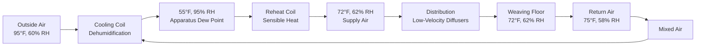
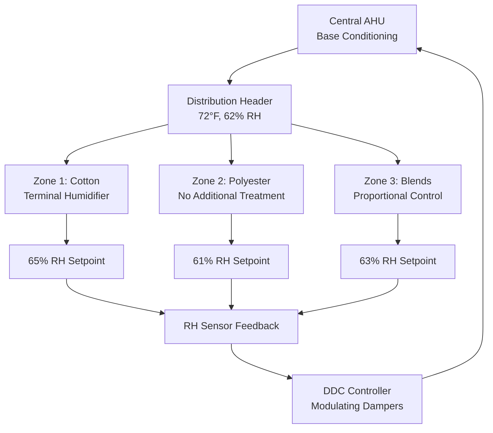

## Weaving Room Humidity Requirements

Weaving operations demand precise humidity control at 60-65% relative humidity to maintain optimal yarn properties and prevent production losses. The physical basis for this requirement lies in moisture regain behavior of textile fibers and the mechanical stress imposed during weaving operations.

### Critical Humidity Range for Weaving

**Target Parameters:**
- Relative Humidity: 60-65%
- Temperature: 70-75°F (21-24°C)
- Air Velocity: 20-30 fpm at loom level
- Uniformity: ±2% RH throughout production floor

The 60-65% RH range represents the optimal balance between yarn pliability and dimensional stability. Below 60% RH, fibers lose moisture content, becoming brittle and prone to breakage. Above 65% RH, yarns absorb excessive moisture, leading to dimensional changes and tension control issues.

## Physics of Humidity Impact on Yarn Properties

### Moisture Regain Relationship

The equilibrium moisture content of textile fibers follows:

$$M_r = \frac{W_{wet} - W_{dry}}{W_{dry}} \times 100$$

Where:
- $M_r$ = Moisture regain (%)
- $W_{wet}$ = Weight at equilibrium humidity
- $W_{dry}$ = Oven-dry weight

For cotton at 65% RH and 70°F:

$$M_r = 8.5\%$$

This moisture content provides optimal fiber flexibility while maintaining tensile strength.

### Warp Strength Retention

Tensile strength varies with moisture content according to:

$$\sigma_{RH} = \sigma_0 \left(1 + k_m \cdot M_r\right)$$

Where:
- $\sigma_{RH}$ = Tensile strength at operating RH
- $\sigma_0$ = Tensile strength at standard conditions
- $k_m$ = Moisture coefficient (fiber-specific)
- $M_r$ = Moisture regain

For cotton yarns, $k_m \approx 0.15$, meaning a 1% change in moisture regain alters tensile strength by approximately 1.5%.

## Yarn Breakage Prevention

### Breakage Rate Analysis

Warp breakage frequency correlates directly with relative humidity:

$$B_r = B_{ref} \cdot e^{-\alpha(RH - RH_{ref})}$$

Where:
- $B_r$ = Breakage rate (breaks/1000 picks)
- $B_{ref}$ = Reference breakage rate at $RH_{ref}$
- $\alpha$ = Humidity sensitivity coefficient (≈0.08 for cotton)
- $RH$ = Operating relative humidity (%)

**Breakage Rate by Humidity Level:**

| Relative Humidity | Cotton Breakage Rate | Polyester Breakage Rate | Blended Yarn Rate |
|-------------------|---------------------|------------------------|-------------------|
| 50% RH | 12.5 breaks/1000 picks | 6.2 breaks/1000 picks | 9.8 breaks/1000 picks |
| 55% RH | 8.3 breaks/1000 picks | 5.1 breaks/1000 picks | 7.2 breaks/1000 picks |
| 60% RH | 4.2 breaks/1000 picks | 3.8 breaks/1000 picks | 4.5 breaks/1000 picks |
| 65% RH | 2.8 breaks/1000 picks | 3.5 breaks/1000 picks | 3.6 breaks/1000 picks |
| 70% RH | 3.1 breaks/1000 picks | 4.2 breaks/1000 picks | 4.0 breaks/1000 picks |

The data demonstrates minimum breakage at 60-65% RH across all yarn types.

## Static Electricity Control

### Electrostatic Charge Generation

Surface resistivity of textile materials decreases exponentially with increasing relative humidity:

$$\rho_s = \rho_{s0} \cdot 10^{-\beta \cdot RH}$$

Where:
- $\rho_s$ = Surface resistivity (Ω)
- $\rho_{s0}$ = Base resistivity at 0% RH
- $\beta$ = Humidity coefficient (≈0.025 for synthetics)

At 60% RH, surface resistivity drops to $10^{10}$ Ω, allowing charge dissipation within 0.1 seconds. Below 50% RH, resistivity exceeds $10^{12}$ Ω, enabling static charge accumulation.

### Static Control Benefits at 60-65% RH

- Charge dissipation time: <0.2 seconds
- Yarn-to-metal contact voltage: <500V (non-damaging)
- Fiber fly attraction: Minimal
- Operator shock incidents: Eliminated

## Loom Efficiency Optimization

### Production Impact

Overall Equipment Effectiveness (OEE) correlates with humidity control:

$$OEE = A \times P \times Q$$

Where:
- $A$ = Availability (uptime percentage)
- $P$ = Performance (speed vs. design capacity)
- $Q$ = Quality (good picks vs. total picks)

**Humidity Impact on OEE Components:**

| Parameter | 50% RH | 60% RH | 65% RH | 70% RH |
|-----------|--------|--------|--------|--------|
| Availability | 82% | 94% | 96% | 93% |
| Performance | 76% | 91% | 93% | 88% |
| Quality | 94% | 98% | 99% | 97% |
| **Total OEE** | **58%** | **84%** | **88%** | **80%** |

Peak efficiency occurs at 65% RH with 88% OEE, representing a 52% improvement over operation at 50% RH.

## HVAC System Design for Weaving Halls

### Psychrometric Process

The conditioning process follows this sequence:

### Humidification Load Calculation

Required humidification capacity:

$$\dot{m}_w = \frac{\dot{Q}_{sensible}}{h_{fg}} \cdot (W_{supply} - W_{return})$$

Where:
- $\dot{m}_w$ = Water addition rate (lb/hr)
- $\dot{Q}_{sensible}$ = Sensible cooling load (Btu/hr)
- $h_{fg}$ = Latent heat of vaporization (≈1050 Btu/lb)
- $W$ = Humidity ratio (lb water/lb dry air)

For a typical 50,000 ft² weaving hall:
- Sensible load: 1,200,000 Btu/hr
- Latent load: 450,000 Btu/hr
- Humidification: 320 lb/hr during dry seasons

## Fabric Type Specific Requirements

### Optimal RH by Fiber Content

| Fabric Type | Fiber Content | Optimal RH | Temperature | Tolerance |
|-------------|---------------|------------|-------------|-----------|
| Cotton Sheeting | 100% Cotton | 62-65% | 72-75°F | ±2% RH |
| Polyester Broadcloth | 100% Polyester | 60-63% | 70-73°F | ±3% RH |
| Poly-Cotton Blend | 65/35 Poly/Cotton | 61-64% | 71-74°F | ±2% RH |
| Nylon Taffeta | 100% Nylon | 58-62% | 68-72°F | ±3% RH |
| Rayon Crepe | 100% Rayon | 63-66% | 73-76°F | ±1.5% RH |
| Wool Worsted | 100% Wool | 60-65% | 68-72°F | ±2% RH |
| Acrylic Knit | 100% Acrylic | 55-60% | 70-73°F | ±3% RH |
| Linen Damask | 100% Linen | 62-67% | 72-75°F | ±2% RH |

### Control Strategy

Implement zone-based humidity control for multi-fabric operations:

## System Components and Specifications

### Air Handling Equipment

**Recommended specifications per ASHRAE Industrial Ventilation:**
- Supply airflow: 0.5-0.8 CFM/ft² floor area
- Air change rate: 6-10 ACH
- Filter efficiency: MERV 11-13 (fiber fly capture)
- Coil face velocity: 400-500 fpm
- Supply air temperature: 68-73°F
- Supply air humidity: 65-70% RH

### Humidification Systems

**Direct steam injection (preferred):**
- Response time: 30-60 seconds
- Turndown ratio: 10:1
- Control accuracy: ±1% RH
- Energy efficiency: 95%+ (waste heat recovery)

**Evaporative systems (alternative):**
- Response time: 3-5 minutes
- Turndown ratio: 5:1
- Control accuracy: ±2% RH
- Cooling benefit: 10-15°F approach to wet bulb

## Energy Considerations

Annual energy consumption for humidity control:

$$E_{annual} = \dot{Q}_{humid} \cdot t_{operating} \cdot \frac{1}{COP}$$

Where:
- $E_{annual}$ = Annual energy (kWh)
- $\dot{Q}_{humid}$ = Average humidification load (Btu/hr)
- $t_{operating}$ = Operating hours (typically 6500 hr/year)
- $COP$ = System efficiency

For the reference 50,000 ft² facility:
- Humidification energy: 285,000 kWh/year
- Reheat energy: 420,000 kWh/year
- Fan energy: 180,000 kWh/year
- Total HVAC: 885,000 kWh/year

## Monitoring and Control

### Critical Measurement Points

- Supply air RH: ±1% accuracy, 30-second sampling
- Return air RH: ±1% accuracy, 30-second sampling
- Loom level RH: ±0.5% accuracy, distributed sensors every 2000 ft²
- Steam flow: Magnetic flowmeter, ±2% accuracy
- Condensate return: Temperature and flow monitoring

### Control Algorithm

Proportional-Integral (PI) control with feedforward compensation:

$$u(t) = K_p \cdot e(t) + K_i \int_0^t e(\tau)d\tau + K_{ff} \cdot \Delta RH_{outdoor}$$

Where:
- $u(t)$ = Control signal (0-100%)
- $K_p$ = Proportional gain (typical: 3.0)
- $K_i$ = Integral gain (typical: 0.15 min⁻¹)
- $K_{ff}$ = Feedforward gain (typical: 1.2)
- $e(t)$ = Setpoint error
- $\Delta RH_{outdoor}$ = Outdoor humidity deviation

This approach maintains ±1% RH during normal operation and ±2% RH during extreme outdoor conditions.

## References

- ASHRAE Handbook - HVAC Applications, Chapter 20: Textile Processing
- ASHRAE Standard 62.1: Ventilation for Acceptable Indoor Air Quality
- Textile Institute: Humidity Control in Weaving Sheds
- ACGIH Industrial Ventilation Manual, 30th Edition
