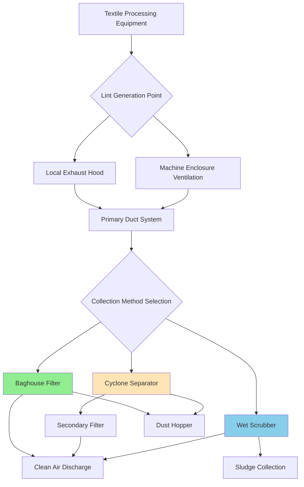
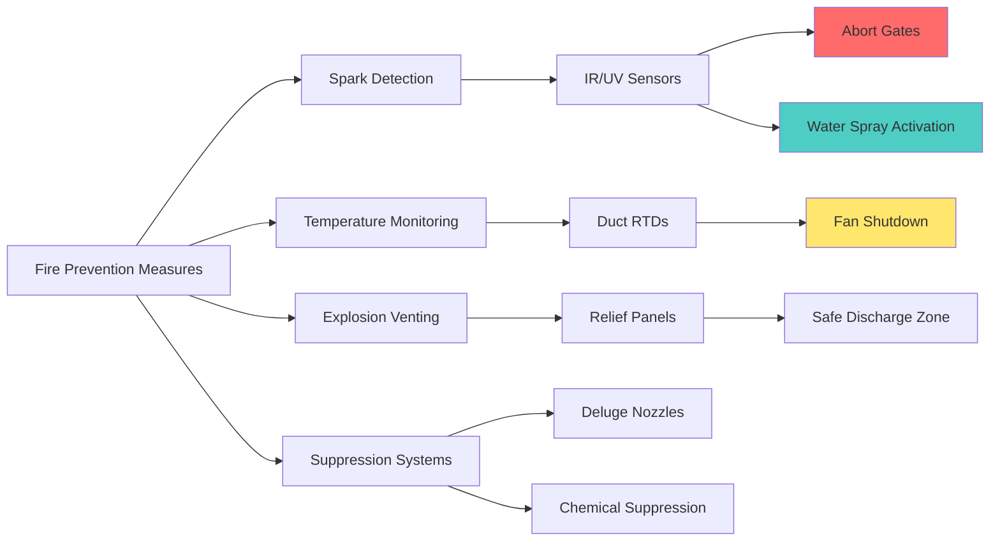

# Lint Control Systems in Textile Plants

Lint control represents a critical safety and operational concern in textile processing facilities. Airborne fiber accumulation creates fire and explosion hazards, reduces product quality, and compromises worker health. Effective lint management requires integrated ventilation, filtration, and fire prevention strategies.

## Lint Hazards and Characteristics

Textile lint consists of fine cellulosic or synthetic fibers released during processing operations. The hazard level depends on fiber composition, particle size distribution, and concentration.

### Fire and Explosion Parameters

| Parameter | Cotton Lint | Polyester | Nylon |
|-----------|-------------|-----------|-------|
| Minimum Ignition Temperature | 400°F (204°C) | 850°F (454°C) | 950°F (510°C) |
| Minimum Ignition Energy | 50-100 mJ | 10-20 mJ | 15-25 mJ |
| Minimum Explosive Concentration | 40-50 g/m³ | 30-40 g/m³ | 35-45 g/m³ |
| Layer Ignition Temperature | 300°F (149°C) | 700°F (371°C) | 750°F (399°C) |

Cotton lint presents the highest fire risk due to low ignition temperature and cellulosic composition. Lint layers accumulating on hot surfaces (motors, bearings, light fixtures) ignite at temperatures significantly below suspended fiber clouds.

## Collection Efficiency Requirements

Lint collection systems must achieve high fractional efficiency across the particle size distribution. Collection efficiency follows the penetration model:

$$
\eta = 1 - e^{-\frac{4 \alpha t}{\pi d_f (1-\alpha)}}
$$

Where:
- $\eta$ = fractional collection efficiency (dimensionless)
- $\alpha$ = filter media solidity (0.05-0.15 for fibrous media)
- $t$ = filter thickness (m)
- $d_f$ = fiber diameter (m)

ACGIH recommends minimum 99% collection efficiency for particles >5 μm and 95% efficiency for particles 1-5 μm in textile exhaust systems.

### Pressure Drop Across Filter Media

Pressure drop increases with dust loading:

$$
\Delta P = \Delta P_0 + K_2 \cdot W
$$

Where:
- $\Delta P$ = total pressure drop (Pa)
- $\Delta P_0$ = clean filter pressure drop (Pa)
- $K_2$ = dust loading coefficient (Pa·m²/g)
- $W$ = dust loading per unit area (g/m²)

Typical values for textile applications: $\Delta P_0$ = 125-250 Pa, $K_2$ = 15-25 Pa·m²/g.

## Lint Collection Methods

### Baghouse Filtration Systems

Fabric filter baghouses provide the highest collection efficiency (99.5-99.9%) for textile lint. Key design parameters:

- **Air-to-cloth ratio**: 1.5-3.0 ft/min (0.008-0.015 m/s) for cotton lint
- **Cleaning cycle**: Pulse-jet or reverse-air at 2-4 minute intervals
- **Filter media**: Polyester or aramid fabrics rated 200-250°F continuous
- **Spark detection**: Mandatory for fire prevention

### Cyclone Pre-separators

Single or multiple cyclone units remove coarse lint (>20 μm) upstream of final filters:

$$
\eta_c = \frac{1}{1 + \left(\frac{d_{50}}{d_p}\right)^2}
$$

Where:
- $\eta_c$ = cyclone efficiency for particle diameter $d_p$
- $d_{50}$ = cut diameter at 50% efficiency (typically 15-25 μm)

Cyclones reduce baghouse dust loading by 60-80%, extending filter life and reducing cleaning frequency.

## Fire Prevention and Protection

### System Fire Safety Requirements

**Critical Fire Prevention Elements:**

1. **Spark Detection Systems**: Infrared or ultraviolet sensors positioned 10-15 ft downstream of high-risk equipment. Response time <100 ms to activate abort gates or water spray suppression.

2. **Explosion Venting**: Relief panels sized per NFPA 68 at Pred = 0.5-1.0 psi. Vent area ratio: 1 ft² per 15-25 ft³ of collector volume for cotton lint.

3. **Temperature Interlocks**: Shutdown fan and activate suppression when duct temperature exceeds 150°F (66°C) or rate-of-rise >15°F/min.

4. **Grounding and Bonding**: All ductwork electrically continuous with resistance <10 ohms to building ground. Critical for static dissipation in low-humidity environments.

## System Comparison

| Collection Method | Efficiency | Pressure Drop | Fire Risk | Maintenance | Relative Cost |
|-------------------|------------|---------------|-----------|-------------|---------------|
| Baghouse (Pulse-Jet) | 99.5-99.9% | 4-6 in. wg | High (requires protection) | Medium (bag replacement) | High |
| Cyclone + Baghouse | 99.0-99.5% | 6-9 in. wg | Medium (pre-separation) | Low | Medium-High |
| Wet Scrubber | 95-98% | 8-12 in. wg | Low (non-combustible) | High (water treatment) | Medium |
| Cartridge Filters | 99.0-99.5% | 3-5 in. wg | High (requires protection) | Medium (cartridge replacement) | Medium |

## Design Recommendations

ASHRAE Industrial Ventilation guidelines and ACGIH Industrial Ventilation Manual establish minimum practices:

- **Transport velocity**: 4,000-4,500 fpm (20-23 m/s) in horizontal ducts to prevent settling
- **Hood capture velocity**: 150-200 fpm (0.75-1.0 m/s) for enclosed sources
- **Makeup air**: 100% of exhaust volume conditioned to maintain humidity 50-65% RH
- **Inspection access**: Ports every 20 ft of duct run and at all direction changes
- **Dust removal**: Daily cleaning schedule for accumulated lint in all accessible areas

Proper lint control system design integrates high-efficiency collection, fire prevention technology, and rigorous maintenance protocols to ensure safe textile plant operation while meeting air quality standards.