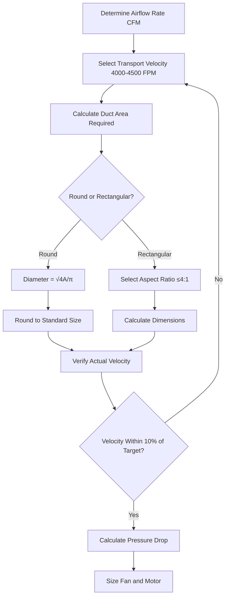
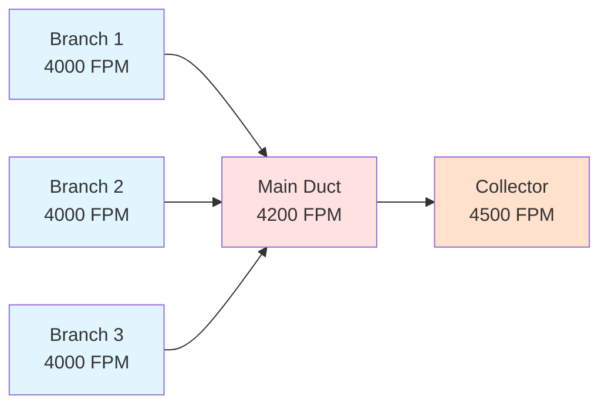

## Minimum Transport Velocity Requirements

Textile lint particles require minimum duct velocities to prevent settling and accumulation within exhaust systems. The 4000 FPM threshold represents the industry-standard minimum transport velocity for lint-laden air streams in textile processing facilities.

### Critical Velocity Determination

Transport velocity must overcome gravitational settling forces acting on lint particles. The minimum velocity depends on particle characteristics:

**Settling Velocity Relationship:**

$$V_{transport} = \frac{V_{settling}}{\sin(\theta)} \times SF$$

Where:
- $V_{transport}$ = Minimum duct transport velocity (FPM)
- $V_{settling}$ = Particle terminal settling velocity (FPM)
- $\theta$ = Duct angle from horizontal (degrees)
- $SF$ = Safety factor (typically 1.5-2.0)

### ACGIH Recommended Velocities

| Material Type | Minimum Velocity | Recommended Velocity | Particle Characteristics |
|---------------|------------------|---------------------|--------------------------|
| Cotton lint | 4000 FPM | 4500 FPM | Light, fibrous, low density |
| Synthetic fibers | 3500 FPM | 4000 FPM | Medium density, smooth |
| Mixed textile waste | 4500 FPM | 5000 FPM | Variable density, entangled |
| Yarn waste | 4000 FPM | 4500 FPM | Fibrous, moderate entanglement |

## Velocity Maintenance Principles

### Pressure Drop Considerations

Higher velocities increase system pressure drop exponentially. The Darcy-Weisbach equation governs friction losses:

$$\Delta P = f \times \frac{L}{D} \times \frac{\rho V^2}{2 \times 144}$$

Where:
- $\Delta P$ = Pressure drop (inches w.g.)
- $f$ = Friction factor (dimensionless)
- $L$ = Duct length (feet)
- $D$ = Duct diameter (feet)
- $\rho$ = Air density (lb/ft³)
- $V$ = Air velocity (FPM)

**Key Relationship:** Doubling velocity increases pressure drop by factor of four.

### Energy Consumption Analysis

Fan power requirement scales with velocity cubed:

$$HP = \frac{Q \times \Delta P}{6356 \times \eta_{fan}}$$

Where:
- $HP$ = Fan brake horsepower
- $Q$ = Airflow rate (CFM)
- $\Delta P$ = Total system pressure (inches w.g.)
- $\eta_{fan}$ = Fan total efficiency (decimal)

## Duct Sizing Methodology

### Design Procedure

### Sizing Calculations

**Required Duct Area:**

$$A = \frac{Q}{V}$$

Where:
- $A$ = Cross-sectional area (ft²)
- $Q$ = Airflow rate (CFM)
- $V$ = Design velocity (FPM)

**Round Duct Diameter:**

$$D = \sqrt{\frac{4A}{\pi}} = \sqrt{\frac{4Q}{\pi V}}$$

**Rectangular Duct Dimensions:**

For aspect ratio $AR = \frac{W}{H}$:

$$W = \sqrt{A \times AR}$$

$$H = \frac{A}{W}$$

### Standard Duct Sizes

| Airflow (CFM) | Velocity (FPM) | Round Diameter (inches) | Rectangular (WxH inches) |
|---------------|----------------|------------------------|--------------------------|
| 2000 | 4000 | 9 | 10 x 7 |
| 4000 | 4000 | 13 | 14 x 10 |
| 6000 | 4000 | 16 | 18 x 12 |
| 8000 | 4000 | 18 | 20 x 14 |
| 10000 | 4000 | 20 | 24 x 15 |

## System Design Considerations

### Velocity Profile Management

**Design Rules:**
- Never reduce velocity in direction of airflow
- Increase velocity 5-10% at each junction
- Maintain minimum 4000 FPM throughout system
- Design collector inlet for 4500 FPM minimum

### Lint Settling Prevention

Critical factors preventing lint accumulation:

1. **Horizontal Run Limitations:** Minimize horizontal ductwork length. Vertical or sloped sections preferred.

2. **Elbow Design:** Use large radius elbows (R/D ≥ 2.0) to prevent settling at direction changes.

3. **Velocity Monitoring:** Install velocity sensors at critical locations to verify design conditions.

4. **Cleanout Access:** Provide access doors every 20 feet of horizontal run and at all low points.

## Energy Optimization Strategies

### Balancing Transport and Energy Costs

Operating at 4000 FPM minimum versus 4500 FPM recommended:

**Energy Comparison:**

| Velocity | Relative Pressure Drop | Relative Energy | Annual Cost (10000 CFM)* |
|----------|------------------------|-----------------|--------------------------|
| 4000 FPM | 1.00 | 1.00 | $8,500 |
| 4250 FPM | 1.13 | 1.13 | $9,600 |
| 4500 FPM | 1.27 | 1.27 | $10,800 |
| 5000 FPM | 1.56 | 1.56 | $13,300 |

*Based on $0.12/kWh, 6000 hours/year operation, 60% fan efficiency

### Design Recommendations

**ASHRAE Industrial Ventilation Guidelines:**
- Design for 4500 FPM when energy costs permit
- Accept 4000 FPM minimum only with rigorous maintenance program
- Consider variable speed control to maintain velocity as filters load
- Monitor actual velocities quarterly to verify design conditions

**System Verification:**
- Commission systems with Pitot tube traverse measurements
- Document baseline velocities at all measurement points
- Establish maintenance procedures for velocity monitoring
- Replace or clean ducts when velocity cannot be maintained

## References

- ACGIH Industrial Ventilation Manual, 30th Edition
- ASHRAE Handbook - HVAC Applications, Chapter 31: Industrial Ventilation
- NFPA 654: Standard for Prevention of Fire and Dust Explosions from Manufacturing, Processing, and Handling of Combustible Particulate Solids
