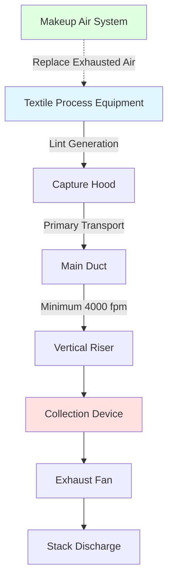
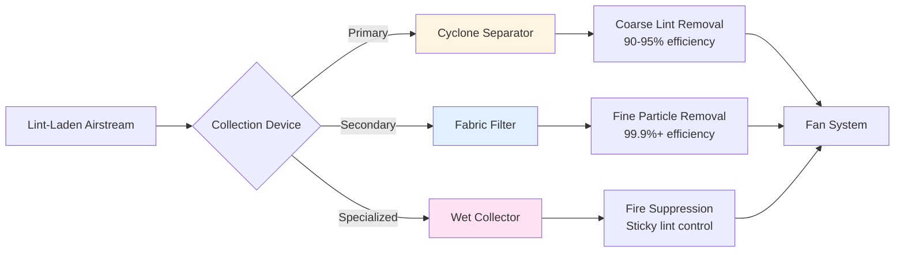
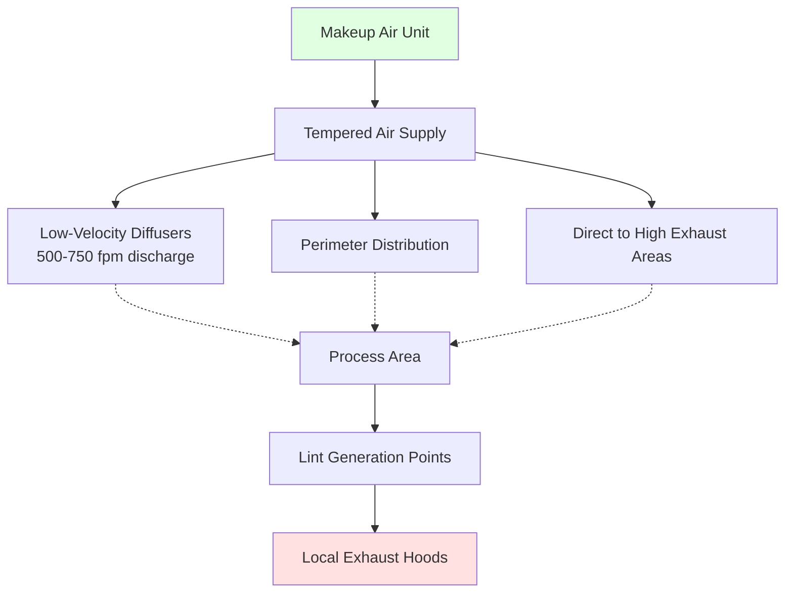

## Overview

Lint control exhaust systems in textile processing plants represent critical industrial ventilation applications requiring precise engineering to maintain air quality, prevent fire hazards, and ensure process efficiency. Proper system design balances capture efficiency, transport velocity, energy consumption, and maintenance requirements.

## Local Exhaust Ventilation Principles

### Capture Velocity Requirements

The fundamental design criterion for lint exhaust is establishing sufficient capture velocity at the point of generation. Per ACGIH Industrial Ventilation Manual, lint particles require minimum capture velocities based on generation conditions:

| Lint Generation Condition | Required Capture Velocity (fpm) |
|----------------------------|----------------------------------|
| Released with no velocity (settling) | 50-100 |
| Released at low velocity (<100 fpm) | 100-200 |
| Active generation (carding, spinning) | 200-500 |
| High-speed processing (>1000 fpm web) | 500-1000 |

### Hood Design Calculations

Exhaust volumetric flow rate for unflanged hoods follows:

$$Q = V_c \cdot A_h \left(10X^2 + A_h\right)$$

Where:
- $Q$ = required airflow (cfm)
- $V_c$ = capture velocity at source (fpm)
- $A_h$ = hood face area (ft²)
- $X$ = distance from hood face to source (ft)

For flanged hoods, the relationship improves to:

$$Q = V_c \cdot A_h \left(5X^2 + A_h\right)$$

The flanged design reduces required airflow by approximately 50% for equivalent capture performance.

## Hood Types and Specifications

### Slotted Hood Design

Slotted hoods provide effective capture for linear textile processes. Critical design parameters:

| Parameter | Specification | Basis |
|-----------|---------------|-------|
| Slot velocity | 1000-2000 fpm | Lint entrainment |
| Slot width | 0.25-0.5 in | Balance flow/capture |
| Plenum depth | 6-10× slot width | Uniform velocity distribution |
| Entry loss coefficient | 0.5-1.2 | Depends on taper geometry |

Slot discharge area calculation:

$$A_{slot} = \frac{Q}{V_{slot}}$$

Where $V_{slot}$ represents the design slot velocity.

### Canopy Hood Applications

Large canopy hoods serve textile machinery where point capture is impractical:

$$Q = V_c \cdot \left(P \cdot W + A_f\right)$$

Where:
- $P$ = perimeter of work area (ft)
- $W$ = distance from source to hood (ft)
- $A_f$ = face area of equipment opening (ft²)

## Duct Design and Transport Velocity

### Minimum Transport Velocities

Lint-laden airstreams require sufficient velocity to prevent settling and accumulation:

| Material Characteristics | Minimum Velocity (fpm) |
|--------------------------|------------------------|
| Cotton lint (light, fluffy) | 3500 |
| Synthetic fibers (medium density) | 4000 |
| Heavy dust/lint mixtures | 4500 |
| Vertical ducts (any material) | 4000 minimum |

### Pressure Loss Calculations

Total system pressure drop:

$$\Delta P_{total} = \Delta P_{hood} + \Delta P_{duct} + \Delta P_{fittings} + \Delta P_{collector}$$

Duct friction loss per ACGIH:

$$\Delta P_{duct} = f \cdot \frac{L}{D} \cdot \frac{V^2}{4005}$$

Where:
- $f$ = friction factor (0.035-0.05 for lint ducts)
- $L$ = duct length (ft)
- $D$ = duct diameter (in)
- $V$ = velocity (fpm)

Fitting losses:

$$\Delta P_{fitting} = C \cdot \frac{V^2}{4005}$$

Common loss coefficients for lint service:
- 90° elbow (r/D = 1.5): C = 0.27
- 90° elbow (r/D = 2.5): C = 0.20
- Branch entry (45°): C = 0.30
- Abrupt expansion: C = 1.0

## Collection Systems

### Cyclone Separators

Primary collection for textile lint. Inlet velocity 3500-4500 fpm achieves 90-95% collection efficiency for particles >10 microns.

Pressure drop estimate:

$$\Delta P_{cyclone} = K \cdot \frac{V_{inlet}^2}{4005}$$

Typical K values: 4-8 velocity heads for standard efficiency cyclones.

### Fabric Filter Collectors

Secondary filtration achieves >99.9% efficiency. Design parameters:

| Parameter | Typical Range | Notes |
|-----------|---------------|-------|
| Air-to-cloth ratio | 4-8 cfm/ft² | Cotton lint applications |
| Filter velocity | 4-8 fpm | Through fabric |
| Cleaning cycle | 30-60 seconds | Pulse-jet systems |
| Pressure drop (clean) | 2-4 in wg | Initial |
| Pressure drop (loaded) | 4-8 in wg | Before cleaning |

## Makeup Air Requirements

### Volumetric Balance

Makeup air must equal total exhaust within acceptable tolerance:

$$Q_{makeup} \geq 0.90 \cdot Q_{exhaust}$$

Undersupply creates negative building pressure, reducing hood capture efficiency and increasing infiltration.

### Temperature Considerations

Makeup air heating load during winter:

$$q = 1.08 \cdot Q_{makeup} \cdot \left(T_{space} - T_{outdoor}\right)$$

Where:
- $q$ = heating load (Btuh)
- $Q_{makeup}$ = airflow (cfm)
- Temperatures in °F

For large textile exhaust systems (>50,000 cfm), makeup air heating represents substantial operating cost. Heat recovery from exhaust should be evaluated.

### Distribution Strategy

Distribute makeup air remote from exhaust hoods to prevent short-circuiting. Discharge velocity <1000 fpm in occupied zones prevents discomfort.

## Fan Selection

Lint exhaust fans require special consideration:

- **Non-sparking construction** (aluminum or coated steel) for fire safety
- **Open radial blade design** to prevent buildup
- **Class II or III construction** per AMCA standards
- **Inlet spin-in** arrangement when downstream of collector
- **Explosion-proof motors** where required by electrical classification

Fan pressure selection includes 25% safety factor above calculated system resistance to accommodate filter loading and minor duct restrictions.

## System Balancing

Post-installation verification measures hood static pressure and volumetric flow. Each hood should achieve within ±10% of design airflow. Balance using:

1. Blast gates for coarse adjustment
2. Dampers at branch entries for fine tuning
3. Main duct damper for system total flow control

Critical measurement: hood static pressure at designated tap location. Compare to design values accounting for elevation and temperature corrections.

## Maintenance and Operation

Establish routine inspection intervals:

- **Daily**: Collector pressure drop monitoring
- **Weekly**: Visual duct inspection for buildup at elbows
- **Monthly**: Hood face velocity measurement at representative locations
- **Quarterly**: Full system rebalancing verification
- **Annual**: Comprehensive duct cleaning and inspection

Maintain duct cleanliness. Lint accumulation exceeding 1/8 in thickness indicates insufficient transport velocity or cleaning deficiency requiring immediate correction.

---

*Reference: ACGIH Industrial Ventilation: A Manual of Recommended Practice for Design, 30th Edition*