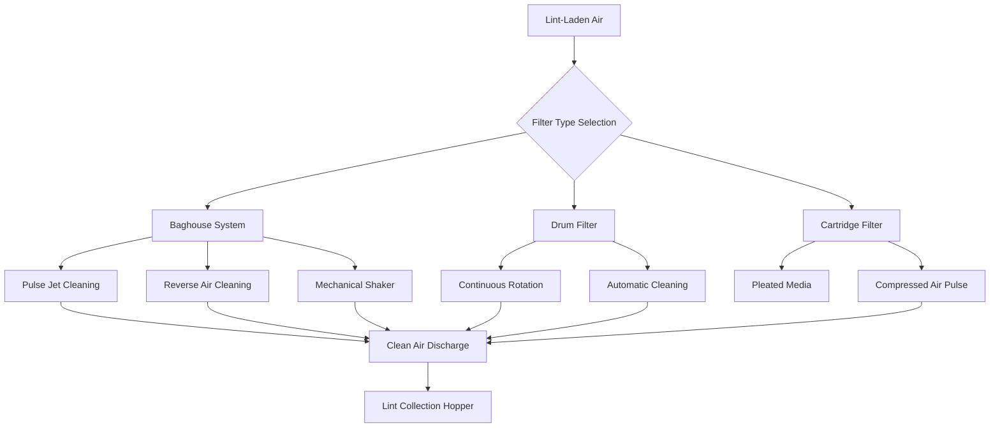

## Filtration System Requirements

Lint filtration in textile processing plants demands specialized equipment capable of handling high particulate loads while maintaining airflow efficiency. Unlike conventional HVAC filtration, textile lint presents unique challenges including fibrous material accumulation, static charge buildup, and potential fire hazards from concentrated combustible fibers.

ASHRAE Industrial Ventilation guidelines specify minimum collection efficiencies of 95% for lint particles above 10 micrometers, with total system pressure drops not exceeding 6 inches water gauge at design airflow. The selection of filtration technology depends on production volume, fiber type, moisture content, and facility layout constraints.

## Filter Efficiency Calculations

Filter performance is quantified through fractional efficiency and overall collection efficiency metrics.

**Fractional Efficiency:**

$$\eta_d = \frac{C_{in,d} - C_{out,d}}{C_{in,d}} \times 100$$

Where:
- $\eta_d$ = fractional efficiency for particle size d (%)
- $C_{in,d}$ = inlet concentration for size d (mg/m³)
- $C_{out,d}$ = outlet concentration for size d (mg/m³)

**Overall Collection Efficiency:**

$$\eta_{total} = \frac{m_{collected}}{m_{inlet}} \times 100 = \left(1 - \frac{C_{out}}{C_{in}}\right) \times 100$$

**Pressure Drop Across Filter Media:**

$$\Delta P = K_1 \mu V + K_2 \rho V^2$$

Where:
- $\Delta P$ = pressure drop (Pa)
- $K_1$ = viscous resistance coefficient (m⁻²)
- $K_2$ = inertial resistance coefficient (m⁻¹)
- $\mu$ = air viscosity (Pa·s)
- $V$ = face velocity (m/s)
- $\rho$ = air density (kg/m³)

## Lint Filtration Technologies



### Baghouse Filter Systems

Baghouse collectors represent the industry standard for high-volume lint filtration. Individual filter bags, typically 12-16 feet in length and 5-8 inches in diameter, provide large filtration surface area in compact footprints. Fabric selection is critical—felted polyester media with 16-18 oz/yd² weight offers optimal balance between efficiency, durability, and cleanability.

**Pulse Jet Cleaning:** High-pressure air bursts (80-100 psig) directed down bag centerlines dislodge accumulated lint. Pulse duration of 0.1-0.2 seconds at 30-90 second intervals maintains pressure drop below 5 inches water gauge while maximizing bag life.

**Reverse Air Cleaning:** Low-pressure (10-20 inches water gauge) reverse airflow collapses bags, releasing lint through mechanical flexing. This gentler method extends bag life but requires larger compartmentalized systems for continuous operation during cleaning cycles.

### Drum Filter Systems

Rotary drum filters employ cylindrical screens (6-12 feet diameter, 8-20 feet length) rotating at 1-3 RPM through lint-laden airstreams. Automatic scraper blades continuously remove accumulated lint into collection hoppers. These systems excel in applications with extremely high lint loads (>50 grains per 1000 cubic feet) where rapid media blinding would compromise bag or cartridge filters.

Face velocities are limited to 150-250 fpm across the drum surface to prevent lint penetration through the screen mesh (typically 40-60 mesh stainless steel). Drum systems provide prefiltering upstream of final baghouse stages in heavy production facilities.

### Cartridge Filter Systems

Pleated cartridge filters offer 3-5 times the surface area of equivalent bag filters through compact pleated media construction. Cartridge systems occupy 40-60% less floor space than baghouse equivalents but require more frequent pulse cleaning (15-30 second intervals) due to reduced media depth.

Cartridge filters are optimal for moderate lint loads (<20 grains per 1000 cubic feet) in space-constrained installations. Media replacement costs typically exceed bag systems by 20-30%, but reduced installation footprint often justifies the operational premium.

## Filter Type Comparison

| Parameter | Baghouse (Pulse Jet) | Drum Filter | Cartridge Filter |
|-----------|---------------------|-------------|------------------|
| Collection Efficiency | 99.5-99.9% | 85-92% | 98-99.5% |
| Face Velocity | 4-6 fpm | 150-250 fpm | 6-9 fpm |
| Pressure Drop (Clean) | 3-4" w.g. | 1-2" w.g. | 2-3" w.g. |
| Pressure Drop (Loaded) | 5-6" w.g. | 2.5-3.5" w.g. | 4-5" w.g. |
| Max Inlet Loading | 50+ grains/1000 ft³ | 100+ grains/1000 ft³ | 20 grains/1000 ft³ |
| Cleaning Interval | 30-90 seconds | Continuous | 15-30 seconds |
| Media Life | 2-4 years | 3-5 years | 1-3 years |
| Footprint (Relative) | 1.0x | 0.8x | 0.4-0.6x |
| Initial Cost ($/cfm) | $8-12 | $12-18 | $10-15 |

## Filter Loading and Sizing

**Air-to-Cloth Ratio:**

$$\text{A/C Ratio} = \frac{Q}{A_{filter}} = \frac{\text{Airflow (cfm)}}{\text{Filter Surface Area (ft}^2\text{)}}$$

Recommended air-to-cloth ratios:
- Pulse jet baghouse: 4-6:1
- Reverse air baghouse: 2-3:1
- Cartridge filters: 6-9:1

**Required Filter Area:**

$$A_{filter} = \frac{Q_{design}}{\text{A/C Ratio}} \times \text{SF}$$

Where SF = safety factor (1.2-1.5 for lint applications)

```mermaid
flowchart LR
    A[Production Area<br/>Lint Generation] --> B[Exhaust Duct<br/>2000-4000 fpm]
    B --> C[Inlet Plenum<br/>Velocity Reduction]
    C --> D[Filter Chamber<br/>4-6 fpm Face Velocity]
    D --> E{Pressure<br/>Monitoring}
    E -->|ΔP > 5" w.g.| F[Pulse Cleaning<br/>Activated]
    E -->|ΔP < 5" w.g.| G[Normal Operation]
    F --> H[Lint Hopper<br/>Discharge]
    G --> I[Clean Air Plenum]
    I --> J[Exhaust Fan<br/>Return/Discharge]

    style E fill:#ff9
    style F fill:#f96
    style H fill:#9cf
```

## Fire Protection and Safety

Lint accumulation presents significant fire hazards. All filtration systems must incorporate:

- Continuous temperature monitoring with alarms at 180-200°F
- Automatic suppression systems (water spray or CO₂)
- Static dissipative filter media (surface resistivity <10¹¹ ohms)
- Explosion venting sized per NFPA 68 (minimum 1 ft² per 15-25 ft³ volume)
- Grounded conductive components throughout airstream

Hopper discharge systems must evacuate collected lint within 8-hour intervals to prevent compaction and spontaneous combustion risks.

## System Performance Optimization

Regular pressure differential monitoring across filter banks provides early indication of cleaning system failures or excessive inlet loading. Establish baseline pressure drop curves and investigate deviations exceeding 20% of normal operating range.

Media inspection schedules should include visual examination for abrasion damage, chemical degradation, or incomplete cleaning patterns. Premature bag blinding typically indicates inadequate pulse pressure, clogged venturis, or compressed air contamination with oil or moisture.

Maintain cleaning compressed air dew point below -40°F to prevent moisture condensation on filter media, which causes irreversible blinding with hygroscopic lint materials.
