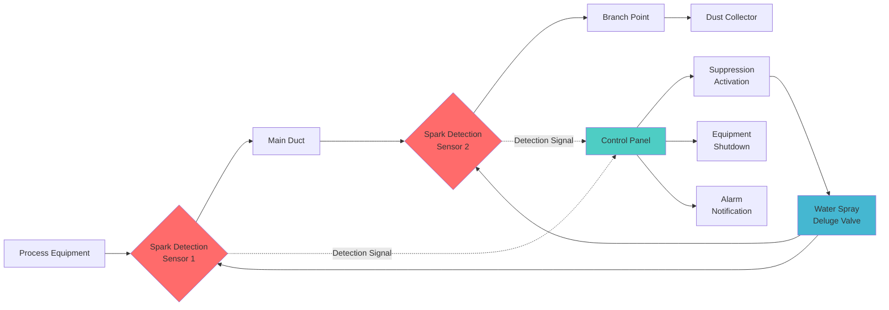
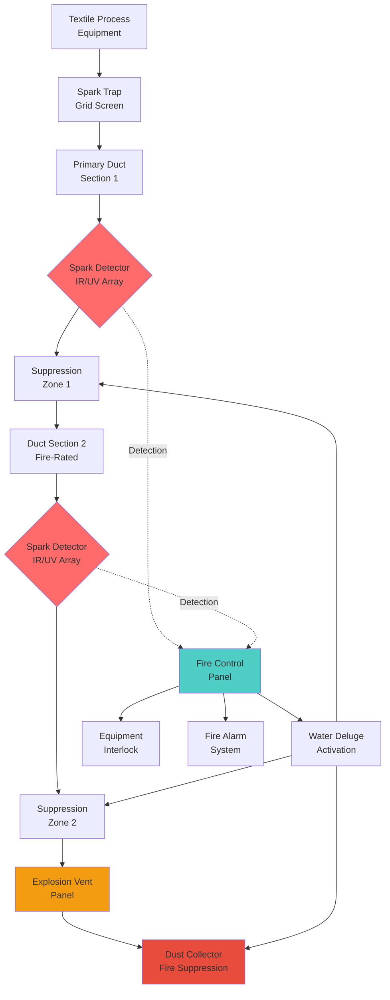

## Lint Fire Hazard Analysis

Textile lint represents one of the most severe fire and explosion hazards in industrial ventilation systems. Lint accumulation creates fuel-rich environments where ignition sources can trigger rapid flame propagation through ductwork, potentially leading to catastrophic explosions.

**Primary ignition sources in textile facilities:**
- Friction sparks from machinery bearings
- Static electrical discharge
- Hot surfaces exceeding lint autoignition temperature (typically 400-450°F)
- Foreign metal objects in process equipment
- Welding or cutting operations near ventilation systems

The minimum ignition energy for airborne textile dust ranges from 10-100 millijoules, making even small sparks capable of initiating fires. Lint deposits in ductwork provide continuous fuel paths enabling fire propagation at velocities exceeding 1,500 ft/min.

## Spark Detection Systems

Spark detection provides the first line of defense against lint fires by identifying and responding to ignition sources before flame development.

**Detection methodology:**

Infrared (IR) and ultraviolet (UV) sensors monitor ductwork at strategic locations to detect thermal signatures characteristic of sparks and embers. System response time must not exceed 0.5 seconds from detection to suppression activation.

**Optimal sensor placement:**
- Immediately downstream of process equipment (within 10 duct diameters)
- Before and after each major duct branch
- Upstream of dust collectors and filters
- At duct velocity measurement stations

**Sensor spacing calculation:**

$$L_{max} = \frac{V_{duct} \times t_{response}}{SF}$$

Where:
- $L_{max}$ = Maximum distance between sensors (ft)
- $V_{duct}$ = Duct air velocity (ft/min)
- $t_{response}$ = System response time (min)
- $SF$ = Safety factor (typically 2.0)

For a system with 4,000 ft/min velocity and 0.5-second response time:

$$L_{max} = \frac{4000 \times (0.5/60)}{2.0} = 16.7 \text{ ft}$$

## Automatic Suppression Systems

### Water Deluge Systems

Water-based suppression provides rapid fire knockdown with minimal system complexity. Deluge nozzles inject atomized water directly into ductwork upon spark detection.

**Critical design parameters:**

| Parameter | Specification | Design Basis |
|-----------|---------------|--------------|
| Water Pressure | 75-100 psi | Atomization requirement |
| Nozzle Spacing | 10-15 ft | Complete duct coverage |
| Activation Time | <0.5 seconds | Fire propagation speed |
| Flow Rate | 0.5-1.0 gpm/ft² | NFPA 654 minimum |
| Droplet Size | 200-400 microns | Optimal cooling efficiency |

**Water application rate calculation:**

$$Q_{water} = A_{duct} \times q_{spec} \times N_{zones}$$

Where:
- $Q_{water}$ = Total water flow rate (gpm)
- $A_{duct}$ = Duct cross-sectional area (ft²)
- $q_{spec}$ = Specific application rate (gpm/ft²)
- $N_{zones}$ = Number of active suppression zones

For a 36-inch diameter duct with 0.75 gpm/ft² application rate across 3 zones:

$$Q_{water} = \pi \times (1.5)^2 \times 0.75 \times 3 = 15.9 \text{ gpm}$$

### Chemical Suppression Systems

Dry chemical systems utilize sodium bicarbonate or monoammonium phosphate to suppress fires through oxygen displacement and chain reaction inhibition. These systems are preferred where water damage to product or equipment is unacceptable.

## Ductwork Fire Protection Design

### Fire-Rated Ductwork Construction

Ductwork in high-risk areas requires fire-resistant construction to prevent external fire spread and contain internal fires.

**NFPA code requirements:**

| Code | Requirement | Application |
|------|-------------|-------------|
| NFPA 654, Section 7.2.3 | Metal ductwork minimum 22-gauge | All lint collection systems |
| NFPA 654, Section 7.2.5 | Horizontal duct minimum slope 2% | Lint accumulation prevention |
| NFPA 654, Section 9.4.1 | Explosion venting required | Dust collectors and enclosed equipment |
| NFPA 91, Section 4.3.2 | Spark-resistant construction | Abrasive material transport |
| NFPA 654, Section 8.3.2 | Fire dampers prohibited | Lint duct systems |

### Explosion Venting

Explosion vent panels protect equipment and structures by relieving overpressure during deflagration events.

**Vent area calculation per NFPA 68:**

$$A_v = C \times V^{0.667} \times \left(\frac{P_{max}}{P_{red}}\right)^{0.5}$$

Where:
- $A_v$ = Required vent area (ft²)
- $C$ = Venting constant (0.11 for textile dust)
- $V$ = Enclosure volume (ft³)
- $P_{max}$ = Maximum explosion pressure (typically 100 psi)
- $P_{red}$ = Reduced pressure with venting (typically 1-2 psi)

For a 1,000 ft³ dust collector with $P_{red}$ = 1.5 psi:

$$A_v = 0.11 \times (1000)^{0.667} \times \left(\frac{100}{1.5}\right)^{0.5} = 85.3 \text{ ft}^2$$

## Housekeeping and Maintenance Requirements

Effective fire protection depends critically on preventing lint accumulation that provides fuel for fires.

**NFPA 654 housekeeping standards:**
- Maximum dust layer thickness: 1/32 inch over 5% of floor area triggers cleaning
- Cleaning frequency: Daily in high-production areas
- Vacuum collection required (no compressed air cleaning)
- Duct inspection intervals: Weekly visual, annual internal inspection
- Filter replacement based on differential pressure, not time schedules

**Ductwork cleaning triggers:**

$$\Delta P_{clean} = 1.5 \times \Delta P_{design}$$

Where cleaning is mandatory when measured pressure drop exceeds 150% of design values, indicating significant lint accumulation restricting airflow and increasing fire risk.

## System Integration and Testing

Fire protection systems require integrated design with process interlocks to ensure coordinated response during fire events. Upon spark detection or fire alarm activation, the system must:

1. Activate suppression systems in affected zones
2. Shut down process equipment feeding the affected ductwork
3. Close isolation dampers to contain fire spread
4. Maintain exhaust fan operation to prevent smoke backdraft
5. Notify facility emergency response personnel

**Testing frequency per NFPA 654:**
- Spark detection sensors: Monthly functional test
- Suppression system discharge: Annual full-scale test
- Emergency shutdown interlocks: Quarterly verification
- Explosion vent panels: Annual inspection for obstruction

## References

- NFPA 654: Standard for the Prevention of Fire and Dust Explosions from the Manufacturing, Processing, and Handling of Combustible Particulate Solids
- NFPA 68: Standard on Explosion Protection by Deflagration Venting
- NFPA 91: Standard for Exhaust Systems for Air Conveying of Vapors, Gases, Mists, and Particulate Solids
- ASHRAE Industrial Ventilation Design Guidebook, Chapter 14: Textile Industry Ventilation
