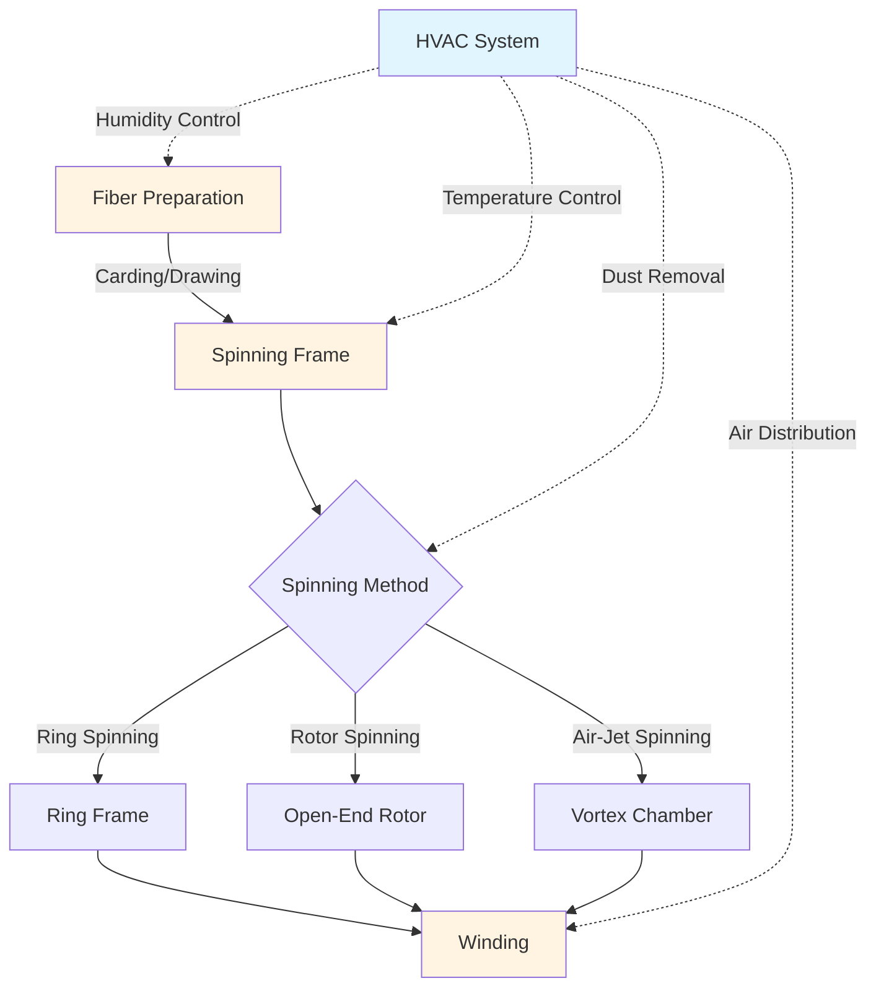

# HVAC Systems for Textile Spinning Processes

Spinning processes transform fiber into yarn through mechanical drawing and twisting operations that demand precise environmental control. The physical properties of textile fibers—particularly moisture regain, static charge accumulation, and tensile strength—vary significantly with ambient conditions, making HVAC systems critical to product quality and process efficiency.

## Process Overview and HVAC Requirements

Textile spinning encompasses multiple technologies, each with distinct environmental demands driven by fiber handling characteristics and mechanical stresses imposed during yarn formation.

### Spinning Method Comparison

| Spinning Method | Temperature (°F) | Relative Humidity (%) | Air Velocity (fpm) | Dust Control Priority |
|----------------|------------------|----------------------|-------------------|----------------------|
| Ring Spinning | 72-78 | 55-65 | 30-50 | High |
| Rotor (Open-End) | 70-76 | 50-60 | 50-100 | Very High |
| Air-Jet Spinning | 68-75 | 45-55 | 100-150 | Critical |
| Friction Spinning | 70-76 | 50-60 | 50-100 | High |

## Humidity Control Physics

Textile fibers exhibit hygroscopic behavior, absorbing or releasing moisture until equilibrium with surrounding air. The moisture regain directly affects fiber flexibility, static generation, and yarn strength.

### Moisture Regain Relationship

The equilibrium moisture regain for cotton fibers follows:

$$M_e = \frac{18.99 \phi + 0.05 \phi^2}{1 - 0.01 \phi}$$

Where:
- $M_e$ = equilibrium moisture regain (%)
- $\phi$ = relative humidity (%)

### Psychrometric Requirements

The absolute humidity must be maintained within narrow bands to prevent process disruptions:

$$W = 0.622 \frac{P_v}{P_{atm} - P_v}$$

Where:
- $W$ = humidity ratio (lb water/lb dry air)
- $P_v$ = partial pressure of water vapor (psia)
- $P_{atm}$ = atmospheric pressure (psia)

For cotton spinning at 75°F and 60% RH:

$$P_v = \phi \times P_{sat} = 0.60 \times 0.4298 = 0.2579 \text{ psia}$$

$$W = 0.622 \frac{0.2579}{14.696 - 0.2579} = 0.0111 \text{ lb/lb}$$

This translates to approximately 77 grains of moisture per pound of dry air, requiring precise dehumidification or humidification capacity.

## Temperature Control Strategy

Spinning machinery generates substantial heat from friction at spindle bearings, traveler-ring interfaces, and rotor systems. Heat loads range from 15-25 BTU/hr per spindle for ring frames to 40-60 BTU/hr per rotor position.

### Sensible Heat Load Calculation

Total sensible heat for a spinning hall:

$$Q_s = Q_{machines} + Q_{lighting} + Q_{transmission} + Q_{occupants}$$

For a 10,000-spindle ring spinning mill:

$$Q_s = (10,000 \times 20) + 50,000 + 30,000 + 10,000 = 290,000 \text{ BTU/hr}$$

Temperature stratification must be minimized to maintain uniform conditions across the production floor. Vertical temperature gradients exceeding 2°F per 10 feet of height cause unacceptable variation in yarn properties.

## Dust Control and Filtration

Fiber dust generation during opening, carding, and spinning creates respiratory hazards and process contamination. Dust particle sizes range from 0.5 to 50 microns, with the respirable fraction (< 10 microns) requiring removal to meet OSHA PEL of 1.0 mg/m³ for cotton dust.

### Ventilation Design

Local exhaust ventilation at dust generation points:

$$Q = V \times A \times 60$$

Where:
- $Q$ = volumetric flow rate (CFM)
- $V$ = capture velocity (fps, typically 100-200 for textile dust)
- $A$ = hood face area (ft²)

For a carding machine with 4 ft² opening hood:

$$Q = 1.5 \times 4 \times 60 = 360 \text{ CFM minimum per card}$$

### Filtration Requirements

ASHRAE 52.2 filtration efficiency requirements:

- Pre-filters: MERV 8-11 (35-65% efficiency at 1-3 microns)
- Final filters: MERV 13-14 (75-90% efficiency at 0.3-1 microns)
- Optional HEPA: 99.97% at 0.3 microns for clean room spinning applications

## Air Distribution Systems

Uniform air distribution prevents localized humidity and temperature variations that cause yarn quality defects. Supply air should be introduced at low velocity through perforated ducts or textile diffusers to minimize drafts while providing adequate mixing.

### Distribution Design Criteria

- Supply air temperature: 55-60°F (15-18°F below space temperature)
- Supply air relative humidity: 85-95% (requires post-cooling dehumidification)
- Air changes per hour: 20-40 ACH depending on dust loading
- Maximum air velocity at work level: 50 fpm to prevent fiber disturbance

## System Architecture

Modern textile spinning HVAC systems integrate:

1. **Central air handling units** with chilled water cooling coils and steam humidifiers
2. **Dual-duct or VAV systems** for simultaneous heating and cooling in different zones
3. **Localized exhaust** for dust collection at each process point
4. **Direct digital control** with dew point sensors for precise humidity management
5. **Energy recovery** through heat wheels or runaround loops (30-50% energy savings)

## ASHRAE Industrial Guidance

ASHRAE Applications Handbook, Chapter 20 (Textile Processing) recommends:

- Humidity tolerance: ±3% RH maximum deviation
- Temperature tolerance: ±2°F maximum deviation
- Fresh air requirement: 15-20 CFM per occupant plus makeup for exhaust
- System response time: < 15 minutes to correct 5% RH deviation

Compliance with these parameters ensures consistent yarn quality, minimizes fiber breakage, and maintains operator comfort in demanding industrial environments.

## Operational Considerations

Seasonal variations require system capacity for:

- **Winter**: Humidification load of 3-5 lb water/hr per 1000 CFM supply air
- **Summer**: Dehumidification load of 20-30 tons per 10,000 ft² floor area
- **Transition seasons**: Independent temperature and humidity control to avoid simultaneous heating and cooling

Equipment maintenance intervals must account for lint accumulation on coils, filters, and fan blades, typically requiring weekly inspections and monthly cleaning cycles.
