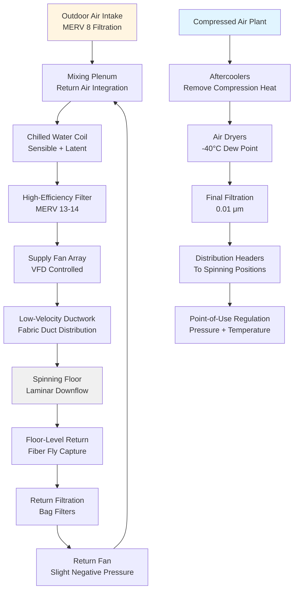

Air jet spinning represents the highest-speed method of yarn formation in textile manufacturing, utilizing high-velocity air streams to twist and bind fibers into continuous yarn. The HVAC requirements for air jet spinning facilities differ fundamentally from conventional ring or rotor spinning due to the critical interdependence between process air quality, compressed air systems, and environmental control.

## Process Air Requirements

The air jet spinning process consumes substantial volumes of compressed air at precisely controlled conditions. The volumetric air consumption per spindle position determines the total facility compressed air load.

### Compressed Air Consumption

The mass flow rate of process air per spindle follows:

$$\dot{m}_{spindle} = \frac{P_1 V_{nozzle}}{RT_1} \times n_{jets}$$

Where:
- $\dot{m}_{spindle}$ = mass flow rate per spindle (kg/s)
- $P_1$ = supply pressure absolute (Pa)
- $V_{nozzle}$ = volumetric flow per jet (m³/s)
- $R$ = specific gas constant for air (287 J/kg·K)
- $T_1$ = supply temperature absolute (K)
- $n_{jets}$ = number of nozzles per spindle

Total facility compressed air demand:

$$Q_{total} = \dot{m}_{spindle} \times N_{spindles} \times \frac{RT_{amb}}{P_{amb}}$$

Where $N_{spindles}$ represents total operating spindle positions.

## Environmental Control Parameters

Air jet spinning requires tighter environmental tolerances than conventional spinning methods due to fiber electrostatic behavior and twist insertion dynamics.

| Parameter | Requirement | Tolerance | Critical Impact |
|-----------|-------------|-----------|-----------------|
| Temperature | 22-25°C | ±1°C | Fiber moisture, air density |
| Relative Humidity | 55-65% | ±3% | Static electricity, fiber strength |
| Air Velocity | 0.15-0.25 m/s | ±0.05 m/s | Fiber fly distribution |
| Filtration | MERV 13-14 | - | Nozzle contamination |
| Pressure | -5 to -10 Pa | ±2 Pa | Adjacent zone isolation |

### Temperature Control

The sensible cooling load combines metabolic heat, machine electrical input, compressed air heat of compression, and envelope gains:

$$Q_{sensible} = Q_{machines} + Q_{occupants} + Q_{compressed} + Q_{envelope} + Q_{lights}$$

The compressed air heat release approximates:

$$Q_{compressed} = \dot{m}_{air} c_p (T_{compressed} - T_{ambient}) \times \eta_{recovery}$$

Where $\eta_{recovery}$ represents the fraction of compression heat released into the conditioned space (typically 0.3-0.5 for systems with aftercoolers).

## Humidity Management

Maintaining precise humidity prevents electrostatic fiber adhesion to machine components and ensures consistent twist insertion. The moisture addition rate follows:

$$\dot{m}_{H_2O} = \frac{\dot{V}_{supply}}{v_1} (W_2 - W_1)$$

Where:
- $\dot{V}_{supply}$ = supply air volumetric flow (m³/s)
- $v_1$ = specific volume at supply conditions (m³/kg)
- $W_2$ = required space humidity ratio (kg/kg)
- $W_1$ = supply air humidity ratio (kg/kg)

## Air Distribution System

## Fiber Fly Control Strategy

Air jet spinning generates significant airborne fiber particulate due to high-speed pneumatic processing. Effective fly control requires:

**Ventilation Approach:**
- Downward laminar airflow at 0.15-0.25 m/s across spinning positions
- Floor-level return air capture minimizes fiber suspension time
- Return air filtration removes 85-95% of fiber content before recirculation
- Outdoor air dilution provides 15-25% of total supply volume

**Pressure Management:**
- Maintain spinning floor at -5 to -10 Pa relative to adjacent spaces
- Prevents fiber migration to clean areas or offices
- Sealed penetrations for electrical and compressed air services

## Energy Optimization

Air jet spinning facilities present unique energy optimization opportunities due to high compressed air consumption.

### Compressed Air Heat Recovery

The compression process converts electrical input to thermal energy. Heat recovery efficiency:

$$\eta_{heat\ recovery} = \frac{Q_{recovered}}{P_{compressor} \times 3600}$$

Typical recovery potential reaches 50-70% of compressor input power through:
- Hot water generation for humidification
- Space heating during cold seasons
- Regenerative desiccant air dryer integration

### Variable Flow Control

Modern systems employ:
- VFD-controlled supply and return fans responding to space conditions
- Compressor staging and VFD control matching production demand
- Enthalpy-based economizer cycles during suitable ambient conditions
- Night setback strategies reducing temperature and humidity tolerances during non-production

## System Sizing Considerations

ASHRAE Industrial Ventilation guidelines recommend:

**Air Changes:**
- 20-30 air changes per hour for modern facilities
- Higher rates in high-density spinning configurations

**Outdoor Air:**
- Minimum 15% of supply for dilution ventilation
- Increased to 25% during high fiber fly generation

**Compressed Air Capacity:**
- 1.2-1.5 safety factor on calculated demand
- Redundant compressor capacity for production continuity
- Storage receiver volume providing 1-2 minutes of peak demand

## Maintenance Requirements

Critical maintenance intervals for air jet spinning HVAC:

| Component | Frequency | Impact of Neglect |
|-----------|-----------|-------------------|
| Process air filters (MERV 13-14) | 30-45 days | Nozzle contamination, pressure drop |
| Return bag filters | 60-90 days | Reduced recirculation, energy penalty |
| Compressed air filters | 90-120 days | Oil carryover, product contamination |
| Humidification media | 180 days | Biological growth, capacity loss |
| Condensate drains | 30 days | Water carryover, corrosion |
| Heat exchanger coils | 180 days | Capacity degradation, ice formation |

The interdependence between compressed air quality, environmental conditions, and fiber handling distinguishes air jet spinning HVAC from conventional textile applications, requiring integrated system design addressing pneumatic process requirements alongside traditional comfort parameters.
