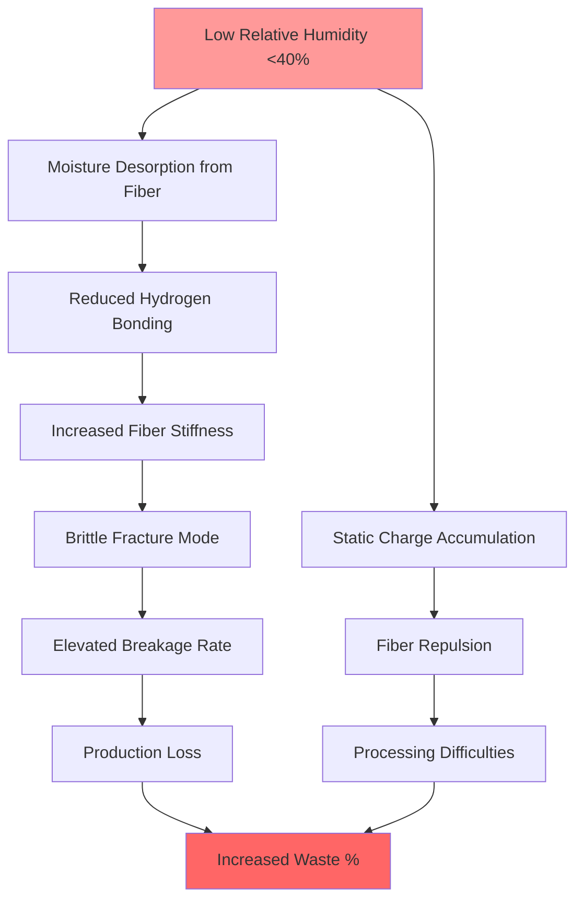
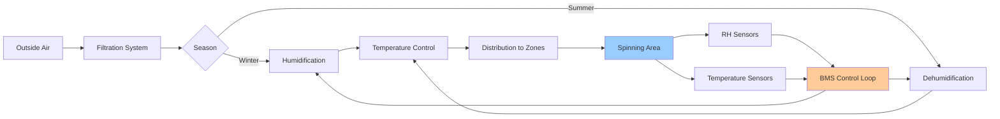

## Moisture-Fiber Strength Relationship

Textile fibers exhibit significant mechanical property variations with ambient relative humidity due to hygroscopic water absorption. The moisture regain directly influences fiber tensile strength, elongation, and elastic modulus through hydrogen bonding between water molecules and fiber polymer chains.

### Moisture Regain Fundamentals

Moisture regain (MR) quantifies the hygroscopic water content in textile fibers:

$$MR = \frac{W_{wet} - W_{dry}}{W_{dry}} \times 100\%$$

Where:
- $W_{wet}$ = mass of fiber at equilibrium with ambient RH
- $W_{dry}$ = oven-dry fiber mass (typically 105°C)

The equilibrium moisture content follows sorption isotherms that vary by fiber type and relative humidity. For most natural fibers, the relationship is non-linear and exhibits hysteresis between adsorption and desorption cycles.

### Fiber Strength Dependence on Humidity

The tensile strength of hygroscopic fibers increases with moisture content up to optimal levels. Water molecules plasticize the fiber structure, reducing brittleness and allowing polymer chain mobility. However, excessive moisture weakens hydrogen bonds between polymer chains, reducing strength.

The strength-humidity relationship for natural fibers:

$$\sigma_{fiber} = \sigma_{ref} \left(1 + k_{1} \cdot MR - k_{2} \cdot MR^{2}\right)$$

Where:
- $\sigma_{fiber}$ = tensile strength at current moisture regain
- $\sigma_{ref}$ = reference strength at standard conditions
- $k_{1}$, $k_{2}$ = fiber-specific empirical constants

## Optimal Humidity Levels by Fiber Type

Different fiber materials require specific relative humidity ranges for maximum strength and minimum breakage during spinning operations.

| Fiber Type | Optimal RH Range | Target Moisture Regain | Temperature Range | Strength Increase vs Dry |
|------------|------------------|------------------------|-------------------|-------------------------|
| Cotton | 60-65% | 7.0-8.5% | 24-27°C | +25-30% |
| Wool | 65-70% | 14-16% | 20-24°C | +35-40% |
| Viscose Rayon | 60-65% | 11-13% | 24-27°C | +40-50% |
| Flax (Linen) | 65-70% | 10-12% | 22-25°C | +30-35% |
| Silk | 65-70% | 10-11% | 24-27°C | +20-25% |
| Polyester | 40-50% | <0.5% | 24-27°C | +2-5% |
| Nylon | 50-60% | 4-5% | 24-27°C | +15-20% |

### Cotton Fiber Behavior

Cotton exhibits maximum tensile strength at 60-65% RH with approximately 7.5% moisture regain. Below 40% RH, cotton becomes brittle with tensile strength decreasing by 25-30% compared to optimal conditions. The increased brittleness causes elevated yarn breakage rates during drawing and spinning.

### Wool and Animal Fibers

Wool demonstrates the highest moisture regain among common textile fibers due to its protein structure. Optimal strength occurs at 65-70% RH. The cortical cells in wool fiber structure require moisture for flexibility. At low humidity (<40% RH), wool becomes harsh and prone to fiber breakage during carding and combing operations.

### Synthetic Fiber Considerations

Hydrophobic synthetic fibers (polyester, polypropylene) show minimal strength variation with humidity but require controlled RH for static electricity management. Hygroscopic synthetics (nylon, acrylic) exhibit moderate strength increases with moisture similar to natural fibers.

## Brittle Fiber Behavior at Low Humidity

When relative humidity drops below critical thresholds, textile fibers lose moisture content and exhibit brittle fracture characteristics rather than ductile behavior.

### Mechanical Failure Mechanisms

At low moisture content:
1. **Reduced Elongation**: Dry fibers exhibit 30-50% lower breaking elongation, causing sudden fracture under tension
2. **Increased Elastic Modulus**: Stiffness increases, reducing ability to absorb shock loads during processing
3. **Surface Embrittlement**: Fiber cuticle hardens, increasing friction and abrasion damage
4. **Crystalline Region Rigidity**: Loss of amorphous region mobility concentrates stress in crystalline zones

## Static Electricity Control

Electrostatic charge generation during fiber processing correlates inversely with relative humidity. Static control represents a critical secondary benefit of humidity management in spinning operations.

### Static Generation Mechanism

Triboelectric charging occurs when fibers contact processing surfaces (rollers, cards, combs). At low humidity, surface resistivity increases exponentially, preventing charge dissipation.

Surface resistivity relationship:

$$\rho_{s} = \rho_{0} \cdot e^{-\beta \cdot RH}$$

Where:
- $\rho_{s}$ = surface resistivity (Ω/square)
- $\rho_{0}$ = reference resistivity at 0% RH
- $\beta$ = humidity coefficient (typically 0.05-0.08 for textiles)
- $RH$ = relative humidity (%)

### Static Control Thresholds

| Relative Humidity | Static Behavior | Processing Impact |
|-------------------|-----------------|-------------------|
| <30% | Severe charge accumulation | Fiber fly, wrapping, production stops |
| 30-40% | Moderate static | Reduced efficiency, quality issues |
| 40-50% | Minimal static | Acceptable for synthetics |
| >50% | Negligible static | Optimal for natural fibers |

## HVAC System Design Considerations

ASHRAE Industrial Ventilation guidelines recommend continuous monitoring and tight control of spinning room conditions to maintain fiber properties.

### Control Specifications

- **RH Control Tolerance**: ±3% of setpoint for natural fiber spinning
- **Temperature Tolerance**: ±1.5°C to prevent psychrometric drift
- **Air Changes**: 15-25 ACH depending on heat loads from machinery
- **Filtration**: MERV 11-13 to prevent fiber contamination

### Humidification System Selection

Spinning operations typically require 2,000-5,000 kg/hr humidification capacity per 10,000 spindles. Recommended technologies:
- **Compressed Air Atomization**: Fine droplet generation, minimal wetting
- **Ultrasonic Humidifiers**: Ultra-fine mist for uniform distribution
- **Direct Steam Injection**: High capacity, requires mineral-free steam

## Breakage Prevention Strategies

Maintaining optimal humidity reduces yarn breaks during spinning by 40-60% compared to uncontrolled conditions.

### Economic Impact

For a 20,000-spindle cotton ring spinning operation:
- **Uncontrolled conditions** (35-50% RH): 15-20 breaks per 1000 spindle-hours
- **Controlled conditions** (62-65% RH): 6-8 breaks per 1000 spindle-hours
- **Productivity gain**: 8-12% through reduced downtime
- **Quality improvement**: 20-30% reduction in thick/thin places

### Monitoring Requirements

Continuous measurement of:
1. Relative humidity (calibrated hygrometers, ±2% accuracy)
2. Dry bulb temperature (RTD sensors, ±0.3°C)
3. Yarn break frequency (integrated with spindle monitoring)
4. Static voltage (electrostatic field meters in critical zones)

Proper humidity control in textile spinning operations directly enhances fiber mechanical properties, reduces static electricity, prevents breakage, and improves both productivity and product quality. The investment in precise HVAC control systems yields measurable returns through waste reduction and increased output efficiency.
