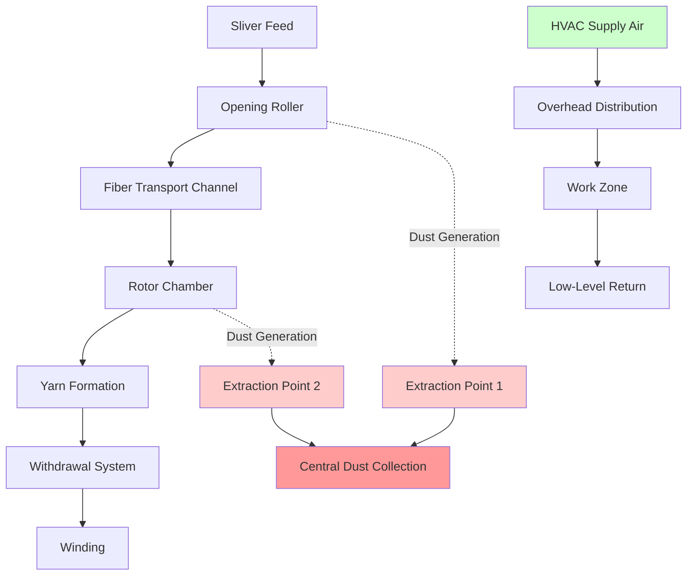
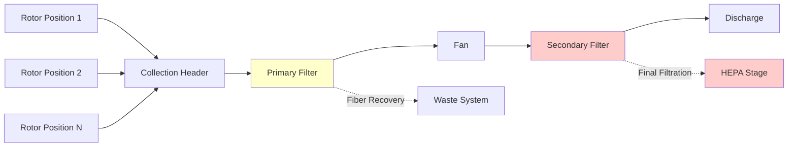

## Overview

Open-end spinning, also known as rotor spinning or break spinning, operates at significantly higher production rates than ring spinning while requiring less stringent environmental controls. The HVAC system must maintain moderate humidity levels, effective dust removal, and stable thermal conditions to ensure consistent yarn quality and equipment performance. Unlike ring spinning, the broken fiber stream in open-end processes reduces static electricity concerns but increases dust generation at rotor boxes.

## Process Description

Open-end spinning separates fibers completely before reassembling them into yarn through centrifugal force within a high-speed rotor. The process eliminates traditional traveler-and-ring systems, enabling production speeds exceeding 150,000 rpm. Dust liberation occurs primarily at the opening roller and rotor chamber, requiring continuous extraction to prevent fiber accumulation and bearing contamination.

## Environmental Specifications

### Temperature and Humidity Requirements

ASHRAE Industrial Applications recommends the following conditions for open-end spinning:

| Parameter | Specification | Tolerance | Notes |
|-----------|--------------|-----------|-------|
| Dry Bulb Temperature | 70-75°F (21-24°C) | ±2°F | Lower than ring spinning |
| Relative Humidity | 50-60% | ±3% | Moderate control required |
| Air Velocity | 25-40 fpm | ±10 fpm | At operator level |
| Dust Concentration | <0.5 mg/m³ | Maximum | Respirable fraction |

The moisture regain relationship for cotton fibers in open-end spinning follows:

$$M_r = \frac{W_{wet} - W_{dry}}{W_{dry}} \times 100$$

Where optimal regain for rotor spinning occurs at:

$$M_r = 7.0\% \pm 0.5\%$$

This corresponds to the specified 50-60% RH range at standard temperatures.

### Psychrometric Requirements

The enthalpy change required to condition outdoor air to spinning room conditions:

$$\Delta h = h_{room} - h_{outdoor}$$

For typical cooling season operation from 95°F DB/75°F WB outdoor to 73°F DB/60% RH indoor:

$$\Delta h = 25.8 - 40.5 = -14.7 \text{ Btu/lb}_{\text{da}}$$

The sensible heat ratio for open-end spinning spaces typically ranges from 0.70 to 0.80, reflecting moderate latent loads from fiber moisture content changes.

## Dust Control Systems

### Extraction Requirements

Each rotor spinning position generates 0.8-1.2 cfm of dust-laden air requiring extraction. For a facility with N spinning positions:

$$Q_{extraction} = N \times 1.0 \text{ cfm/position} \times SF$$

Where SF (safety factor) equals 1.15-1.25 to account for system pressure variations.

### Dust Collection System Design

Filter efficiency requirements:

| Stage | Efficiency | Pressure Drop | Media Type |
|-------|-----------|---------------|------------|
| Primary | 95% @ 10μm | 2-3" WC | Bag/cartridge |
| Secondary | 99% @ 5μm | 3-4" WC | Pleated synthetic |
| Final (optional) | 99.97% @ 0.3μm | 1-2" WC | HEPA |

## HVAC System Design

### Air Distribution Strategy

Supply air distribution utilizes overhead textile ducts or perforated pipes to provide uniform downward airflow, preventing horizontal drafts that could affect fiber transport. Return air extraction occurs at low levels to capture dust particles and maintain slight positive pressurization preventing outdoor contaminant infiltration.

### Ventilation Rates

Total supply air quantity combines process cooling, humidity control, and general ventilation:

$$Q_{total} = Q_{sensible} + Q_{latent} + Q_{ventilation}$$

Minimum ventilation: 0.5-0.8 cfm/ft² of production floor area, significantly lower than ring spinning due to reduced static electricity concerns.

### System Load Calculations

Sensible heat gains include:

$$Q_s = Q_{machines} + Q_{lighting} + Q_{envelope} + Q_{occupants,sensible}$$

Rotor spinning machine heat release: 250-350 W per spinning position at full production capacity.

Latent loads derive primarily from fiber moisture release:

$$Q_l = \dot{m}_{fiber} \times \Delta M_r \times h_{fg}$$

Where:
- $\dot{m}_{fiber}$ = fiber processing rate (lb/hr)
- $\Delta M_r$ = moisture regain change (%)
- $h_{fg}$ = latent heat of vaporization (1050 Btu/lb)

## Control System Integration

Modern open-end spinning facilities implement integrated control systems monitoring:

1. **Zone temperature**: Direct expansion or chilled water cooling with modulating control
2. **Humidity**: Steam or ultrasonic humidification with dewpoint sensing
3. **Dust extraction**: Variable frequency drives maintaining constant static pressure at collection headers
4. **Air balance**: Building pressurization monitoring relative to outdoor conditions

The humidity control loop responds to measured dewpoint with proportional-integral control:

$$u(t) = K_p \cdot e(t) + K_i \int e(t) dt$$

Where e(t) represents dewpoint error from setpoint, typically controlled to ±1°F dewpoint tolerance.

## Energy Efficiency Considerations

Open-end spinning requires approximately 30-40% less HVAC energy than ring spinning due to:

- Lower humidity requirements reducing humidification loads
- Moderate temperature specifications allowing economizer operation
- Reduced air change rates from lower static control needs
- Higher allowable temperature and humidity tolerances

Heat recovery from dust collection system exhaust provides preheating for makeup air during heating seasons, recovering 50-60% of extraction air energy.

## Maintenance and Monitoring

Critical maintenance intervals for open-end spinning HVAC systems:

| Component | Inspection Frequency | Key Parameters |
|-----------|---------------------|----------------|
| Dust collection filters | Weekly | Pressure drop, visual |
| Extraction ductwork | Monthly | Deposit buildup, leaks |
| Humidification systems | Weekly | Output capacity, sanitation |
| Cooling coils | Monthly | Pressure drop, capacity |
| Temperature/RH sensors | Quarterly | Calibration verification |

Continuous monitoring of dust extraction system performance prevents production losses from inadequate fiber removal at rotor chambers. A 10% reduction in extraction effectiveness can increase rotor box cleaning frequency by 30-40%.

## Reference Standards

Design and operation of open-end spinning HVAC systems should reference:
- ASHRAE Handbook - HVAC Applications, Chapter 20: Textile Processing Plants
- ACGIH Industrial Ventilation Manual for dust control system design
- Local building codes for minimum ventilation and filtration requirements
