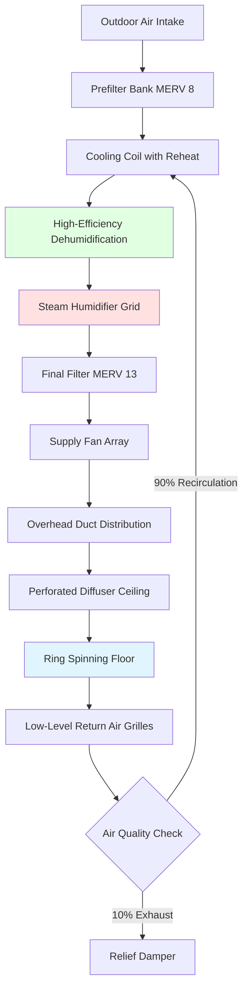
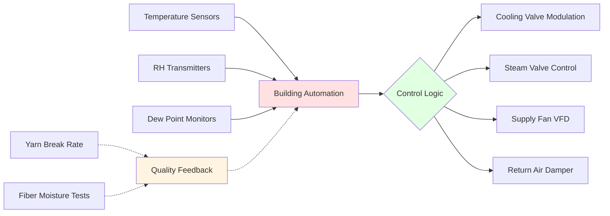

## Ring Spinning Environmental Control

Ring spinning represents the most demanding environmental control challenge in textile manufacturing. The process transforms drafted roving into twisted yarn through high-speed spindle rotation, with the ring-and-traveler mechanism generating significant heat while requiring precise fiber moisture content to prevent breakage.

Environmental conditions directly impact yarn strength, evenness, and production efficiency. Inadequate humidity control causes fiber brittleness and elevated end breakage rates, while temperature deviations affect fiber elasticity and traveler friction characteristics.

## Critical Process Parameters

Ring spinning requires tighter environmental tolerances than other spinning methods due to the mechanical stress imposed on fibers during twist insertion.

| Parameter | Cotton | Polyester-Cotton | Synthetic | Control Tolerance |
|-----------|--------|------------------|-----------|-------------------|
| Temperature | 75-80°F | 72-77°F | 70-75°F | ±2°F |
| Relative Humidity | 65-70% | 60-65% | 55-60% | ±3% |
| Air Velocity | 30-50 fpm | 30-50 fpm | 25-45 fpm | ±10 fpm |
| Fiber Moisture | 7-8% | 5-6% | 0.5-1% | ±0.5% |

### Fiber Moisture Equilibrium

The equilibrium moisture content of textile fibers follows the relationship:

$$M_e = \frac{K_1 \cdot K_2 \cdot RH}{(1 - K_2 \cdot RH)(1 + K_1 \cdot K_2 \cdot RH)}$$

Where:
- $M_e$ = equilibrium moisture content (%)
- $K_1$, $K_2$ = fiber-specific sorption constants
- $RH$ = relative humidity (decimal)

For cotton at standard spinning conditions (75°F, 65% RH):

$$M_e = 7.5\%$$

This moisture level provides optimal fiber flexibility and lubrication for the high-speed twisting process.

## Heat Generation and Load Calculation

Ring spinning machines generate substantial sensible heat from spindle drives, traveler friction, and motor operation.

### Spindle Heat Load

$$Q_{spindle} = \frac{N_{spindles} \cdot P_{motor} \cdot LF \cdot 3412}{E_{motor}}$$

Where:
- $Q_{spindle}$ = heat generated (Btu/hr)
- $N_{spindles}$ = number of spindles
- $P_{motor}$ = motor power per spindle (HP)
- $LF$ = load factor (0.70-0.85)
- $E_{motor}$ = motor efficiency (0.85-0.92)

For a typical 500-spindle ring frame with 0.05 HP per spindle:

$$Q_{spindle} = \frac{500 \cdot 0.05 \cdot 0.75 \cdot 3412}{0.88} = 72,800 \text{ Btu/hr}$$

### Traveler Friction Heat

The ring-traveler interface generates localized heat from friction:

$$Q_{traveler} = \mu \cdot N \cdot v \cdot 3.41$$

Where:
- $\mu$ = coefficient of friction (0.15-0.25)
- $N$ = normal force on traveler (grams-force)
- $v$ = traveler velocity (m/min)

## HVAC System Design Requirements

### Air Distribution Strategy

Ring spinning requires uniform vertical air distribution to maintain consistent conditions across all spindle positions:

$$ACH = \frac{Q_{total} \cdot 60}{V_{room} \cdot \rho_{air} \cdot c_p \cdot \Delta T}$$

Typical air change rates: 20-30 ACH for cotton, 15-25 ACH for synthetics.

**Critical Design Features:**

- **Overhead plenum distribution** with perforated ceiling panels (40-50% open area)
- **Low sidewall return** to create downward airflow pattern
- **Uniform velocity field** preventing fiber fly accumulation
- **Zoned humidity control** for different yarn counts

## Moisture Addition and Control

Maintaining precise humidity levels requires careful humidification system selection and control.

### Humidification Load Calculation

$$W_{humidification} = \rho_{air} \cdot Q_{supply} \cdot (w_{supply} - w_{return}) \cdot 60$$

Where:
- $W_{humidification}$ = moisture addition rate (lb/hr)
- $\rho_{air}$ = air density (lb/ft³)
- $Q_{supply}$ = airflow rate (CFM)
- $w$ = humidity ratio (lb moisture/lb dry air)

For a 50,000 ft² ring spinning room with 30 ACH and target conditions:

$$W_{humidification} = 0.075 \cdot 375,000 \cdot (0.0115 - 0.0095) \cdot 60 = 3,375 \text{ lb/hr}$$

### Steam Injection Requirements

Direct steam injection provides rapid humidity response:

$$m_{steam} = \frac{W_{humidification} \cdot h_{fg}}{h_{steam} - h_{fg}}$$

Using steam at 15 psig ensures complete absorption within the duct length.

## System Performance Monitoring

**Key Performance Indicators:**

- End breakage rate correlation with RH deviation
- Yarn strength variation coefficient vs. temperature stability
- Energy consumption per pound of yarn produced
- Humidifier efficiency and steam consumption

## ASHRAE Industrial Ventilation Guidelines

Per ASHRAE Industrial Ventilation standards, ring spinning areas require:

1. **Minimum outdoor air:** 0.5 CFM/ft² for lint dilution
2. **Filtration:** MERV 13 minimum to prevent fiber recontamination
3. **Pressurization:** +0.02-0.05 in. w.g. relative to adjacent spaces
4. **Temperature uniformity:** Maximum 3°F variation across spinning floor
5. **Humidity response time:** Return to setpoint within 15 minutes after disturbance

## Troubleshooting Common Issues

**High End Breakage Rate:**
- Verify RH sensors calibration (±2% accuracy required)
- Check for stratification using vertical temperature profile
- Inspect humidifier nozzles for scaling or clogging
- Confirm uniform air distribution pattern

**Excessive Energy Consumption:**
- Evaluate simultaneous heating and cooling (reheat optimization)
- Verify economizer operation during shoulder seasons
- Check heat recovery from machinery cooling systems
- Optimize air change rate based on actual heat load

**Fiber Fly Accumulation:**
- Increase air change rate in problem zones
- Verify downward airflow pattern maintenance
- Check filter loading and pressure drop
- Evaluate electrostatic precipitation for fine particulates

## Design Recommendations

1. **Redundant humidification capacity:** 120% of calculated load for maintenance flexibility
2. **Variable speed supply fans:** 25-30% energy savings during reduced production
3. **Dew point control strategy:** More stable than RH control at varying temperatures
4. **Zoned systems:** Separate control for different yarn counts or fiber types
5. **Heat recovery:** Capture 40-60% of sensible heat from process equipment

The critical nature of environmental control in ring spinning justifies premium HVAC equipment selection and comprehensive monitoring systems to ensure consistent yarn quality and production efficiency.
