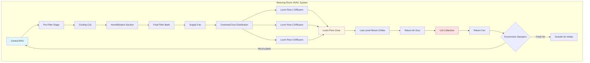
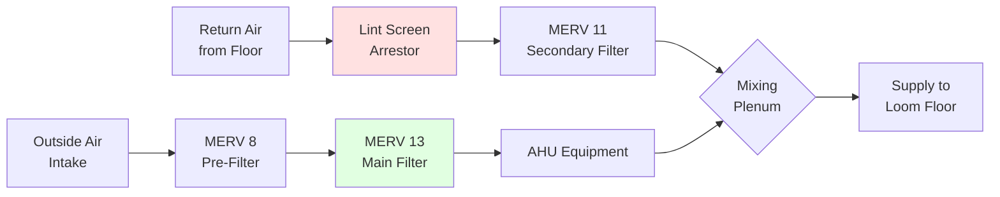

# HVAC Requirements for Weaving Processes

Weaving operations demand precise environmental control to maintain yarn strength, reduce breakage, and ensure consistent fabric quality. The HVAC system must address the unique challenges of high-speed mechanical looms, airborne fiber generation, and the moisture-sensitive nature of textile yarns during interlacing operations.

## Critical Environmental Parameters

Weaving processes require tighter environmental tolerances than many other textile operations due to the mechanical stress imposed on yarns during the interlacing process. ASHRAE Industrial Ventilation guidelines establish baseline conditions, with specific requirements varying by fiber type and fabric construction.

### Temperature Requirements by Fiber Type

| Fiber Type | Temperature (°F) | Temperature (°C) | Tolerance | Rationale |
|------------|------------------|------------------|-----------|-----------|
| Cotton | 75-82 | 24-28 | ±2°F | Maintains fiber flexibility |
| Wool | 65-70 | 18-21 | ±2°F | Prevents excess shrinkage |
| Polyester | 70-75 | 21-24 | ±3°F | Reduces static buildup |
| Silk | 70-75 | 21-24 | ±2°F | Preserves fiber integrity |
| Blends | 72-78 | 22-26 | ±2°F | Balanced for constituents |

### Relative Humidity Requirements

The moisture content of yarns directly affects their tensile strength and elongation properties. The relationship between relative humidity and yarn strength follows:

$$\sigma_y = \sigma_0 \left(1 + k \cdot \frac{RH}{100}\right)$$

Where:
- $\sigma_y$ = yarn tensile strength at given RH
- $\sigma_0$ = base strength at standard conditions
- $k$ = moisture sensitivity coefficient (fiber-dependent)
- $RH$ = relative humidity (%)

**Standard Weaving Room Conditions:**

| Parameter | Cotton/Rayon | Wool | Synthetics | Silk |
|-----------|--------------|------|------------|------|
| Target RH (%) | 65-70 | 60-65 | 45-50 | 65-70 |
| RH Tolerance | ±3% | ±3% | ±5% | ±2% |
| Dew Point (°F) | 62-68 | 55-60 | 50-55 | 60-65 |

## Weaving Room Air Distribution

Air distribution systems must provide uniform conditions across the loom floor while managing heat from mechanical equipment and removing airborne lint.

## Humidity Control Strategies

Maintaining stable relative humidity in weaving rooms requires sophisticated control due to continuous moisture loss from yarns and varying occupancy loads.

### Humidification Load Calculation

The total humidification requirement accounts for ventilation air, infiltration, and yarn moisture loss:

$$\dot{m}_{humid} = \dot{m}_{vent} + \dot{m}_{inf} + \dot{m}_{yarn}$$

**Ventilation moisture load:**

$$\dot{m}_{vent} = \rho_{air} \cdot \dot{V} \cdot (\omega_{target} - \omega_{outdoor})$$

Where:
- $\rho_{air}$ = air density (lb/ft³)
- $\dot{V}$ = ventilation airflow rate (CFM)
- $\omega$ = humidity ratio (lb water/lb dry air)

**Yarn moisture loss rate:**

$$\dot{m}_{yarn} = N_{looms} \cdot v_{pick} \cdot w_{yarn} \cdot \Delta MC$$

Where:
- $N_{looms}$ = number of active looms
- $v_{pick}$ = picks per minute
- $w_{yarn}$ = yarn weight per pick (lb)
- $\Delta MC$ = moisture content change (%)

### Humidification System Selection

| System Type | Capacity Range | Response Time | Energy Efficiency | Application |
|-------------|----------------|---------------|-------------------|-------------|
| Steam Grid | High | Fast (5-10 min) | Moderate | Large facilities |
| Ultrasonic | Low-Medium | Very Fast (2-5 min) | High | Precise control zones |
| Evaporative Media | Medium-High | Moderate (10-15 min) | Very High | Economical operation |
| Air Washer | Very High | Slow (15-20 min) | High | Combined cooling/humidification |

## Air Quality and Filtration

Weaving operations generate significant airborne lint that must be removed to prevent:
- Loom mechanism jamming
- Fabric contamination
- Worker respiratory exposure
- HVAC system fouling

### Recommended Filtration Approach

**Filter Selection Criteria:**

| Location | Filter Type | MERV Rating | Pressure Drop | Change Frequency |
|----------|-------------|-------------|---------------|------------------|
| Outside Air Intake | Pleated Panel | MERV 8 | 0.3" w.g. | Quarterly |
| Main Supply | Bag Filter | MERV 13 | 0.6" w.g. | Bi-annually |
| Return Air Pre-filter | Lint Arrestor | N/A | 0.2" w.g. | Monthly |
| Return Air Secondary | Rigid Box | MERV 11 | 0.5" w.g. | Quarterly |

## Ventilation Requirements

Minimum outside air ventilation for weaving rooms addresses occupant requirements and dilution of process emissions.

$$\dot{V}_{OA} = \max(\dot{V}_{occupant}, \dot{V}_{dilution})$$

**ASHRAE Standard 62.1 Occupant Ventilation:**

$$\dot{V}_{occupant} = N_{people} \cdot 5 \text{ CFM/person} + A_{floor} \cdot 0.06 \text{ CFM/ft}^2$$

**Typical Weaving Room Design Values:**

- Air changes per hour: 15-25 ACH
- Outside air fraction: 15-25% of total supply
- Supply air velocity at loom level: 30-50 FPM
- Return air placement: Low-level (24-36 inches above floor)

## Heat Load Management

High-density loom installations generate substantial sensible heat requiring continuous removal:

$$\dot{Q}_{looms} = N_{looms} \cdot P_{motor} \cdot \eta_{operation} \cdot 3.412 \text{ BTU/hr/W}$$

**Typical Heat Generation:**

| Loom Type | Motor Power (HP) | Heat Output (BTU/hr) | Looms per 1000 ft² |
|-----------|------------------|----------------------|---------------------|
| Air Jet | 5-7 | 12,750-17,850 | 8-12 |
| Rapier | 3-5 | 7,650-12,750 | 10-15 |
| Projectile | 4-6 | 10,200-15,300 | 8-12 |
| Water Jet | 4-5 | 10,200-12,750 | 10-14 |

## Design Recommendations

1. **Zoning Strategy:** Separate HVAC zones for different fiber types or fabric constructions requiring distinct conditions
2. **Redundancy:** Provide N+1 humidification capacity to maintain production during maintenance
3. **Monitoring:** Install continuous RH and temperature monitoring at multiple loom floor locations
4. **Control Response:** Configure humidity control with 2-5 minute response time to prevent rapid environmental swings
5. **Seasonal Adaptation:** Implement economizer cycles during moderate weather to reduce cooling energy while maintaining humidity control

## System Performance Metrics

Monitor these parameters to verify proper HVAC performance:

- Temperature uniformity: Maximum 2°F variation across loom floor
- Relative humidity uniformity: Maximum 3% RH variation across loom floor
- Filter pressure drop trend: Alert at 150% of initial clean pressure drop
- Humidification system cycling: Should not exceed 6 cycles per hour
- Energy usage intensity: Target 15-25 kBTU/ft²/year for conditioned space

## Conclusion

Weaving room HVAC systems require careful integration of temperature control, precise humidification, effective air filtration, and adequate ventilation to support high-quality fabric production. The system design must account for fiber-specific requirements, mechanical heat loads, and lint generation while maintaining operational energy efficiency. Proper commissioning and ongoing monitoring ensure the environmental conditions necessary for minimizing yarn breakage and maximizing weaving efficiency.
