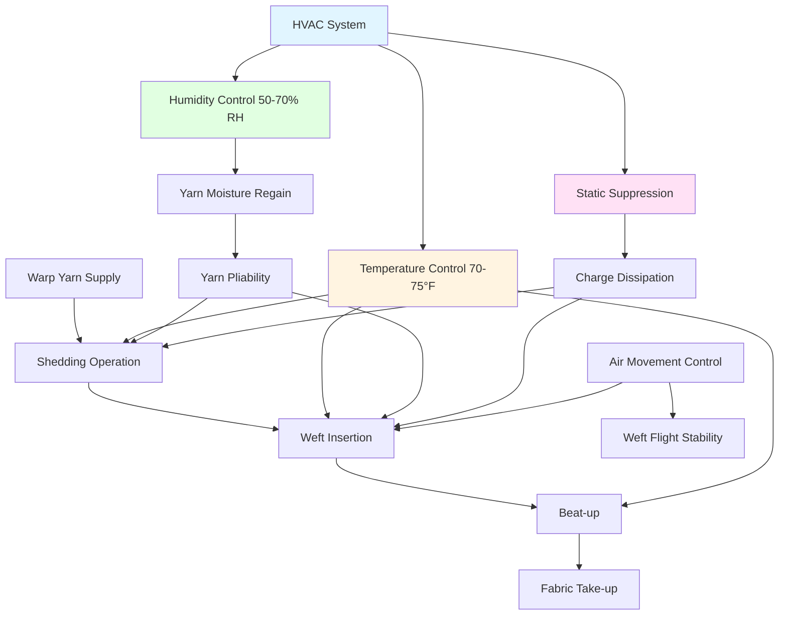

## Loom Room Environmental Requirements

Fabric formation through weaving requires precise environmental control to maintain yarn pliability, minimize static electricity, and prevent breakage during the interlacing process. The loom room represents the most critical control zone in weaving facilities, where yarn mechanical properties directly depend on atmospheric moisture content.

### Critical Environmental Parameters

**Temperature Control:**
Loom rooms operate within a narrow temperature band of 70-75°F (21-24°C) to maintain consistent yarn dimensions and mechanical properties. Higher temperatures reduce relative humidity at constant absolute moisture, while lower temperatures may cause condensation on metallic loom components.

**Humidity Requirements:**
The relationship between yarn moisture regain and ambient relative humidity governs weaving performance. Cotton yarns require 60-65% RH, synthetic yarns 50-55% RH, and wool yarns 65-70% RH for optimal formation characteristics.

The yarn moisture regain follows an empirical relationship:

$$M_r = k_1 \cdot \phi^{n} \cdot e^{k_2 \cdot T}$$

Where:
- $M_r$ = Moisture regain (%)
- $\phi$ = Relative humidity (decimal)
- $T$ = Temperature (°C)
- $k_1, k_2, n$ = Fiber-specific constants

### Static Electricity Control

Static charge accumulation on yarns causes adhesion to loom components and yarn-to-yarn repulsion, both detrimental to fabric formation. The surface charge density relates to humidity:

$$\sigma_s = \sigma_0 \cdot e^{-\alpha \cdot \phi}$$

Where:
- $\sigma_s$ = Surface charge density (C/m²)
- $\sigma_0$ = Reference charge at 0% RH
- $\alpha$ = Humidity dissipation coefficient (fiber-dependent)
- $\phi$ = Relative humidity (decimal)

This exponential relationship demonstrates why maintaining 55-65% RH effectively suppresses static generation during high-speed weaving operations.

## Loom Room HVAC Design Parameters

| Parameter | Cotton Weaving | Synthetic Weaving | Wool Weaving | Design Basis |
|-----------|---------------|-------------------|--------------|--------------|
| Temperature | 73°F ± 2°F | 72°F ± 2°F | 68°F ± 2°F | ASHRAE Industrial Ch. 21 |
| Relative Humidity | 62% ± 3% | 52% ± 3% | 67% ± 3% | Fiber-specific regain |
| Air Velocity | 50-75 fpm | 50-75 fpm | 40-60 fpm | Minimize yarn disturbance |
| Ventilation Rate | 2-4 ACH | 3-5 ACH | 2-3 ACH | Heat removal, lint control |
| Supply Air Distribution | Overhead laminar | Overhead laminar | Overhead laminar | Uniform conditions |
| Return Air Location | Floor level | Floor level | Floor level | Lint removal |

## Weaving Process Environmental Interactions

## Yarn Breakage Prevention

Yarn tensile strength varies with moisture content according to:

$$\sigma_t = \sigma_{dry} \cdot (1 + \beta \cdot M_r)$$

Where:
- $\sigma_t$ = Tensile strength at moisture regain $M_r$
- $\sigma_{dry}$ = Tensile strength in dry condition
- $\beta$ = Moisture strengthening coefficient
- $M_r$ = Moisture regain (%)

For cotton yarns, $\beta$ ranges from 0.05-0.08, indicating 5-8% strength increase per 1% moisture regain increase within the hygroscopic range. Insufficient humidity causes embrittlement and increased breakage during shedding and beat-up operations.

### Breakage Rate Correlation

Empirical studies establish yarn breakage frequency relationship with humidity:

$$B_f = B_0 \cdot e^{-\gamma(\phi - \phi_0)}$$

Where:
- $B_f$ = Breakage frequency (breaks/1000 loom-hours)
- $B_0$ = Baseline breakage at reference humidity
- $\gamma$ = Humidity sensitivity factor
- $\phi$ = Operating relative humidity
- $\phi_0$ = Reference relative humidity (typically 50%)

This relationship demonstrates exponential breakage reduction as humidity approaches optimal fiber-specific values.

## HVAC System Design Considerations

**Load Calculations:**
Loom room sensible heat gains include motor heat from looms (500-800 W per loom), lighting, building envelope, and compressed air system heat rejection. Latent loads typically remain minimal except during summer infiltration.

**Humidification Systems:**
Steam injection systems provide the most precise humidity control for weaving operations. Atomizing spray systems offer lower operating costs but require careful water treatment to prevent mineral deposition on yarns and fabrics.

**Air Distribution:**
Overhead laminar flow supply maintains uniform conditions throughout the loom room height. Supply air velocities must remain below 75 fpm to prevent weft yarn flight disturbances during insertion, particularly for air-jet looms.

**Filtration Requirements:**
Minimum MERV 11 filtration protects yarns from particulate contamination. Additional lint collection at return air locations prevents accumulation on loom mechanisms.

**Control Strategy:**
Dew point control provides superior performance compared to relative humidity control, maintaining consistent yarn moisture regain despite minor temperature variations from load fluctuations.

## Monitoring and Quality Assurance

Continuous monitoring of dry-bulb temperature, wet-bulb temperature, and calculated relative humidity at multiple loom room locations ensures specification compliance. Install sensors at warp yarn plane height (typically 36-48 inches above floor) for representative measurements of actual yarn environment conditions.

Maintain data logging for correlation between environmental conditions and yarn breakage rates, enabling optimization of setpoints for specific yarn types and weaving operations.

## ASHRAE Standards Reference

Design parameters follow ASHRAE Handbook - HVAC Applications, Chapter 21 (Textile Processing), Section on Weaving Operations. Consult manufacturer specifications for specialty synthetic fibers requiring non-standard environmental conditions.
