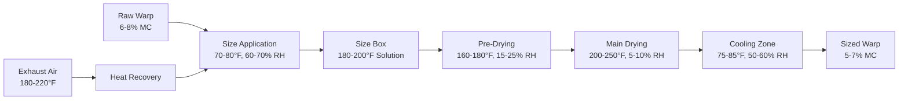

## Warp Sizing HVAC Requirements

Warp sizing applies protective coatings to warp yarns before weaving, requiring precise environmental control through three critical zones: size application, drying, and post-sizing conditioning. Each zone demands specific temperature and humidity conditions to ensure proper size adhesion, controlled moisture removal, and optimal yarn properties for weaving.

### Sizing Process Environmental Zones

### Size Application Zone HVAC

The size application area requires stable conditions to maintain consistent viscosity and prevent premature drying:

**Environmental Parameters:**

| Parameter | Target Range | Tolerance | Control Method |
|-----------|--------------|-----------|----------------|
| Temperature | 70-80°F | ±2°F | AHU with heating/cooling coils |
| Relative Humidity | 60-70% | ±5% | Humidification or dehumidification |
| Air Velocity | <50 fpm | ±10 fpm | Low-velocity displacement ventilation |
| Air Changes | 8-12 ACH | - | Constant volume system |

Excessive air movement causes solution evaporation and viscosity changes. Supply air must be distributed through low-velocity diffusers positioned away from size boxes to prevent drafts across the wet yarn surface.

### Sizing Dryer Ventilation

Drying chambers remove 20-40% of yarn weight as moisture, requiring substantial exhaust capacity and heat input. The moisture removal rate determines ventilation requirements:

$$\dot{m}_w = \frac{Y \cdot V \cdot \rho_y \cdot (MC_i - MC_f)}{100}$$

Where:
- $\dot{m}_w$ = moisture removal rate (lb/hr)
- $Y$ = yarn production rate (yd/min)
- $V$ = yarn linear density (yd/lb)⁻¹
- $\rho_y$ = yarn density factor
- $MC_i$ = initial moisture content (%)
- $MC_f$ = final moisture content (%)

**Exhaust air requirements:**

$$Q_e = \frac{\dot{m}_w}{W_{sa} - W_{ea}} \cdot 60$$

Where:
- $Q_e$ = exhaust air flow (cfm)
- $W_{sa}$ = supply air humidity ratio (lb/lb)
- $W_{ea}$ = exhaust air humidity ratio (lb/lb)

For a typical sizing line processing 500 yd/min of 30/1 cotton yarn with initial MC of 25% (wet sized) to final MC of 6%:

$$\dot{m}_w = \frac{500 \cdot 0.0333 \cdot 1.0 \cdot (25 - 6)}{100} = 3.17 \text{ lb/hr}$$

At supply air conditions of 200°F, 0.005 lb/lb and exhaust conditions of 0.035 lb/lb:

$$Q_e = \frac{3.17}{0.035 - 0.005} \cdot 60 = 6,340 \text{ cfm}$$

### Drying Zone Configuration

Modern sizing machines employ multiple drying stages with progressive temperature increase:

**Multi-Stage Drying Parameters:**

| Stage | Temperature | RH | Air Velocity | Heat Input |
|-------|-------------|-----|--------------|------------|
| Pre-Dry | 160-180°F | 15-25% | 800-1000 fpm | Steam coils |
| Main Dry 1 | 200-230°F | 8-12% | 1000-1200 fpm | Gas burner/steam |
| Main Dry 2 | 220-250°F | 5-10% | 1200-1500 fpm | Gas burner/steam |
| Final Dry | 200-220°F | 8-12% | 800-1000 fpm | Steam coils |

High-velocity air impingement perpendicular to yarn sheet surface maximizes heat transfer. Supply air enters through nozzle arrays 2-4 inches from yarn, with exhaust collection on opposite side creating through-flow.

### Heat Recovery Systems

Dryer exhaust at 180-220°F contains significant recoverable energy. ASHRAE Industrial Ventilation guidelines recommend heat recovery when exhaust temperatures exceed 150°F and runtime exceeds 4000 hours annually.

**Heat Recovery Options:**

1. **Runaround Loops**: Glycol coils in exhaust and makeup air streams, 50-60% effectiveness
2. **Plate Heat Exchangers**: Direct heat transfer, 60-70% effectiveness, requires filtration
3. **Heat Pump Systems**: Active heat transfer, 200-300% COP, highest capital cost

Recovered heat preheats makeup air or supplies space heating to adjacent preparation areas.

### Post-Sizing Conditioning

After drying, sized warp must cool to handling temperature while regaining controlled moisture content for weaving flexibility:

$$MC_{target} = MC_{ambient} \pm 1\%$$

Where ambient refers to weaving room conditions (65-75% RH). The cooling zone operates at:

- Temperature: 75-85°F
- Relative Humidity: 50-60%
- Residence Time: 30-60 seconds
- Air Velocity: 200-400 fpm

Supply air contacts yarn through perforated cylinders or cans, providing gentle cooling without thermal shock that could cause size cracking.

### Ventilation Design Considerations

**Makeup Air Calculation:**

Total makeup air must balance:
- Dryer exhaust (primary load)
- Local exhaust at size boxes (fume control)
- Building infiltration
- General ventilation (8-12 ACH)

**Air distribution strategy:**
1. Deliver tempered makeup air to application zone
2. Allow air to flow toward drying zones
3. Exhaust from dryers and high-humidity areas
4. Maintain slight positive pressure in application zone

**Filter requirements:**
- Makeup air: MERV 8-10 (prevent size contamination)
- Recirculation air: MERV 13-14 (lint and fiber removal)
- Dryer exhaust: Washable screens (heavy lint loading)

### Energy Optimization

Sizing operations consume 2000-4000 Btu per pound of yarn processed. Energy reduction strategies include:

1. **Maximize heat recovery efficiency** (target 60% minimum)
2. **Optimize dryer temperature profiles** (avoid excessive temperature)
3. **Control makeup air based on humidity** (reduce over-ventilation)
4. **Use variable speed drives** on dryer fans (match production rate)
5. **Implement economizer cycles** when outdoor conditions permit

These measures can reduce energy consumption by 25-40% compared to constant-volume, non-recovery systems while maintaining sizing quality and process reliability.

---

**Reference:** ASHRAE Handbook - HVAC Applications, Chapter 20: Textile Processing
