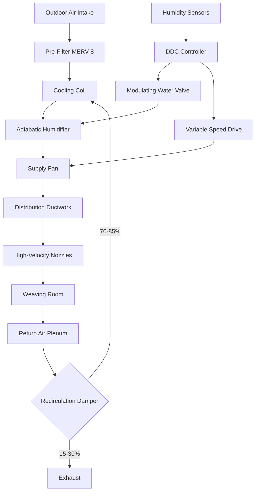
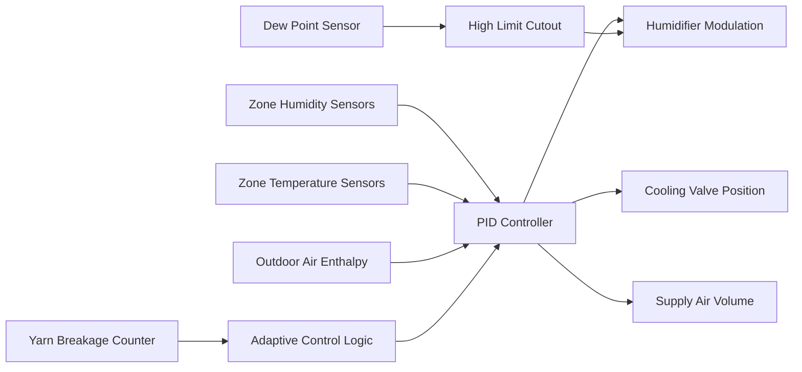

## Fundamentals of Weaving Room Humidity Control

Humidity control in weaving operations directly affects product quality, production efficiency, and operational costs. The physical relationship between relative humidity and fiber moisture content governs yarn behavior during high-speed weaving processes. Insufficient humidity causes static electricity buildup, increased yarn breakage, and fabric defects. Excessive humidity leads to yarn swelling, reduced tensile strength, and microbial growth.

## Moisture Regain and Fiber Physics

Textile fibers exhibit hygroscopic behavior, absorbing or desorbing moisture to achieve equilibrium with ambient air conditions. This relationship is quantified through moisture regain:

$$R = \frac{W_w - W_d}{W_d} \times 100$$

Where:
- $R$ = moisture regain (%)
- $W_w$ = weight of conditioned fiber (kg)
- $W_d$ = bone-dry fiber weight (kg)

The equilibrium moisture content varies by fiber type and follows established isotherms. Cotton at 65% RH and 21°C achieves approximately 7.5% regain, while synthetic fibers exhibit significantly lower values.

For practical humidity control design, the air moisture pickup in the weaving room is calculated:

$$Q_m = \frac{\dot{m}_f \times \Delta R}{100 \times \rho_a \times V}$$

Where:
- $Q_m$ = moisture addition rate (kg/s)
- $\dot{m}_f$ = fiber throughput (kg/h)
- $\Delta R$ = change in regain (%)
- $\rho_a$ = air density (kg/m³)
- $V$ = ventilation rate (m³/s)

## Optimal Humidity Setpoints by Fiber Type

Different fiber compositions require specific humidity ranges for optimal weaving performance. These values are established through both thermodynamic principles and empirical production data.

| Fiber Type | Temperature (°C) | Relative Humidity (%) | Moisture Regain (%) | Dew Point (°C) |
|------------|------------------|----------------------|---------------------|----------------|
| Cotton | 24-27 | 60-65 | 7.0-8.5 | 16-19 |
| Wool | 20-23 | 60-70 | 14.0-16.0 | 14-18 |
| Polyester | 21-24 | 50-55 | 0.4-0.5 | 11-14 |
| Nylon | 21-24 | 55-65 | 3.5-4.5 | 13-17 |
| Rayon | 24-27 | 60-70 | 11.0-13.0 | 16-20 |
| Silk | 22-25 | 60-70 | 9.0-11.0 | 15-19 |
| Cotton/Polyester Blend | 23-26 | 55-60 | 4.0-5.0 | 14-18 |
| Linen | 22-25 | 60-65 | 10.0-12.0 | 15-18 |

ASHRAE Industrial Ventilation guidelines (Chapter 13) recommend maintaining conditions within ±2% RH and ±1°C for high-quality production.

## Yarn Breakage Mechanisms and Prevention

Warp and filling yarn breakage represents the primary quality concern in weaving operations. The breakage rate correlates directly with deviation from optimal humidity conditions.

### Warp Breakage Control

Warp yarns under tension experience cyclic stress during shed formation. At RH below 50%, cotton warp strength decreases by 15-20% while surface friction increases by 30-40%. The combined effect elevates breakage rates exponentially.

Critical control parameters:
- Maintain RH uniformity within ±3% across loom width
- Control rate of humidity change to <5% RH per hour during startup
- Position humidification nozzles to prevent direct impingement on warp sheet
- Monitor dew point to prevent condensation on yarn guide surfaces

### Filling Breakage Prevention

Filling yarns experience tensile shock during shuttle or projectile insertion. Brittle fibers at low humidity exhibit reduced elongation at break. For cotton filling, maintaining 60-65% RH reduces breakage by 40-60% compared to operation at 40% RH.

## Humidification System Design

### System Selection Criteria

The humidification system must deliver precise control while minimizing energy consumption and maintenance. Three primary technologies apply to weaving operations:

**Direct Evaporative (Adiabatic) Humidification**
- Wetted media or spray chamber configuration
- Efficiency: 85-95% saturation effectiveness
- Water consumption: 0.8-1.2 L/kg moisture added
- Cooling effect: 2450 kJ/kg evaporated
- Best application: High outdoor air percentages, cooling loads present

**Steam Grid Humidification**
- Atmospheric or low-pressure steam distribution
- Response time: 30-90 seconds
- Capacity modulation: 10:1 turndown ratio
- Best application: Low outdoor air, tight RH tolerance (±2%)

**Ultrasonic Atomization**
- Droplet size: 1-10 microns
- Energy consumption: 20-40 W per kg/h capacity
- Distribution uniformity: ±1% RH with proper nozzle spacing
- Best application: Retrofit installations, localized control zones

## Control System Architecture

The control system must prevent condensation while maintaining setpoint. Dew point temperature at any surface must remain at least 2°C below surface temperature. For weaving machinery at 25°C operation, maximum dew point is 23°C, corresponding to 67% RH at 25°C.

## Air Distribution and Uniformity

Achieving uniform conditions across the weaving floor requires careful air distribution design. High-velocity jet diffusion from ceiling-mounted linear diffusers provides superior mixing compared to low-velocity displacement systems.

Design parameters:
- Supply air velocity: 8-12 m/s at diffuser
- Throw distance: 0.8 times ceiling height
- Air change rate: 15-25 ACH for natural fiber weaving
- Velocity at loom level: <0.3 m/s to prevent yarn deflection

## Energy Optimization

Weaving room humidity control represents a significant energy load. Optimization strategies include:

1. **Enthalpy-based economizer control**: Use outdoor air when enthalpy favors it over recirculation
2. **Variable air volume**: Reduce airflow during low-production periods while maintaining RH
3. **Heat recovery**: Extract sensible heat from exhaust air using plate or rotary exchangers (60-75% effectiveness)
4. **Desiccant dehumidification**: For climates requiring simultaneous cooling and dehumidification

The specific energy consumption for maintaining 65% RH at 25°C in a cotton weaving facility ranges from 15-30 kWh per kg of fabric produced, depending on climate and system design.

## Quality Impact and Production Metrics

Properly controlled humidity conditions deliver measurable production improvements:

- Warp breakage reduction: 50-70%
- Filling breakage reduction: 30-50%
- Production speed increase: 10-20%
- First-quality fabric yield improvement: 5-15%
- Static electricity elimination: >90% reduction in defects

These improvements typically justify humidification system capital costs within 12-24 months of operation for medium to large weaving facilities processing natural fibers.
