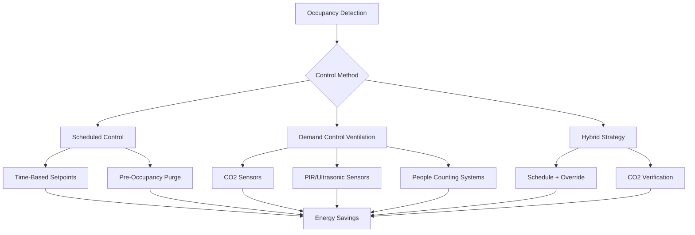
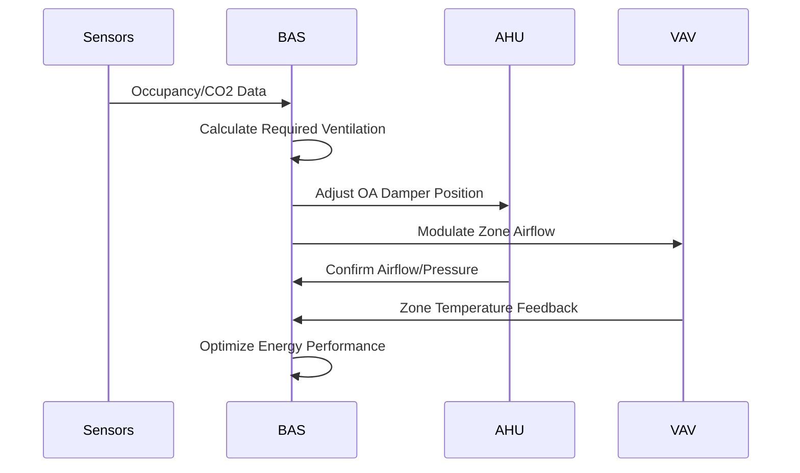

Variable occupancy control represents a critical strategy for optimizing HVAC system performance in spaces where occupant density fluctuates significantly throughout the day or week. These control methodologies reduce energy consumption during low-occupancy periods while maintaining comfort and indoor air quality when spaces are fully utilized.

## Fundamental Principles

Variable occupancy spaces present unique challenges due to the dynamic nature of thermal and ventilation loads. The total sensible cooling load varies proportionally with occupancy density:

$$Q_{sensible} = Q_{envelope} + Q_{lights} + Q_{equipment} + n \cdot q_{person,sensible}$$

where $n$ represents the number of occupants and $q_{person,sensible}$ equals approximately 250 BTU/hr per person at typical indoor conditions. The latent load component follows a similar relationship:

$$Q_{latent} = n \cdot q_{person,latent} + Q_{moisture,other}$$

with $q_{person,latent}$ ranging from 200-450 BTU/hr depending on activity level and space temperature.

The required outdoor air ventilation follows ASHRAE Standard 62.1:

$$V_{oz} = R_p \cdot P_z + R_a \cdot A_z$$

where $R_p$ is the people outdoor air rate (CFM/person), $P_z$ is the zone population, $R_a$ is the area outdoor air rate (CFM/ft²), and $A_z$ is the zone floor area. For variable occupancy applications, the people component dominates and creates significant modulation opportunity.

## Control Strategies

### Scheduled Control

Scheduled control relies on predetermined occupancy patterns to adjust HVAC operation. This approach works effectively for spaces with predictable usage including offices, educational facilities, and religious buildings.

Key parameters include:
- Occupied period setpoints (typically 72-76°F cooling, 68-72°F heating)
- Unoccupied setback (55-60°F heating, 85-90°F cooling)
- Pre-occupancy startup time calculation
- Holiday and exception day programming

The required startup time follows:

$$t_{startup} = \frac{C \cdot \Delta T}{Q_{capacity} \cdot 60}$$

where $C$ represents the building thermal mass (BTU/°F), $\Delta T$ is the temperature recovery required (°F), and $Q_{capacity}$ is the system heating or cooling capacity (BTU/hr).

### Demand Control Ventilation (DCV)

DCV modulates outdoor air intake based on real-time occupancy measurements, typically using CO2 concentration as a proxy for occupant density. ASHRAE Standard 62.1 permits DCV in spaces larger than 500 ft² with variable occupancy and greater than 25 people/1000 ft² design density.

The outdoor air fraction adjusts according to:

$$\frac{V_{ot}}{V_{supply}} = \frac{C_{space} - C_{return}}{C_{outdoor} - C_{return}}$$

where concentrations are measured in ppm. The control loop maintains space CO2 levels between 600-1000 ppm above outdoor ambient (typically 400 ppm), corresponding to adequate ventilation per person.

## Application-Specific Considerations

### Assembly Facilities

Assembly occupancies including theaters, auditoriums, and worship spaces experience extreme occupancy swings from near-zero to design capacity. Critical considerations include:

**Load Diversity**

Design ventilation capacity should account for simultaneous use factors. For multi-space facilities:

$$V_{total} = \sum_{i=1}^{n} D_i \cdot V_{design,i}$$

where $D_i$ represents the diversity factor (typically 0.6-0.8 for assembly spaces).

**Rapid Response Requirements**

High occupancy density (150 ft²/person or less) generates significant latent loads requiring quick system response. Ventilation rates must ramp from minimum (typically 0.06 CFM/ft²) to design capacity within 15-30 minutes of occupancy detection.

### Event Spaces and Convention Centers

Large event spaces demand sophisticated control due to highly variable schedules and configuration flexibility:

| Operation Mode | Ventilation Rate | Temperature Setpoint | Humidity Control |
|----------------|------------------|---------------------|------------------|
| Unoccupied | 0.06 CFM/ft² | 85°F cooling / 60°F heating | None |
| Pre-event | 50% design | 74°F | Dehumidification active |
| Occupied | Full design | 72-74°F | Full control |
| Post-event | 75% design (30 min) | 74°F | Active |
| Cleaning/Setup | 0.15 CFM/ft² | 78°F | None |

### Educational and Office Buildings

Scheduled control dominates in these applications, supplemented by zone-level DCV in high-density spaces such as conference rooms and classrooms:

**Optimal Start/Stop Algorithms**

Modern building automation systems calculate startup time using outdoor temperature and building thermal response:

$$t_{start} = K_1 + K_2(T_{setpoint} - T_{space}) + K_3(T_{space} - T_{outdoor})$$

where $K_1$, $K_2$, and $K_3$ are empirically derived coefficients based on building thermal mass and system capacity.

## System Integration

Effective variable occupancy control requires coordination between multiple building systems:

The control sequence must maintain minimum ventilation requirements per ASHRAE 62.1 Section 6.2 while preventing excessive outdoor air intake during extreme weather conditions.

## Energy Performance

Properly implemented variable occupancy control achieves 20-40% reduction in HVAC energy consumption compared to constant-volume operation. Savings derive from:

- Reduced fan energy (proportional to flow rate cubed)
- Decreased heating/cooling of outdoor air
- Optimized equipment runtime
- Minimized simultaneous heating and cooling

The fan power relationship follows the affinity laws:

$$\frac{P_2}{P_1} = \left(\frac{V_2}{V_1}\right)^3$$

demonstrating that reducing airflow to 50% of design decreases fan power to 12.5% of full-load consumption.

## Implementation Requirements

Successful variable occupancy control systems require:

- Accurate occupancy detection or prediction
- Properly calibrated CO2 sensors (±50 ppm accuracy)
- Building automation system with adaptive algorithms
- Commissioning verification of control sequences
- Periodic sensor calibration and performance monitoring

ASHRAE Guideline 36 provides standardized control sequences for variable occupancy applications, ensuring consistent implementation across diverse building types and control platforms.
