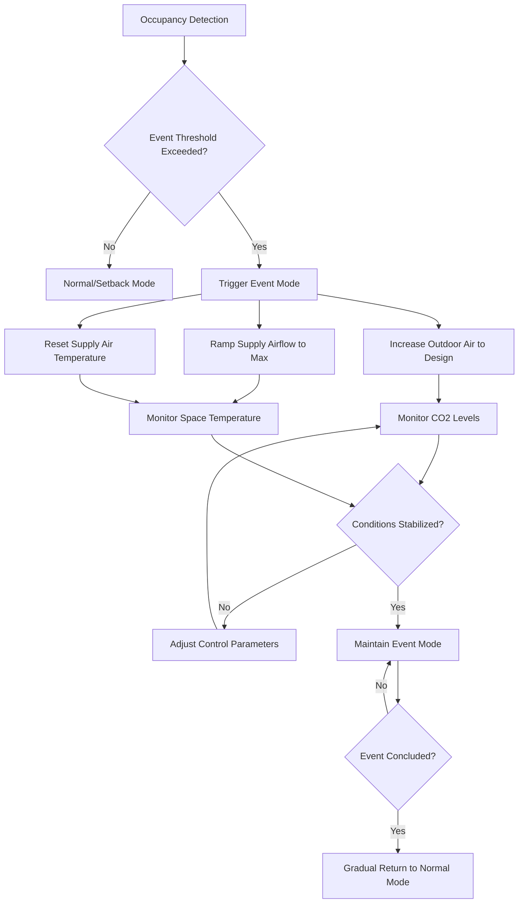
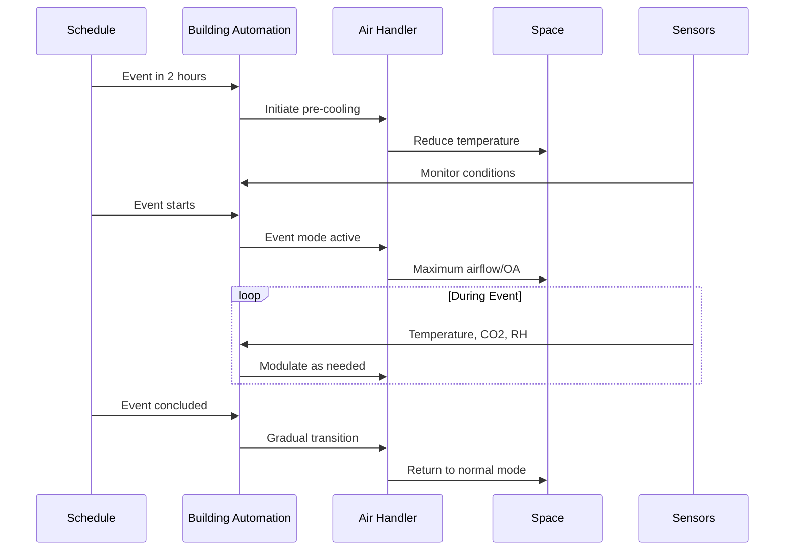

Event mode operation represents a critical HVAC control strategy for spaces experiencing sudden, significant increases in occupancy, such as auditoriums, convention centers, houses of worship, and multipurpose facilities. This operational mode transitions systems from energy-conserving setback conditions to full capacity operation, managing both ventilation and thermal loads during high-density occupancy events.

## Physical Principles of Event Loads

Event mode operation addresses two primary load categories: ventilation loads from increased outdoor air requirements and internal gains from occupant metabolic heat and moisture generation.

### Ventilation Load Calculation

The outdoor air ventilation requirement during events follows ASHRAE Standard 62.1 breathing zone calculations:

$$V_{bz} = R_p \times P_z + R_a \times A_z$$

Where:
- $V_{bz}$ = breathing zone outdoor airflow, CFM
- $R_p$ = people outdoor air rate, CFM/person (typically 5-7.5 CFM/person for assembly spaces)
- $P_z$ = zone population at peak event occupancy
- $R_a$ = area outdoor air rate, CFM/ft²
- $A_z$ = zone floor area, ft²

The sensible cooling load from increased ventilation is:

$$Q_{vent,s} = 1.08 \times V_{oa} \times (T_{oa} - T_{sa})$$

Latent ventilation load:

$$Q_{vent,l} = 0.68 \times V_{oa} \times (W_{oa} - W_{sa})$$

Where $V_{oa}$ is outdoor air CFM, $T$ represents dry-bulb temperatures in °F, and $W$ represents humidity ratios in grains/lb.

### Occupant Load Calculation

Occupant sensible and latent heat gains vary with activity level and space temperature. For assembly spaces with seated, very light activity (ASHRAE Handbook—Fundamentals):

$$Q_{occ,s} = N_{occ} \times q_{s,person}$$

$$Q_{occ,l} = N_{occ} \times q_{l,person}$$

At 75°F space temperature: $q_{s,person}$ = 245 BTU/hr, $q_{l,person}$ = 155 BTU/hr per person.

Total event cooling load:

$$Q_{event,total} = Q_{vent,s} + Q_{vent,l} + Q_{occ,s} + Q_{occ,l} + Q_{lighting} + Q_{equipment}$$

## Event Mode Control Strategies

### Detection Methods

Event mode triggers employ multiple detection strategies:

- **Scheduled activation**: Pre-programmed based on facility calendar (most common for predictable events)
- **CO₂-based triggering**: Space CO₂ concentration exceeding threshold (typically 150-200 ppm above outdoor ambient)
- **Occupancy sensors**: People counting systems detecting occupancy exceeding setpoint (80-90% of design occupancy)
- **Manual override**: Building operator initiation for unscheduled events

### Operation Mode Comparison

| Parameter | Setback Mode | Normal Mode | Event Mode | Response Time |
|-----------|--------------|-------------|------------|---------------|
| Outdoor Air Damper | Minimum position (10-15%) | Code minimum | Design maximum (100%) | 2-5 minutes |
| Supply Airflow | 40-60% design | 70-85% design | 95-100% design | 5-10 minutes |
| Supply Air Temperature | 60-65°F | 55-58°F | 52-55°F | 10-15 minutes |
| Space Temperature Setpoint | 78-82°F | 72-76°F | 72-74°F | 15-30 minutes |
| Exhaust/Relief Dampers | Closed/minimum | Modulating | Maximum | 2-5 minutes |

## Pre-Cooling and Ventilation Strategies

Effective event mode operation requires pre-event conditioning to minimize thermal shock and ensure adequate air quality upon occupant arrival.

### Pre-Cooling Duration

Required pre-cooling time depends on building thermal mass and desired temperature pulldown:

$$t_{precool} = \frac{m \times c_p \times \Delta T}{Q_{cooling,net}}$$

Where:
- $t_{precool}$ = pre-cooling duration, hours
- $m$ = effective thermal mass, lbm
- $c_p$ = specific heat of building materials, BTU/(lbm·°F)
- $\Delta T$ = desired temperature reduction, °F
- $Q_{cooling,net}$ = net cooling capacity during unoccupied pulldown, BTU/hr

Typical pre-cooling periods: 1-3 hours for light construction, 2-4 hours for heavy mass construction.

### Ventilation Purge

Pre-event ventilation purge removes accumulated contaminants and establishes adequate air quality:

$$N_{ACH} = \frac{V_{oa} \times 60}{V_{space}}$$

Where $N_{ACH}$ is air changes per hour and $V_{space}$ is space volume in ft³.

ASHRAE recommends 2-3 air changes of outdoor air before occupancy for spaces with extended unoccupied periods.

## System Capacity Requirements

Equipment sizing for event mode operation must accommodate peak loads with adequate safety factor:

$$\text{Cooling Capacity} = Q_{event,total} \times 1.15 \text{ to } 1.25$$

The multiplier accounts for:
- Simultaneous peak conditions
- Equipment degradation over time
- Altitude and installation effects
- Transient response requirements

### Supply Fan Considerations

Variable-volume systems in event mode operate at maximum airflow with corresponding fan power:

$$P_{fan} = \frac{V_{sa} \times \Delta P_{total}}{6356 \times \eta_{fan}}$$

Where $P_{fan}$ is fan power (HP), $V_{sa}$ is supply airflow (CFM), $\Delta P_{total}$ is total static pressure (in. w.g.), and $\eta_{fan}$ is fan total efficiency.

Peak fan power during event mode typically represents 2-3 times the power consumption during normal occupied mode in VAV systems.

## Control Sequence Integration

Event mode operation integrates with building automation systems through defined control sequences:

1. **Event initiation** (T-120 to T-60 minutes): Start pre-cooling, increase outdoor air to 50% design
2. **Pre-occupancy** (T-60 to T-0 minutes): Achieve space temperature setpoint, increase outdoor air to 75% design
3. **Event active** (T-0 to event conclusion): Maintain full design outdoor air, modulate cooling to maintain setpoint
4. **Post-event transition** (0 to +30 minutes): Gradual reduction in outdoor air and cooling capacity
5. **Return to normal** (+30 to +60 minutes): Resume scheduled operation mode

## Performance Metrics

Event mode effectiveness requires monitoring:

- **Temperature recovery time**: Duration to achieve setpoint after event start
- **CO₂ control**: Maintaining space CO₂ below 1000 ppm during peak occupancy
- **Humidity control**: Space relative humidity maintained between 30-60%
- **Energy consumption**: kWh per event compared to baseline
- **Occupant comfort**: Temperature variation within ±2°F of setpoint

Properly designed event mode operation ensures occupant comfort and indoor air quality during high-density occupancy while optimizing energy consumption during unoccupied and normal-occupancy periods. The control strategy balances rapid response capability with system efficiency through coordinated equipment operation and predictive scheduling.
