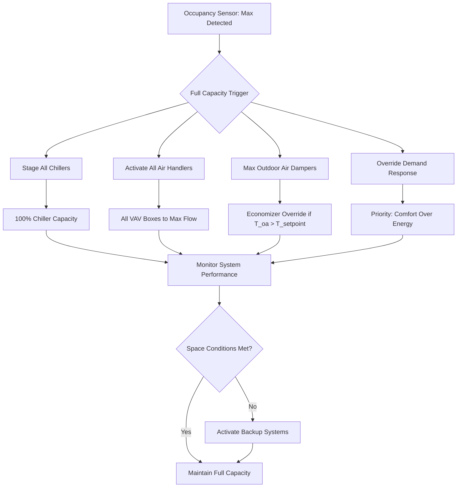

## Overview

Full capacity mode represents the maximum operational state of variable occupancy HVAC systems, designed to maintain thermal comfort and indoor air quality during peak occupancy events. This mode activates all available equipment, maximizes outdoor air ventilation, and prioritizes occupant comfort over energy efficiency.

## Peak Load Calculation

The total cooling load during full capacity operation combines sensible and latent heat gains from maximum occupancy:

$$Q_{total} = Q_{sensible} + Q_{latent}$$

Where the sensible load includes:

$$Q_{sensible} = Q_{occupants,s} + Q_{lights} + Q_{equipment} + Q_{envelope} + Q_{ventilation,s}$$

The occupant sensible heat gain at peak density:

$$Q_{occupants,s} = N_{max} \times q_{s,person} \times CLF$$

The latent load from occupants and ventilation:

$$Q_{latent} = N_{max} \times q_{l,person} + \dot{m}_{oa} \times h_{fg} \times (W_{oa} - W_{ra})$$

Total supply airflow requirement:

$$\dot{V}_{supply} = \frac{Q_{sensible}}{1.08 \times \Delta T_{supply}}$$

## Ventilation Requirements

ASHRAE Standard 62.1 mandates outdoor air based on occupancy and floor area. The breathing zone outdoor airflow:

$$V_{bz} = R_p \times P_z + R_a \times A_z$$

For assembly spaces at maximum occupancy:

$$V_{oz} = \frac{V_{bz}}{E_z}$$

Where zone air distribution effectiveness $E_z$ typically ranges from 0.8 to 1.0 depending on supply air configuration.

## Equipment Staging Strategy

## System Performance Parameters

| Parameter | Full Capacity Value | Design Basis | ASHRAE Reference |
|-----------|---------------------|--------------|------------------|
| Occupant Density | 100% design | 7-15 ft²/person | 62.1 Table 6-1 |
| Outdoor Air Rate | Maximum CFM | 5-7.5 CFM/person | 62.1-2022 |
| Supply Air Temperature | 52-55°F | Max cooling capacity | 90.1 Section 6 |
| Chilled Water ΔT | 10-14°F | Design flow rate | Guideline 0-2021 |
| Fan Speed | 90-100% | VFD maximum | 90.1-2022 |
| Space Temperature | 72-76°F | Comfort zone | 55-2020 |
| Relative Humidity | 40-60% | Latent control | 55-2020 |

## Cooling Capacity Requirements

Peak cooling load components for assembly spaces:

| Load Component | Unit Load | Peak Occupancy Factor | Total Load (BTU/hr) |
|----------------|-----------|----------------------|---------------------|
| Occupants (sensible) | 250 BTU/hr·person | 500 people | 125,000 |
| Occupants (latent) | 200 BTU/hr·person | 500 people | 100,000 |
| Lighting | 1.5 W/ft² | 10,000 ft² | 51,000 |
| Equipment | 0.8 W/ft² | 10,000 ft² | 27,300 |
| Envelope | 0.6 W/ft² | 10,000 ft² | 20,500 |
| Ventilation (sensible) | 2,500 CFM × 1.08 | 95°F outdoor | 81,000 |
| Ventilation (latent) | 2,500 CFM × 0.68 | 0.015 lb/lb ΔW | 25,500 |
| **Total Cooling Load** | | | **430,300** |

Safety factor of 1.15-1.25 applied for equipment selection yields 495,000-538,000 BTU/hr installed capacity.

## Control Sequence

Full capacity mode activation follows this logic:

1. **Trigger Detection**: Occupancy sensors report ≥90% of design occupancy for ≥15 minutes
2. **Pre-Cool Validation**: Space temperature ≥74°F or predicted to exceed within 30 minutes
3. **Equipment Ramp**: All units staged to 100% within 5-10 minutes
4. **Outdoor Air**: Dampers modulate to maximum economizer position or minimum ventilation requirement
5. **Override Activation**: Demand response signals ignored, setback schedules suspended
6. **Monitoring**: CO₂ levels maintained <1000 ppm, temperature within ±2°F of setpoint

## Demand Response Override

During full capacity operation, energy management strategies defer to occupant comfort:

$$P_{electrical} = P_{chillers} + P_{fans} + P_{pumps} + P_{auxiliary}$$

Peak electrical demand may reach 1.5-2.0 times normal operation. Coordination with utility providers ensures adequate service capacity.

## Performance Monitoring

Critical parameters tracked during full capacity operation:

- **Supply Air Temperature**: Maintain 52-55°F to meet sensible load
- **Space Temperature**: Control within ±1.5°F of setpoint under peak load
- **CO₂ Concentration**: Keep below 1000 ppm per ASHRAE 62.1
- **Relative Humidity**: Maintain 40-60% to control latent loads
- **Equipment Runtime**: Log hours for maintenance scheduling
- **Energy Consumption**: Track kW and peak demand for utility coordination

## Design Considerations

Systems designed for variable occupancy with full capacity mode require:

- Equipment capacity 1.2-1.5 times steady-state design load
- Redundant cooling equipment for backup during peak events
- Oversized outdoor air plenums and dampers for maximum ventilation
- Variable frequency drives rated for continuous operation at high speed
- Advanced controls with occupancy prediction algorithms
- Integration with building management systems for demand response coordination

Proper implementation ensures thermal comfort and air quality during maximum occupancy while maintaining system reliability and longevity.
