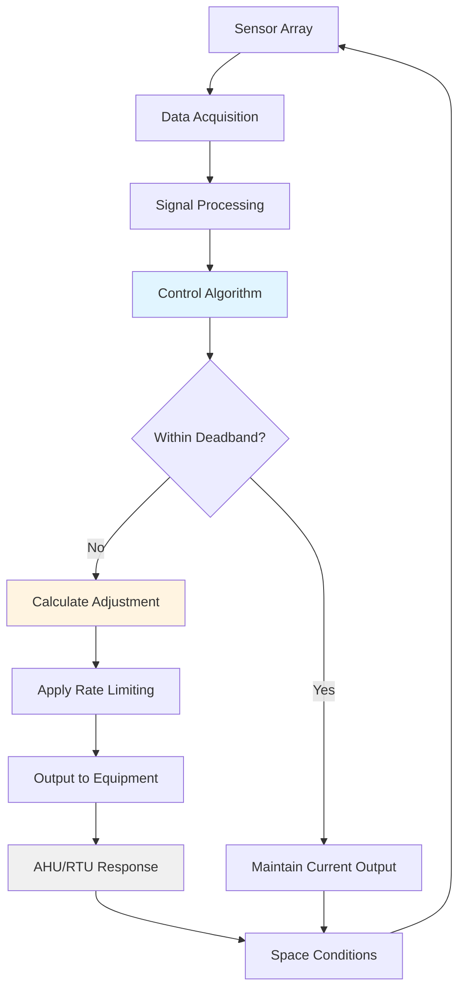
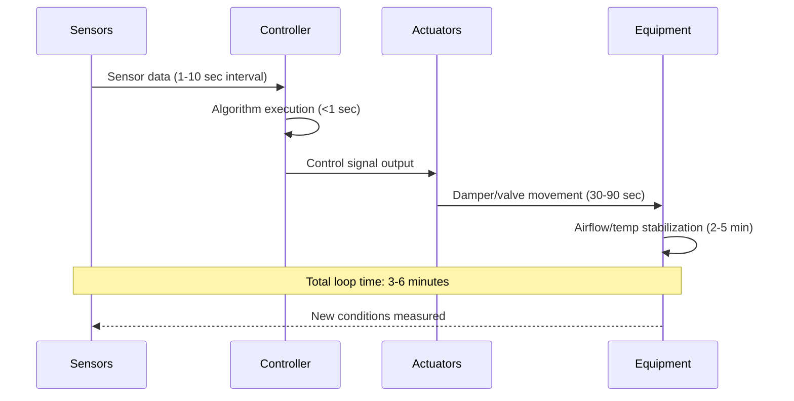

## Real-Time Control Fundamentals

Real-time adjustment represents the dynamic response layer of event mode HVAC systems, continuously modifying system parameters based on measured environmental conditions. This control strategy responds to actual occupancy loading rather than predetermined schedules, optimizing comfort while minimizing energy waste.

The effectiveness of real-time adjustment depends on three critical factors: sensor accuracy, control algorithm response time, and system capacity to meet rapid load changes. ASHRAE Standard 62.1 requires that demand-controlled ventilation systems maintain minimum ventilation rates under all operating conditions while allowing modulation above minimums based on occupancy indicators.

## Control Loop Architecture

The real-time adjustment control loop operates on measured deviations from setpoint targets, implementing proportional-integral-derivative (PID) control enhanced with occupancy-weighted gains.

## Sensor Configuration Requirements

Real-time control accuracy depends directly on sensor placement, calibration frequency, and signal reliability. The following table specifies sensor requirements per ASHRAE Standard 135 (BACnet) and Standard 62.1.

| Sensor Type | Location | Accuracy Required | Response Time | Calibration Interval |
|-------------|----------|-------------------|---------------|---------------------|
| CO₂ | Breathing zone (4-6 ft height) | ±50 ppm | <60 seconds | 6 months |
| Temperature | Return air, multiple zones | ±0.5°F | <30 seconds | 12 months |
| Humidity | Return air stream | ±3% RH | <60 seconds | 12 months |
| Occupancy (PIR) | Ceiling-mounted, strategic coverage | N/A (binary) | <10 seconds | Functional test annually |
| Airflow | Supply duct, after fan | ±10% of reading | <15 seconds | 12 months |
| Pressure | Space differential to adjacent areas | ±0.01 in. w.c. | <10 seconds | 6 months |

## Adaptive Control Algorithms

The real-time adjustment algorithm modulates outdoor air intake, supply air temperature, and airflow based on the integrated sensor feedback. The control output calculation follows:

$$
u(t) = K_p e(t) + K_i \int_0^t e(\tau) d\tau + K_d \frac{de(t)}{dt} + G_o \cdot O(t)
$$

Where:
- $u(t)$ = control output signal
- $e(t)$ = error signal (setpoint - measured value)
- $K_p$, $K_i$, $K_d$ = proportional, integral, and derivative gains
- $G_o$ = occupancy gain factor
- $O(t)$ = normalized occupancy signal (0 to 1)

For CO₂-based demand-controlled ventilation, the required outdoor airflow adjusts continuously:

$$
\dot{V}_{oa}(t) = \dot{V}_{oa,min} + \frac{(C_{measured} - C_{target}) \cdot \dot{V}_{supply}}{(C_{indoor} - C_{outdoor})} \cdot K_{adj}
$$

Where:
- $\dot{V}_{oa}(t)$ = outdoor air volume flow rate at time t (cfm)
- $\dot{V}_{oa,min}$ = minimum outdoor air per code (cfm)
- $C_{measured}$ = measured CO₂ concentration (ppm)
- $C_{target}$ = target CO₂ setpoint (typically 1000-1200 ppm)
- $\dot{V}_{supply}$ = total supply airflow (cfm)
- $K_{adj}$ = adjustment gain factor (0.5-1.0)

## Response Time Requirements

Control loop execution speed determines how quickly the system reacts to changing conditions. The following response hierarchy ensures stable operation:

**Critical timing parameters:**

- Sensor polling interval: 5-10 seconds for CO₂, 1-5 seconds for temperature
- Control calculation cycle: 1-10 seconds (BAS processing speed)
- Actuator stroke time: 30-120 seconds for dampers, 15-60 seconds for valves
- System settling time: 3-10 minutes for thermal equilibrium

## Implementation Requirements

**Deadband Configuration**

Implement control deadbands to prevent excessive actuator cycling and equipment wear:

- Temperature deadband: ±1.0°F from setpoint
- CO₂ deadband: ±50 ppm from setpoint
- Humidity deadband: ±5% RH from setpoint

**Rate Limiting**

Apply slew rate limits to prevent shock loading:

$$
\frac{d\dot{V}_{oa}}{dt} \leq R_{max}
$$

Where $R_{max}$ typically ranges from 10-20% of maximum airflow per minute.

**Override Conditions**

Real-time control must yield to safety overrides:

1. High CO₂ alarm (>1400 ppm): Force maximum outdoor air
2. Extreme outdoor temperature: Limit outdoor air to minimum code requirement
3. Equipment fault: Revert to safe default position
4. Manual operator override: Log event and disable automatic control

## Integration with Building Automation Systems

Real-time adjustment requires robust BAS integration supporting:

- High-resolution trending (minimum 1-minute intervals for critical points)
- Alarm generation with escalation protocols
- Remote monitoring and adjustment capability
- Historical data storage (minimum 2 years) for performance verification
- API access for advanced analytics platforms

ASHRAE Guideline 36 provides standardized control sequences for VAV systems with demand-controlled ventilation, ensuring consistent implementation across different BAS platforms.

## Performance Verification

Continuous commissioning validates real-time control effectiveness through:

- CO₂ concentration histograms showing time below 1200 ppm (target: >95%)
- Temperature deviation analysis from setpoint (target: ±2°F for >90% of occupied hours)
- Energy comparison to baseline operation (typical savings: 15-30% for variable occupancy spaces)
- Sensor drift detection through redundant measurement comparison

Document control performance quarterly and recalibrate sensors according to the schedule specified above to maintain optimal operation.
