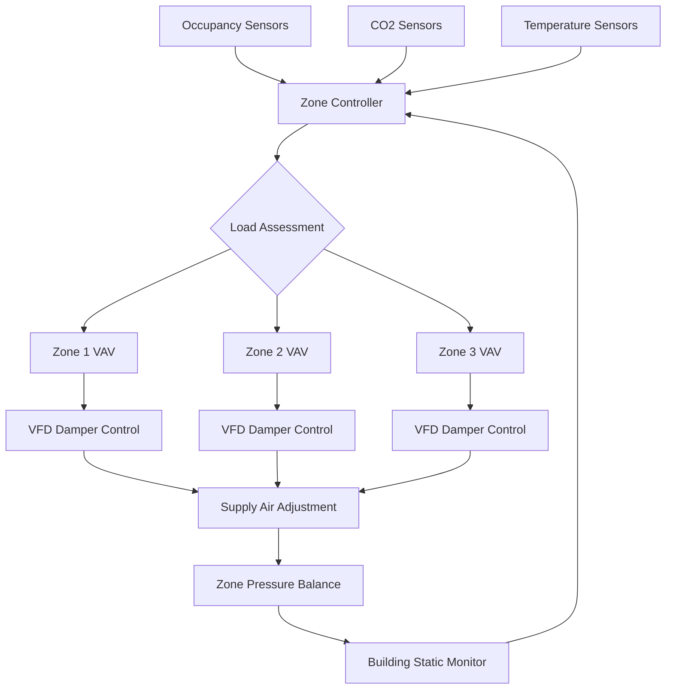
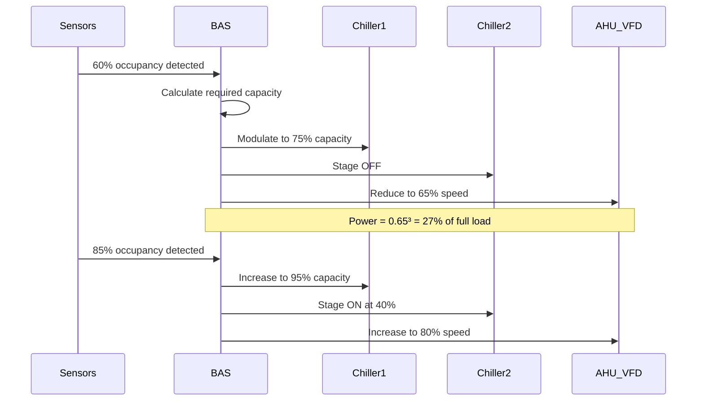

## Variable Load Response Fundamentals

Variable load response systems continuously adjust HVAC output to match real-time thermal and ventilation demands during events with fluctuating occupancy. The control strategy differs fundamentally from steady-state operation by implementing predictive algorithms that anticipate load changes based on sensor feedback and event programming data.

### Load Calculation Dynamics

The instantaneous cooling load during variable occupancy events is:

$$Q_{total}(t) = Q_{sensible}(t) + Q_{latent}(t)$$

Where sensible load from occupants varies with actual headcount:

$$Q_{sensible}(t) = N(t) \cdot q_{s,person} \cdot CF_{activity}$$

- $N(t)$ = instantaneous occupancy count
- $q_{s,person}$ = sensible heat gain per person (typically 250-450 BTU/hr)
- $CF_{activity}$ = activity correction factor (1.0 seated, 1.4-2.0 active)

The latent load component responds more slowly due to moisture buffering:

$$Q_{latent}(t) = N(t) \cdot q_{l,person} + V_{space} \cdot \rho_{air} \cdot \frac{d\omega}{dt} \cdot h_{fg}$$

Where the second term accounts for moisture storage/release from building materials during occupancy transitions.

## Control Response Algorithms

### Proportional Load Following

The system capacity modulation follows:

$$\dot{m}_{air}(t) = \dot{m}_{design} \cdot \left[\frac{Q_{total}(t)}{Q_{design}} \right]^{0.85}$$

The exponent less than unity accounts for system efficiency variations at part-load. VFD-controlled supply fans adjust speed according to:

$$\omega_{fan}(t) = \omega_{rated} \cdot \sqrt[3]{\frac{\dot{m}_{air}(t)}{\dot{m}_{design}}}$$

Power consumption scales with the cube law:

$$P_{fan}(t) = P_{rated} \cdot \left[\frac{\omega_{fan}(t)}{\omega_{rated}}\right]^3$$

This relationship enables substantial energy savings during partial occupancy periods.

## Zone-Level Balancing

### VAV Terminal Unit Response

Each zone terminal unit modulates based on local conditions:

$$\dot{m}_{zone,i}(t) = \dot{m}_{min,i} + \left(\dot{m}_{max,i} - \dot{m}_{min,i}\right) \cdot f(T_{error}, CO_{2,error})$$

Where the function $f$ implements PI or PID control:

$$f = K_p \cdot e(t) + K_i \int e(\tau)d\tau$$

Minimum airflow $\dot{m}_{min,i}$ maintains ventilation per ASHRAE 62.1 requirements even in unoccupied zones.

## Response Time Characteristics

| Load Change Type | Detection Time | Response Time | Steady-State Time |
|------------------|----------------|---------------|-------------------|
| Sudden occupancy increase | 1-3 min | 3-5 min | 8-15 min |
| Gradual occupancy ramp | 2-5 min | 5-8 min | 10-20 min |
| Occupancy decrease | 2-4 min | 8-12 min | 15-25 min |
| Activity level change | 3-6 min | 6-10 min | 12-18 min |

*Note: Times assume properly calibrated sensors and tuned control loops*

## Multi-Stage Equipment Response

### Staging Logic

Equipment staging follows hysteresis bands to prevent short-cycling:

$$Stage_{n+1,ON} = \frac{Q_{total}}{Q_{installed}} > 0.85 \cdot n + 0.15$$

$$Stage_{n,OFF} = \frac{Q_{total}}{Q_{installed}} < 0.70 \cdot (n-1) + 0.15$$

The 15% deadband between stage-on and stage-off thresholds prevents oscillation during borderline conditions.

## Sensor Integration Strategy

| Sensor Type | Primary Function | Response Weight | Update Frequency |
|-------------|------------------|-----------------|------------------|
| Occupancy (PIR/ultrasonic) | Headcount estimation | 0.40 | 30-60 sec |
| CO₂ (NDIR) | Ventilation demand | 0.30 | 60-120 sec |
| Temperature (RTD) | Thermal load | 0.20 | 30-60 sec |
| Humidity (capacitive) | Latent load | 0.10 | 120-180 sec |

The weighted sensor fusion algorithm combines inputs:

$$Load_{estimated} = \sum_{i=1}^{n} w_i \cdot Signal_i(t)$$

Subject to $\sum w_i = 1.0$ and individual bounds preventing sensor failures from dominating control decisions.

## Performance Optimization

### Predictive Load Anticipation

Advanced systems implement feed-forward control based on event scheduling:

$$Q_{predicted}(t+\Delta t) = Q_{current}(t) + \frac{dN}{dt}\bigg|_{scheduled} \cdot q_{person} \cdot e^{-\frac{\Delta t}{\tau}}$$

Where $\tau$ represents the thermal time constant of the space (typically 10-30 minutes for large event spaces). This allows equipment pre-staging 5-10 minutes before anticipated load increases.

### Energy Efficiency Metrics

The coefficient of performance during variable load operation:

$$COP_{variable}(t) = \frac{Q_{cooling}(t)}{P_{compressor}(t) + P_{fan}(t) + P_{pumps}(t)}$$

Properly implemented variable load response maintains $COP_{variable} / COP_{rated} > 0.90$ across the operational range from 40-100% capacity.

## ASHRAE Standards Compliance

- **ASHRAE 90.1**: Requires VFD control on supply fans >7.5 HP and VAV systems for demand-controlled ventilation
- **ASHRAE 62.1**: Mandates minimum ventilation rates regardless of occupancy sensor readings
- **ASHRAE 55**: Thermal comfort maintained during load transitions (±1.5°F drift limit)
- **Guideline 36**: Provides sequences of operation for VAV systems with occupancy-based control

## Implementation Considerations

Successful variable load response requires:

1. **Sensor placement**: CO₂ sensors in return air streams, occupancy sensors with overlapping coverage zones
2. **Control loop tuning**: Slower integral gains prevent overshoot during rapid occupancy changes
3. **Minimum flow limits**: Set at maximum of code-required ventilation or 30% of zone maximum
4. **Static pressure reset**: Building static pressure setpoint reduces as overall demand decreases
5. **Interlock logic**: Equipment staging based on aggregate zone demands, not individual zone calls

The thermal lag between occupancy changes and space condition response necessitates properly tuned predictive algorithms to maintain comfort during dynamic event conditions.
