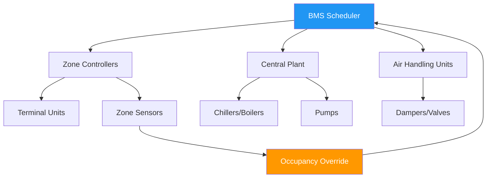
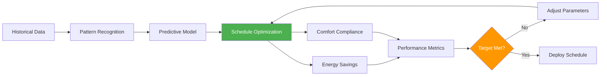

# Occupancy Scheduling for HVAC Systems

Occupancy scheduling represents the temporal component of demand-controlled HVAC operation, establishing time-based control parameters that align system operation with building usage patterns. This deterministic approach reduces energy consumption during unoccupied periods while ensuring comfort conditions upon occupant arrival.

## Fundamental Scheduling Principles

### Time-Based Control Strategy

Occupancy scheduling divides the operational day into discrete periods with distinct control parameters:

- **Occupied mode**: Full system operation maintaining design comfort conditions
- **Unoccupied mode**: Reduced operation with relaxed setpoints
- **Pre-conditioning mode**: Transitional operation preparing spaces for occupancy
- **Night purge mode**: Strategic ventilation during favorable outdoor conditions

The energy savings potential follows the relationship:

$$Q_{saved} = \sum_{i=1}^{n} \dot{Q}_i \cdot t_{unoccupied,i} \cdot \eta_{reduction,i}$$

where $\dot{Q}_i$ represents the thermal load for zone $i$, $t_{unoccupied,i}$ is the unoccupied duration, and $\eta_{reduction,i}$ is the fractional load reduction during setback.

### Setback Optimization

The optimal setback strategy balances energy savings against recovery requirements. The critical parameter is the thermal time constant:

$$\tau = \frac{m \cdot c_p}{UA + \dot{m}_{inf} \cdot c_p}$$

where $m$ is the building thermal mass, $c_p$ is specific heat capacity, $UA$ is the envelope conductance, and $\dot{m}_{inf}$ is infiltration mass flow rate.

Buildings with large $\tau$ (high thermal mass) tolerate wider setback ranges without excessive recovery penalties.

## Building Management System Integration

### BMS Architecture

The BMS scheduler coordinates multiple system levels:

1. **Central plant scheduling**: Chiller/boiler staging based on anticipated load
2. **Distribution scheduling**: Pump and fan operation aligned with demand zones
3. **Zone scheduling**: Individual space temperature and ventilation control
4. **Override management**: Temporary occupancy adjustments

### Event Priority Hierarchy

| Priority Level | Event Type | Response Time | Duration Limit |
|----------------|------------|---------------|----------------|
| 1 (Highest) | Life safety | Immediate | Unlimited |
| 2 | Manual override | <30 seconds | 2-4 hours |
| 3 | Occupancy sensor | <2 minutes | Per detection |
| 4 | Scheduled event | Per program | Per schedule |
| 5 (Lowest) | Optimization | <15 minutes | Continuous |

## Pre-Conditioning Strategies

### Optimal Start Algorithm

Pre-conditioning calculates the required lead time to achieve setpoint conditions at occupancy:

$$t_{start} = t_{occupancy} - \frac{\Delta T_{required}}{\dot{T}_{recovery}}$$

where $\dot{T}_{recovery}$ is the system's temperature recovery rate under maximum capacity.

Advanced systems employ adaptive algorithms that learn building response:

$$\dot{T}_{recovery}(t) = f(T_{outdoor}, T_{initial}, \text{equipment capacity}, \text{solar gain})$$

### Recovery Performance Metrics

The pre-conditioning effectiveness is quantified by:

$$\eta_{precon} = \frac{t_{actual\_ready} - t_{optimal\_start}}{t_{occupancy} - t_{optimal\_start}} \times 100\%$$

Target performance: $\eta_{precon} \geq 95\%$ (ASHRAE Guideline 36 recommendation).

## Schedule Optimization Framework

### Energy-Comfort Tradeoff

The optimization objective function balances energy cost and comfort penalties:

$$\min \left[ \sum_{t=1}^{T} C_{energy}(t) + \lambda \sum_{t=1}^{T} P_{discomfort}(t) \right]$$

where $C_{energy}(t)$ is the time-dependent energy cost, $P_{discomfort}(t)$ is the comfort penalty, and $\lambda$ is the weighting factor.

### Schedule Parameter Matrix

| Building Type | Pre-condition Lead | Setback ΔT (°F) | Unoccupied Ventilation | Recovery Rate Target |
|---------------|-------------------|-----------------|------------------------|----------------------|
| Office | 30-90 min | 8-12 | 0-15% design | 3-5°F/hr |
| Classroom | 45-120 min | 6-10 | 10-20% design | 4-6°F/hr |
| Retail | 20-60 min | 4-8 | 15-25% design | 5-8°F/hr |
| Healthcare | 15-30 min | 2-4 | 50-100% design | 2-3°F/hr |
| Data center | N/A | 0-2 | 100% design | N/A |

## ASHRAE Standards Compliance

**ASHRAE Standard 90.1-2019** (Section 6.4.3.3) mandates automatic HVAC shutdown or setback during unoccupied periods, with exceptions for:

- Spaces requiring continuous operation (data centers, laboratories)
- Systems providing makeup air for exhaust systems
- Spaces with specific ventilation requirements (healthcare)

**ASHRAE Standard 189.1** requires optimum start controls for systems exceeding 10,000 cfm capacity.

**ASHRAE Guideline 36** (High Performance Sequences of Operation for HVAC Systems) provides detailed scheduling sequences including:

- Occupancy mode transitions
- Warm-up and cool-down sequences
- Freeze protection during unoccupied periods
- Optimal start/stop algorithms

## Implementation Considerations

### Schedule Flexibility

Effective scheduling systems incorporate:

1. **Exception handling**: Holiday calendars, special events, after-hours access
2. **Zone-level granularity**: Independent scheduling for areas with different usage patterns
3. **Adaptive learning**: Automatic adjustment based on actual occupancy patterns
4. **Manual override capability**: Local occupant control with automatic reversion

### Performance Monitoring

Key performance indicators for scheduled operation:

$$\text{Energy Use Intensity Ratio} = \frac{\text{EUI}_{actual}}{\text{EUI}_{baseline}}$$

$$\text{Unoccupied Hour Savings} = \frac{E_{occupied} - E_{unoccupied}}{E_{occupied}} \times 100\%$$

Target metrics: 20-40% energy reduction during unoccupied hours for typical commercial buildings.

### Common Scheduling Errors

- **Insufficient pre-conditioning time**: Discomfort at occupancy start
- **Excessive lead time**: Unnecessary energy consumption
- **Inadequate setback**: Minimal savings potential
- **Rigid schedules**: Failure to adapt to actual usage patterns
- **Poor override management**: Extended unnecessary operation

Proper occupancy scheduling typically achieves 15-30% annual HVAC energy savings while maintaining comfort compliance exceeding 98% during occupied hours.
