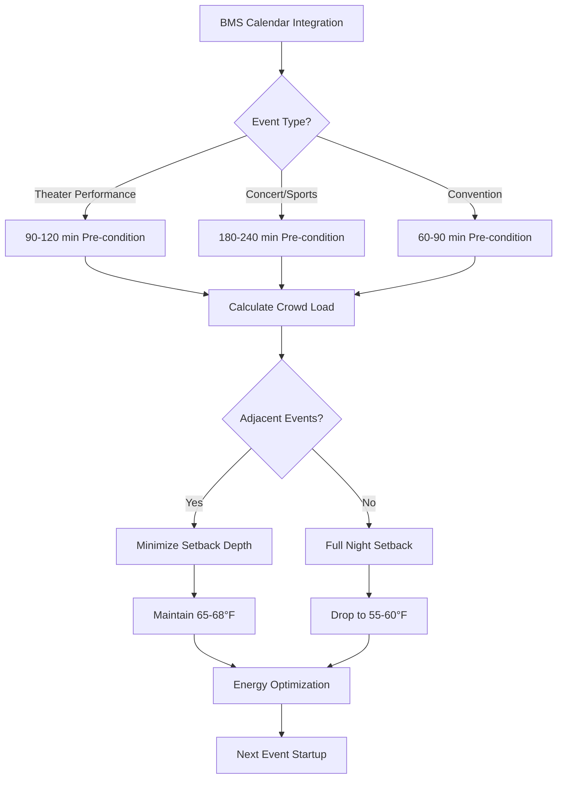

## Overview

Event and performance venues present unique HVAC challenges due to rapid occupancy changes, high transient loads, and strict comfort requirements during performances. Proper scheduling coordinates pre-conditioning, peak load management, and post-event recovery to maintain comfort while minimizing energy consumption.

ASHRAE Standard 90.1 mandates automatic time-based controls for spaces exceeding 10,000 ft², while ASHRAE 55 requires maintaining thermal comfort during occupied periods regardless of crowd density.

## Load Characteristics by Event Type

| Event Type | Occupancy Density | Sensible Load | Latent Load | Pre-Condition Time |
|------------|-------------------|---------------|-------------|--------------------|
| Theater Performance | 7-10 ft²/person | 225-250 BTU/hr·person | 200-225 BTU/hr·person | 90-120 min |
| Concert Hall | 5-8 ft²/person | 250-275 BTU/hr·person | 225-250 BTU/hr·person | 120-180 min |
| Convention/Trade Show | 15-20 ft²/person | 225-250 BTU/hr·person | 175-200 BTU/hr·person | 60-90 min |
| Sports Arena | 8-12 ft²/person | 275-300 BTU/hr·person | 250-275 BTU/hr·person | 180-240 min |
| Banquet Hall | 10-15 ft²/person | 225-250 BTU/hr·person | 200-225 BTU/hr·person | 60-90 min |

## Crowd Load Calculations

The total cooling load for event spaces combines sensible and latent components from occupants, lighting, and equipment.

### Occupant Load

$$Q_{occupant} = N \times (q_{sensible} + q_{latent})$$

Where:
- $Q_{occupant}$ = Total occupant heat gain (BTU/hr)
- $N$ = Number of occupants
- $q_{sensible}$ = Sensible heat per person (225-300 BTU/hr)
- $q_{latent}$ = Latent heat per person (175-275 BTU/hr)

### Peak Load with Diversity

$$Q_{peak} = Q_{occupant} + Q_{lighting} + Q_{equipment} + Q_{infiltration}$$

For a 500-seat theater:

$$Q_{peak} = 500 \times (250 + 225) + 15,000 + 8,000 + 12,000 = 272,500 \text{ BTU/hr}$$

### Pre-Conditioning Energy Requirements

The energy required to condition the space before occupancy:

$$Q_{precool} = \rho V c_p (T_{initial} - T_{setpoint}) + m \times h_{fg} \times (\omega_{initial} - \omega_{setpoint})$$

Where:
- $\rho$ = Air density (0.075 lb/ft³)
- $V$ = Space volume (ft³)
- $c_p$ = Specific heat of air (0.24 BTU/lb·°F)
- $m$ = Mass of air (lb)
- $h_{fg}$ = Latent heat of vaporization (1061 BTU/lb)
- $\omega$ = Humidity ratio (lb moisture/lb dry air)

## Scheduling Strategy

```mermaid
gantt
    title Event HVAC Scheduling Timeline
    dateFormat HH:mm
    axisFormat %H:%M

    section Pre-Event
    System Startup           :done, startup, 14:00, 30m
    Pre-Conditioning Phase   :done, precool, 14:30, 120m
    Stabilization Period     :done, stabil, 16:30, 30m

    section Event
    Doors Open              :active, doors, 17:00, 30m
    Performance Start       :crit, perf, 17:30, 150m
    Intermission            :inter, 19:00, 20m
    Performance End         :crit, end, 20:10, 50m

    section Post-Event
    Venue Clearing          :clear, 21:00, 30m
    Recovery Mode           :recover, 21:30, 60m
    Night Setback           :setback, 22:30, 60m
```

## Pre-Conditioning Protocol

### Temperature Pulldown Strategy

1. **Initial Startup (T-150 min)**: Energize all air handling units, enable full economizer if outdoor conditions permit
2. **Aggressive Cooling (T-120 min)**: Set discharge air temperature to 50-52°F, maximize airflow
3. **Thermal Mass Charging (T-90 min)**: Continue cooling to drop space temperature 3-5°F below setpoint
4. **Stabilization (T-30 min)**: Ramp to normal discharge temperature, allow space to drift toward setpoint
5. **Fine Tuning (T-0 min)**: Maintain setpoint ±1°F as occupants arrive

### Humidity Management

For venues requiring strict humidity control (60% RH target):

$$\dot{m}_{dehumid} = \frac{V \times \rho \times (\omega_{initial} - \omega_{target})}{t_{precondition}}$$

Where:
- $\dot{m}_{dehumid}$ = Required moisture removal rate (lb/hr)
- $t_{precondition}$ = Pre-conditioning time (hr)

## Multi-Event Coordination

### Schedule Optimization Logic

For venues with multiple daily events, maintain intermediate setpoints between performances:

$$T_{intermediate} = T_{occupied} - \Delta T_{recovery} \times f_{time}$$

Where:
- $\Delta T_{recovery}$ = Maximum recovery temperature difference (8-12°F)
- $f_{time}$ = Time factor (hours available / hours required)

## Performance Monitoring

### Key Performance Indicators

- **Pre-conditioning Achievement**: Space within setpoint ±1°F at door opening time
- **Peak Load Response**: Maintain setpoint ±2°F during peak occupancy
- **Recovery Efficiency**: Return to setback within 60 minutes post-event
- **Energy Index**: kWh per occupied hour normalized to outdoor conditions

### Adaptive Learning

Modern BMS systems track actual occupancy patterns and thermal response:

$$t_{optimal} = t_{baseline} + \alpha \times (T_{missed} - 0)$$

Where:
- $t_{optimal}$ = Adjusted start time
- $t_{baseline}$ = Scheduled start time
- $\alpha$ = Learning coefficient (5-10 min/°F)
- $T_{missed}$ = Temperature deviation at event start

## Special Considerations

### Matinee and Evening Schedules

Matinee performances require modified pre-conditioning due to higher outdoor temperatures. Increase pre-conditioning time by 15-20% for afternoon events during cooling season.

### Weekend Schedule Variation

Weekend events following unoccupied periods need extended pre-conditioning to recover thermal mass. Add 30-60 minutes to standard startup for Monday performances or events following 48+ hour vacancy.

### Intermission Management

During 15-20 minute intermissions, maintain supply airflow at 80-90% of peak to prevent rapid temperature drift while reducing fan energy. Do not enable economizer during intermission due to infiltration from open doors.

## Integration with Building Management Systems

ASHRAE Guideline 36 recommends calendar-based scheduling with the following hierarchy:

1. **Primary Schedule**: Regular performance times pulled from venue booking system
2. **Override Events**: Special events entered manually with custom parameters
3. **Occupancy Verification**: Motion sensors confirm actual occupancy matches schedule
4. **Adaptive Adjustment**: System learns optimal start times based on historical performance

Event scheduling systems must interface with fire alarm and life safety systems to ensure HVAC returns to normal operation during emergency evacuation scenarios.

## Energy Recovery

Post-event recovery transitions the system from occupied comfort mode to unoccupied setback while capturing residual cooling capacity:

$$E_{recovery} = \int_{t_0}^{t_1} \dot{Q}_{total}(t) \, dt$$

Where recovery continues until space reaches setback temperature or 90 minutes elapsed, whichever occurs first. This prevents excessive runtime while ensuring thermal reset for next-day events.
