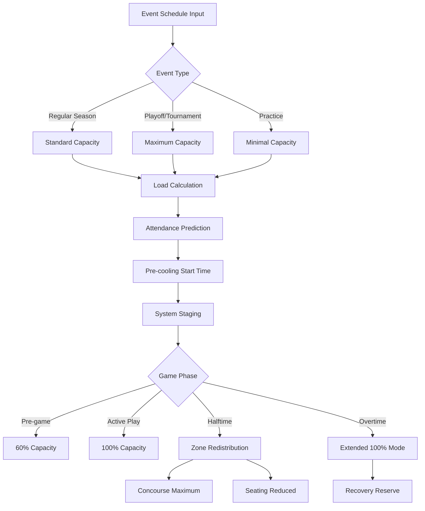

## Overview

Sporting venues present extreme HVAC challenges due to rapid occupancy changes, high metabolic heat generation, concentrated load periods, and event-specific requirements. System design must accommodate empty facilities during off-hours, moderate loads during practice sessions, and peak demands during events with thousands of spectators generating significant sensible and latent heat.

## Load Characteristics for Sporting Events

### Occupancy-Based Thermal Load

The total cooling load varies dramatically with event type and attendance:

$$Q_{total} = Q_{sensible} + Q_{latent} = \dot{m}c_p\Delta T + \dot{m}h_{fg}\Delta\omega$$

Where:
- $Q_{sensible}$ = sensible heat from occupants, lighting, and equipment (BTU/hr)
- $Q_{latent}$ = latent heat from occupant moisture generation (BTU/hr)
- $\dot{m}$ = mass flow rate of air (lb/hr)
- $c_p$ = specific heat of air = 0.24 BTU/lb·°F
- $\Delta T$ = temperature difference (°F)
- $h_{fg}$ = latent heat of vaporization ≈ 1,060 BTU/lb
- $\Delta\omega$ = humidity ratio change (lb moisture/lb dry air)

### Metabolic Heat Generation by Activity Level

Per ASHRAE Fundamentals, metabolic heat varies with spectator engagement and athlete activity:

$$q_{metabolic} = N \times q_{person} \times AF$$

Where:
- $N$ = number of occupants
- $q_{person}$ = heat gain per person (BTU/hr)
- $AF$ = activity factor (1.0 seated, 1.3 standing/cheering, 4.0-6.0 active play)

| Activity Type | Sensible Heat (BTU/hr) | Latent Heat (BTU/hr) | Total (BTU/hr) |
|---------------|------------------------|----------------------|----------------|
| Seated spectator | 230 | 190 | 420 |
| Standing/cheering | 250 | 300 | 550 |
| Light athletic activity | 315 | 585 | 900 |
| Moderate activity (basketball) | 345 | 905 | 1,250 |
| Heavy activity (hockey, intense play) | 405 | 1,345 | 1,750 |

## Event Schedule Integration

### Predictive Load Scheduling

HVAC systems must pre-condition facilities based on event schedules:

$$T_{precool} = \frac{V \times \rho \times c_p \times \Delta T_{desired}}{Q_{cooling} - Q_{building}}$$

Where:
- $T_{precool}$ = required pre-cooling time (hours)
- $V$ = venue volume (ft³)
- $\rho$ = air density ≈ 0.075 lb/ft³
- $Q_{cooling}$ = available cooling capacity (BTU/hr)
- $Q_{building}$ = building envelope load (BTU/hr)

```mermaid
gantt
    title Sporting Event HVAC Schedule Timeline
    dateFormat HH:mm
    axisFormat %H:%M

    section Pre-Event
    Setback Mode (55% capacity)     :a1, 00:00, 6h
    Pre-cooling (75% capacity)      :a2, 06:00, 2h
    Final conditioning (100%)       :a3, 08:00, 1h

    section Game Day
    Doors open                      :milestone, m1, 09:00, 0m
    Pre-game (50% crowd)            :a4, 09:00, 1h
    Game start                      :milestone, m2, 10:00, 0m
    First half (100% load)          :crit, a5, 10:00, 1h
    Halftime (peak concourse)       :crit, a6, 11:00, 20m
    Second half (100% load)         :crit, a7, 11:20, 1h
    Potential overtime              :a8, 12:20, 30m

    section Post-Event
    Crowd dispersal (80% capacity)  :a9, 12:50, 30m
    Cleanup mode (40% capacity)     :a10, 13:20, 2h
    Setback mode (30% capacity)     :a11, 15:20, 8h
```

## Dynamic Load Management Strategies

### Zone-Based Control

Implement separate control strategies for different venue zones:

**Playing Surface Zone:**
- Maintain strict temperature control (68-72°F for basketball/volleyball, 55-60°F for ice hockey)
- High air change rates: 6-12 ACH minimum per ASHRAE 62.1
- Minimize air velocity at playing level (<50 fpm to prevent interference)

**Spectator Seating Zone:**
- Occupied mode: 72-76°F, 30-60% RH
- Variable capacity staging based on ticket sales
- Increased ventilation during peak occupancy: 15 CFM/person minimum

**Concourse and Amenities:**
- Peak load during halftime and intermissions
- 100% occupancy factor during breaks
- Rapid recovery capability required

### Halftime Load Spike Management

Halftime creates unique load distribution as occupants move from seats to concourses:

$$Q_{halftime} = Q_{concourse\_peak} + Q_{restrooms} + Q_{concessions} - Q_{seating\_reduced}$$

Peak concourse occupancy can reach 70-80% of total attendance simultaneously, creating:
- 40-60% increase in concourse cooling demand
- Reduced seating area loads (30-40% decrease)
- Concentrated latent loads near food service areas
- Restroom exhaust requirements spike to maximum

## Ventilation Requirements

ASHRAE 62.1 specifies minimum ventilation rates for sports venues:

- Spectator areas: 7.5 CFM/person
- Playing surfaces: 0.3 CFM/ft² (gymnasiums), 0.5 CFM/ft² (arenas)
- Locker rooms: 0.5 CFM/ft² plus shower exhaust

Total outdoor air requirement:

$$\dot{V}_{OA} = R_p \times P + R_a \times A$$

Where:
- $R_p$ = outdoor air rate per person (CFM/person)
- $P$ = anticipated peak occupancy
- $R_a$ = outdoor air rate per unit area (CFM/ft²)
- $A$ = zone floor area (ft²)

## System Recommendations

**Capacity Staging:**
- Design for 20-30% overcapacity to handle extreme conditions
- Multiple chiller/RTU staging for part-load efficiency
- Variable speed drives on all major air handling equipment

**Scheduling Integration:**
- BMS integration with ticketing systems for real occupancy data
- Weather postponement flexibility with rapid reschedule capability
- Tournament mode for back-to-back events with minimal recovery time

**Control Sequences:**
- 2-4 hour pre-cooling based on outdoor conditions and event type
- Demand-controlled ventilation using CO₂ sensors in occupied zones
- Post-event setback to 55°F (winter) or 85°F (summer) within 30 minutes

**Monitoring Points:**
- Real-time occupancy counting at entrances
- Zone-level temperature and humidity
- Supply air temperature reset based on crowd density
- Return air CO₂ levels for ventilation adequacy

## Components

- Game Schedule Input
- Practice Schedule
- Tournament Schedule
- Season Schedule Variation
- Weather Postponement Flexibility
- Schedule Change Accommodation
