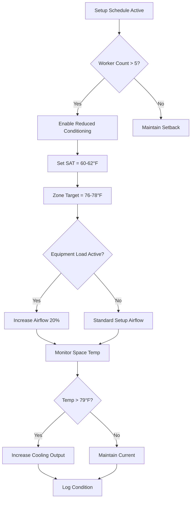

## Overview

Setup and teardown periods represent distinct HVAC conditioning challenges where spaces transition between vacant, worker-occupied, and full-event states. Unlike full occupancy events, setup/teardown involves smaller worker populations, concentrated equipment loads, and physical activity generating elevated metabolic heat. Proper HVAC scheduling during these transitions optimizes energy consumption while maintaining acceptable working conditions per ASHRAE Standard 55.

## Conditioning Load Analysis

### Worker Occupancy Heat Gain

Setup crews generate significantly higher sensible heat than seated occupants due to physical activity:

$$q_{worker} = q_{sensible} + q_{latent} = 250 + 200 = 450 \text{ Btu/hr per person}$$

For moderate to heavy work (ASHRAE Fundamentals, Chapter 18):

$$Q_{occupants} = N_{workers} \times q_{worker} \times CLF$$

Where:
- $N_{workers}$ = number of setup personnel
- $q_{worker}$ = 450 Btu/hr for moderate work (lifting, moving equipment)
- $CLF$ = cooling load factor (typically 0.90-0.95 for short duration)

### Equipment Staging Loads

Temporary equipment during setup introduces transient loads:

$$Q_{equipment,staging} = \sum_{i=1}^{n} (P_i \times 3.41 \times F_{use,i} \times F_{rad,i})$$

Where:
- $P_i$ = equipment power (W)
- 3.41 = conversion factor (Btu/hr per W)
- $F_{use}$ = usage factor during setup (0.4-0.6 typical)
- $F_{rad}$ = radiation factor (heat entering space)

### Reduced Conditioning Strategy

During setup/teardown, target conditions can be relaxed compared to full occupancy:

$$\Delta T_{setup} = T_{occupied} + 3°F \text{ to } 5°F$$

Acceptable setup temperature range: 76-80°F dry bulb (vs 72-75°F occupied)

Ventilation reduction calculation per ASHRAE 62.1:

$$V_{oz,setup} = R_p \times P_{setup} + R_a \times A_z$$

Where setup population $P_{setup}$ is 5-15% of full occupancy for most event spaces.

## Setup Teardown Scheduling Framework

```mermaid
gantt
    title HVAC Conditioning Timeline for Event Setup/Teardown
    dateFormat HH:mm
    axisFormat %H:%M

    section Pre-Event
    Setback Mode           :done, setback, 00:00, 6h
    Pre-Conditioning Start :done, precond, 06:00, 2h
    Setup Begins           :active, setup1, 08:00, 3h
    Equipment Load-In      :active, loadin, 08:30, 2h
    Setup Completion       :crit, setup2, 11:00, 1h

    section Event
    Full Occupancy Mode    :event, 12:00, 4h

    section Post-Event
    Teardown Begins        :teardown1, 16:00, 2h
    Equipment Load-Out     :loadout, 16:30, 1.5h
    Final Cleaning         :clean, 18:00, 1h
    Return to Setback      :setback2, 19:00, 5h
```

## Activity Schedule Matrix

| Phase | Duration | Personnel | Conditioning Target | Ventilation | Equipment Notes |
|-------|----------|-----------|---------------------|-------------|----------------|
| **Pre-Setup** | 2-3 hr | 0 | Unoccupied pre-cool | Minimum outdoor air | Space conditioning to target |
| **Load-In** | 1-2 hr | 5-10 workers | 78°F DB / 50% RH | 15 cfm/person | Dock doors open - infiltration |
| **Setup Active** | 2-4 hr | 10-25 workers | 76-78°F DB | 20 cfm/person | AV, lighting, staging equipment |
| **Pre-Event** | 0.5-1 hr | 2-5 workers | Transition to occupied | Ramp to design | Final adjustments |
| **Full Event** | Variable | Design occupancy | 72-75°F DB | Design cfm/person | Full conditioning load |
| **Initial Teardown** | 1-2 hr | 15-30 workers | 76-78°F DB | 20 cfm/person | High metabolic load period |
| **Load-Out** | 1-2 hr | 5-10 workers | 78°F DB | 15 cfm/person | Dock access - infiltration |
| **Final Cleaning** | 1-2 hr | 3-8 workers | 78-80°F DB | 15 cfm/person | Light activity |
| **Post-Event Setback** | Until next event | 0 | Unoccupied setback | Minimum | Energy conservation |

## Control Sequences

### Setup Period Control Logic

### Transition to Full Occupancy

Ramp period from setup to full conditioning:

$$t_{ramp} = \frac{V \times \rho \times c_p \times \Delta T}{Q_{cooling,available}}$$

Typical ramp time: 30-60 minutes for most venues to transition from 78°F setup to 74°F occupied condition.

## Load-In/Load-Out Considerations

### Dock Door Infiltration

Open loading dock doors introduce significant infiltration loads:

$$Q_{infiltration} = 1.08 \times CFM_{infiltration} \times \Delta T + 0.68 \times CFM_{infiltration} \times \Delta W$$

For a 10 ft × 12 ft dock door open for 90 minutes:
- Infiltration rate: 3,000-5,000 CFM typical
- Additional sensible load: 15,000-30,000 Btu/hr (summer conditions)
- Latent load: 8,000-15,000 Btu/hr (humid climates)

Mitigation strategies:
- Air curtains at dock doors (500-800 FPM discharge velocity)
- Vestibule pressurization
- Scheduled door closure coordination
- Temporary barriers during extended load-in periods

### Equipment Staging Heat Release

Temporary equipment generates heat even during setup before event start:

| Equipment Type | Typical Power | Usage Factor | Heat Release During Setup |
|----------------|---------------|--------------|---------------------------|
| Audio mixing console | 500 W | 0.6 | 1,000 Btu/hr |
| Powered speakers (pair) | 1,200 W | 0.3 | 1,200 Btu/hr |
| Lighting controller | 300 W | 0.8 | 800 Btu/hr |
| Stage LED panels (per 100 sqft) | 2,000 W | 0.5 | 3,400 Btu/hr |
| Video projection system | 1,500 W | 0.4 | 2,000 Btu/hr |

## Energy Optimization

Reduced conditioning during setup/teardown yields significant energy savings:

$$E_{saved} = \frac{(Q_{design} - Q_{setup}) \times t_{setup}}{12,000 \times EER}$$

Example: 50-ton system, 4-hour setup period, 40% load reduction:
- Avoided cooling: 240,000 Btu/hr × 4 hr × 0.40 = 384,000 Btu
- Energy savings: 384,000 / (12,000 × 12 EER) = 2.67 kWh per event

Annual savings for 200 events: 534 kWh = $50-80 depending on utility rates.

## Maintenance Window Coordination

Schedule HVAC maintenance during extended teardown periods when possible:
- Filter replacement after high-occupancy events
- Coil inspection following periods of maximum load
- Control calibration during low-occupancy windows
- System testing without occupant impact

Coordinate maintenance access with cleaning crews to maximize equipment accessibility while minimizing operational disruptions.

## Conclusion

Effective setup and teardown HVAC scheduling balances worker comfort, equipment protection, and energy efficiency during transition periods. Reduced conditioning targets (76-78°F) for worker occupancy, strategic ventilation reduction, and infiltration management during load-in/load-out operations optimize system performance. Integration with building automation systems enables automated transitions between setback, setup, occupied, and teardown modes based on actual scheduling needs rather than fixed time blocks.

