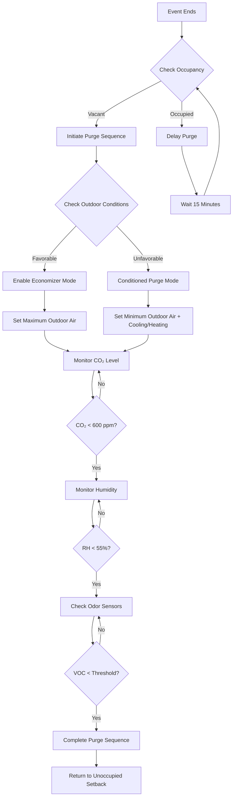

# Post-Event Purge Systems

Post-event purge ventilation provides rapid air quality restoration in variable occupancy spaces following high-density events. The system addresses elevated CO₂ concentrations, moisture accumulation, bioeffluents, and odors while optimizing energy recovery and preparing the space for subsequent occupancy.

## Physical Principles

Following an event, indoor air quality degradation stems from multiple sources:

**Contaminant accumulation** occurs through metabolic CO₂ production, typically at 0.3 L/min per person at sedentary activity levels. For a 1,000-person event lasting 3 hours, total CO₂ generation reaches approximately 54,000 L (108 kg).

**Moisture loading** from occupant respiration and perspiration adds latent heat to the space. Each occupant releases approximately 50-70 g/hr of moisture at moderate activity levels. A 1,000-person event generates 150-210 kg of water vapor requiring removal.

**Bioeffluent and odor compounds** accumulate during occupancy, including volatile organic compounds, aldehydes, and particulate matter. These contaminants exhibit varying persistence based on adsorption characteristics and surface interactions.

## Purge Time Calculations

The time required to reduce contaminant concentrations follows first-order decay kinetics based on air change rate.

### Concentration Decay

$$C(t) = C_0 \cdot e^{-\lambda t} + C_{oa}(1 - e^{-\lambda t})$$

Where:
- $C(t)$ = indoor concentration at time $t$ (ppm or g/m³)
- $C_0$ = initial post-event concentration
- $C_{oa}$ = outdoor air concentration
- $\lambda$ = air change rate (1/hr)
- $t$ = purge time (hr)

### Required Purge Time

$$t_{purge} = \frac{\ln\left(\frac{C_0 - C_{oa}}{C_f - C_{oa}}\right)}{\lambda}$$

Where:
- $C_f$ = final target concentration

**Example:** Reducing CO₂ from 1,500 ppm to 600 ppm (outdoor = 420 ppm) with 6 ACH:

$$t_{purge} = \frac{\ln\left(\frac{1500 - 420}{600 - 420}\right)}{6} = \frac{\ln(6.0)}{6} = 0.30 \text{ hr} = 18 \text{ minutes}$$

### Moisture Removal Time

For spaces with elevated humidity:

$$t_{moisture} = \frac{V \cdot \rho_{air} \cdot (W_i - W_f)}{Q \cdot \rho_{air} \cdot (W_i - W_{oa})}$$

Where:
- $V$ = space volume (m³)
- $W_i$ = initial humidity ratio (kg/kg)
- $W_f$ = final target humidity ratio (kg/kg)
- $W_{oa}$ = outdoor air humidity ratio (kg/kg)
- $Q$ = purge airflow rate (m³/s)

## Purge Operation Modes

| Mode | Airflow Rate | Temperature | Application | Energy Impact |
|------|--------------|-------------|-------------|---------------|
| Rapid Purge | 8-12 ACH | Untempered outdoor air | Quick turnaround required | Minimal conditioning |
| Economizer Purge | 6-8 ACH | Outdoor air (favorable conditions) | Moderate turnaround | Low energy use |
| Conditioned Purge | 4-6 ACH | Tempered outdoor air | Comfort maintenance priority | Standard conditioning |
| Night Purge | 2-4 ACH | Untempered outdoor air | Overnight restoration | Minimal energy |
| Hybrid Purge | Variable | Mixed temperature control | Balanced approach | Optimized energy |

## Purge Sequence Control

## ASHRAE Guidelines

**ASHRAE Standard 62.1** provides minimum ventilation rates but does not explicitly address post-event purge strategies. However, Section 6.2.7 on variable air volume systems establishes principles for demand-controlled ventilation applicable to purge sequences.

**ASHRAE Standard 55** thermal comfort criteria may be temporarily relaxed during unoccupied purge cycles, allowing economizer operation outside normal comfort bounds to maximize energy savings.

**ASHRAE Guideline 36** High-Performance Sequences of Operation for HVAC Systems provides detailed control sequences for economizer operation and demand-controlled ventilation applicable to purge strategies.

## Energy Recovery Integration

Heat recovery ventilators and energy recovery ventilators complicate purge operations by reducing the effectiveness of contaminant removal.

### Bypass Strategy

During rapid purge mode, bypass energy recovery devices to maximize contaminant exhaust:

$$\eta_{purge} = \frac{(C_0 - C_f)}{(C_0 - C_{oa})} \cdot 100\%$$

Energy recovery bypass prevents cross-contamination from return air to supply air, improving purge effectiveness by 15-30%.

### Partial Recovery Mode

For conditioned purge operations, maintain partial energy recovery:

$$\dot{Q}_{recovered} = \dot{m} \cdot c_p \cdot \epsilon \cdot (T_{return} - T_{outdoor})$$

Where:
- $\epsilon$ = heat exchanger effectiveness (reduced to 40-50% during purge)
- $\dot{m}$ = air mass flow rate (kg/s)
- $c_p$ = specific heat of air (1.006 kJ/kg·K)

## System Design Considerations

**Sensor placement** determines purge effectiveness. Install CO₂ sensors in return air streams at occupied zone height. Place humidity sensors away from direct airflow and heat sources.

**Fan capacity** must accommodate maximum purge airflow rates, typically 150-200% of occupied design airflow for rapid purge modes.

**Damper sizing** for outdoor air intake must handle full economizer operation at purge airflow rates without excessive pressure drop. Target maximum 0.5 in. w.c. pressure drop across outdoor air dampers at full open position.

**Control interlocks** prevent simultaneous heating and cooling during purge transitions. Implement minimum 3-minute time delays between mode changes to prevent equipment short-cycling.

## Performance Verification

Measure purge effectiveness through continuous monitoring:

$$E_{purge} = \frac{(C_0 - C_{final})}{(C_0 - C_{oa})} \cdot 100\%$$

Target purge effectiveness exceeding 85% for CO₂ removal and 70% for moisture removal within design time constraints.

## Optimization Strategies

**Predictive purge initiation** based on event schedules reduces recovery time between events. Begin purge 30-60 minutes before facility opening for optimal air quality.

**Weather-based mode selection** automatically selects rapid untempered purge during favorable outdoor conditions and conditioned purge during extreme weather.

**Zoned purge sequences** for large facilities prioritize high-occupancy areas, reducing overall energy consumption while maintaining air quality in critical spaces.

Post-event purge systems provide essential air quality management in variable occupancy facilities, balancing rapid restoration with energy efficiency through intelligent control sequences and adaptive operation modes.
