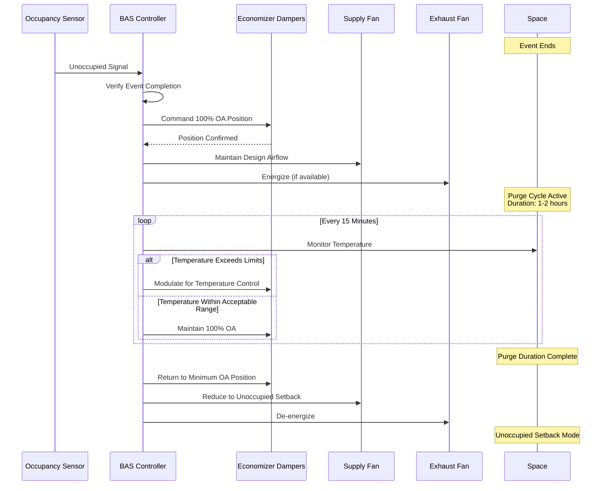

## Post-Event Purge Cycle Air Exchange

Post-event purge cycles utilize high air exchange rates to rapidly remove contaminants, odors, and bioeffluents accumulated during high-occupancy events. This strategy maximizes outdoor air delivery when the space is unoccupied, providing cost-effective IAQ restoration before the next occupancy cycle.

### Air Exchange Rate Fundamentals

Air exchange rate quantifies the volumetric replacement of indoor air with outdoor air. For post-event purge operations, elevated air changes per hour (ACH) dramatically reduce contaminant concentrations through dilution ventilation.

**Air Changes Per Hour (ACH) Definition:**

$$ACH = \frac{Q \times 60}{V}$$

Where:
- $ACH$ = air changes per hour [h⁻¹]
- $Q$ = ventilation airflow rate [CFM]
- $V$ = space volume [ft³]
- $60$ = conversion factor (minutes to hours)

**Contaminant Decay During Purge:**

$$C(t) = C_0 \cdot e^{-N \cdot t}$$

Where:
- $C(t)$ = contaminant concentration at time $t$ [ppm or µg/m³]
- $C_0$ = initial contaminant concentration [ppm or µg/m³]
- $N$ = air change rate [h⁻¹]
- $t$ = purge duration [hours]
- $e$ = natural logarithm base (≈2.718)

### ASHRAE Standard 62.1 Considerations

While ASHRAE 62.1 prescribes minimum ventilation rates for occupied periods, post-event purge cycles operate under different criteria. The strategy leverages unoccupied periods to deliver air exchange rates 3-5 times higher than occupied mode requirements, enabling rapid contaminant removal without thermal comfort penalties or excessive conditioning costs.

ASHRAE 62.1 Section 6.2.7.1 permits demand-controlled ventilation strategies that reduce outdoor air during unoccupied periods, but post-event purge inverts this approach by intentionally maximizing outdoor air immediately following high-density occupancy.

## Purge Cycle ACH Requirements

| Space Type | Occupied ACH | Post-Event Purge ACH | Purge Duration |
|------------|--------------|----------------------|----------------|
| Auditorium | 2-4 | 6-8 | 1.0-1.5 hours |
| Gymnasium | 3-6 | 8-10 | 1.5-2.0 hours |
| Conference Room | 4-6 | 10-12 | 0.5-1.0 hours |
| Cafeteria | 4-8 | 10-15 | 1.0-1.5 hours |
| Assembly Hall | 2-4 | 6-10 | 1.5-2.0 hours |

**Factors Influencing Purge ACH Selection:**

- **Occupant Density:** Higher density events generate greater bioeffluent accumulation requiring elevated ACH
- **Activity Level:** Vigorous activity (athletics) produces more metabolic byproducts than sedentary events
- **Duration of Occupancy:** Longer events accumulate higher contaminant concentrations
- **Outdoor Air Quality:** Poor outdoor air quality may limit purge effectiveness
- **Inter-Event Time:** Shorter turnaround times necessitate higher ACH for adequate purge

## Purge Sequence Operation

Post-event purge cycles maximize outdoor air delivery through coordinated control of air handling equipment. The sequence prioritizes air exchange over temperature control, accepting temporary space temperature drift during unoccupied purge periods.

## Purge Cycle Duration Calculation

The required purge duration depends on target contaminant reduction and achievable air change rate.

**Purge Time for Specified Contaminant Reduction:**

$$t = \frac{\ln(C_0) - \ln(C_t)}{N}$$

Or equivalently:

$$t = \frac{\ln(C_0/C_t)}{N}$$

Where:
- $t$ = required purge time [hours]
- $C_0$ = initial contaminant concentration
- $C_t$ = target contaminant concentration
- $N$ = air change rate [h⁻¹]

**Example Calculation:**

For a gymnasium requiring 90% contaminant reduction ($C_t = 0.1 \times C_0$) with a purge ACH of 8:

$$t = \frac{\ln(10)}{8} = \frac{2.303}{8} = 0.288 \text{ hours} \approx 17 \text{ minutes}$$

For 95% reduction:

$$t = \frac{\ln(20)}{8} = \frac{2.996}{8} = 0.375 \text{ hours} \approx 23 \text{ minutes}$$

For 99% reduction:

$$t = \frac{\ln(100)}{8} = \frac{4.605}{8} = 0.576 \text{ hours} \approx 35 \text{ minutes}$$

## Contaminant Removal Efficiency

| Purge Duration (minutes) | ACH = 6 | ACH = 8 | ACH = 10 | ACH = 12 |
|-------------------------|---------|---------|----------|----------|
| 15 | 59.3% | 69.9% | 77.7% | 83.5% |
| 30 | 83.5% | 90.2% | 94.5% | 96.9% |
| 45 | 93.1% | 96.9% | 98.6% | 99.4% |
| 60 | 97.0% | 99.0% | 99.7% | 99.9% |
| 90 | 99.4% | 99.9% | 99.99% | 99.997% |
| 120 | 99.9% | 99.997% | 99.9997% | 99.9999% |

This table demonstrates exponential decay characteristics where initial contaminant removal occurs rapidly, with diminishing returns for extended purge periods.

## System Design Requirements

**100% Outdoor Air Capability:**

Air handling units serving variable occupancy spaces must accommodate full outdoor air operation without compromising equipment performance. Design considerations include:

- Economizer damper sizing for 100% outdoor air delivery at design fan capacity
- Outdoor air intake location verification per IMC Section 401.3
- Freeze protection strategies for coil protection during winter purge cycles
- Supply fan capacity verification at 100% outdoor air static pressure conditions

**Mixing Box Pressure Balancing:**

$$\Delta P_{OA} = \Delta P_{RA}$$

Damper sizing must ensure outdoor air damper pressure drop at 100% position equals return air damper pressure drop to prevent mixing box pressurization.

**Economizer Control Integration:**

Post-event purge sequences override standard economizer control logic. Temperature-based and enthalpy-based economizer lockouts are disabled during purge cycles, prioritizing air exchange over energy efficiency.

## Measurement and Verification

**Airflow Verification:**

Post-installation airflow measurement confirms design ACH achievement:

$$Q_{measured} = \frac{ACH_{target} \times V}{60}$$

**Sensor Placement:**

- CO₂ sensors document concentration decay during purge cycles
- Placement at breathing height (3-6 ft above floor) in representative locations
- Multi-point sampling for spaces exceeding 5,000 ft²

**Performance Metrics:**

- CO₂ reduction from peak occupancy levels to near-ambient (≤600 ppm)
- Temperature drift during purge cycle
- Energy consumption per purge cycle

## Energy Implications

Post-event purge cycles impose conditioning energy penalties proportional to outdoor-indoor temperature difference and purge duration. Life-cycle cost analysis balances IAQ benefits against increased HVAC energy consumption.

**Purge Cycle Energy:**

$$E_{purge} = Q \times \rho \times c_p \times (T_{OA} - T_{SA}) \times t$$

Where:
- $E_{purge}$ = heating or cooling energy [Btu]
- $Q$ = airflow rate [CFM]
- $\rho$ = air density [lb/ft³]
- $c_p$ = specific heat of air [Btu/lb·°F]
- $T_{OA}$ = outdoor air temperature [°F]
- $T_{SA}$ = supply air temperature [°F]
- $t$ = purge duration [minutes]

Optimal purge strategies balance ACH intensity against duration, recognizing that excessively high ACH provides minimal IAQ benefit while increasing fan energy and thermal conditioning load.

## Implementation Best Practices

1. **Schedule Integration:** Program purge cycles to initiate immediately upon event conclusion, verified by occupancy sensors or calendar-based scheduling
2. **Temperature Limits:** Establish purge cycle suspension thresholds (typically ±10°F from setpoint) to prevent equipment damage or excessive temperature drift
3. **Seasonal Adjustment:** Reduce purge duration during extreme outdoor temperature conditions when conditioning costs are excessive
4. **Multi-Zone Coordination:** Stagger purge cycles across multiple zones to limit peak demand
5. **Documentation:** Maintain purge cycle logs documenting frequency, duration, and measured effectiveness

Post-event purge with elevated air exchange rates provides an efficient IAQ management strategy for variable occupancy spaces, leveraging unoccupied periods to restore indoor air quality through intensive outdoor air dilution.
