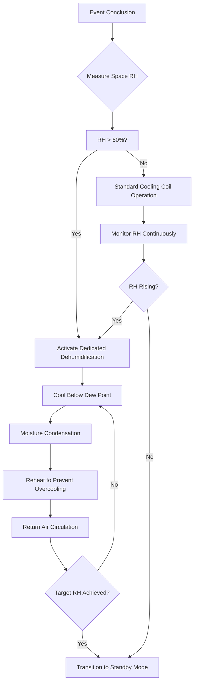

## Overview

Post-event moisture removal addresses the significant latent loads introduced during high-occupancy periods in venues. Each occupant introduces approximately 200-400 BTU/hr of latent heat depending on activity level, creating substantial humidity burdens that persist after occupant departure. Effective moisture removal prevents condensation on building surfaces, maintains indoor air quality, and prepares the space for subsequent occupancy cycles.

## Latent Load Fundamentals

### Occupant-Generated Moisture

The latent heat generated by occupants follows predictable patterns based on metabolic activity:

| Activity Level | Sensible Load (BTU/hr) | Latent Load (BTU/hr) | Total Load (BTU/hr) |
|----------------|------------------------|----------------------|---------------------|
| Seated at rest | 245 | 155 | 400 |
| Light work/walking | 250 | 200 | 450 |
| Moderate activity | 250 | 300 | 550 |
| Heavy work/dancing | 275 | 525 | 800 |

The total moisture removal requirement calculates as:

$$Q_L = N \times q_L \times t$$

where:
- $Q_L$ = total latent energy to remove (BTU)
- $N$ = number of occupants (persons)
- $q_L$ = latent load per occupant (BTU/hr)
- $t$ = occupancy duration (hr)

### Moisture Mass Calculation

The mass of water vapor introduced to the space:

$$m_{H_2O} = \frac{Q_L}{h_{fg}}$$

where:
- $m_{H_2O}$ = mass of water vapor (lb)
- $h_{fg}$ = latent heat of vaporization ≈ 1,060 BTU/lb at typical conditions

For a venue with 5,000 occupants at moderate activity over 3 hours:

$$Q_L = 5000 \times 300 \times 3 = 4,500,000 \text{ BTU}$$
$$m_{H_2O} = \frac{4,500,000}{1,060} \approx 4,245 \text{ lb of water}$$

## Dehumidification Capacity Requirements

### Removal Rate Calculation

The required dehumidification capacity depends on target recovery time:

$$\dot{m}_{removal} = \frac{m_{H_2O}}{t_{recovery}} \times \frac{60}{7,000}$$

where:
- $\dot{m}_{removal}$ = dehumidification capacity (pints/hr)
- $t_{recovery}$ = target recovery time (hr)
- Conversion: 1 lb water ≈ 0.12 gallons ≈ 0.96 pints

For the example above with a 4-hour recovery target:

$$\dot{m}_{removal} = \frac{4,245}{4} \times \frac{60}{7,000} \approx 9.1 \text{ pints/hr}$$

This represents approximately 218 pints over the recovery period, requiring substantial dedicated dehumidification equipment beyond standard cooling coil condensate removal.

## Psychrometric Analysis

### Humidity Ratio Change

The change in humidity ratio from occupied to target conditions:

$$\Delta W = W_{occupied} - W_{target}$$

$$W = 0.622 \times \frac{P_{vapor}}{P_{atm} - P_{vapor}}$$

where:
- $W$ = humidity ratio (lb moisture/lb dry air)
- $P_{vapor}$ = partial pressure of water vapor (psia)
- $P_{atm}$ = atmospheric pressure (psia)

### Air Volume Required

The total air volume that must be processed:

$$V_{air} = \frac{m_{H_2O}}{\Delta W \times \rho_{air}}$$

where:
- $V_{air}$ = total air volume (ft³)
- $\rho_{air}$ = air density ≈ 0.075 lb/ft³ at standard conditions

## Dehumidification Process Flow

## Condensation Prevention Strategy

### Dew Point Control

Surface condensation occurs when surface temperature drops below the dew point temperature of adjacent air. The dew point temperature relationship:

$$T_{dp} = T - \frac{100 - RH}{5}$$

This approximation (valid for typical comfort conditions) provides quick field calculation where:
- $T_{dp}$ = dew point temperature (°F)
- $T$ = dry bulb temperature (°F)
- $RH$ = relative humidity (%)

### Critical Surface Temperatures

| Surface Type | Typical Temperature (°F) | Critical RH at 75°F (%) |
|--------------|-------------------------|------------------------|
| Single-pane glass | 55-65 | 60-70 |
| Insulated glass | 65-70 | 70-80 |
| Exterior walls (insulated) | 68-72 | 80-90 |
| Cold water pipes | 50-60 | 50-65 |
| Supply air ducts (unconditioned space) | 55-60 | 60-70 |

## Recovery Timeline Protocol

### Phase-Based Dehumidification

```mermaid
gantt
    title Post-Event Moisture Removal Timeline
    dateFormat HH:mm
    axisFormat %H:%M
    section Immediate Response
    High-volume air circulation     :a1, 00:00, 1h
    Initial dehumidification activation :a2, 00:00, 1h
    section Active Removal
    Maximum dehumidification capacity :b1, 01:00, 3h
    Temperature control with reheat   :b2, 01:00, 3h
    section Recovery Phase
    Reduced dehumidification mode     :c1, 04:00, 2h
    RH setpoint approach              :c2, 04:00, 2h
    section Stabilization
    Standard HVAC operation           :d1, 06:00, 2h
    Continuous monitoring             :d2, 06:00, 2h
```

### Control Sequence Logic

1. **Immediate Response (0-1 hr post-event)**
   - Maximize outdoor air intake if outdoor humidity ratio < indoor humidity ratio
   - Activate all dehumidification equipment at full capacity
   - Increase air circulation rates to 150% of design

2. **Active Removal (1-4 hr post-event)**
   - Maintain cooling coil leaving air temperature at 50-52°F to maximize condensation
   - Apply reheat as necessary to prevent space temperature drop below 68°F
   - Monitor condensate removal rates to verify performance

3. **Recovery Phase (4-6 hr post-event)**
   - Modulate dehumidification capacity as RH approaches setpoint
   - Reduce air circulation to design rates
   - Transition outdoor air dampers to minimum position

4. **Stabilization (6-8 hr post-event)**
   - Return to standard occupancy-based control
   - Verify RH stability within ±5% of setpoint
   - Log system performance for optimization

## Equipment Sizing Criteria

### Dedicated Dehumidification Systems

Based on ASHRAE Standard 62.1 and empirical venue data:

| Venue Capacity | Peak Latent Load (tons) | Dehumidification Capacity (pints/day) | Recovery Time (hr) |
|----------------|------------------------|---------------------------------------|-------------------|
| 1,000 occupants | 25 | 600 | 4 |
| 5,000 occupants | 125 | 3,000 | 6 |
| 10,000 occupants | 250 | 6,000 | 8 |
| 20,000 occupants | 500 | 12,000 | 10 |

Note: 1 ton latent = 12,000 BTU/hr latent capacity

### Moisture Removal Efficiency

The coefficient of performance for dedicated dehumidification:

$$COP_{dehum} = \frac{Q_L}{W_{input}}$$

where:
- $COP_{dehum}$ = dehumidification coefficient of performance
- $Q_L$ = latent cooling provided (BTU/hr)
- $W_{input}$ = electrical input power (BTU/hr)

Typical desiccant dehumidification systems achieve COP of 0.8-1.2, while cooling-based systems achieve 2.5-3.5 when properly applied.

## Sensor Verification and Calibration

Accurate humidity measurement is critical for effective moisture removal control. Per ASHRAE Guideline 36, humidity sensors should maintain ±3% RH accuracy across the operating range.

### Sensor Placement Strategy

- **Return air**: Primary control sensor, 10 ft minimum from any moisture source
- **Supply air**: Verification of dehumidification performance, downstream of reheat
- **Space sensors**: Distributed in areas prone to high moisture accumulation
- **Critical surfaces**: Surface temperature sensors on condensation-prone areas

### Drift Compensation

Expected sensor drift rates:
- Capacitive RH sensors: 1-2% per year
- Resistive RH sensors: 2-3% per year
- Calibration frequency: annually or after 1,000 operating hours at >85% RH

Implement automated cross-checking between multiple sensors to identify drift conditions requiring recalibration.

## References

- ASHRAE Standard 62.1: Ventilation for Acceptable Indoor Air Quality
- ASHRAE Standard 55: Thermal Environmental Conditions for Human Occupancy
- ASHRAE Handbook - Fundamentals: Psychrometrics (Chapter 1)
- ASHRAE Guideline 36: High-Performance Sequences of Operation for HVAC Systems
