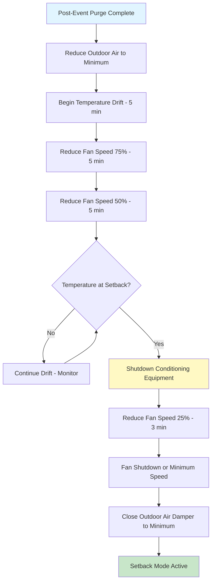
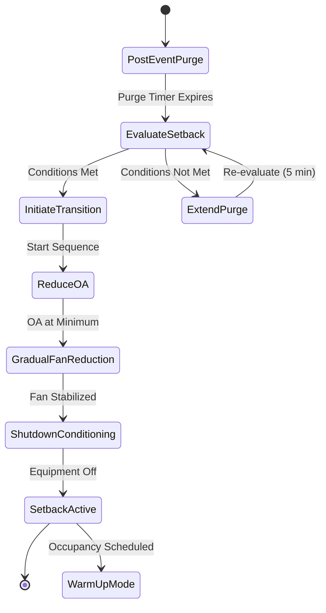

## Overview

Return to setback represents the final phase of variable occupancy control, transitioning HVAC systems from post-event purge operation to energy-conserving unoccupied mode. This phase prioritizes energy savings while maintaining minimum indoor air quality and preventing equipment damage through controlled shutdown sequences.

Proper setback transitions reduce equipment cycling, minimize energy consumption, and extend equipment life by avoiding abrupt operational changes that stress mechanical components.

## Setback Mode Initiation Criteria

The transition to setback mode begins after post-event purge completion, verified through:

**Time-Based Initiation:**
- Purge duration timer expires (typically 30-60 minutes)
- Schedule confirms no upcoming occupancy within next 2 hours
- All occupied zones report complete air change completion

**Condition-Based Initiation:**
- Indoor CO₂ concentrations ≤ outdoor + 100 ppm
- VOC levels return to baseline (if monitored)
- Zone temperatures within acceptable drift range
- All emergency or demand ventilation overrides cleared

**System Status Verification:**
- No active alarms or fault conditions
- All zone sensors reporting valid data
- Outdoor air dampers operational and controllable
- No manual override conditions active

## Temperature Setback Strategies

### Heating Season Setback

Setback temperatures during heating prevent freeze damage while minimizing energy consumption:

| Building Type | Occupied Setpoint | Setback Temperature | Energy Savings Potential |
|--------------|-------------------|---------------------|-------------------------|
| Office | 70°F (21°C) | 60-65°F (15.6-18.3°C) | 15-25% heating energy |
| Assembly | 68°F (20°C) | 55-60°F (12.8-15.6°C) | 20-30% heating energy |
| Retail | 72°F (22°C) | 62-65°F (16.7-18.3°C) | 12-20% heating energy |
| Educational | 70°F (21°C) | 60-65°F (15.6-18.3°C) | 18-28% heating energy |

**Heating Energy Savings Calculation:**

The energy savings from temperature setback follows:

$$Q_{saved} = UA(T_{occ} - T_{sb})\Delta t$$

where:
- $Q_{saved}$ = energy saved during setback period (Btu)
- $U$ = overall heat transfer coefficient (Btu/hr·ft²·°F)
- $A$ = building envelope area (ft²)
- $T_{occ}$ = occupied setpoint temperature (°F)
- $T_{sb}$ = setback temperature (°F)
- $\Delta t$ = setback duration (hours)

**Percent Energy Reduction:**

$$\eta_{setback} = \frac{(T_{occ} - T_{sb})}{(T_{occ} - T_{outdoor,avg})} \times 100\%$$

For a 10°F setback with 30°F average outdoor-indoor temperature difference:

$$\eta_{setback} = \frac{10}{30} \times 100\% = 33.3\%$$

### Cooling Season Setup

Setup temperatures during cooling reduce compressor runtime and electrical demand:

| Building Type | Occupied Setpoint | Setup Temperature | Energy Savings Potential |
|--------------|-------------------|-------------------|-------------------------|
| Office | 74°F (23.3°C) | 80-85°F (26.7-29.4°C) | 20-35% cooling energy |
| Assembly | 72°F (22.2°C) | 82-85°F (27.8-29.4°C) | 25-40% cooling energy |
| Retail | 74°F (23.3°C) | 80-82°F (26.7-27.8°C) | 18-30% cooling energy |
| Educational | 74°F (23.3°C) | 80-85°F (26.7-29.4°C) | 22-38% cooling energy |

**Cooling Energy Savings:**

$$P_{saved} = \frac{Q_{avoided}}{COP} = \frac{UA(T_{setup} - T_{occ})\Delta t}{COP}$$

where:
- $P_{saved}$ = electrical energy saved (kWh)
- $COP$ = coefficient of performance (typically 2.5-4.0)
- $Q_{avoided}$ = cooling load avoided (Btu)

## Gradual Transition Sequence

Abrupt equipment shutdown causes thermal shock and increased wear. Implement staged transitions:

### Transition Timing Table

| Phase | Duration | Fan Speed | OA Damper | Heating/Cooling | Setpoint |
|-------|----------|-----------|-----------|-----------------|----------|
| Purge End | 0 min | 100% | 15-25% | Active | Occupied |
| OA Reduction | 2 min | 100% | Min Position | Active | Occupied |
| Initial Drift | 5 min | 100% | Min Position | Active | Occupied |
| Stage 1 | 5 min | 75% | Min Position | Active | Drift Start |
| Stage 2 | 5 min | 50% | Min Position | Modulating | Drifting |
| Stage 3 | Variable | 50% | Min Position | Off | Setback Value |
| Conditioning Off | 0 min | 50% | Min Position | Off | Setback |
| Stage 4 | 3 min | 25% | Min Position | Off | Setback |
| Setback Active | Continuous | 0-25% | Min Position | Off | Setback |

Total transition time: 15-25 minutes depending on building thermal response.

## Equipment Shutdown Sequence

**Staged Equipment Deactivation:**

1. **Mechanical Cooling Shutdown (if active):**
   - Reduce chilled water valve to 0% over 2 minutes
   - Stop compressor(s) after valve fully closed
   - Maintain condenser water flow for 3 minutes (washdown)
   - Stop condenser pumps and cooling tower fans

2. **Heating Equipment Shutdown (if active):**
   - Reduce heating valve/gas input to 0% over 2 minutes
   - Continue fan operation for heat dissipation (5 minutes)
   - Verify discharge temperature < 90°F before fan reduction
   - Close steam/hot water valves completely

3. **Outdoor Air Damper Positioning:**
   - Modulate to minimum position per code (typically 5-10% for damper sealing)
   - ASHRAE 90.1 Section 6.4.3.4.3 allows closure when unoccupied
   - Verify damper closed through position feedback
   - Disable economizer control logic

4. **Supply Fan Reduction:**
   - Gradual speed reduction prevents pressure transients
   - VFD ramp-down rate: 10% per minute maximum
   - Monitor bearing temperatures during shutdown
   - Achieve standby speed or complete stop

## Standby Mode Operation

Systems may operate in partial standby rather than complete shutdown:

**Continuous Fan Operation (Recommended for large buildings):**
- Supply fan at 15-25% speed maintains air circulation
- Prevents stratification and moisture accumulation
- Enables faster recovery to occupied mode
- Additional energy cost: 2-5% of total HVAC energy

**Intermittent Fan Operation (Energy Priority):**
- Fan cycles based on temperature drift limits
- Typical cycle: 10 minutes on per hour
- Maximum energy savings but slower recovery
- Risk of moisture issues in humid climates

**Complete Shutdown (Small systems):**
- All equipment off except safety circuits
- Maximum energy savings (approaching 100% unoccupied savings)
- Requires longer recovery times (1-3 hours)
- Only suitable for buildings with low thermal mass

## Energy Conservation Priority

ASHRAE 90.1-2019 Section 6.4.3.3 mandates automatic setback controls for zones with operating hours < 168 hours/week.

**Annual Energy Impact:**

For a 50,000 ft² office building operating 50 hours/week:

$$E_{annual,saved} = Q_{hourly} \times \Delta T_{setback} \times h_{unoccupied} \times \eta_{system}$$

Assumptions:
- $Q_{hourly}$ = 500,000 Btu/hr design load
- $\Delta T_{setback}$ = 10°F average effective setback
- $h_{unoccupied}$ = 118 hours/week × 50 weeks = 5,900 hours/year
- $\eta_{system}$ = 30% average savings factor

$$E_{annual,saved} = 500,000 \times 0.30 \times 5,900 = 885 \text{ million Btu/year}$$

At $12/MMBtu for natural gas, annual savings = $10,620.

For cooling at 3.5 COP and $0.12/kWh:

$$E_{cooling,saved} = \frac{885,000,000}{3.5 \times 3,412} = 74,100 \text{ kWh/year}$$

Annual cooling savings = $8,892.

**Total annual savings: $19,512 for setback implementation.**

## Control Logic Integration

## Verification and Commissioning

**Functional Testing Requirements:**

- Verify setback initiation after purge completion
- Confirm gradual transition over 15-25 minute period
- Measure temperature drift rates (should not exceed 2°F per 10 minutes)
- Document actual vs. design setback temperatures
- Verify outdoor air damper closure and sealing
- Test recovery time from setback to occupied setpoint
- Measure energy consumption in setback mode vs. design predictions

**Monitoring Points:**

- Zone temperatures during transition
- Supply air temperature during equipment shutdown
- Fan power draw at each stage
- Outdoor air damper position feedback
- Equipment runtime hours in setback mode
- Recovery time statistics for optimization

## Optimization Strategies

**Adaptive Setback Timing:**

Adjust setback depth based on:
- Outdoor temperature forecast (deeper setback in mild weather)
- Next occupancy time (maintain higher setback if early morning event)
- Building thermal mass response (measured drift rates)

**Equipment Protection:**

- Minimum runtime requirements before shutdown (prevent short cycling)
- Discharge temperature limits before fan reduction (< 90°F)
- Bearing temperature monitoring during shutdown
- Minimum off-time before restart (typically 5 minutes for compressors)

Return to setback represents a critical energy conservation opportunity when implemented with proper gradual transitions that protect equipment while maximizing savings.
