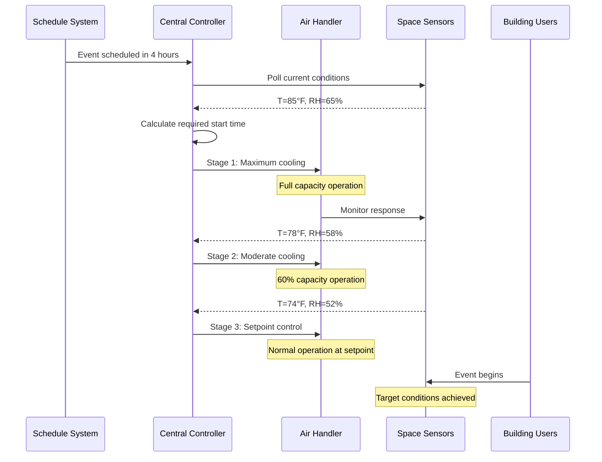

## Overview

Pre-event conditioning establishes optimal environmental conditions before occupancy begins in variable-occupancy facilities. This proactive approach differs fundamentally from reactive control by leveraging thermal mass, anticipating sensible and latent loads, and ensuring immediate comfort upon occupant arrival. Applications include auditoriums, convention centers, sports venues, religious facilities, and educational spaces with intermittent use patterns.

The primary objective is achieving target conditions at occupancy time while minimizing energy consumption and avoiding excessive overshoot or undershoot. Successful pre-conditioning requires accurate load prediction, understanding of building thermal response, and coordination with occupancy schedules.

## Thermal Response Fundamentals

Building thermal response to pre-conditioning depends on thermal mass and surface area. The time constant characterizes this response:

$$\tau = \frac{mc_p}{hA}$$

where:
- $\tau$ = thermal time constant (hours)
- $m$ = thermal mass (kg)
- $c_p$ = specific heat capacity (J/kg·K)
- $h$ = convective heat transfer coefficient (W/m²·K)
- $A$ = surface area (m²)

The temperature response to step input follows exponential decay:

$$T(t) = T_{final} + (T_{initial} - T_{final})e^{-t/\tau}$$

Achieving 95% of the desired temperature change requires approximately $3\tau$. For typical commercial construction, time constants range from 2-8 hours.

## Pre-Conditioning Load Calculation

The total pre-conditioning load comprises transmission, infiltration, and thermal mass components:

$$Q_{pre} = Q_{transmission} + Q_{infiltration} + Q_{thermal\ mass}$$

**Transmission load:**

$$Q_{transmission} = UA(T_{outdoor} - T_{setpoint})$$

**Infiltration load:**

$$Q_{infiltration} = \rho V_{air} c_p ACH(T_{outdoor} - T_{setpoint})$$

**Thermal mass load:**

$$Q_{thermal\ mass} = \frac{mc_p \Delta T}{\Delta t}$$

where $\Delta t$ represents the pre-conditioning period.

## Pre-Conditioning Sequence

## Pre-Conditioning Stages

### Stage 1: Maximum Capacity Operation

Initial stage operates equipment at maximum capacity to rapidly change space conditions. Supply air temperature reaches minimum (cooling) or maximum (heating) values. Duration depends on initial offset from setpoint.

**Characteristics:**
- Supply air temperature: 50-55°F (cooling) or 95-105°F (heating)
- Fan speed: 100% design airflow
- Outside air damper: Minimum position (unless economizer beneficial)
- Typical duration: 1-3 hours for moderate conditions

### Stage 2: Modulated Approach

As space conditions approach setpoint, equipment capacity reduces to prevent overshoot. Control transitions from full output to proportional control.

**Characteristics:**
- Supply air temperature: Modulated based on error
- Fan speed: May reduce to 70-85% if VAV system
- Outside air: May increase if economizer effective
- Typical duration: 30-60 minutes

### Stage 3: Setpoint Maintenance

Final stage maintains design conditions with normal control algorithms. Equipment operates in standard occupied mode.

## Humidity Pre-Conditioning

Latent load management presents unique challenges due to slower moisture diffusion compared to heat transfer. The moisture balance equation:

$$\frac{dm_{moisture}}{dt} = \dot{m}_{supply}(\omega_{supply} - \omega_{space})$$

where:
- $\omega$ = humidity ratio (kg water/kg dry air)
- $\dot{m}$ = mass flow rate (kg/s)

Dehumidification requires longer lead times than temperature adjustment due to:
- Lower driving potential (vapor pressure difference vs. temperature difference)
- Material moisture buffering effects
- Reheat requirements limiting dehumidification rate

**Recommended lead times:**

| Initial RH | Target RH | Temperature Change | Estimated Lead Time |
|------------|-----------|-------------------|---------------------|
| 65% | 50% | 10°F cooling | 3-4 hours |
| 70% | 50% | 15°F cooling | 4-6 hours |
| 60% | 50% | 5°F cooling | 2-3 hours |
| 55% | 50% | 10°F cooling | 2-3 hours |

## Optimal Start Algorithms

ASHRAE Guideline 36-2021 recommends adaptive optimal start algorithms that learn building response. The basic calculation:

$$t_{start} = t_{event} - \left[\frac{T_{current} - T_{target}}{R_{avg}}\right]$$

where:
- $t_{start}$ = equipment start time
- $t_{event}$ = scheduled occupancy time
- $R_{avg}$ = average temperature change rate (°F/hour)

Advanced algorithms incorporate:
- Outdoor temperature effects
- Day-of-week patterns
- Historical performance data
- Weather forecasts

## Energy Optimization Strategies

**Load shifting:** Pre-cool during off-peak hours to reduce on-peak demand charges. Particularly effective for buildings with significant thermal mass.

**Demand-controlled staging:** Sequence multiple units to maintain steady power draw rather than simultaneous startup.

**Economizer utilization:** Maximize free cooling during pre-conditioning when outdoor conditions permit.

**Supply air reset:** Gradually warm supply air temperature as target approaches to improve efficiency and prevent overcooling.

## Implementation Considerations

**Scheduling interface:** Integrate with event management systems to receive occupancy schedules automatically. Manual override capability essential for unscheduled events.

**Sensor placement:** Position sensors to represent average space conditions, not local microclimates. Wireless sensors facilitate optimal placement without retrofit wiring.

**Equipment staging:** For multiple units, stagger start times by 5-15 minutes to reduce electrical demand peaks and water flow surges.

**Verification period:** Allow 15-30 minutes before occupancy for final condition verification and minor adjustments.

## Performance Monitoring

Track key metrics to validate pre-conditioning effectiveness:

- Condition achievement rate (% of events meeting target at occupancy time)
- Average pre-conditioning duration
- Energy consumption per pre-conditioning cycle
- Occupant comfort complaints during initial occupancy period
- Equipment runtime efficiency

ASHRAE Standard 90.1 recognizes pre-conditioning as an acceptable strategy for intermittently occupied spaces, provided unoccupied setpoints achieve minimum 5°F setback (cooling) or setup (heating).

## Common Challenges

**Inaccurate scheduling:** Late or cancelled events waste energy. Implement confirmation protocols and learning algorithms to reduce false starts.

**Thermal mass underestimation:** Heavy construction requires longer lead times than anticipated. Characterize building response through measurement, not assumption.

**Simultaneous heating and cooling:** Poor coordination between systems causes energy waste. Implement interlocks and staging sequences.

**Humidity overshoot:** Aggressive pre-cooling without dehumidification control causes condensation. Monitor dewpoint, not just RH.

Pre-event conditioning represents a critical component of efficient variable-occupancy HVAC operation. Proper implementation achieves occupant comfort immediately upon arrival while minimizing energy consumption compared to continuous conditioning strategies.
