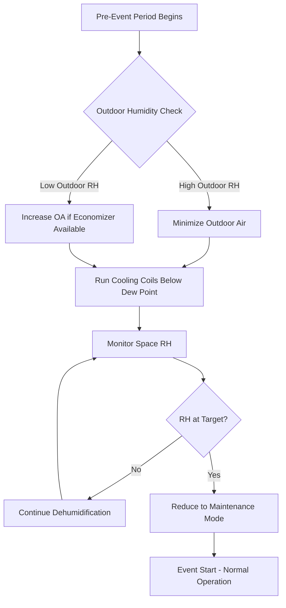
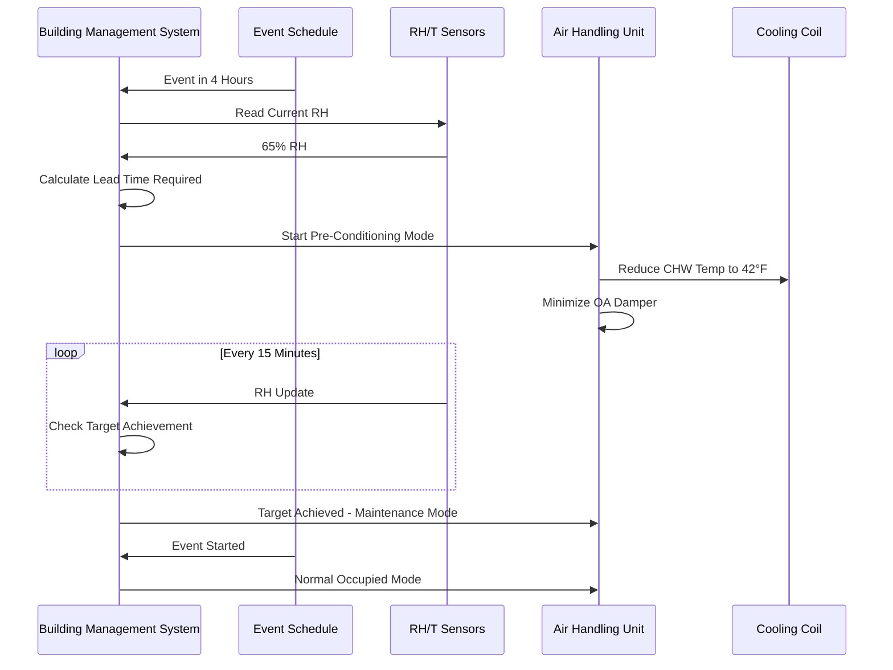

## Overview

Pre-event humidity control establishes optimal moisture conditions before occupancy surges in venues, preventing condensation on cold surfaces, reducing latent load impact during events, and maintaining comfort. Effective dehumidification requires understanding psychrometric relationships, equipment capacity, and time-to-setpoint calculations.

## Dehumidification Physics

### Moisture Removal Fundamentals

The moisture removal rate depends on cooling coil temperature, airflow, and entering air conditions:

$$\dot{m}_w = \dot{V} \cdot \rho_{air} \cdot (W_1 - W_2)$$

Where:
- $\dot{m}_w$ = moisture removal rate (lb/hr or kg/hr)
- $\dot{V}$ = volumetric airflow (CFM or m³/s)
- $\rho_{air}$ = air density (lb/ft³ or kg/m³)
- $W_1$ = entering humidity ratio (lb_w/lb_da or kg_w/kg_da)
- $W_2$ = leaving humidity ratio (lb_w/lb_da or kg_w/kg_da)

### Time to Achieve Setpoint

The lead time required to reduce space humidity from initial to target conditions:

$$t_{lead} = \frac{V_{space} \cdot \rho_{air} \cdot (W_{initial} - W_{target})}{\dot{m}_w \cdot 60}$$

Where:
- $t_{lead}$ = lead time (hours)
- $V_{space}$ = conditioned space volume (ft³ or m³)
- Factor of 60 converts minutes to hours

### Latent Cooling Capacity

The sensible heat ratio (SHR) determines the portion of total capacity dedicated to moisture removal:

$$Q_{latent} = Q_{total} \cdot (1 - SHR)$$

$$Q_{latent} = \dot{m}_w \cdot h_{fg}$$

Where:
- $Q_{latent}$ = latent cooling capacity (Btu/hr or kW)
- $Q_{total}$ = total cooling capacity (Btu/hr or kW)
- $h_{fg}$ = latent heat of vaporization (~1,060 Btu/lb or 2,465 kJ/kg)

## Pre-Event Humidity Control Strategy

## Humidity Setpoint Targets

### Pre-Event Humidity Targets by Application

| Venue Type | Pre-Event RH Target | Event RH Target | Lead Time | Critical Surfaces |
|------------|---------------------|-----------------|-----------|-------------------|
| Ice Arenas | 30-40% | 40-50% | 3-6 hours | Ice surface, glass |
| Auditoriums | 40-50% | 45-55% | 2-4 hours | Windows, mirrors |
| Convention Centers | 40-50% | 45-55% | 4-8 hours | Exhibit equipment |
| Natatoriums | 50-60% | 55-65% | 2-3 hours | Walls, ceiling |
| Gymnasiums | 35-45% | 40-50% | 2-4 hours | Floors, equipment |

### Dew Point Control Criteria

Maintaining surface temperatures above dew point prevents condensation:

$$T_{surface} > T_{dewpoint} + \Delta T_{safety}$$

Where $\Delta T_{safety}$ = 5-10°F (3-6°C) safety margin.

**Dew Point Reference Table:**

| Dry Bulb (°F) | 30% RH | 40% RH | 50% RH | 60% RH |
|---------------|--------|--------|--------|--------|
| 70 | 37°F | 44°F | 51°F | 56°F |
| 72 | 39°F | 46°F | 53°F | 58°F |
| 75 | 42°F | 49°F | 56°F | 61°F |
| 78 | 45°F | 52°F | 59°F | 65°F |

## Dehumidification System Considerations

### Equipment Capacity Requirements

**Cooling Coil Performance:**
- Entering water temperature: 42-45°F (6-7°C) for effective dehumidification
- Coil surface temperature must be below entering air dew point
- Face velocity: 400-500 FPM to allow adequate contact time
- Row depth: Minimum 6-8 rows for deep dehumidification

**Moisture Removal Capacity Sizing:**

$$\dot{m}_{w,required} = \frac{V_{space} \cdot \rho_{air} \cdot (W_{initial} - W_{target})}{t_{available} \cdot 60}$$

### Outdoor Air Impact

During pre-event dehumidification, outdoor air introduces additional moisture load:

$$\dot{m}_{w,OA} = \dot{V}_{OA} \cdot \rho_{air} \cdot (W_{outdoor} - W_{target})$$

**Control Strategy:**
- Reduce outdoor air to code minimum during dehumidification
- Use energy recovery ventilators (ERV) to precondition outdoor air
- Close outdoor air dampers if permitted by ventilation standards

## Lead Time Calculation Example

For a 200,000 ft³ auditorium:
- Initial conditions: 75°F, 65% RH (W = 0.0120 lb_w/lb_da)
- Target conditions: 72°F, 45% RH (W = 0.0073 lb_w/lb_da)
- System moisture removal: 400 lb/hr

$$t_{lead} = \frac{200,000 \cdot 0.075 \cdot (0.0120 - 0.0073)}{400 \cdot 60} = 2.9 \text{ hours}$$

## ASHRAE Standards and Guidelines

**ASHRAE Standard 55-2020:** Thermal Environmental Conditions for Human Occupancy
- Acceptable humidity range: 30-60% RH for comfort
- Dew point range: 32-62°F (0-17°C)

**ASHRAE Standard 62.1-2022:** Ventilation for Acceptable Indoor Air Quality
- Minimum outdoor air requirements during occupied periods
- Allows reduced ventilation during unoccupied pre-conditioning

**ASHRAE Handbook - HVAC Applications:**
- Assembly occupancies: Chapter 4
- Dehumidification strategies: Chapter 25
- Moisture control in buildings: Chapter 27

## Control Sequence Integration

## Condensation Prevention Strategies

### Critical Surface Protection

**Cold Surface Identification:**
- Windows and glazing systems
- Structural steel and metal decking
- Chilled water piping and diffusers
- Refrigeration equipment in concession areas

**Prevention Methods:**
1. Pre-warm surfaces before dehumidification if possible
2. Maintain surface temperature > dew point + safety margin
3. Increase air circulation near susceptible surfaces
4. Apply insulation to persistently cold surfaces

### Infiltration Control

Moisture intrusion during pre-event period:
- Seal doors and loading dock openings
- Pressurize space slightly (0.02-0.05 in. w.c.) to prevent infiltration
- Minimize door openings during dehumidification cycle

## Monitoring and Verification

**Key Performance Indicators:**
- Time to achieve target RH
- Energy consumption per pound of moisture removed
- Surface condensation occurrence frequency
- Occupant comfort complaints during events

**Sensor Placement:**
- Multiple zones in large venues
- Near critical cold surfaces
- Return air stream for system control
- Outdoor air for enthalpy comparison

## Conclusion

Effective pre-event humidity control requires accurate psychrometric calculations, adequate lead time, and proper equipment sizing. Understanding moisture removal physics and implementing strategic control sequences prevents condensation, reduces latent loads during occupancy, and maintains acceptable comfort conditions. Adherence to ASHRAE standards ensures code compliance while optimizing energy efficiency and system performance.
