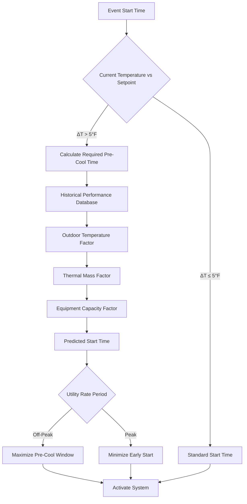

## Overview

Pre-cooling timing determines when HVAC systems activate before scheduled occupancy to achieve target conditions at event start. Proper timing optimization reduces peak demand charges, leverages off-peak utility rates, and maintains occupant comfort through strategic thermal mass manipulation.

## Pre-Cooling Physics

### Heat Removal Requirements

The total cooling load during pre-cooling consists of sensible heat stored in building thermal mass and ongoing heat gains:

$$Q_{total} = Q_{mass} + Q_{gains} = mc_p\Delta T + \int_0^t (Q_{solar} + Q_{envelope} + Q_{equipment})dt$$

Where:
- $Q_{mass}$ = sensible heat stored in thermal mass (Btu or kJ)
- $m$ = effective building mass (lbm or kg)
- $c_p$ = specific heat capacity (Btu/lbm·°F or kJ/kg·K)
- $\Delta T$ = temperature depression (°F or K)
- $Q_{gains}$ = time-integrated heat gains (Btu or kJ)

### Cooling Rate Prediction

The achievable cooling rate depends on equipment capacity and thermal resistance:

$$\frac{dT}{dt} = \frac{Q_{cooling} - Q_{gains}}{mc_p} = \frac{\dot{Q}_{net}}{C_{thermal}}$$

Where:
- $\dot{Q}_{net}$ = net cooling capacity (Btu/hr or kW)
- $C_{thermal}$ = effective thermal capacitance (Btu/°F or kJ/K)

### Pre-Cool Duration Calculation

Required pre-cooling time follows from integrating the cooling rate equation:

$$t_{precool} = \frac{C_{thermal} \cdot \Delta T}{\dot{Q}_{cooling} - \dot{Q}_{gains}} + t_{safety}$$

Where $t_{safety}$ represents margin for system startup, control stabilization, and weather variations (typically 15-30 minutes).

## Optimal Start Control Algorithm

### Time-to-Setpoint Estimation



### Adaptive Learning Parameters

| Parameter | Initial Value | Learning Rate | Bounds |
|-----------|--------------|---------------|--------|
| Base cooling rate | 2°F/hr per ton | ±0.1°F/hr per event | 1-4°F/hr per ton |
| Thermal mass coefficient | 25 Btu/°F·ft² | ±2% per season | 15-40 Btu/°F·ft² |
| Solar gain factor | 1.0 | ±0.05 per day | 0.5-1.5 |
| Occupancy heat multiplier | 250 Btu/hr·person | Fixed | — |

## Equipment Staging Strategy

### Sequential Cooling Activation

```mermaid
gantt
    title Pre-Cooling Equipment Staging Sequence
    dateFormat HH:mm
    axisFormat %H:%M

    section Stage 1
    AHU-1 Economizer Mode    :active, s1a, 04:00, 1h
    Chiller Soft Start       :s1b, 04:30, 30m

    section Stage 2
    AHU-1 Full Cooling       :active, s2a, 05:00, 2h
    AHU-2 Economizer Mode    :s2b, 05:30, 30m

    section Stage 3
    AHU-2 Full Cooling       :active, s3a, 06:00, 1h
    Ice Storage Discharge    :crit, s3b, 06:30, 30m

    section Occupancy
    Event Start 07:00        :milestone, m1, 07:00, 0m
```

### Staging Timing Calculations

For multi-stage systems, activate equipment according to capacity priority:

$$t_{stage,n} = t_{event} - \sum_{i=n}^{N} \frac{\Delta Q_i}{\dot{Q}_{capacity,i}}$$

Where stage $n$ starts at time $t_{stage,n}$, removing heat increment $\Delta Q_i$ with capacity $\dot{Q}_{capacity,i}$.

## Timing Optimization Tables

### Pre-Cool Start Time by Building Mass

| Building Type | Thermal Mass | ΔT = 5°F | ΔT = 10°F | ΔT = 15°F |
|---------------|--------------|----------|-----------|-----------|
| Light (metal, minimal furniture) | Low | 1.5 hrs | 2.5 hrs | 3.5 hrs |
| Medium (wood frame, standard) | Medium | 2.0 hrs | 3.5 hrs | 5.0 hrs |
| Heavy (concrete, masonry) | High | 3.0 hrs | 5.0 hrs | 7.0 hrs |
| Very Heavy (massive stone) | Very High | 4.0 hrs | 7.0 hrs | 10.0 hrs |

### Outdoor Temperature Correction Factors

| Outdoor Temp (°F) | Correction Factor | Adjusted Start Time |
|-------------------|-------------------|---------------------|
| < 70 | 0.85 | Base × 0.85 |
| 70-80 | 1.00 | Base × 1.00 |
| 80-90 | 1.15 | Base × 1.15 |
| 90-100 | 1.35 | Base × 1.35 |
| > 100 | 1.50 | Base × 1.50 |

## Setpoint Depression Strategy

### Aggressive Pre-Cooling

Temporarily reduce setpoint below target to accelerate thermal mass cooling:

$$T_{precool} = T_{target} - \Delta T_{depression}$$

Typical depression: 3-5°F (1.7-2.8 K) for 1-2 hours before occupancy.

### Recovery to Comfort

Allow setpoint to gradually rise to target as occupancy begins:

$$T(t) = T_{precool} + \Delta T_{depression} \cdot \left(1 - e^{-\frac{t}{\tau_{recovery}}}\right)$$

Where $\tau_{recovery}$ = 30-60 minutes for smooth transition.

## Peak Shaving Benefits

### Demand Reduction Calculation

Effective pre-cooling shifts cooling load from peak to off-peak periods:

$$kW_{peak,reduction} = \frac{Q_{precool}}{3.412 \text{ kBtu/kWh}} \cdot \frac{t_{peak,avoided}}{t_{total}}$$

Typical peak demand reduction: 15-30% for well-executed pre-cooling.

### Utility Cost Savings

$$\text{Savings} = kW_{peak,reduction} \cdot (\text{Demand Charge}) + kWh_{shifted} \cdot (\text{Rate}_{peak} - \text{Rate}_{offpeak})$$

## ASHRAE Standard References

**ASHRAE Standard 90.1-2019**, Section 6.4.3.3: Optimal start controls required for systems > 10,000 cfm serving spaces with thermal mass.

**ASHRAE Guideline 36-2021**, Section 3.1.3.4: Pre-occupancy purge and pre-cooling sequences for event spaces with variable scheduling.

**ASHRAE Handbook—HVAC Applications (2019)**, Chapter 45: Pre-cooling strategies for demand-limited facilities and time-of-use rate optimization.

## Implementation Considerations

### Weather Forecast Integration

Adjust pre-cool timing based on predicted outdoor conditions:
- Solar intensity forecast affects envelope gains
- Humidity impacts latent load requirements
- Temperature trend influences start time accuracy

### Occupancy Prediction Accuracy

Pre-cooling effectiveness depends on event certainty:
- Scheduled events: Full pre-cooling sequence
- Predicted occupancy: Conservative timing with 80% confidence
- Uncertain events: Minimal pre-cooling, rapid response capability

### Control System Requirements

- 15-minute or faster temperature sampling
- Historical performance database (minimum 30 days)
- Weather data integration via API or on-site sensors
- Utility rate schedule programming
- Manual override capability for facility managers

## Performance Monitoring

Track these metrics to validate pre-cooling timing:
- Achievement rate: Percentage of events meeting target temperature at start time
- Energy efficiency: kWh per degree-hour of pre-cooling
- Peak demand reduction: kW saved during utility peak periods
- Occupant comfort: Temperature variance during first 30 minutes of occupancy

Optimal pre-cooling timing balances comfort assurance, energy cost minimization, and equipment longevity through physics-based prediction and continuous learning algorithms.