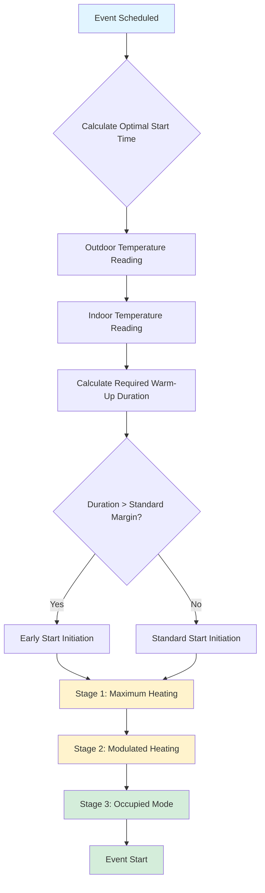

## Overview

Pre-event warm-up for variable occupancy spaces requires precise calculation of heating requirements to achieve comfort conditions before occupant arrival. Large venues such as arenas, convention centers, and auditoriums present unique challenges due to significant thermal mass, extended unoccupied periods, and deep temperature setback strategies.

The fundamental challenge involves heating not only the air volume but also the building envelope, seating structures, floor slabs, and interior finishes that absorb and release thermal energy throughout the warm-up cycle.

## Thermal Mass Heating Calculations

The total heating energy required during warm-up consists of two primary components: sensible heating of air and thermal mass recovery.

### Air Volume Heating

The sensible heat required to raise air temperature from setback to occupied setpoint:

$$Q_{air} = \rho \cdot V \cdot c_p \cdot (T_{occ} - T_{setback})$$

Where:
- $Q_{air}$ = sensible heat for air (Btu)
- $\rho$ = air density (0.075 lb/ft³ at sea level)
- $V$ = space volume (ft³)
- $c_p$ = specific heat of air (0.24 Btu/lb·°F)
- $T_{occ}$ = occupied setpoint temperature (°F)
- $T_{setback}$ = setback temperature (°F)

### Thermal Mass Recovery

Building thermal mass requires significantly more energy than air heating alone:

$$Q_{mass} = \sum_{i=1}^{n} m_i \cdot c_{p,i} \cdot (T_{final,i} - T_{initial,i})$$

Where:
- $Q_{mass}$ = total thermal mass heat requirement (Btu)
- $m_i$ = mass of component $i$ (lb)
- $c_{p,i}$ = specific heat of material $i$ (Btu/lb·°F)
- $T_{final,i}$ = final temperature of component (°F)
- $T_{initial,i}$ = initial temperature of component (°F)

### Warm-Up Time Estimation

The theoretical minimum warm-up time depends on available heating capacity:

$$t_{warmup} = \frac{Q_{air} + Q_{mass} + Q_{infiltration}}{Q_{capacity} \cdot \eta}$$

Where:
- $t_{warmup}$ = warm-up time (hours)
- $Q_{capacity}$ = installed heating capacity (Btu/hr)
- $\eta$ = heating system efficiency factor (0.85-0.95)
- $Q_{infiltration}$ = infiltration heat loss during warm-up (Btu)

## Warm-Up Sequence Strategy

## Staged Warm-Up Implementation

### Stage 1: Maximum Heating Output

- All heating equipment energized simultaneously
- Supply air temperature at maximum (typically 90-110°F)
- Ventilation dampers at minimum position
- Fan systems at full capacity
- Duration: 60-75% of total warm-up period

### Stage 2: Modulated Heating

- Supply temperature reduced to moderate levels (75-85°F)
- Outdoor air dampers begin modulation
- Heating output throttled based on space temperature
- Duration: 20-30% of total warm-up period

### Stage 3: Occupied Transition

- Ventilation rates increased to occupied levels
- Supply temperature modulates to maintain setpoint
- Heating capacity matches actual load
- Duration: 5-10% of warm-up period before occupancy

## Typical Warm-Up Duration Requirements

| Space Type | Volume (ft³) | Setback ΔT (°F) | Warm-Up Time (hrs) | Notes |
|------------|--------------|-----------------|-------------------|-------|
| Ice Arena | 500,000 | 20-25 | 4-6 | Includes spectator areas |
| Convention Hall | 800,000 | 15-20 | 3-5 | High thermal mass |
| Auditorium | 300,000 | 15-18 | 2-3 | Moderate mass |
| Gymnasium | 200,000 | 12-15 | 1.5-2.5 | Lower mass |
| Fieldhouse | 1,000,000 | 18-22 | 5-8 | Large volume, high mass |

*Times assume outdoor temperature 20-30°F below indoor setpoint and heating capacity sized for occupied load plus 30% margin.*

## Optimal Start Algorithm

Modern building automation systems employ adaptive optimal start algorithms that learn building thermal response characteristics:

$$T_{start} = T_{event} - \left(k_1 \cdot \Delta T_{indoor} + k_2 \cdot \Delta T_{outdoor} + k_3 \cdot t_{unoccupied}\right)$$

Where:
- $T_{start}$ = calculated start time
- $T_{event}$ = scheduled event time
- $k_1, k_2, k_3$ = learned coefficients from historical data
- $\Delta T_{indoor}$ = temperature rise required (°F)
- $\Delta T_{outdoor}$ = outdoor temperature depression (°F)
- $t_{unoccupied}$ = duration of unoccupied period (hours)

## Zone Priority Sequencing

For large facilities with multiple zones:

1. **High Priority Zones** (Entry lobbies, box seats): Start first, reach setpoint 30-45 minutes before event
2. **Medium Priority Zones** (General seating, concourses): Start second, reach setpoint 15-30 minutes before event
3. **Low Priority Zones** (Storage, support spaces): Start last, reach setpoint at event start

This sequential approach reduces peak demand and prevents electrical system overload during warm-up initiation.

## ASHRAE Standards Reference

ASHRAE Standard 90.1-2019 Section 6.4.3.3.3 requires automatic setback controls with optimal start capabilities for spaces larger than 10,000 ft² served by systems greater than 75,000 Btu/hr capacity. The standard mandates that warm-up periods use minimum outdoor air ventilation rates until 30 minutes before scheduled occupancy.

ASHRAE Guideline 36-2021 provides detailed control sequences for optimal start algorithms, specifying maximum warm-up duration limits and outdoor air lockout strategies to minimize energy consumption during pre-occupancy conditioning.

## Heating Capacity Considerations

Adequate heating capacity must account for:

- **Design heating load** during occupied conditions
- **Setback recovery capacity** (typically 20-35% additional)
- **Infiltration loads** during warm-up with building pressurization
- **Outdoor temperature effects** on equipment capacity

Undersized heating systems result in extended warm-up periods, increased energy consumption, and potential occupant discomfort. Proper sizing requires thermal mass calculations specific to the building construction and intended setback strategy.

## Performance Verification

Monitor and verify warm-up performance through:

- Space temperature achievement vs. event start time
- Total energy consumption per warm-up cycle
- Equipment runtime hours and staging patterns
- Outdoor air damper position during warm-up phases
- Occupant comfort complaints within first 30 minutes of event

Adjust optimal start coefficients based on collected data to minimize energy use while maintaining reliable comfort delivery.