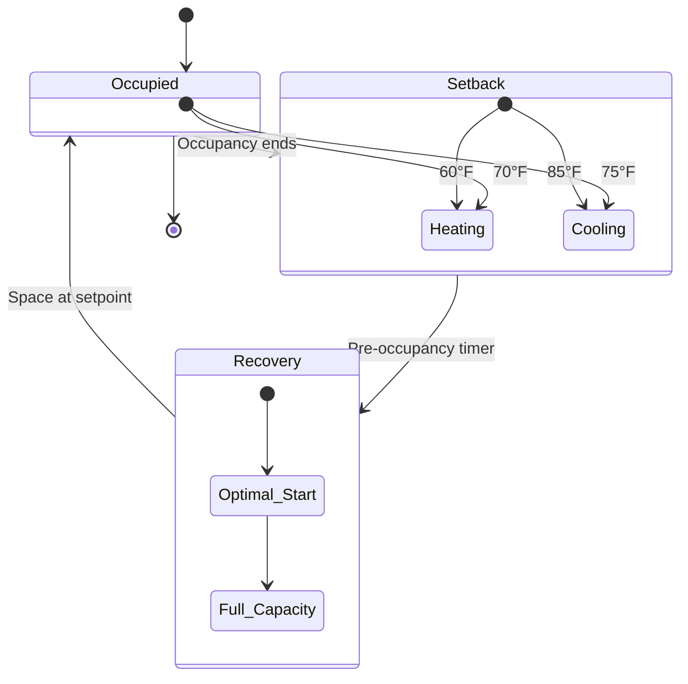

# Unoccupied Setback Control

Unoccupied setback is a fundamental energy conservation strategy that adjusts HVAC system setpoints during periods when buildings are not occupied. This strategy reduces heating and cooling loads by allowing interior temperatures to drift toward outdoor conditions within safe limits, delivering significant energy savings while protecting building equipment and maintaining structural integrity.

## Physical Principles

The energy savings from setback control derive from reduced temperature differential between conditioned space and outdoor environment. Heat transfer rate through building envelope follows:

$$Q = UA\Delta T$$

where:
- $Q$ = heat transfer rate (BTU/hr)
- $U$ = overall heat transfer coefficient (BTU/hr·ft²·°F)
- $A$ = envelope area (ft²)
- $\Delta T$ = temperature difference (°F)

Reducing $\Delta T$ during unoccupied periods directly decreases heat loss (winter) or heat gain (summer), proportionally reducing HVAC energy consumption.

## Setback Strategies

### Temperature Setback Modes

### Setpoint Recommendations

The following setpoints balance energy savings with equipment protection and recovery time requirements:

| Season | Occupied | Setback | Maximum Drift | Recovery Time |
|--------|----------|---------|---------------|---------------|
| Heating | 70°F | 60-65°F | 55°F minimum | 1-3 hours |
| Cooling | 75°F | 82-85°F | 90°F maximum | 1-2 hours |
| Shoulder | 72°F | Off (economizer) | 65-80°F | 30-60 min |

**Critical limits:**
- Minimum 55°F: Prevents pipe freezing, condensation damage
- Maximum 90°F: Protects electronics, prevents material degradation
- Humidity: Maintain 30-60% RH to prevent mold growth and material damage

## Energy Savings Calculations

### Heating Season Savings

Annual heating energy savings from nighttime setback:

$$E_{saved} = \frac{24 \cdot DD \cdot \Delta T_{sb}}{T_{occ} \cdot \Delta T_{design}} \cdot E_{annual}$$

where:
- $DD$ = heating degree days (°F·days)
- $\Delta T_{sb}$ = setback temperature reduction (°F)
- $T_{occ}$ = occupied hours per day (hr)
- $\Delta T_{design}$ = design temperature difference (°F)
- $E_{annual}$ = annual heating energy without setback

**Example calculation:**
- Climate: 5,000 heating degree days
- Occupied: 10 hours/day (7 AM - 5 PM)
- Setback: 70°F to 60°F (10°F reduction)
- Design ΔT: 70°F indoor - 0°F outdoor = 70°F

$$E_{saved} = \frac{24 \cdot 5000 \cdot 10}{10 \cdot 70} \cdot E_{annual} = 1.71 \cdot E_{annual}$$

This indicates potential savings of approximately 15-20% of heating energy for a 10°F setback over 14 unoccupied hours.

### Cooling Season Savings

Cooling savings are more complex due to latent load and thermal mass effects:

$$E_{saved,cooling} = \eta_{sb} \cdot \left(\frac{h_{unoccupied}}{24}\right) \cdot \left(\frac{\Delta T_{sb}}{\Delta T_{design}}\right) \cdot E_{annual,cooling}$$

where:
- $\eta_{sb}$ = setback efficiency factor (0.6-0.8 accounting for thermal mass)
- $h_{unoccupied}$ = unoccupied hours per day
- Other terms as defined above

Cooling setback typically achieves 10-15% energy savings, less than heating due to:
- Thermal mass heat absorption during setback
- Latent load recovery requirements
- Higher recovery energy demands

## Implementation Strategies

### Occupancy Schedule Programming

Effective setback control requires accurate scheduling:

1. **Fixed schedule:** Predetermined occupied/unoccupied periods based on building use patterns
2. **Occupancy sensors:** Real-time detection for irregular schedules (conference rooms, auditoriums)
3. **Tenant override:** Manual temporary occupancy extension (typically 2-4 hours)
4. **Holiday calendars:** Automated recognition of non-working days

### Optimal Start Algorithms

Recovery from setback must achieve comfort before occupancy. Optimal start calculates required pre-occupancy runtime:

$$t_{start} = \frac{(T_{setpoint} - T_{current}) \cdot C_{thermal}}{Q_{capacity}}$$

where:
- $t_{start}$ = required start time before occupancy (hours)
- $C_{thermal}$ = building thermal capacitance (BTU/°F)
- $Q_{capacity}$ = HVAC system heating/cooling capacity (BTU/hr)

Modern building automation systems employ adaptive algorithms that learn building thermal response and adjust start times based on outdoor temperature and recent performance.

## Equipment Protection Considerations

### Preventing Damage During Setback

Unoccupied setback must maintain conditions that protect building systems:

- **Pipe freeze protection:** Minimum 55°F in areas with plumbing, or use glycol solutions
- **Electronics:** Maximum 85°F for IT equipment rooms; consider separate temperature control
- **Humidity control:** Prevent condensation (dewpoint monitoring) and mold growth (max 60% RH)
- **Refrigeration equipment:** Maintain ambient temperature within manufacturer specifications

### Zone-Specific Strategies

Different building areas require customized setback approaches:

| Zone Type | Setback Strategy | Reason |
|-----------|------------------|--------|
| Office areas | Full setback | High occupancy variation, good thermal mass |
| Server rooms | No setback | Equipment heat generation, strict temperature limits |
| Laboratories | Reduced setback | Process requirements, safety equipment operation |
| Warehouses | Deep setback | Low occupancy, minimal equipment sensitivity |
| Perimeter zones | Limited setback | Higher envelope loads, longer recovery times |

## ASHRAE 90.1 Requirements

ASHRAE Standard 90.1 (Energy Standard for Buildings) mandates automatic setback controls:

- **Section 6.4.3.3:** Zone thermostatic controls must include automatic setback/setup capability
- **Setback requirement:** Reduce heating setpoint by ≥10°F or increase cooling setpoint by ≥10°F during unoccupied periods
- **Automatic capability:** Manual-only setback does not satisfy code requirements
- **Exemptions:** Zones requiring continuous operation for safety or process reasons

Compliance verification requires documentation of:
1. Programmed schedules in building automation system
2. Actual setpoint values for occupied and unoccupied modes
3. Override controls and automatic return to setback

## Performance Monitoring

Track these metrics to verify setback effectiveness:

- **Energy use intensity (EUI):** Compare occupied vs. unoccupied period consumption (BTU/ft²·day)
- **Recovery success rate:** Percentage of days achieving setpoint before occupancy
- **Temperature excursions:** Incidents exceeding maximum drift limits
- **Override frequency:** Manual occupancy extensions indicating schedule misalignment

Effective unoccupied setback control delivers measurable energy savings while maintaining equipment longevity and occupant comfort, representing one of the highest return-on-investment efficiency measures available in building HVAC operations.
