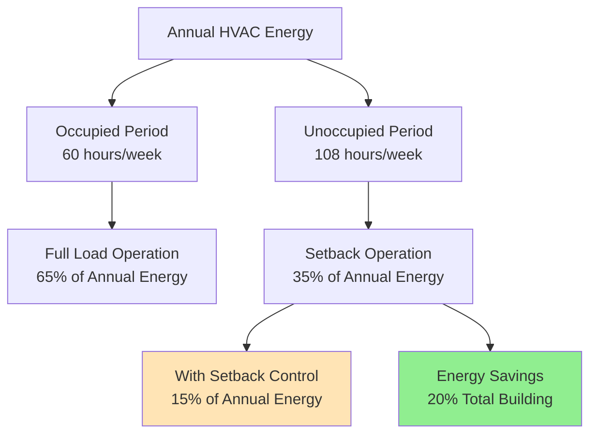

Unoccupied setback strategies represent one of the most cost-effective energy conservation measures in commercial HVAC systems. By reducing conditioning requirements during unoccupied periods, buildings achieve 30-50% annual energy savings while maintaining occupant comfort during business hours. ASHRAE 90.1 mandates automatic setback controls for most commercial applications, recognizing the significant energy and cost benefits.

## Energy Savings Mechanisms

Unoccupied setback reduces energy consumption through four primary mechanisms:

**Reduced Temperature Differential** - By allowing indoor temperatures to drift toward outdoor conditions, the building envelope heat transfer rate decreases proportionally to the temperature differential.

**Equipment Runtime Reduction** - HVAC equipment cycles less frequently or shuts down completely during unoccupied periods, eliminating unnecessary operation.

**Auxiliary Load Elimination** - Fans, pumps, and other auxiliary equipment consume zero energy when systems are off, providing immediate demand reduction.

**Peak Demand Reduction** - Strategic setback scheduling shifts load away from utility peak periods, reducing demand charges that can represent 30-50% of commercial electric bills.

## Heating Energy Savings Calculation

The heating energy savings from nighttime setback depends on building thermal mass, envelope performance, and setback duration:

$$Q_{saved} = UA \cdot \Delta T_{reduction} \cdot t_{setback} \cdot \eta_{recovery}$$

Where:
- $Q_{saved}$ = Energy saved during setback period (Btu)
- $U$ = Overall envelope heat transfer coefficient (Btu/hr·ft²·°F)
- $A$ = Building envelope area (ft²)
- $\Delta T_{reduction}$ = Reduced temperature differential (°F)
- $t_{setback}$ = Setback duration (hours)
- $\eta_{recovery}$ = Recovery penalty factor (0.70-0.85)

The recovery penalty accounts for the additional energy required to restore occupied temperatures. Heavy thermal mass buildings (concrete, masonry) experience higher recovery penalties but better load shifting benefits.

## Cooling Energy Savings Calculation

Cooling setback savings include both sensible and latent load reductions:

$$E_{cooling} = \frac{Q_{sensible} + Q_{latent}}{COP} \cdot t_{setback} \cdot (1 - f_{runtime})$$

Where:
- $E_{cooling}$ = Electrical energy savings (kWh)
- $Q_{sensible}$ = Sensible cooling load reduction (Btu/hr)
- $Q_{latent}$ = Latent load reduction (Btu/hr)
- $COP$ = System coefficient of performance
- $t_{setback}$ = Unoccupied hours per day
- $f_{runtime}$ = Runtime fraction during setback (0.0-0.2)

For typical commercial buildings with 12-hour occupancy schedules, cooling setback during the remaining 12 hours reduces annual cooling energy by 35-45%.

## Annual Energy Savings Analysis

## Savings by Building Type and Climate

| Building Type | Climate Zone | Heating Savings | Cooling Savings | Total Annual Savings |
|---------------|--------------|-----------------|-----------------|---------------------|
| Office | Hot-Humid (2A) | 15-25% | 40-50% | 35-45% |
| Office | Cold (6A) | 35-45% | 30-40% | 35-42% |
| Retail | Mixed (4A) | 25-35% | 35-45% | 30-40% |
| School | Cold (5A) | 40-50% | 35-45% | 38-48% |
| Warehouse | Hot-Dry (3B) | 20-30% | 30-40% | 28-38% |
| Healthcare (non-critical) | Mixed (4A) | 25-30% | 30-35% | 28-33% |

Savings percentages represent reductions in HVAC energy consumption relative to continuous operation at occupied setpoints.

## Demand Charge Reduction

Peak demand reduction provides significant cost savings in commercial rate structures:

$$Cost_{demand} = kW_{peak} \cdot Rate_{demand} \cdot 12\text{ months}$$

Strategic setback scheduling reduces peak demand by 20-40% when unoccupied periods coincide with utility peak windows (typically 2-7 PM in summer). For a 100-ton cooling system:

- Peak demand without setback: 120 kW
- Peak demand with setback: 75 kW
- Demand reduction: 45 kW
- Annual demand charge savings: $45 \text{ kW} \times $15/\text{kW} \times 12 = $8,100$

## Time-of-Use Optimization

Time-of-use (TOU) rates charge different energy prices based on time of day. Optimal setback strategies align minimum conditioning with maximum utility rates:

```mermaid
gantt
    title Daily Energy Cost Optimization
    dateFormat HH:mm
    axisFormat %H:%M

    section Utility Rate
    Off-Peak ($0.08/kWh)    :rate1, 00:00, 7h
    Mid-Peak ($0.12/kWh)    :rate2, 07:00, 5h
    On-Peak ($0.24/kWh)     :rate3, 12:00, 7h
    Mid-Peak ($0.12/kWh)    :rate4, 19:00, 3h
    Off-Peak ($0.08/kWh)    :rate5, 22:00, 2h

    section HVAC Operation
    Deep Setback (10% load)  :hvac1, 00:00, 6h
    Warm-Up (80% load)       :hvac2, 06:00, 2h
    Full Operation (100%)    :hvac3, 08:00, 10h
    Setback (20% load)       :hvac4, 18:00, 6h
```

## Operating Cost Analysis

Annual utility cost savings combine energy and demand reductions:

| Cost Component | Without Setback | With Setback | Annual Savings |
|----------------|-----------------|--------------|----------------|
| Energy (kWh) | $45,000 | $27,000 | $18,000 (40%) |
| Demand (kW) | $21,600 | $13,500 | $8,100 (38%) |
| Total Annual Cost | $66,600 | $40,500 | $26,100 (39%) |

Based on a 50,000 ft² office building, mixed climate, $0.11/kWh average energy rate, $15/kW demand charge.

## ASHRAE 90.1 Requirements

ASHRAE Standard 90.1 mandates automatic setback controls for most commercial HVAC systems:

**Section 6.4.3.3 - Setback Controls** requires automatic temperature reset or shutdown during unoccupied periods for all HVAC systems serving spaces with scheduled occupancy patterns.

**Setpoint Requirements:**
- Heating setback: ≤55°F or system shutdown
- Cooling setup: ≥85°F or system shutdown
- Exceptions for processes requiring continuous conditioning

**Override Provisions:**
- Manual override limited to 2 hours maximum
- Automatic return to setback mode after override period
- Override capability required for temporary occupancy

## Optimizing Recovery Time

Efficient recovery from setback minimizes energy penalties while ensuring occupied comfort:

$$t_{recovery} = \frac{C \cdot \Delta T}{Q_{available} - Q_{loss}}$$

Where:
- $t_{recovery}$ = Time to restore occupied temperature (hours)
- $C$ = Building thermal capacitance (Btu/°F)
- $\Delta T$ = Temperature change required (°F)
- $Q_{available}$ = Available HVAC capacity (Btu/hr)
- $Q_{loss}$ = Ongoing envelope losses (Btu/hr)

Optimal start algorithms calculate required pre-occupancy start times based on current indoor temperature, outdoor conditions, and historical recovery performance. This prevents excessive early starts that waste energy and late starts that compromise comfort.

## Implementation Best Practices

**Schedule Accuracy** - Verify actual occupancy patterns match programmed schedules. Many buildings operate setback based on outdated schedules, missing 10-15% additional savings.

**Seasonal Adjustment** - Modify setback aggressiveness seasonally. Mild weather permits deeper setbacks with faster recovery.

**Zone-Level Control** - Apply setback independently to zones with different occupancy schedules rather than building-wide schedules that accommodate the longest occupied period.

**Equipment Sequencing** - Stage equipment shutdown during setback initiation and startup during recovery to minimize demand spikes.

**Monitoring and Verification** - Track runtime, energy consumption, and demand profiles to verify savings and identify optimization opportunities.

Properly implemented unoccupied setback strategies deliver immediate, measurable energy savings with minimal capital investment, typically achieving simple payback periods under one year for retrofit applications and contributing significantly to ASHRAE 90.1 compliance in new construction.
