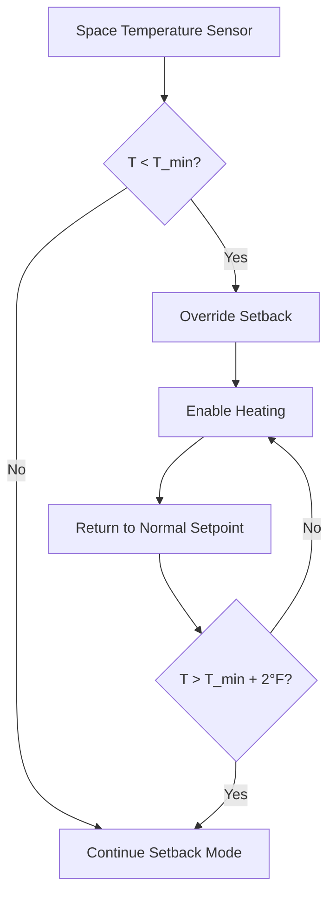
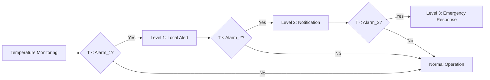

## Overview

Freeze protection is a critical safety function in unoccupied HVAC control that prevents equipment damage, pipe rupture, and building envelope degradation when heating systems operate in setback mode. During unoccupied periods, maintaining minimum safe temperatures protects water-filled components while maximizing energy savings.

## Minimum Temperature Setpoints

### Space Temperature Limits

The minimum unoccupied heating setpoint must balance freeze protection with energy conservation. ASHRAE Standard 90.1 permits setback to 55°F (13°C) for most commercial applications, but local conditions dictate actual requirements.

**Minimum space temperature:**

$$T_{min} = T_{freeze} + \Delta T_{safety}$$

Where:
- $T_{min}$ = minimum space setpoint (°F or °C)
- $T_{freeze}$ = freezing point of protected fluid (32°F / 0°C for water)
- $\Delta T_{safety}$ = safety margin (typically 10-15°F / 5-8°C)

For water systems:

$$T_{min} = 32°F + 13°F = 45°F \, (7°C)$$

### Pipe Protection Temperature

Pipes in exterior walls, unheated spaces, or near building penetrations require elevated protection temperatures:

$$T_{pipe,min} = T_{freeze} + \Delta T_{wall} + \Delta T_{safety}$$

Where:
- $\Delta T_{wall}$ = temperature gradient through wall assembly (5-10°F / 3-6°C)

**Typical minimum: 50°F (10°C) for piping systems**

## Freeze Protection Strategies

### 1. Low Temperature Limit Control

Primary protection layer that overrides unoccupied setback when space temperature approaches dangerous levels.

**Control logic:**
- Heating enabled when: $T_{space} < T_{min}$
- Heating disabled when: $T_{space} > T_{min} + \Delta T_{differential}$
- Typical differential: 2-3°F (1-2°C)

### 2. Freeze Stat Protection

Hardwired safety device that directly energizes heating equipment, independent of control system operation. ASHRAE Guideline 36 recommends manual reset freeze stats set at 35-40°F (2-4°C).

**Installation requirements:**
- Coil face freeze stats: 35°F (2°C) with capillary across coldest coil section
- Duct freeze stats: 38°F (3°C) downstream of cooling coils
- Space freeze stats: 40°F (4°C) in critical areas

### 3. Glycol System Monitoring

For systems using glycol solutions, freeze protection shifts from temperature maintenance to concentration verification.

**Glycol freeze point:**

$$T_{freeze,glycol} = T_{water} - K \cdot C_{glycol}$$

Where:
- $K$ = depression constant (varies by glycol type)
- $C_{glycol}$ = glycol concentration (% by volume)

For ethylene glycol:
- 30% solution: 7°F (-14°C) freeze point
- 40% solution: -10°F (-23°C) freeze point
- 50% solution: -33°F (-36°C) freeze point

## Protection Setpoint Table

| Application | Minimum Setpoint | Alarm Point | Freeze Stat Setting |
|-------------|------------------|-------------|---------------------|
| Interior spaces | 55°F (13°C) | 50°F (10°C) | 40°F (4°C) |
| Perimeter zones | 58°F (14°C) | 52°F (11°C) | 40°F (4°C) |
| Mechanical rooms | 50°F (10°C) | 45°F (7°C) | 38°F (3°C) |
| Pipe chases | 50°F (10°C) | 45°F (7°C) | 38°F (3°C) |
| Water coils | N/A | 40°F (4°C) | 35°F (2°C) |
| Chilled water systems | 42°F (6°C) | 38°F (3°C) | 35°F (2°C) |

## Alarm System Integration

### Multi-Stage Alarm Response

**Alarm hierarchy:**
1. **Pre-alarm (Level 1):** $T_{space} < T_{setpoint} + 5°F$ — Building automation alert
2. **Warning (Level 2):** $T_{space} < 50°F (10°C)$ — Email/SMS notification to facilities staff
3. **Critical (Level 3):** $T_{space} < 45°F (7°C)$ — Emergency dispatch, equipment override

### Monitoring Requirements

ASHRAE Guideline 36 Section 5.1.13 specifies freeze protection monitoring:
- Temperature sampling interval: 5 minutes maximum
- Alarm latency: 2 minutes maximum
- Reset authority: supervisory override required for freeze stat resets
- Trend logging: continuous during alarm conditions

## Heating System Standby

During unoccupied periods, heating equipment must remain capable of rapid response to freeze conditions.

**Standby strategies:**
- Boiler maintaining minimum temperature (120-140°F / 49-60°C)
- Circulation pumps enabled on temperature drop
- Backup heating sources armed for automatic activation
- Heat trace systems for exposed piping

**Response time requirement:**

$$t_{response} = \frac{V_{space} \cdot \rho \cdot c_p \cdot \Delta T}{Q_{heating}}$$

Where:
- $t_{response}$ = time to restore safe temperature (hours)
- $V_{space}$ = conditioned space volume (ft³)
- $\rho$ = air density (0.075 lb/ft³)
- $c_p$ = specific heat of air (0.24 Btu/lb·°F)
- $Q_{heating}$ = available heating capacity (Btu/h)

For adequate protection: $t_{response} < 2 \, hours$

## Pipe Freeze Prevention

### Heat Trace Systems

Self-regulating heat trace cable provides localized protection for vulnerable piping. Power density decreases as pipe temperature rises, preventing overheating.

**Heat trace sizing:**

$$W_{trace} = \frac{Q_{loss}}{L_{pipe}} \cdot SF$$

Where:
- $W_{trace}$ = required watts per linear foot
- $Q_{loss}$ = heat loss from pipe (Btu/h·ft)
- $L_{pipe}$ = protected length (ft)
- $SF$ = safety factor (1.2-1.5)

### Insulation Requirements

Pipe insulation thickness must account for unheated space exposure. ASHRAE Standard 90.1 Table 6.8.3 specifies minimum insulation for freeze protection: 1-2 inches (25-51 mm) for pipes below 3 inches diameter in unconditioned spaces.

## System Design Considerations

**Redundancy requirements:**
- Dual temperature sensors in critical areas with voting logic
- Independent freeze stats separate from BAS control
- Emergency heat source independent of primary system
- Battery backup for control and alarm systems (4-hour minimum)

**Commissioning verification:**
- Simulate freeze conditions by reducing setpoints
- Verify alarm notification delivery
- Test freeze stat manual reset procedure
- Document response times and override sequences

**Maintenance protocol:**
- Monthly sensor calibration verification during heating season
- Annual freeze stat functionality test
- Glycol concentration testing (semi-annual)
- Heat trace continuity testing (annual)

## Code and Standard References

- **ASHRAE Standard 90.1:** Energy-efficient setback temperature limits
- **ASHRAE Guideline 36:** High-performance sequences of operation for HVAC systems
- **International Mechanical Code (IMC):** Section 301.11 equipment protection requirements
- **ASHRAE Standard 135 (BACnet):** Alarm and event management protocols

Proper freeze protection implementation ensures building safety during unoccupied periods while maintaining energy efficiency objectives. The multi-layered approach combining control sequences, hardwired safety devices, and monitoring systems provides defense-in-depth against freeze damage.
