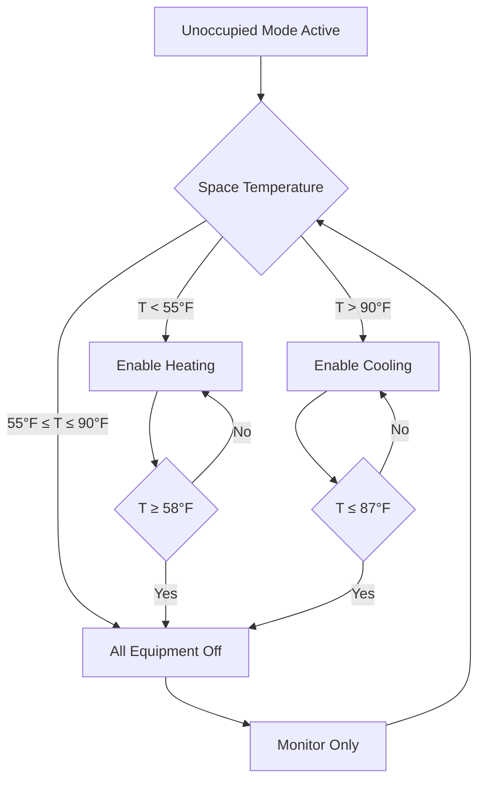
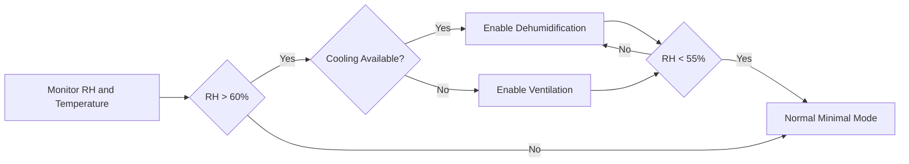

## Overview

Minimal conditioning represents the most aggressive energy conservation strategy during unoccupied periods, maintaining only the environmental conditions necessary to protect building systems, prevent equipment damage, and avoid moisture-related issues. This approach maximizes energy savings by allowing space temperatures to drift within wide deadbands while cycling equipment only when protection limits are reached.

## Minimal Conditioning Operating Principles

Minimal conditioning mode operates on the principle that unoccupied spaces can tolerate extreme temperature excursions without compromising building integrity. The strategy focuses on three critical protection objectives:

1. **Equipment Protection**: Preventing damage to temperature-sensitive building systems
2. **Envelope Protection**: Avoiding condensation, freezing, or structural stress
3. **Recovery Capability**: Maintaining sufficient thermal stability for reasonable morning warmup

The wide temperature deadband between heating and cooling setpoints eliminates unnecessary equipment cycling and allows natural thermal drift based on outdoor conditions and internal thermal mass.

## Setpoint Strategy and Temperature Limits

### Standard Minimal Conditioning Setpoints

| Condition | Heating Setpoint | Cooling Setpoint | Deadband | Application |
|-----------|------------------|------------------|----------|-------------|
| Winter Dominant | 55°F (13°C) | 90°F (32°C) | 35°F | Cold climates, well-insulated buildings |
| Moderate Climate | 58°F (14°C) | 88°F (31°C) | 30°F | Mixed climates, standard construction |
| Humidity Concern | 60°F (16°C) | 85°F (29°C) | 25°F | High humidity regions, moisture-sensitive equipment |
| Equipment Intensive | 62°F (17°C) | 82°F (28°C) | 20°F | Server rooms, laboratories (off-hours) |

### Extreme Setback Temperature Limits

**Heating Protection Threshold**: The minimum heating setpoint prevents:
- Pipe freezing in perimeter zones
- Condensation on cold surfaces
- Equipment damage from low temperatures
- Excessive morning recovery time

**Cooling Protection Threshold**: The maximum cooling setpoint prevents:
- Electronic equipment overheating
- High humidity and condensation risk
- Material degradation from excessive heat
- Occupant discomfort upon building re-entry

## Equipment Cycling Strategy

### Minimal Runtime Control Logic

### Staging and Differential Control

The control system implements hysteresis to prevent short-cycling:

**Heating Cycle**:
- Start heating at: 55°F
- Stop heating at: 58°F (3°F differential)
- Minimum runtime: 10 minutes

**Cooling Cycle**:
- Start cooling at: 90°F
- Stop cooling at: 87°F (3°F differential)
- Minimum runtime: 15 minutes

This differential ensures equipment runs for meaningful periods when activated, reducing wear from frequent starts while maintaining protection limits.

## Energy Savings Calculations

### Heating Energy Reduction

The heating energy savings from minimal conditioning compared to occupied setpoints can be estimated using:

$$Q_{saved} = UA \cdot \Delta T_{sb} \cdot t_{unocc}$$

Where:
- $Q_{saved}$ = energy saved (Btu or kWh)
- $U$ = overall heat transfer coefficient (Btu/hr·ft²·°F)
- $A$ = building envelope area (ft²)
- $\Delta T_{sb}$ = setback temperature difference (°F)
- $t_{unocc}$ = unoccupied duration (hours)

### Percentage Energy Savings

For heating season, the fractional savings can be approximated as:

$$\text{Savings} = \left(1 - \frac{T_{indoor,sb} - T_{outdoor}}{T_{indoor,occ} - T_{outdoor}}\right) \times \frac{t_{unocc}}{t_{total}}$$

Where:
- $T_{indoor,sb}$ = setback heating setpoint (55°F)
- $T_{indoor,occ}$ = occupied heating setpoint (70°F)
- $T_{outdoor}$ = average outdoor temperature during unoccupied period

**Example Calculation**:
- Occupied setpoint: 70°F
- Setback setpoint: 55°F
- Average outdoor temperature: 30°F
- Unoccupied fraction: 60% of week

$$\text{Savings} = \left(1 - \frac{55 - 30}{70 - 30}\right) \times 0.60 = \left(1 - \frac{25}{40}\right) \times 0.60 = 0.375 \times 0.60 = 22.5\%$$

This example demonstrates 22.5% heating energy reduction from minimal conditioning setback.

## Moisture and Condensation Control

### Humidity Monitoring Requirements

Minimal conditioning must include humidity monitoring to prevent:
- Surface condensation on cold surfaces
- Mold growth from sustained high humidity
- Material damage in humidity-sensitive spaces

**Critical Humidity Thresholds**:
- Maximum relative humidity: 65% RH
- Dew point alarm: 60°F
- Condensation risk temperature: 55°F surface temperature

### Condensation Prevention Logic

When relative humidity exceeds 60%, the system must provide dehumidification even if space temperature remains within the minimal conditioning deadband. This override protects building materials and equipment from moisture damage.

## ASHRAE 90.1 Compliance

### Energy Standard Requirements

ASHRAE 90.1 Section 6.4.3.3 establishes requirements for automatic setback controls:

**Mandatory Provisions**:
- Automatic temperature reset during unoccupied periods
- Setback to 55°F heating or setup to 90°F cooling
- Override capability for temporary occupancy
- Automatic return to occupied setpoints before scheduled occupancy

**Zone-Level Controls**: Each zone must have independent setback capability unless justified by system design limitations.

### Exception Conditions

Minimal conditioning may not be appropriate for:
- Spaces with continuous processes requiring stable temperatures
- Areas with temperature-sensitive equipment or materials
- Spaces requiring positive pressurization for contamination control
- Zones where recovery time would exceed pre-occupancy period

## Implementation Considerations

### Morning Recovery Preparation

The building management system should initiate recovery from minimal conditioning mode based on:

$$t_{recovery} = \frac{C \cdot m \cdot \Delta T}{Q_{capacity}}$$

Where:
- $t_{recovery}$ = required recovery time (hours)
- $C$ = specific heat of air (0.24 Btu/lb·°F)
- $m$ = air mass or effective building thermal mass
- $\Delta T$ = temperature difference to overcome
- $Q_{capacity}$ = available heating/cooling capacity

**Typical Recovery Rates**:
- Lightweight construction: 2-4°F per hour
- Medium thermal mass: 1.5-3°F per hour
- Heavy thermal mass: 1-2°F per hour

### Equipment Protection Features

**Compressor Protection**: When enabling cooling from minimal mode, implement:
- Crankcase heater verification before start
- Minimum off-time of 5 minutes between cycles
- Staged startup for multiple compressors

**Boiler/Furnace Protection**: When enabling heating from minimal mode:
- Purge cycle completion before ignition
- Low temperature limit verification
- Gradual capacity increase to prevent thermal shock

## Performance Monitoring

### Key Performance Indicators

Track these metrics to verify minimal conditioning effectiveness:

| Metric | Target | Action if Exceeded |
|--------|--------|-------------------|
| Average Unoccupied Runtime | < 15% of unoccupied hours | Review setpoint limits |
| Temperature Excursions | < 5% of readings outside limits | Check sensor calibration |
| Morning Recovery Failures | 0 per month | Adjust recovery start time |
| Humidity Excursions | < 2% of readings > 65% RH | Enable dehumidification override |

### Energy Baseline Comparison

Establish baseline energy consumption and compare monthly:
- Total heating energy during unoccupied hours
- Total cooling energy during unoccupied hours
- Equipment runtime hours
- Peak demand during recovery periods

Minimal conditioning should reduce unoccupied HVAC energy by 20-35% compared to standard setback strategies in most climates.

## Conclusion

Minimal conditioning provides maximum energy savings during unoccupied periods while maintaining essential building protection. Success requires proper setpoint selection, robust humidity monitoring, intelligent equipment cycling logic, and adequate morning recovery capacity. When implemented according to ASHRAE 90.1 requirements and building-specific constraints, minimal conditioning delivers substantial operational cost reduction without compromising building integrity or occupant comfort upon return.
