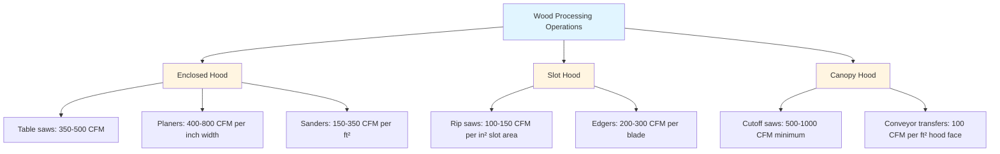
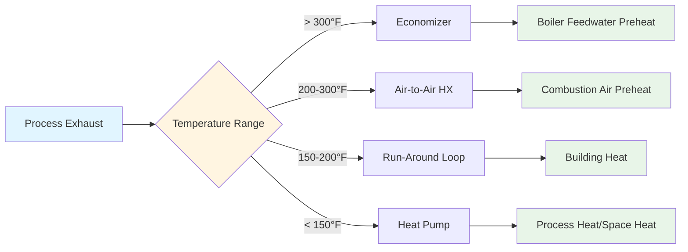
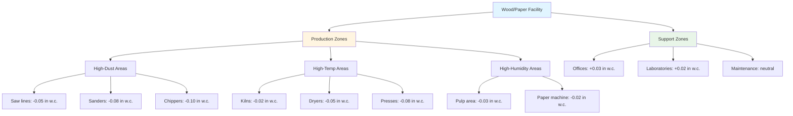

# Wood & Paper Facility HVAC Systems

Wood processing and paper manufacturing facilities present demanding HVAC challenges characterized by high particulate loads (10-50 grains/ft³ in saw areas), elevated process temperatures (180-400°F in dryers and kilns), extreme humidity swings (20-90% RH across process zones), and substantial heat generation from mechanical equipment. Effective ventilation systems must capture wood dust at source (capture velocities 100-200 fpm), manage condensation risks in high-humidity pulping areas, integrate with process heat recovery systems, and maintain worker comfort in environments where production equipment generates 500-2000 Btu/h per ft² sensible load. System design follows NFPA 664 requirements for combustible wood dust control, ACGIH Industrial Ventilation guidelines for local exhaust, and ASHRAE standards for thermal environment management in manufacturing spaces.

## Particulate Control Fundamentals

### Wood Dust Generation Characteristics

Sawing, planing, sanding, and handling operations generate airborne wood particles spanning three orders of magnitude in size distribution:

**Particle size classification:**

| Source Operation | Particle Size Range | Concentration | Settling Velocity |
|------------------|---------------------|---------------|-------------------|
| Circular saws | 10-100 μm (coarse) | 20-100 mg/m³ | 1-30 fpm |
| Planer/jointer | 20-200 μm (chips/shavings) | 50-200 mg/m³ | 5-50 fpm |
| Belt sanders | 1-50 μm (fine dust) | 10-80 mg/m³ | 0.1-5 fpm |
| Pneumatic conveying | 50-500 μm (fragments) | 100-500 mg/m³ | 10-100 fpm |

**Health and explosion hazards:**

Wood dust exposure presents both chronic health risks and acute explosion hazards. OSHA PEL for wood dust: 5 mg/m³ (8-hour TWA) for Western Red Cedar; 15 mg/m³ for softwoods and most hardwoods. Respirable particles (< 10 μm) penetrate deep into lungs, causing respiratory sensitization and increased cancer risk.

**Minimum Explosive Concentration (MEC) for common species:**
- Pine, Douglas Fir: 40-50 g/m³
- Oak, Maple hardwoods: 35-45 g/m³
- Plywood, particleboard dust: 30-40 g/m³

Dust cloud explosibility requires suspension concentration between MEC and Upper Explosive Limit (typically 2-4 kg/m³), plus ignition source exceeding minimum ignition energy (10-40 mJ for wood dust). NFPA 664 mandates maintaining dust accumulation below 1/32 in depth over 5% of surface area to prevent secondary explosions from deposited material becoming re-entrained during primary deflagration.

### Local Exhaust Ventilation Design

Capture wood particles at generation point before dispersion into general work environment:

**Hood capture velocity requirements:**

$$V_{capture} = V_x \left(1 + \frac{X^2}{A}\right)$$

Where:
- $V_{capture}$ = Centerline velocity at particle generation point (fpm)
- $V_x$ = Face velocity at hood opening (fpm)
- $X$ = Distance from hood face to source (ft)
- $A$ = Hood opening area (ft²)

**ACGIH recommended capture velocities:**

| Condition | Capture Velocity |
|-----------|------------------|
| Released with no velocity (sanding dust fall) | 50-100 fpm |
| Released at low velocity (planer discharge) | 100-200 fpm |
| Released at high velocity (saw discharge) | 200-500 fpm |
| Released in very rapid motion (conveyor transfer) | 500-1000 fpm |

**Hood types and applications:**

**Duct transport velocity:**

Maintain sufficient velocity to prevent particle settling and accumulation:

**Minimum transport velocities (ACGIH):**
- Heavy chips, hog fuel: 4000-4500 fpm
- Shavings, sander dust: 3500-4000 fpm
- Fine sander dust: 3000-3500 fpm
- Sawdust, general: 3500-4000 fpm

**Pressure loss calculation:**

$$\Delta P_{duct} = f \times \frac{L}{D} \times \frac{\rho V^2}{2} + K \times \frac{\rho V^2}{2}$$

Where:
- $\Delta P_{duct}$ = Pressure loss (in w.c.)
- $f$ = Friction factor (0.02-0.03 for dust-laden air)
- $L$ = Duct length (ft)
- $D$ = Duct diameter (ft)
- $\rho$ = Air density (lb/ft³)
- $V$ = Velocity (fpm)
- $K$ = Loss coefficient for fittings

For wood dust systems, add 10-20% safety factor above calculated losses to account for partial blockages and surface roughness from particle deposition.

## High-Temperature Process Ventilation

### Kiln and Dryer Exhaust Systems

Lumber dry kilns, veneer dryers, and particleboard press areas generate substantial sensible and latent heat requiring dedicated exhaust:

**Conventional lumber kiln ventilation:**

Operating at 110-180°F and 40-90% RH during different drying phases. Ventilation serves two functions:
1. **Moisture removal:** Exhaust humid air to reduce moisture load
2. **Temperature control:** Prevent overheating during steam injection phases

**Exhaust rate calculation:**

$$Q_{exhaust} = \frac{\dot{m}_{water} \times 60}{\rho_{air} \times (W_{in} - W_{out})}$$

Where:
- $Q_{exhaust}$ = Exhaust airflow rate (CFM)
- $\dot{m}_{water}$ = Moisture removal rate (lb/min)
- $\rho_{air}$ = Air density at kiln conditions (lb/ft³)
- $W_{in}$ = Humidity ratio of kiln air (lb water/lb dry air)
- $W_{out}$ = Humidity ratio of outdoor air (lb water/lb dry air)

**Example: 20,000 board-foot kiln drying 4/4 lumber from 30% to 8% MC over 10 days:**

Moisture removal:
- Lumber weight (oven-dry basis): 20,000 BF × 2.8 lb/BF = 56,000 lb
- Initial moisture: 56,000 lb × 0.30 = 16,800 lb
- Final moisture: 56,000 lb × 0.08 = 4,480 lb
- Total removal: 12,320 lb over 240 hours = 51.3 lb/h = 0.855 lb/min

At mid-schedule conditions (130°F, 60% RH):
- W_in = 0.045 lb/lb (from psychrometric chart)
- W_out = 0.008 lb/lb (assuming 40°F outdoor, 80% RH)
- ρ_air = 0.067 lb/ft³ at 130°F

$$Q_{exhaust} = \frac{0.855 \times 60}{0.067 \times (0.045 - 0.008)} = 20,700 \text{ CFM}$$

**Actual design:** Use 25,000-30,000 CFM to provide margin and account for peak moisture removal during initial drying phase.

### Plywood and OSB Press Ventilation

Hot press operations release steam, volatile organic compounds, and formaldehyde from resin cure reactions at press temperatures of 280-400°F:

**Contaminant generation:**
- Steam release: 5-15% of panel weight (from wood moisture vaporization)
- VOCs (terpenes, aldehydes): 0.1-0.5% of panel weight
- Formaldehyde: 0.01-0.05% of panel weight (phenol-formaldehyde resins)

**Press exhaust hood design:**

Capture volatiles immediately upon press opening (peak release during first 10-30 seconds):

**Hood requirements:**
- Type: Enclosing hood with vertical slots on press sides
- Face velocity: 150-250 fpm at fully open press position
- Capture rate: 100-200 CFM per ft² of press platen area
- Temperature: 200-300°F at hood face during press operation

**Example: 4 ft × 8 ft press platen:**
- Platen area: 32 ft²
- Exhaust rate: 32 ft² × 150 CFM/ft² = 4,800 CFM minimum
- Design: 6,000 CFM to provide safety margin

**Thermal oxidizer integration:**

VOC and formaldehyde destruction requires thermal or catalytic oxidation:
- Operating temperature: 1400-1600°F (thermal); 600-900°F (catalytic)
- Residence time: 0.5-1.0 seconds
- Destruction efficiency: > 98% for VOCs, > 95% for formaldehyde

## Process Integration and Heat Recovery

### Waste Heat Utilization

Wood processing facilities generate substantial waste heat from mechanical operations and process equipment:

**Heat generation sources:**

| Equipment | Heat Output | Temperature | Recovery Potential |
|-----------|-------------|-------------|-------------------|
| Chipper motors | 2,545 Btu/h per HP | 150-200°F | Low (dispersed) |
| Kiln exhaust | 20,000-50,000 Btu/h | 110-180°F | Medium-High |
| Dryer exhaust | 500,000-2M Btu/h | 200-400°F | High |
| Press exhaust | 100,000-500,000 Btu/h | 250-350°F | High |
| Boiler flue gas | 1-5M Btu/h | 300-500°F | Medium |

**Heat recovery methods:**

**Economizer application for dryer exhaust:**

Preheat boiler feedwater using 300-400°F dryer exhaust:

**Heat recovery calculation:**

$$Q_{recovered} = \dot{m}_{exhaust} \times c_p \times (T_{in} - T_{out}) \times \eta_{HX}$$

Where:
- $Q_{recovered}$ = Heat recovered (Btu/h)
- $\dot{m}_{exhaust}$ = Exhaust mass flow (lb/h)
- $c_p$ = Specific heat of air (0.24 Btu/lb·°F)
- $T_{in}$ = Inlet temperature (°F)
- $T_{out}$ = Outlet temperature (°F)
- $\eta_{HX}$ = Heat exchanger effectiveness (0.60-0.75)

**Example: Veneer dryer exhaust at 350°F, 100,000 CFM:**

Mass flow: 100,000 CFM × 60 min/h × 0.060 lb/ft³ = 360,000 lb/h

Cooling to 200°F (minimum to prevent condensation):
$$Q_{recovered} = 360,000 \times 0.24 \times (350 - 200) \times 0.70 = 9.07 \text{M Btu/h}$$

At natural gas cost of $8.00/MMBtu and 80% boiler efficiency:
Annual savings = 9.07 MMBtu/h × 6,000 h/yr × $8.00/MMBtu ÷ 0.80 = $543,780/year

**Payback analysis:** Heat exchanger capital cost $150,000-250,000; simple payback 3-5 months.

### Air-to-Air Heat Recovery for Makeup Air

Wood facilities require substantial makeup air (50,000-500,000 CFM) to replace exhaust from dust collection and process ventilation:

**Run-around loop systems:**

Glycol solution circulates between exhaust and supply air heat exchangers:
- Exhaust coil: Captures sensible heat from building exhaust
- Supply coil: Preheats outdoor makeup air
- Pump: Circulates glycol (3-8 GPM per 10,000 CFM)
- Effectiveness: 45-65% sensible heat recovery

**Winter heating savings:**

Design outdoor air: 0°F, supply setpoint: 65°F

Without recovery: $\Delta T$ = 65°F
With recovery (55% effectiveness): $T_{preheat}$ = 0 + (70 - 0) × 0.55 = 38.5°F
Remaining $\Delta T$ = 65 - 38.5 = 26.5°F

**Heating load reduction:**
$$\frac{26.5}{65.0} = 0.408 \text{ or } 59.2\% \text{ savings}$$

For 200,000 CFM makeup air facility:
$$Q_{saved} = 200,000 \times 1.08 \times 65 \times 0.592 = 8.31 \text{M Btu/h}$$

Annual heating cost savings (6-month heating season, 50% average load):
8.31 MMBtu/h × 4,320 h × $8.00/MMBtu ÷ 0.80 = $358,900/year

## Humidity Management Strategies

### Paper Machine Ventilation

Paper machines generate steam from wet web drying, creating extreme humidity conditions:

**Humidity generation rate:**

$$\dot{m}_{steam} = \dot{m}_{paper} \times (MC_{wet} - MC_{dry})$$

Where:
- $\dot{m}_{steam}$ = Steam generation rate (lb/h)
- $\dot{m}_{paper}$ = Paper production rate (tons/day, dry basis)
- $MC_{wet}$ = Wet end moisture content (60-70%)
- $MC_{dry}$ = Dry end moisture content (4-8%)

**Example: 200 ton/day paper machine:**

Production rate: 200 tons/day ÷ 24 h = 8.33 tons/h = 16,667 lb/h (dry basis)

Moisture removal: 16,667 lb/h × (0.65 - 0.06) = 9,833 lb/h steam

**Ventilation requirement:**

Maintain machine area at 80°F, 60% RH maximum:

From psychrometric chart at 80°F:
- 60% RH: W = 0.0132 lb/lb
- 50% RH: W = 0.0110 lb/lb (target)
- 40°F outdoor: W = 0.0035 lb/lb (winter)

$$Q_{ventilation} = \frac{\dot{m}_{steam}}{\rho_{air} \times (W_{space} - W_{outdoor})}$$

$$Q_{ventilation} = \frac{9,833}{0.075 \times (0.0110 - 0.0035)} = 1,746,000 \text{ CFM}$$

**Actual design:** Zone exhaust at dryer sections (highest humidity generation) with lower general ventilation rates. Typical: 40-60 air changes per hour in dryer areas; 6-12 ACH in general machine area.

### Condensation Prevention

High-humidity process areas adjacent to cold outdoor walls create condensation risks:

**Dew point calculation:**

At 80°F, 70% RH: Dew point = 68°F

Interior surface temperature of insulated wall:
$$T_{surface} = T_{indoor} - \frac{T_{indoor} - T_{outdoor}}{R_{total}} \times R_{indoor}$$

For R-19 wall in 0°F outdoor, 80°F indoor conditions:
$$T_{surface} = 80 - \frac{80 - 0}{19} \times 0.68 = 77.1°F$$

**Result:** No condensation (surface above dew point).

**For uninsulated concrete wall (R-1):**
$$T_{surface} = 80 - \frac{80 - 0}{1} \times 0.68 = 25.6°F$$

**Result:** Severe condensation and ice formation.

**Mitigation strategies:**
1. **Insulation:** Minimum R-13 walls, R-25 roof in high-humidity process areas
2. **Vapor barriers:** Interior-side barriers prevent moisture migration into wall cavities
3. **Destratification:** Ceiling fans prevent warm, humid air from accumulating at ceiling
4. **Local exhaust:** Capture moisture at source before general space humidification

## System Configuration and Zoning

### Multi-Zone Facility Layout

Wood and paper facilities require segregated HVAC zones based on process characteristics:

**Pressure relationships:**

Maintain negative pressure in process areas relative to support spaces prevents dust and odor migration:
- High-dust production areas: -0.05 to -0.10 in w.c. relative to outdoors
- High-temperature/humidity areas: -0.02 to -0.05 in w.c.
- Corridors and circulation: -0.01 to +0.01 in w.c. (buffer zone)
- Offices and control rooms: +0.02 to +0.05 in w.c. (positive pressure)

**Airflow cascade:** Clean → Moderate → Contaminated ensures contamination flows toward exhaust points.

### Dust Collection System Integration

Central dust collection systems serve multiple machines through ducted network:

**Collector sizing:**

Total airflow = Sum of connected equipment requirements × Diversity factor

Diversity factor accounts for non-simultaneous operation:
- Small shops (< 10 machines): 0.8-1.0 (limited diversity)
- Medium facilities (10-30 machines): 0.6-0.8
- Large plants (> 30 machines): 0.5-0.7

**Collector selection:**

| Collector Type | Efficiency | Pressure Drop | Application |
|----------------|-----------|---------------|-------------|
| Cyclone | 85-95% (> 10 μm) | 2-6 in w.c. | Precleaners, coarse chips |
| Fabric filter (baghouse) | 99.5-99.9% (> 1 μm) | 4-8 in w.c. | Final filtration, fine dust |
| Cartridge | 99-99.9% (> 1 μm) | 3-6 in w.c. | Compact installations |

**Baghouse design parameters for wood dust:**
- Air-to-cloth ratio: 2.5-4.0 CFM/ft² (depends on particle size, moisture)
- Filter media: Polyester felt (standard); flame-retardant for spark-generating operations
- Cleaning method: Pulse-jet reverse air (8-12 pulses/minute per row)
- Hopper design: 60° minimum slope, rotary airlock discharge

**Fire protection:**

NFPA 664 requirements for dust collectors:
- Spark detection at duct inlets (infrared sensors, 50-100 ms response)
- Automatic water spray suppression (actuates when spark detected)
- Explosion venting (vent area per NFPA 68 calculations)
- Abort gates (divert contaminated air to safe location)
- Deflagration isolation (fast-acting valves prevent flame propagation)

---

*Wood and paper facility HVAC systems address unique challenges of high particulate loads, elevated process temperatures, and extreme humidity conditions through specialized local exhaust ventilation, integrated heat recovery, and multi-zone pressurization strategies that protect worker health, prevent combustible dust hazards, and support process requirements while minimizing energy consumption in these energy-intensive manufacturing operations.*
