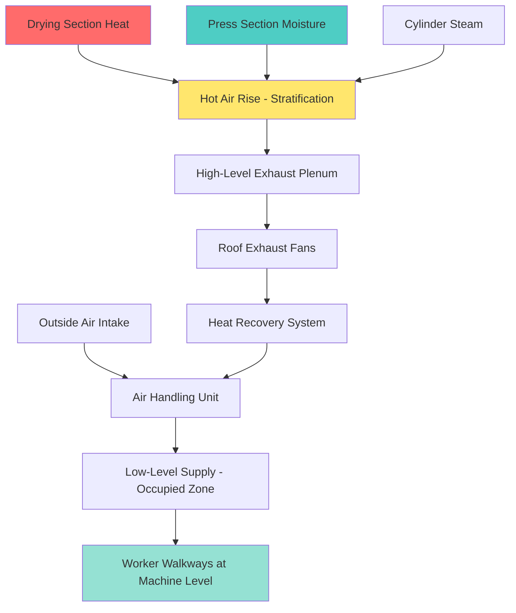
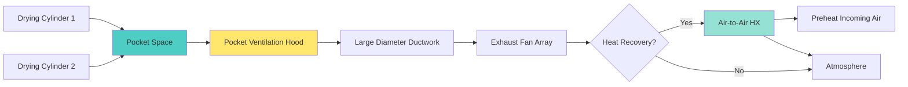

# Paper Machine Hall HVAC Systems

Paper machine halls present unique and demanding HVAC challenges due to extreme heat loads, high moisture generation, and the need for precise environmental control across different sections of the paper machine. The HVAC system must manage thermal conditions ranging from ambient to over 200°F while maintaining worker comfort and process stability.

## Heat Load Characteristics

Paper machines generate massive heat loads from multiple sources requiring careful management:

**Primary Heat Sources:**
- Drying cylinders operating at 300-350°F surface temperatures
- Steam condensate systems releasing latent heat
- Motor drives and hydraulic systems dissipating mechanical energy
- Process lighting and electrical equipment
- Solar heat gain through extensive roof areas

Heat load intensity varies dramatically along the machine length:

| Machine Section | Heat Flux | Moisture Release |
|----------------|-----------|------------------|
| Forming section | 5-10 BTU/hr·ft² | Moderate |
| Press section | 15-25 BTU/hr·ft² | High |
| Drying section | 80-150 BTU/hr·ft² | Very high |
| Calender section | 10-20 BTU/hr·ft² | Low |
| Reel section | 5-10 BTU/hr·ft² | Minimal |

The drying section represents the most challenging thermal environment, with concentrated heat release requiring dedicated ventilation strategies.

## Ventilation System Design

### Stratified Ventilation Approach

Paper machine halls benefit from stratified ventilation that exploits natural thermal stratification rather than fighting it:

### Zoned Ventilation Strategy

Different machine sections require tailored ventilation approaches:

**Forming Section:**
- Supply air at 60-70°F for operator comfort
- General exhaust to remove shower water mist
- Negative pressure relative to occupied areas
- 4-6 air changes per hour

**Press Section:**
- Enhanced exhaust over press nips
- Steam vapor capture hoods
- Moderate cooling for hydraulic systems
- 6-8 air changes per hour

**Drying Section:**
- High-volume exhaust directly above cylinder sections
- Pocket ventilation systems for inter-cylinder spaces
- Supply air ducted to machine tenders' positions
- 15-25 air changes per hour in thermal plume zones

**Calender and Reel:**
- General ventilation for equipment cooling
- Local exhaust for dust control at winders
- Moderate supply air for comfort
- 4-6 air changes per hour

## Moisture Extraction Systems

Paper machines evaporate 1-3 tons of water per ton of paper produced, requiring robust moisture removal:

### Pocket Ventilation

The most critical moisture control system extracts humid air from spaces between drying cylinders:

**Pocket Ventilation Design Parameters:**
- Exhaust air temperature: 180-220°F
- Relative humidity: 80-95%
- Air velocity: 2000-4000 fpm at hood face
- Total exhaust: 15,000-30,000 cfm per drying section

### Hood Systems

Exhaust hoods capture steam and heat at the source:

- **Canopy Hoods:** Over dryer sections, sized 3-6 ft beyond equipment edges
- **Slot Hoods:** Along cylinder rows with continuous slot openings
- **Downdraft Hoods:** For felt conditioning areas
- **Steam Enclosures:** Full or partial enclosures for press sections

## Air Distribution Systems

### Supply Air Strategy

Supply air must reach occupied zones without excessive heating:

**Low-Level Supply:**
- Floor-mounted or low sidewall diffusers
- Supply temperature 65-75°F during summer
- High-velocity throws (1500-2500 fpm) to penetrate thermal plumes
- Directed toward operator stations and walkways

**Spot Cooling:**
- Portable or fixed evaporative coolers at operator stations
- Radiant cooling panels above critical work positions
- Personal cooling stations with high-velocity fans
- Cooling vests for workers in extreme heat zones

### Exhaust Air Collection

**High-Level Exhaust:**
- Continuous slot or grille systems in ceiling/roof structure
- Located directly above heat sources
- Sized for 120-180°F exhaust air temperature
- Natural draft augmented by powered exhaust

**Roof Monitor Systems:**
- Continuous roof monitors running machine length
- Natural ventilation during mild weather
- Powered exhaust during peak loads
- Integration with smoke evacuation requirements

## Energy Recovery Opportunities

The massive airflows and high exhaust temperatures create significant energy recovery potential:

**Heat Recovery Technologies:**

| System Type | Temperature Range | Efficiency | Application |
|-------------|------------------|------------|-------------|
| Runaround loops | 140-220°F | 50-60% | Pocket ventilation |
| Air-to-air HX | 120-200°F | 60-75% | General exhaust |
| Heat pipe HX | 150-220°F | 55-70% | High-temperature zones |
| Thermal wheels | 100-180°F | 70-80% | Moderate temperatures |

**Recovered Heat Applications:**
- Preheating incoming combustion air
- Space heating during cold weather
- Process water preheating
- Adjacent building heating loads

## Control Strategies

Modern paper machine ventilation employs sophisticated controls:

**Variable Volume Control:**
- Supply and exhaust fans modulate based on zone temperatures
- Minimum ventilation rates maintained for code compliance
- Seasonal optimization of supply/exhaust balance

**Temperature-Based Sequencing:**
- Progressive activation of exhaust capacity as heat loads increase
- Supply air volume tracks exhaust to maintain slight negative pressure
- Integration with machine speed for load-following

**Pressure Management:**
- Building pressure maintained 0.03-0.08 in. wc negative
- Prevents moisture migration to adjacent spaces
- Reduces infiltration heat loads

## Design Considerations

**Structural Integration:**
- Coordinate ductwork with overhead cranes and conveyors
- Support systems must accommodate high-temperature expansion
- Accessibility for maintenance in congested spaces

**Material Selection:**
- Stainless steel or coated carbon steel for high-moisture areas
- Insulation systems rated for 250°F minimum
- Corrosion-resistant fasteners and hangers

**Fire Protection:**
- Fire dampers per NFPA 90A at fire barriers
- Smoke detection integrated with building fire alarm
- Emergency exhaust for smoke purging

**Safety Requirements:**
- Ventilation interlocks with machine emergency stops
- Carbon monoxide monitoring if gas-fired equipment present
- Adequate makeup air to prevent negative pressure hazards

## Performance Verification

Commissioning and ongoing verification ensure system effectiveness:

- Temperature surveys across occupied zones during peak production
- Airflow measurements at major supply and exhaust points
- Relative humidity monitoring in critical areas
- Worker thermal comfort assessments
- Energy consumption benchmarking against similar facilities

Properly designed paper machine hall HVAC systems maintain tolerable working conditions in one of industry's most thermally demanding environments while recovering substantial energy from waste heat streams. The investment in sophisticated ventilation infrastructure pays dividends through improved worker productivity, reduced cooling costs, and enhanced process stability.

---

*Related Topics: [Paper Mills](../../../../../specialty-applications-testing/specialty-hvac-applications/wood-paper-facilities/paper-mills/_index.md), [Industrial Local Exhaust](../../../../../specialty-applications-testing/specialty-hvac-applications/industrial-local-exhaust/_index.md), [Heat Recovery](../../../../../specialty-applications-testing/specialty-hvac-applications/wood-paper-facilities/paper-mills/heat-recovery/_index.md)*
