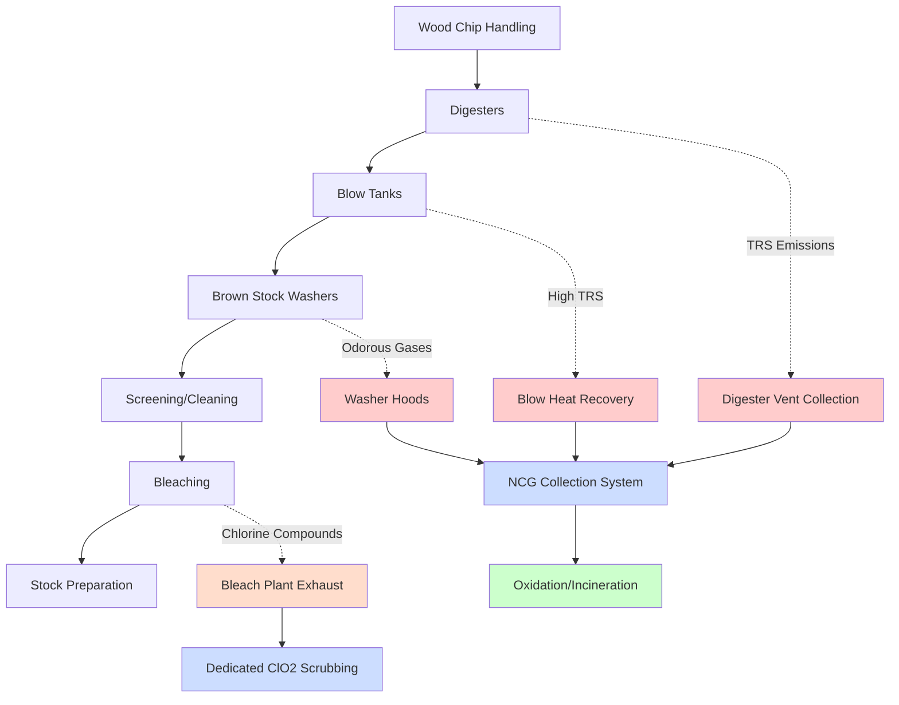
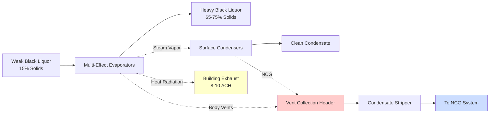
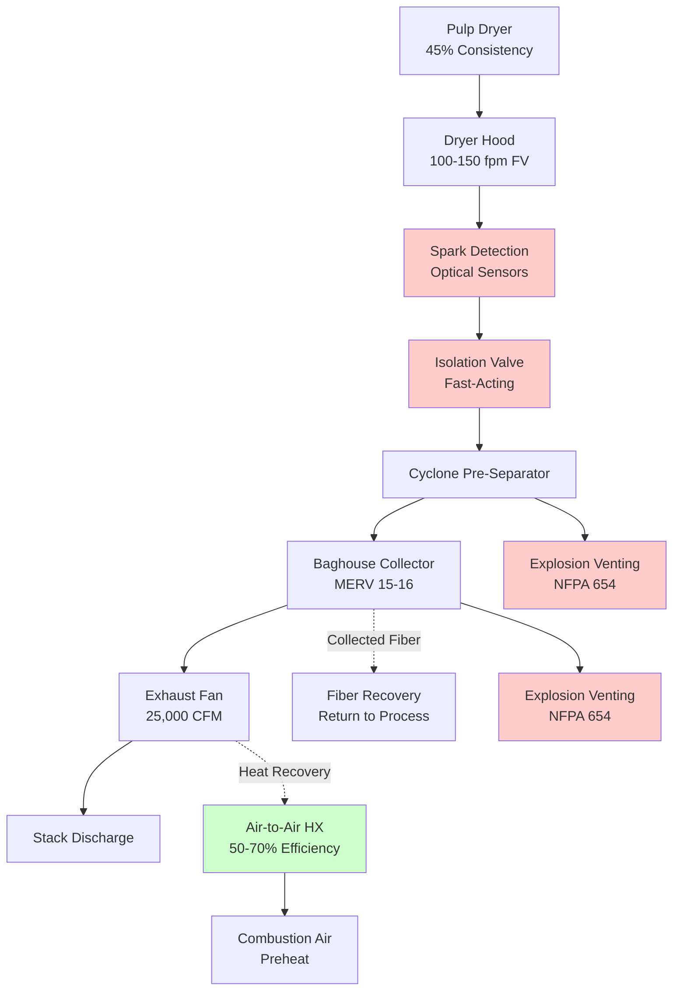

Pulp processing facilities present unique ventilation challenges due to chemical emissions, high moisture loads, corrosive atmospheres, and stringent odor control requirements. Effective ventilation systems must capture reduced sulfur compounds, chlorine dioxide, organic vapors, and particulates while maintaining safe working conditions and regulatory compliance.

## Pulping Process Ventilation Overview

Pulping operations convert wood chips into cellulose fibers through mechanical or chemical processes, each generating distinct contaminants requiring specialized exhaust systems. The primary ventilation concerns involve total reduced sulfur (TRS) compounds in kraft pulping and sulfur dioxide in sulfite processes.

## Chemical Kraft Pulping Ventilation

Kraft pulping uses sodium hydroxide and sodium sulfide to break down lignin at elevated temperatures (160-175°C) and pressures (7-10 bar). The process releases methyl mercaptan, hydrogen sulfide, dimethyl sulfide, and dimethyl disulfide—collectively termed TRS compounds.

**Digester Building Ventilation:**

Continuous digesters and batch digesters require dedicated ventilation capturing emissions during normal operation and relief events. Design criteria include:

- **General ventilation rate:** 10-15 ACH minimum for digester buildings
- **Local exhaust at relief valves:** 500-1000 CFM per relief point
- **Blow tank exhaust:** 2000-4000 CFM capturing flash steam and TRS
- **High-level exhaust intakes:** Position 10-15 feet above floor to capture buoyant TRS gases

Corrosion-resistant construction using FRP, stainless steel (316L minimum), or coated carbon steel withstands acidic condensate and sulfur compound exposure. Duct velocities of 3000-4000 fpm prevent condensation and maintain self-cleaning characteristics.

**Noncondensable Gas (NCG) Collection:**

NCG collection systems gather emissions from multiple sources into a centralized treatment system. Primary NCG sources include:

| Source | Typical Flow Rate | TRS Concentration |
|--------|------------------|-------------------|
| Digester relief and vent | 1000-3000 SCFM | 5000-15000 ppmv |
| Blow tank vent | 2000-5000 SCFM | 2000-8000 ppmv |
| Brown stock washers | 3000-6000 SCFM | 500-2000 ppmv |
| Evaporator vents | 2000-4000 SCFM | 1000-3000 ppmv |

NCG systems operate under slight negative pressure (1-3 inches H₂O) to prevent fugitive emissions while avoiding excessive air infiltration that dilutes the gas stream. Variable-speed induced draft fans accommodate flow variations across the production cycle.

## Chemical Recovery Area Ventilation

Black liquor chemical recovery involves evaporation, combustion, causticizing, and lime kiln operations, each requiring specific ventilation strategies.

**Recovery Boiler Area:**

The recovery boiler burns concentrated black liquor, recovering sodium and sulfur compounds while generating process steam. Ventilation requirements address:

- **Smelt dissolving tank exhaust:** 5000-10,000 CFM capturing TRS and steam
- **Recovery boiler building:** 6-8 ACH for ambient temperature control
- **Emergency relief capacity:** 3-4 times normal ventilation for upset conditions
- **Combustion air preheating:** Recover heat from boiler flue gas using air-to-air heat exchangers

Smelt dissolving tanks represent the highest TRS emission source in recovery areas, requiring dedicated exhaust ducted to the NCG collection system. Explosive hazard analysis per NFPA 69 determines if continuous purge ventilation or explosion venting provisions are necessary.

**Evaporator Building Ventilation:**

Multiple-effect evaporators concentrate black liquor from 15-18% solids to 65-75% solids before combustion. Evaporator body vents release water vapor contaminated with organic compounds and TRS:

- **Condensate stripper vents:** Direct to NCG collection system
- **Flash tank vents:** Scrub or incinerate due to high TRS levels
- **Building ventilation:** 8-10 ACH addressing heat gains from evaporator bodies
- **Supply air tempering:** Maintain 70-80°F working environment despite process heat

Vapor condensers separate clean condensate from noncondensable gases, with proper venting preventing TRS carryover into foul condensate collection systems.

## Bleach Plant Ventilation

Modern pulp bleaching uses elemental chlorine-free (ECF) sequences employing chlorine dioxide, hydrogen peroxide, oxygen, and ozone. Bleach plant ventilation manages highly reactive oxidizing gases requiring separate exhaust systems from TRS-containing streams.

**Chlorine Dioxide Generator Ventilation:**

ClO₂ generators produce explosive mixtures at concentrations above 10% by volume in air, necessitating robust ventilation:

- **Dedicated exhaust system:** Separate from all other mill exhausts
- **Emergency ventilation capacity:** 60 ACH minimum for generator rooms
- **Continuous operation:** No interruption even during generator shutdown
- **Explosion-proof equipment:** Class I, Division 2 electrical classification
- **Caustic scrubbing:** Neutralize ClO₂ in exhaust stream before discharge

Ventilation interlocks prevent generator operation if exhaust airflow drops below setpoint. Backup power for exhaust fans ensures continuous operation during power interruptions.

**Bleaching Tower Ventilation:**

Each bleaching stage generates vapors requiring capture at tower vents, seal tanks, and transfer points:

- **Tower top vents:** 200-500 CFM per tower capturing evolved gases
- **Seal tank vents:** 100-300 CFM preventing fugitive emissions
- **Transfer piping vents:** Size for anticipated flow surges
- **Filtrate tank vents:** Capture aerosols and vapors from washing operations

Vapor collection systems maintain negative pressure of 0.5-2 inches H₂O gauge in equipment headspaces. FRP or PVC ductwork resists chlorine dioxide corrosion, with velocity maintained at 2500-3500 fpm.

**Chlorine Dioxide Scrubbing:**

Unlike TRS compounds amenable to thermal oxidation, chlorine dioxide requires chemical neutralization. Caustic scrubber design parameters:

- **Caustic strength:** 1-2% NaOH solution
- **Liquid-to-gas ratio:** 5-10 gallons per 1000 CFM
- **Scrubber type:** Packed tower or spray chamber
- **Contact time:** 2-4 seconds minimum
- **Removal efficiency:** >99% ClO₂ destruction

Scrubber recirculation pumps and liquid level controls ensure continuous caustic availability. pH monitoring confirms adequate caustic strength for complete ClO₂ neutralization.

## Pulp Dryer Ventilation

Market pulp production requires drying pulp sheets from 45-50% consistency to 8-10% moisture content. Dryer ventilation addresses dust generation, fire hazards, and moisture removal.

**Dryer Hood Exhaust:**

Yankee dryers, fluidized bed dryers, or flash dryers release moisture-laden air containing cellulose fines:

- **Exhaust volume:** 15,000-30,000 CFM per dryer depending on evaporation rate
- **Hood face velocity:** 100-150 fpm for containment without web disturbance
- **Moisture removal:** 2000-4000 lb/hr water vapor per dryer
- **Temperature:** 200-250°F at exhaust point

Energy recovery from dryer exhaust preheats combustion air or building ventilation air. Plate heat exchangers or rotary heat wheels recover 50-70% of available thermal energy.

**Dust Collection and Fire Protection:**

Cellulose dust presents combustible dust hazards requiring protection per NFPA 654:

- **Dust collector:** Baghouse or cyclone removing particles before exhaust fan
- **Explosion venting:** Size per Kst value for cellulose (150-200 bar-m/s)
- **Deflagration isolation:** Mechanical or chemical isolation between dryer and collector
- **Spark detection:** Optical sensors triggering water spray suppression
- **Grounding:** All ductwork and equipment properly bonded

Minimum transport velocity of 4000-4500 fpm in ductwork prevents fiber accumulation. Regular inspection and cleaning maintains fire safety integrity.

## Odor Control Technologies

TRS emissions require treatment before atmospheric discharge to meet odor threshold limits (typically 5-10 ppb hydrogen sulfide equivalent).

**Thermal Oxidation:**

High-temperature oxidation converts TRS compounds to sulfur dioxide, subsequently scrubbed in chemical absorbers:

- **Oxidation temperature:** 1200-1400°F for complete conversion
- **Residence time:** 0.5-1.0 seconds minimum
- **Destruction efficiency:** >99% for TRS compounds
- **Heat recovery:** Generate steam or preheat combustion air

Thermal oxidizers operate continuously due to long thermal mass stabilization times. Auxiliary fuel maintains temperature during low NCG generation periods.

**Catalytic Oxidation:**

Lower temperature oxidation (500-700°F) using noble metal catalysts reduces fuel consumption:

- **Catalyst type:** Platinum or palladium on ceramic substrate
- **Space velocity:** 10,000-20,000 hr⁻¹
- **Catalyst life:** 3-5 years with proper operation
- **Preheating required:** Bring gas stream to reaction temperature

Catalyst poisoning by sulfur compounds necessitates periodic regeneration or replacement. Pressure drop monitoring indicates catalyst fouling requiring maintenance.

**Wet Scrubbing:**

Chemical scrubbing using sodium hydroxide or sodium hypochlorite oxidizes TRS compounds to sulfate:

- **Scrubber type:** Packed tower or venturi scrubber
- **Chemical dosing:** Maintain pH 9-11 for optimal oxidation
- **L/G ratio:** 15-30 gallons per 1000 CFM depending on inlet concentration
- **Removal efficiency:** 95-99% for hydrogen sulfide, variable for organic sulfides

Scrubber blowdown requires treatment before discharge due to sulfate and residual sulfide content. Ion exchange or biological treatment reduces environmental impact.

## Ventilation System Materials

Corrosive atmospheres in pulp processing demand appropriate material selection:

**Ductwork Materials:**

- **FRP (fiberglass-reinforced plastic):** Excellent acid and TRS resistance, lightweight
- **316L stainless steel:** High corrosion resistance, suitable for hot, acidic conditions
- **PVC or CPVC:** Chlorine dioxide service in bleach plants
- **Coated carbon steel:** Economical for less aggressive applications

**Fan Construction:**

- **FRP construction:** Wheel, housing, and shaft for corrosive gas streams
- **Coated cast iron:** Heavy-duty applications with proper coating maintenance
- **Stainless steel:** High-temperature or high-particulate loading service
- **Explosion-proof motors:** Classified area installations per NEC Article 500

## Monitoring and Control

Continuous emissions monitoring ensures regulatory compliance and system performance:

- **TRS analyzers:** Total reduced sulfur monitoring at stack discharge
- **ClO₂ monitors:** Bleach plant area monitors with alarm setpoints at 0.1 ppm
- **SO₂ monitors:** Recovery boiler and oxidizer discharge monitoring
- **Airflow monitoring:** Pitot tube or thermal mass flow meters at key points
- **Building differential pressure:** Ensure negative pressure relative to outdoors

Control systems integrate ventilation with process operations, adjusting exhaust volumes based on digester cooking schedules, evaporator loads, and bleach plant production rates. Variable-speed fan drives optimize energy consumption while maintaining capture effectiveness.

## Regulatory Considerations

Pulp mill ventilation systems must comply with multiple regulatory frameworks:

- **EPA Maximum Achievable Control Technology (MACT):** Subpart S and MM emission limits
- **State air quality permits:** Facility-specific emission limits and monitoring requirements
- **OSHA 29 CFR 1910.1000:** Occupational exposure limits for H₂S (10 ppm TWA, 15 ppm STTL)
- **NFPA codes:** Fire protection (NFPA 654) and hazardous locations (NFPA 497)

Best Available Control Technology (BACT) determinations increasingly require thermal oxidation or equivalent odor control for TRS emissions. Ambient air quality modeling demonstrates compliance with off-site odor impact criteria.

## Energy Recovery Integration

Pulp processing ventilation systems offer substantial energy recovery opportunities:

**Heat Recovery Applications:**

| Source | Temperature | Recovery Potential | End Use |
|--------|-------------|-------------------|---------|
| Dryer exhaust | 200-250°F | 40-60 MMBtu/hr | Combustion air preheat, building heat |
| Digester blow steam | 280-320°F | 80-120 MMBtu/hr | Black liquor evaporators, process heat |
| Recovery boiler flue gas | 300-400°F | 100-150 MMBtu/hr | Combustion air preheat, water heating |

Heat recovery systems integrate with mill-wide steam and hot water distribution. Payback periods of 1-3 years justify capital investment in recovery equipment.

## Conclusion

Pulp processing ventilation systems represent complex, integrated designs balancing worker safety, environmental compliance, and energy efficiency. Effective capture of TRS emissions, proper treatment of chlorine compounds, and robust odor control require specialized engineering knowledge and materials selection. Modern systems incorporate continuous monitoring, automated controls, and energy recovery to optimize performance while meeting increasingly stringent regulatory requirements. Success demands understanding of both pulping chemistry and industrial ventilation fundamentals applied through rigorous design methodology following ACGIH, EPA, and industry-specific guidelines.
