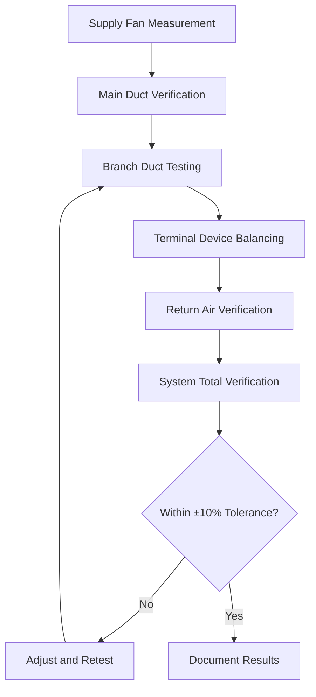
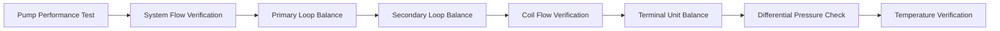

# Testing, Adjusting, and Balancing Process

Testing, adjusting, and balancing (TAB) represents the systematic process of verifying and documenting HVAC system performance to ensure designed conditions are achieved. This critical phase bridges design intent and operational reality, establishing baseline performance metrics essential for long-term system efficiency.

## TAB Fundamentals

The TAB process encompasses three distinct phases:

**Testing** involves measurement and documentation of system parameters using calibrated instruments. Air systems require measurements of flow rates, static pressures, and temperature differentials. Hydronic systems demand flow rate verification, differential pressure measurement, and temperature analysis across coils and equipment.

**Adjusting** modifies system components to achieve design specifications. Air-side adjustments include damper positioning, fan speed modification, and duct static pressure optimization. Water-side adjustments involve balancing valve manipulation, pump speed adjustment, and system pressure regulation.

**Balancing** achieves proportional distribution of air or water throughout the system according to design requirements. The process follows a systematic approach from the distribution source to terminal devices, ensuring each branch receives its designated flow.

## Air System Balancing Procedures

Air balancing follows the proportional balancing method, working from the air handling unit outward to terminal devices.

### Measurement Hierarchy

**Initial Setup Requirements:**

- Verify all dampers are accessible and operational
- Confirm filter installation and cleanliness
- Check fan rotation and motor amperage
- Measure system static pressure at design locations
- Verify control system operation in occupied mode

**Balancing Sequence:**

1. Measure total system airflow at the air handling unit using pitot tube traverse or calibrated flow stations
2. Establish proper fan operating point by adjusting speed or inlet vanes to achieve design static pressure
3. Measure and record all branch duct flows, identifying high and low flow conditions
4. Begin proportional balancing at branch furthest from fan, setting dampers to reduce flow to design values
5. Progress systematically through all branches, maintaining constant fan operation
6. Verify terminal device flows meet specifications within ±10% tolerance
7. Recheck total system flow and adjust fan as necessary

The process requires multiple iterations as adjustments in one branch affect flows throughout the system. Static pressure readings at key locations guide the balancing process and identify restriction points.

## Hydronic System Balancing

Water balancing demands precise flow measurement and careful pressure analysis to prevent pump cavitation and ensure proper heat transfer.

**Critical Measurement Points:**

- Pump discharge and suction pressures
- Flow rates at balancing valve stations
- Temperature differential across heat exchangers
- System fill pressure and expansion tank pre-charge
- Differential pressure across coils and heat exchangers

**Balancing valve positioning** follows manufacturer's Cv curves, calculating flow based on measured pressure drops. The relationship Q = Cv√(ΔP/SG) determines flow rate where Q represents flow in GPM, Cv is the valve coefficient, ΔP equals differential pressure in PSI, and SG denotes specific gravity.

**Temperature-based verification** confirms proper flow through coils. Design temperature differential (ΔT) relates to flow through Q = (BTU/hr) / (500 × ΔT) for water systems. Measured ΔT significantly lower than design indicates excessive flow; higher ΔT indicates insufficient flow.

## Commissioning Integration

TAB forms the functional performance verification phase of building commissioning, providing quantitative data confirming system operation meets design intent.

**Pre-Functional Checklists** completed before TAB include:

- Equipment installation verification against specifications
- Electrical connections and safety interlocks tested
- Control sequences programmed and preliminarily tested
- Duct and pipe system pressure tests completed
- System flushing and cleaning verified

**Functional Performance Testing** builds upon TAB results, verifying:

- System response to varying loads
- Control sequence operation under actual conditions
- Energy recovery system performance
- Economizer functionality and changeover points
- Safety system operation and alarm verification

## Documentation Requirements

Complete TAB reports document system performance and provide operational baselines. ASHRAE Standard 111 and industry standards (NEBB, AABC, TABB) specify minimum documentation requirements.

**Essential Report Components:**

- Instrument calibration certificates (annual certification required)
- Design airflow and water flow summaries
- Measured values with percentage variance from design
- Equipment nameplate data and operational parameters
- Deficiency reports identifying non-conformance issues
- Recommended corrective actions
- As-built system modifications affecting performance

**Field Data Sheets** record:

- Terminal device designation and location
- Design versus measured flows
- Damper and valve positions
- Static pressure readings at measurement points
- Water temperatures and differential pressures

## Certification Standards

Three primary organizations establish TAB certification standards:

**NEBB (National Environmental Balancing Bureau)** emphasizes procedural standardization and technician certification through comprehensive examination and experience requirements. NEBB Procedural Standards provide detailed testing methodologies.

**AABC (Associated Air Balance Council)** focuses on organizational certification, requiring company-wide quality systems and personnel training programs. AABC National Standards establish minimum performance criteria.

**TABB (Testing, Adjusting and Balancing Bureau)** affiliated with SMACNA, provides certification combining individual technician qualification with company accreditation.

All certification bodies require annual instrument calibration to NIST-traceable standards, maintaining measurement accuracy within specified tolerances (typically ±2% for airflow, ±0.5% for temperature).

## Performance Verification Tolerances

Industry standards establish acceptable variance between design and measured values:

| System Component | Acceptable Tolerance |
|-----------------|---------------------|
| Total system airflow | ±10% |
| Branch airflow | ±10% |
| Terminal device airflow | ±10% |
| Hydronic flow (individual circuits) | ±10% |
| Temperature differential | ±1°F |
| Static pressure | ±0.03 in. w.g. |

Values exceeding tolerances require investigation and correction. Common causes include undersized ductwork, excessive system resistance, improper equipment selection, or installation deficiencies.

The TAB process provides essential verification that designed systems perform as intended, establishing operational baselines for future troubleshooting and optimization. Proper execution requires trained personnel, calibrated instruments, and systematic adherence to established procedures, ensuring building systems achieve their performance objectives efficiently and reliably.
