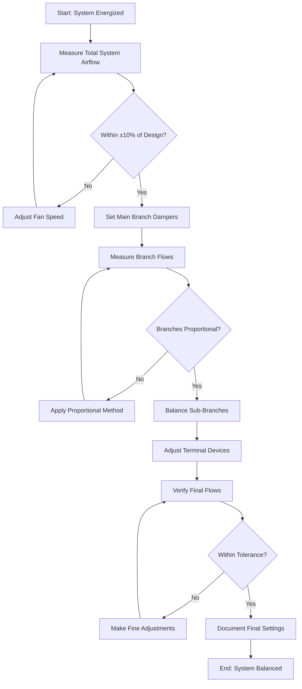
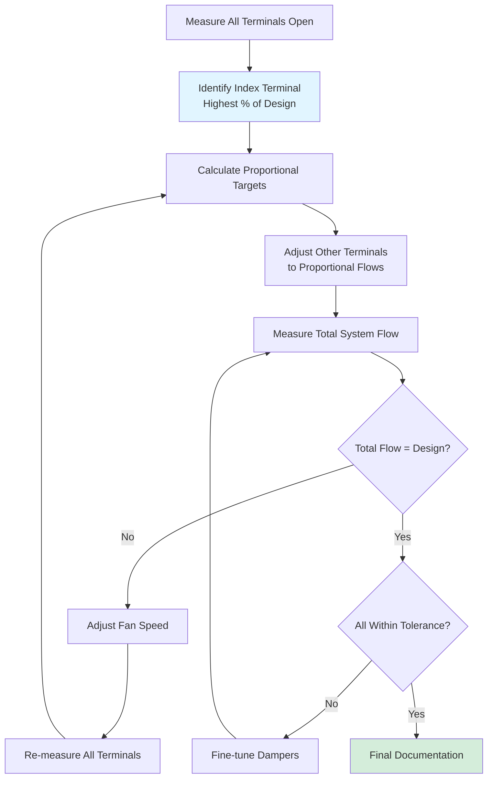

## Overview

System adjustments represent the core execution phase of air system testing and balancing. This process involves systematic manipulation of dampers, fan speeds, and airflow distribution to achieve design conditions within acceptable tolerances. Proper adjustment procedures ensure energy-efficient operation while meeting ventilation and comfort requirements.

## Fundamental Balancing Strategy

The adjustment process follows a hierarchical approach working from the air handling equipment outward to terminal devices. This strategy minimizes repetitive adjustments and reduces overall balancing time.

**Adjustment sequence:**
1. Verify and set total system airflow at the fan
2. Balance main duct branches to design proportions
3. Adjust sub-branches to specified ratios
4. Fine-tune terminal devices to final setpoints
5. Verify system stability and document final conditions

## Fan Speed Adjustment

Fan speed adjustment establishes the total system airflow capacity. This primary adjustment should be completed before any damper balancing begins.

**Variable frequency drive (VFD) adjustment:**
- Adjust frequency in 2-5 Hz increments
- Allow system stabilization (30-60 seconds) between changes
- Document Hz, amperage, and static pressure at final setting
- Verify motor current remains within nameplate rating

**Sheave adjustment (belt-drive systems):**
- Calculate required RPM change: RPM₂ = RPM₁ × (CFM₂/CFM₁)
- Measure and record existing sheave settings before adjustment
- Maintain proper belt tension after sheave repositioning
- Check belt alignment and bearing condition

**Performance verification:**
- Total airflow should be set to 100-105% of design to allow damper authority
- Measure static pressure at multiple points to verify system curve
- Confirm absence of surge or stall conditions at operating point

## Damper Adjustment Principles

Dampers provide the primary means of airflow distribution control. Proper damper selection and positioning are critical to achieving balanced conditions without excessive pressure loss.

**Damper authority:**

The ratio of pressure drop across a damper to total system pressure determines control effectiveness. Minimum damper authority of 0.25 (25%) is required for adequate control.

Authority = ΔP_damper / ΔP_total

**Adjustment guidelines:**
- Begin with all balancing dampers fully open
- Use dampers closest to terminals for final adjustment
- Avoid closing dampers more than 75% (excessive pressure loss)
- Position opposed-blade dampers for better control linearity
- Document damper positions as percentage open or number of turns

## Stepwise Proportional Balancing Method

The stepwise proportional method represents the most efficient approach for multi-outlet systems. This technique minimizes the number of adjustment iterations required to achieve balanced conditions.

### Proportional Balancing Procedure

**Initial measurements:**
1. Record airflow at all terminals with dampers fully open
2. Calculate total measured flow
3. Determine proportional flow ratios for each terminal

**First balance iteration:**
1. Identify terminal with highest percentage of design flow
2. Leave this terminal damper fully open (index terminal)
3. Calculate target flows for remaining terminals proportional to index terminal
4. Adjust all other dampers to achieve proportional targets

**Subsequent iterations:**
1. Re-measure all terminal flows
2. Calculate new proportional targets if total system flow changed
3. Adjust dampers maintaining proportional relationships
4. Repeat until all terminals within tolerance

### Proportional Calculation Example

For a system with three terminals:

| Terminal | Design CFM | Measured CFM (Open) | % of Design |
|----------|------------|---------------------|-------------|
| A        | 500        | 575                 | 115%        |
| B        | 400        | 425                 | 106%        |
| C        | 300        | 280                 | 93%         |

**Analysis:**
- Terminal A has highest percentage (115%) → becomes index terminal
- Total design = 1,200 CFM; Total measured = 1,280 CFM
- System delivers 107% of design (acceptable before damper adjustment)

**Proportional targets:**
- Terminal A: 575 CFM (damper remains fully open)
- Terminal B: 575 × (400/500) = 460 CFM
- Terminal C: 575 × (300/500) = 345 CFM

After adjusting B and C to proportional targets, re-measure total flow. If total exceeds design, reduce fan speed and repeat proportional adjustments.

## Balancing Tolerances

Industry standards establish acceptable deviation ranges for air system balancing. These tolerances recognize practical limitations of measurement accuracy and system stability.

**AABC tolerance standards:**
- Total system airflow: ±10% of design
- Individual terminal devices ≥100 CFM: ±10% of design
- Individual terminal devices <100 CFM: ±0.01 CFM/ft² served
- Main supply and return fans: ±5% of design
- Diversity systems: ±5% of calculated diversity flow

**NEBB tolerance standards:**
- Supply, return, and exhaust fans: ±10% of design CFM
- Air outlets and inlets: ±10% of design CFM for flow ≥100 CFM
- Air outlets and inlets: ±10 CFM for flow <100 CFM
- Branch ducts: ±10% of design CFM
- Total outdoor air: ±10% of design CFM

**Tolerance considerations:**
- Tighter tolerances may be specified for critical applications (laboratories, healthcare)
- Document exceedances and obtain design professional approval for variances
- Consider cumulative effect of multiple terminals at tolerance limits
- Static pressure readings typically ±0.05 in. w.g. accuracy

## Sequential Balancing for Complex Systems

Large systems with multiple air handlers require coordinated balancing sequences to maintain proper pressure relationships.

**Multi-zone system approach:**
1. Balance primary air handler to design total flow
2. Establish proper zone supply flows with zone dampers
3. Balance terminals within each zone to design distribution
4. Verify return and exhaust systems maintain proper building pressurization
5. Test diversity and economizer sequences under various conditions

**Pressure-dependent vs. pressure-independent:**
- Pressure-dependent terminals require iterative balancing as system conditions change
- Pressure-independent terminals (VAV with flow measurement) self-compensate
- Hybrid systems require balancing at design conditions with verification at part-load

## Documentation Requirements

Comprehensive documentation provides verification of completed work and baseline data for future system evaluation.

**Required documentation per AABC/NEBB:**
- Complete instrument calibration records
- Initial and final readings for all measurement points
- Damper positions and fan speed settings
- Calculated results and percentage of design values
- Deficiency reports and resolution documentation
- Schematic diagrams with measurement locations
- Test and balance certification signature and seal

## System Stability Verification

Final verification ensures the balanced system maintains stable operation across expected operating conditions.

**Stability tests:**
- Operate system continuously for minimum 15 minutes at design conditions
- Verify flows remain within tolerance during stabilization period
- Test control sequences (occupied/unoccupied, economizer modes)
- Document any drift or hunting behavior requiring control adjustment

**Post-balancing checkout:**
- Verify all access panels secured and insulation replaced
- Confirm damper locking mechanisms engaged
- Test and document all control sequences
- Provide preliminary performance data to commissioning team

## Conclusion

Systematic application of proportional balancing methods combined with proper fan speed adjustment produces efficient, stable air distribution systems. Adherence to AABC and NEBB procedural standards ensures consistent, verifiable results that meet design intent while maintaining energy efficiency. Proper documentation provides essential baseline data for ongoing system performance verification and optimization throughout the building lifecycle.
