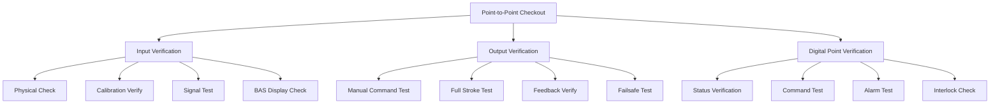
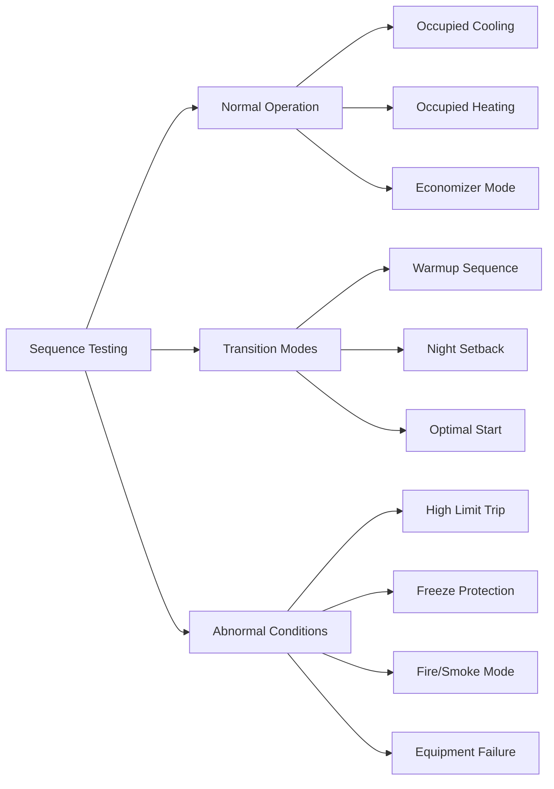

Control system verification constitutes a critical phase of HVAC commissioning, ensuring that building automation systems (BAS) and direct digital control (DDC) systems operate according to design intent and sequence of operations. This process encompasses hardware checkout, software verification, point-to-point testing, and functional performance validation.

## Point-to-Point Checkout

Point-to-point verification confirms the physical and logical connections between field devices and control system interfaces. This systematic process validates each input and output point in the control system.

### Hardware Verification Procedures

**Input Point Verification:**
- Verify physical sensor installation and location
- Confirm calibration and range settings match specifications
- Apply known signal or physical stimulus to sensor
- Verify signal appears correctly at controller and BAS workstation
- Document point address, location, and calibration data

**Output Point Verification:**
- Manually command actuators through full range of travel
- Verify actuator response matches commanded position
- Confirm feedback signals where applicable
- Test failsafe positions upon loss of control signal
- Verify interlocks prevent conflicting operations

**Digital Point Verification:**
- Verify status points reflect actual field device state
- Test binary commands produce expected field device response
- Confirm alarm points trigger at correct setpoints
- Validate enable/disable functions operate correctly

## Sequence of Operations Testing

Sequence testing validates that control logic executes as specified in the design documents. ASHRAE Guideline 36 provides standardized sequences for high-performance HVAC systems.

### Testing Methodology

**Mode Verification:**
- Occupied mode operation and setpoints
- Unoccupied mode setback/setup temperatures
- Warm-up and cool-down optimization sequences
- Morning start time calculations
- Holiday and special event schedules

**Control Loop Testing:**
- Proportional-integral-derivative (PID) tuning verification
- Setpoint tracking and response time
- Dead band and throttling range confirmation
- Reset schedules (supply air, chilled water, hot water)
- Cascade control loop coordination

**Safety and Limit Controls:**
- High/low temperature limit responses
- Freeze protection sequences
- Smoke control mode activation
- Emergency shutdown sequences
- Equipment lockout and time delays

### ASHRAE Guideline 36 Compliance

Guideline 36 sequences emphasize:
- Separate minimum outdoor air and economizer damper control
- Trim and respond logic for supply air temperature reset
- Dual maximum logic for zone heating/cooling
- Demand-controlled ventilation with CO₂ monitoring
- Optimal start/stop algorithms

## Trend Logging and Performance Verification

Trend data collection provides empirical evidence of system performance over time, revealing operational issues not apparent during spot checks.

### Critical Trending Points

**Air Handling Unit Trends:**
- Mixed air, supply air, return air temperatures
- Outdoor air temperature and enthalpy
- Discharge air temperature setpoint and reset
- Damper positions (outdoor, return, exhaust)
- Heating and cooling valve positions
- Supply and return fan status, speed, current
- Static pressure setpoints and actual values
- Filter differential pressure

**Hydronic System Trends:**
- Supply and return water temperatures
- Flow rates and differential pressure
- Valve positions at representative zones
- Pump status, speed, and power consumption
- System pressure and makeup water flow

**Zone-Level Trends:**
- Space temperature and setpoint
- Discharge air temperature (VAV terminals)
- Damper/valve position
- Occupancy status
- CO₂ concentration (demand-controlled ventilation)

### Trend Analysis Methodology

Establish appropriate trending intervals:
- Fast-changing points (dampers, valve positions): 1-5 minute intervals
- Moderate-rate points (temperatures, pressures): 5-15 minute intervals
- Slow-changing points (energy totals): 15-60 minute intervals

Minimum trend duration: 72 hours of continuous operation including occupied and unoccupied periods, preferably during design load conditions.

## Functional Performance Testing

Functional tests simulate actual operating conditions to verify integrated system performance.

### Test Execution Protocol

1. **Pre-functional checks:** Verify all point-to-point tests complete, sequences programmed correctly
2. **Initial conditions:** Document starting system state, weather conditions, building occupancy
3. **Induced conditions:** Simulate design day conditions where possible (adjust setpoints, modify inputs)
4. **Response measurement:** Record system response to changing conditions
5. **Performance evaluation:** Compare actual performance to design intent criteria
6. **Deficiency documentation:** Record failures, discrepancies, or performance shortfalls

### Common Functional Tests

**Economizer Operation:**
- Verify integrated economizer control across temperature and enthalpy thresholds
- Confirm proper damper modulation and lockouts
- Test high-limit shutoff functionality

**Zone Temperature Control:**
- Verify space temperature maintained within deadband
- Confirm proper staging of heating and cooling
- Test reset schedules under varying loads

**Demand Response:**
- Verify load shed strategies execute correctly
- Confirm critical loads maintain service
- Test automatic restoration after demand event

## Documentation Requirements

Comprehensive documentation includes:
- Point-to-point checkout sheets with as-found and as-left values
- Sequence test results with pass/fail criteria
- Trend logs with analysis and findings
- Functional test reports with performance data
- Deficiency logs and resolution tracking
- Final commissioning report per ASHRAE Guideline 0 or Guideline 1.1

Proper control system verification ensures HVAC systems deliver design performance, energy efficiency, and occupant comfort throughout the building lifecycle.
