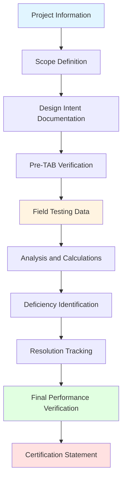
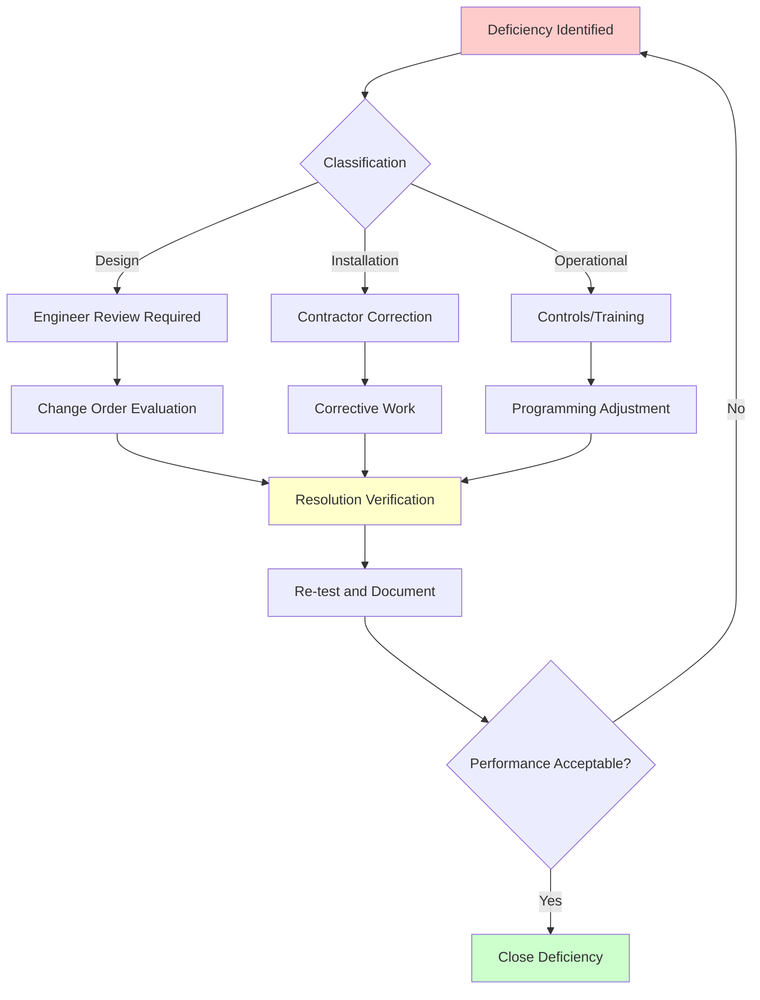

Testing, adjusting, and balancing documentation serves as the permanent record of HVAC system performance verification, establishing baseline operational parameters essential for facility management, troubleshooting, and future system modifications. Proper documentation validates that installed systems meet design specifications and provides the foundation for commissioning deliverables.

## TAB Report Structure and Components

Industry standards established by AABC, NEBB, and TABB define comprehensive reporting requirements that ensure consistency, traceability, and professional accountability. Complete TAB reports contain standardized sections addressing equipment data, test procedures, measured results, and system deficiencies.

**Essential Report Sections:**

**Executive Summary** provides project overview, scope of work, completion date, and certification statement. This section identifies the certifying organization, lists certified personnel who performed the work, and confirms instrument calibration status.

**Instrument Calibration Documentation** includes certificates for all measuring devices used during testing. NIST-traceable calibration performed within 12 months of test date is mandatory. Documentation specifies instrument manufacturer, model, serial number, calibration date, and accuracy tolerances.

**Design Data Summary** presents intended operating parameters from mechanical drawings and specifications. Tables list design airflows, water flows, temperatures, pressures, and equipment capacities for comparison with measured values.

**Field Measurement Data** constitutes the core technical content, documenting all readings taken during the balancing process. Data sheets record terminal device flows, duct traverse measurements, pump performance, system pressures, temperatures, and equipment operating conditions.

**Deficiency Reports** identify conditions preventing achievement of design performance. Each deficiency includes description, location, responsible party, recommended corrective action, and resolution status.

**System Diagrams** marked with final damper positions, valve settings, and equipment operating points provide visual documentation of balanced system configuration.

## AABC Documentation Standards

Associated Air Balance Council National Standards define documentation requirements emphasizing quality systems and organizational certification. AABC reports follow standardized formats ensuring uniformity across certified firms.

**AABC Report Requirements:**

- **Equipment Schedules:** Complete manufacturer data for all tested equipment including model numbers, serial numbers, electrical characteristics, and nameplate ratings
- **Air Handling System Data:** Fan performance curves showing actual operating point, motor nameplate data, drive information, and measured electrical values
- **Terminal Device Summary:** Design versus measured flows for all diffusers, grilles, registers, and VAV terminals with percentage variance
- **Hydronic System Data:** Pump curves with operating point, flow rates, differential pressures, and temperature measurements
- **Sound and Vibration Levels:** When specified, documentation of measured noise levels and vibration amplitudes

**AABC Certification Statement** signed by certified technician and company representative verifies work performed in accordance with National Standards and confirms systems are balanced to specified tolerances.

## NEBB Procedural Standards Documentation

National Environmental Balancing Bureau Procedural Standards emphasize detailed methodology documentation and individual technician certification. NEBB reports demonstrate technical rigor through comprehensive test procedure descriptions.

**NEBB Documentation Framework:**

**NEBB Specific Requirements:**

- **Test Procedures Description:** Detailed explanation of methods used for each system type including traverse patterns, measurement locations, and calculation procedures
- **Correction Factors:** Documentation of altitude, temperature, and density corrections applied to measurements
- **System Effect Documentation:** Analysis of inlet and outlet conditions affecting fan performance, including system effect factors
- **Diversity Calculations:** For VAV systems, documentation of peak zone loads, diversity factors, and system sizing verification

**NEBB Supervisory Certification** requires certified supervisor review and signature confirming work meets Procedural Standards requirements.

## TABB Documentation Protocol

Testing, Adjusting and Balancing Bureau, affiliated with SMACNA, combines individual and company certification with emphasis on practical field documentation.

**TABB Report Elements:**

- **Building Description:** Facility type, gross area, occupancy classification, and HVAC system types
- **Equipment Inventory:** Complete list of all equipment tested including locations and equipment tags matching control drawings
- **Sequence of Operations Summary:** Documentation of control system programming affecting TAB procedures
- **Testing Limitations:** Identification of seasonal constraints, incomplete construction, or other factors affecting test scope

TABB standards require documentation of preliminary test conditions, including filter status, control system operation mode, and building occupancy during testing.

## ASHRAE Guideline 1.4 Integration

ASHRAE Guideline 1.4, "Procedures for Preparing Operations and Maintenance Documentation for Building Systems," establishes the framework for integrating TAB reports into comprehensive commissioning deliverables.

**Commissioning Documentation Hierarchy:**

**TAB Report Integration Points:**

TAB data provides baseline performance metrics referenced during functional performance testing. Measured airflows, water flows, and system pressures establish expected operating ranges for control sequences. Deficiency resolution tracking links TAB findings to punch list completion and final commissioning acceptance.

**Systems Manual Content Derived from TAB:**

- Equipment operating data at design conditions
- System air and water flow distribution diagrams
- Balancing valve and damper position documentation
- Seasonal adjustment guidance based on design day conditions
- Performance benchmarks for future re-commissioning

## Field Data Sheet Standards

Standardized data sheets ensure consistent documentation across projects and facilitate data review. Industry organizations provide template forms customized for specific equipment types.

**Air System Data Sheets Include:**

| Data Element | Recording Requirement |
|--------------|----------------------|
| Terminal ID | Per contract documents |
| Room/Zone designation | Building location |
| Design airflow | From specifications |
| Measured airflow (initial) | Before balancing |
| Measured airflow (final) | After balancing |
| Percentage variance | Calculated value |
| Damper position | Open/closed/percentage |
| Static pressure | At measurement point |

**Hydronic System Data Sheets Include:**

| Data Element | Recording Requirement |
|--------------|----------------------|
| Equipment tag | Per P&ID |
| Design flow rate | GPM from drawings |
| Measured flow rate | GPM calculated |
| Design ΔT | From specifications |
| Measured ΔT | Supply-return temperature |
| Differential pressure | Across balancing valve |
| Valve position | Turns open |
| Supply/return temperatures | Actual measured |

**Electronic Data Collection** using tablet-based applications streamlines field documentation, enabling real-time calculations, automatic variance identification, and immediate deficiency flagging. Digital systems maintain data integrity and facilitate rapid report generation.

## Deficiency Documentation and Resolution

Systematic deficiency identification and tracking ensures all performance-limiting conditions are addressed before final acceptance.

**Deficiency Classification:**

**Design Deficiencies** involve specifications inadequate for achieving desired performance. Examples include undersized ductwork, insufficient system pressure capabilities, or equipment capacity shortfalls. Resolution requires design team review and potential modification authorization.

**Installation Deficiencies** result from construction not conforming to approved documents. Missing dampers, incorrect equipment installation, or improper duct fabrication require contractor correction before final balancing.

**Operational Deficiencies** involve control programming, equipment settings, or operational procedures preventing design performance achievement. Resolution involves controls contractor adjustment or owner training.

**Deficiency Report Format:**

Each deficiency entry documents discovery date, description, responsible party notified, proposed resolution, completion date, and verification results.

## Quality Assurance and Certification

Certification bodies mandate quality assurance procedures ensuring report accuracy and professional standards compliance.

**Required QA Elements:**

- **Peer Review:** Second certified technician verifies calculations and reviews data consistency
- **Supervisory Approval:** Certified supervisor confirms methodology compliance and result reasonableness
- **Instrument Calibration Verification:** Quality manager confirms all instruments hold valid calibration certificates
- **Completeness Check:** Administrative review ensures all required sections, signatures, and data sheets are included

**Certification Statement Components:**

The certification statement represents professional affirmation that testing was performed according to industry standards and systems meet specified tolerances. The statement identifies:

- Certifying organization (AABC, NEBB, or TABB)
- Certification number and expiration date
- Certified personnel performing work
- Standards followed during testing
- System acceptance confirmation or exceptions

## Digital Documentation and BIM Integration

Modern TAB documentation increasingly interfaces with Building Information Modeling platforms and computerized maintenance management systems.

**BIM Integration Benefits:**

- Equipment tags linked between 3D model and TAB reports
- Spatial location documentation for future access
- Performance data embedded in equipment objects
- System diagrams generated from coordinated models

**CMMS Data Transfer** enables facility management systems to import baseline performance data, creating automatic alert thresholds when measured parameters deviate from TAB-established norms.

**Long-term Value:** Properly executed TAB documentation provides facility operators with essential system performance baselines, troubleshooting references, and re-commissioning starting points. Reports serve as primary technical references throughout building operational life, justifying investment in thorough, standards-compliant documentation practices.

TAB documentation excellence requires technical competence, attention to detail, and adherence to established industry standards. Reports must withstand scrutiny from engineers, commissioning authorities, and facility managers while serving as permanent performance verification records. Professional certification and standardized formats ensure documentation quality and industry-wide consistency.
