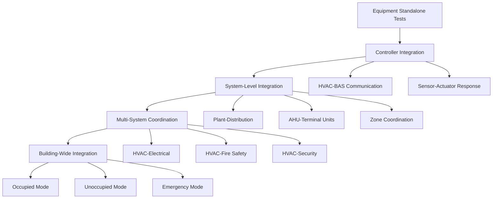
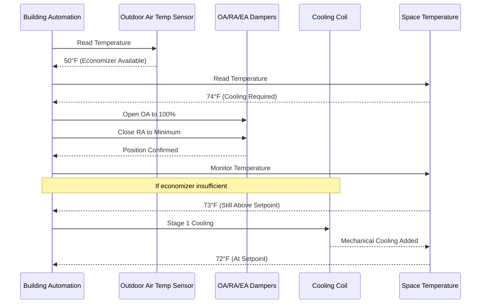
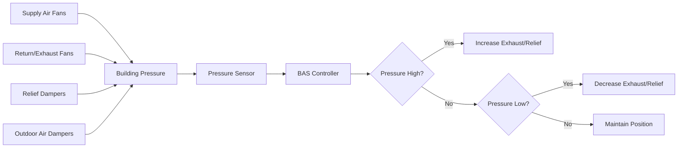
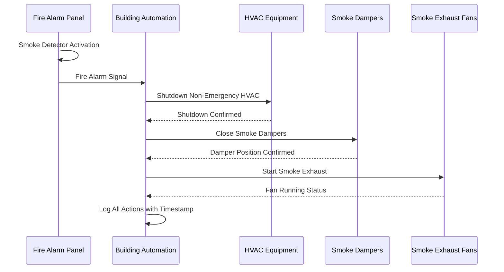

System integration tests verify coordinated operation across HVAC equipment, building automation controls, electrical power systems, and life safety components. Integration testing distinguishes itself from individual equipment tests by evaluating system-level responses, control interactions, and performance under dynamic building conditions per ASHRAE Guideline 0 commissioning protocols.

## Integration Test Hierarchy

Integration testing follows a structured sequence from component-level verification through full building system coordination:

## Economizer Functionality Test

Economizer integration testing verifies outdoor air damper modulation coordinates properly with mechanical cooling stages, minimum ventilation requirements, and space temperature control.

### Test Sequence Protocol

**Economizer Test Procedure:**

1. Set outdoor air temperature simulation to 45°F, space to occupied cooling mode
2. Command space temperature setpoint to 68°F
3. Verify outdoor air damper modulates to 100% open position
4. Confirm return air damper closes to minimum position (never fully closed)
5. Monitor mixed air temperature equals outdoor air temperature ±2°F
6. Incrementally increase outdoor air temperature: 50°F, 55°F, 60°F, 65°F, 70°F
7. Record damper positions at each step
8. Verify mechanical cooling stages only after economizer reaches maximum capacity
9. Test high limit shutoff: increase OA temperature to 75°F, confirm economizer lockout
10. Verify return to minimum outdoor air position during economizer lockout

**Acceptance Criteria:**

- Damper position correlates with outdoor air temperature per control sequence
- No simultaneous economizer cooling and first stage mechanical cooling
- Minimum outdoor air maintained at all operating conditions
- Mixed air temperature controlled to prevent coil freeze-up

## Demand Controlled Ventilation Test

DCV integration verifies CO₂ sensors modulate outdoor air dampers while maintaining minimum code-required ventilation and coordinating with economizer operation.

### Test Implementation

1. Establish baseline: occupied mode with design occupancy load
2. Record CO₂ levels at design conditions (typically 800-1000 ppm)
3. Reduce occupancy or simulate reduced CO₂ generation
4. Verify outdoor air damper modulates toward minimum position
5. Confirm minimum outdoor air never violated (per ASHRAE 62.1 calculations)
6. Increase occupancy or inject CO₂ to simulate high occupancy
7. Verify outdoor air damper opens to increase ventilation
8. Test interaction: enable economizer mode during DCV operation
9. Confirm economizer overrides DCV when free cooling available

**Critical Coordination:**

- DCV minimum position must equal ASHRAE 62.1 minimum outdoor air requirement
- Economizer operation takes precedence over DCV damper positioning
- Multiple zones require ventilation efficiency calculations per ASHRAE 62.1-2019 Appendix A

## Building Pressurization Test

Pressurization testing validates the coordinated control of supply air, return air, and relief air systems to maintain design building pressure relationships.

### Pressure Control Integration

**Test Procedure:**

1. Verify all air systems operating in occupied mode
2. Measure building pressure at representative locations (typically 5-10 points)
3. Record baseline pressure differential: typically +0.02 to +0.05 in. w.c. positive
4. Close exterior doors, disable relief dampers (one modification at a time)
5. Monitor pressure response, verify relief damper modulates to control pressure
6. Simulate high exhaust condition: enable all exhaust fans simultaneously
7. Verify building pressure remains within acceptable range
8. Test pressure response during economizer operation
9. Confirm pressure control maintains setpoint during outdoor air modulation

**Acceptance Criteria:**

- Building maintains positive pressure relative to outdoors (prevents infiltration)
- Pressure remains within ±0.03 in. w.c. of setpoint during normal operation
- Pressure transients during system starts limited to ±0.05 in. w.c.
- Critical areas (stairwells, elevator shafts) maintain design pressure relationships

## Smoke Control Integration Test

Smoke control testing validates integration between fire alarm systems, HVAC controls, and smoke management equipment. These tests require coordination with fire marshal authority and should follow NFPA 92 protocols.

### Smoke Control Sequence

**Test Protocol (Non-Emergency Simulation):**

1. Coordinate with fire alarm technician and building authority
2. Place fire alarm in test mode
3. Activate smoke detector in designated zone
4. Verify HVAC shutdown occurs within design time (typically 30-90 seconds)
5. Confirm smoke dampers close and latch
6. Verify smoke exhaust fans start and achieve design pressure differential
7. Test stairwell pressurization: measure pressure in stairwell relative to floor
8. Confirm elevator recall and HVAC shutdown coordination
9. Reset fire alarm, verify HVAC systems restart properly

**Critical Coordination Points:**

- HVAC shutdown must occur before smoke damper closure to prevent pressure damage
- Stairwell pressurization fans override normal HVAC controls
- Emergency power transfer must maintain smoke control system operation

## Emergency Power Transfer Test

Emergency power testing validates automatic transfer switch operation and HVAC equipment restart sequencing during utility power failure.

### Transfer Sequence

1. Notify building occupants and utility of planned test
2. Verify generator in automatic mode, fuel level adequate
3. Record all HVAC equipment operating status before test
4. Simulate utility failure (open normal power breaker)
5. Verify automatic transfer switch transfers to emergency power
6. Confirm HVAC equipment on emergency circuits restarts per load sequencing
7. Monitor voltage and frequency stability during startup
8. Allow 15 minutes of emergency operation
9. Transfer back to utility power
10. Verify all equipment returns to normal operation

**Load Sequencing Verification:**

Emergency HVAC loads must start sequentially to prevent generator overload. Typical sequence with 5-second intervals:

1. Critical exhaust fans (fume hoods, hazardous areas)
2. Smoke control equipment
3. Primary chilled water pumps
4. Critical air handling units
5. Condenser water pumps
6. Cooling tower fans

## Optimal Start Integration Test

Optimal start algorithms predict the required pre-occupancy HVAC runtime to achieve comfort conditions at occupancy time while minimizing energy consumption.

### Optimization Test Procedure

1. Enable optimal start function in BAS
2. Set occupancy time to known value (e.g., 8:00 AM)
3. Allow building to drift to unoccupied setpoints overnight
4. Monitor actual start time chosen by optimal start algorithm
5. Record space temperatures at occupancy time
6. Evaluate accuracy: spaces should reach setpoint within 15 minutes of occupancy
7. Repeat test over multiple days with varying outdoor conditions
8. Verify algorithm adjusts start time based on learned building thermal response

**Integration Verification:**

- Optimal start overrides normal scheduled start time
- All associated equipment (boilers, chillers, pumps) starts with AHUs
- Setpoint recovery occurs without excessive equipment cycling
- Algorithm adapts to seasonal changes and building use patterns

## Night Setback Operation Test

Night setback testing validates unoccupied mode temperature drift, equipment shutdown sequencing, and energy reduction compared to occupied operation.

**Test Requirements:**

1. Configure unoccupied setpoints (typically 55°F heating, 85°F cooling)
2. Verify schedule transitions to unoccupied mode
3. Confirm space temperatures drift toward setback setpoints
4. Monitor equipment status: non-critical equipment should shut down
5. Verify minimum equipment operation maintains setback limits
6. Measure energy consumption during unoccupied period
7. Compare to occupied energy consumption (expect 40-60% reduction)

Integration testing represents the convergence of individual equipment capabilities into coordinated building systems. Systematic verification of economizer sequences, demand control ventilation, building pressurization, smoke control, emergency power, and optimization algorithms ensures HVAC installations deliver design performance across all operating modes while maintaining safety and efficiency objectives throughout the building lifecycle.
