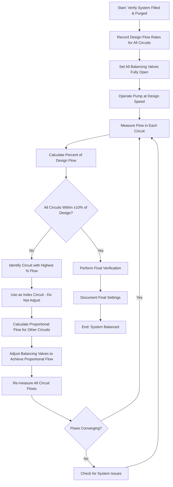
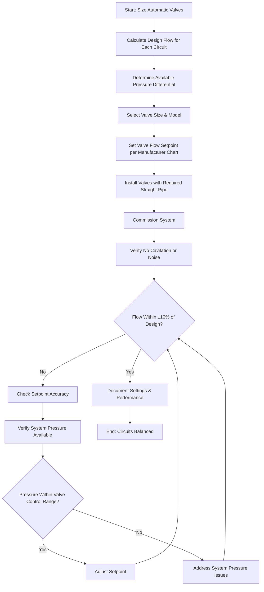

## Hydronic Balancing Fundamentals

Hydronic system balancing ensures each terminal unit receives design flow rates at design pressure differentials. Proper balancing maximizes heat transfer efficiency, minimizes pump energy consumption, and eliminates comfort complaints. The process requires systematic measurement, adjustment, and verification following established protocols.

ASHRAE Standard 111 defines procedures for Testing, Adjusting, and Balancing (TAB) of hydronic systems. Balancing must account for system diversity, control valve authority, and pump performance characteristics to achieve stable operation across all load conditions.

## Proportional Balancing Method

The proportional balancing method adjusts flow rates sequentially from the pump outward, establishing proper flow relationships between parallel circuits. This approach minimizes iterations and reduces balancing time compared to rated flow methods.

### Proportional Balancing Sequence

**Proportional Calculation**

For each circuit requiring adjustment:

**Target Flow (Iteration N) = Design Flow × (Actual Index Flow / Design Index Flow)**

This maintains flow relationships while the system converges toward design conditions. Typically achieves balance within 3-5 iterations.

### Proportional Balancing Advantages

- Fewer measurement iterations required
- Less sensitive to pump curve variations
- Maintains circuit relationships throughout process
- Suitable for complex multi-zone systems
- Accommodates diversity factors naturally

## Automatic Balancing Valves

Automatic (pressure-independent) balancing valves combine flow regulation with pressure compensation, maintaining constant flow regardless of system pressure fluctuations. These valves reduce balancing labor and improve control valve performance.

### Automatic Valve Operating Principles

Automatic balancing valves contain an integral differential pressure regulator that adjusts valve position to maintain constant downstream pressure. A fixed orifice or adjustable cartridge establishes the flow rate. The pressure regulator absorbs system pressure variations, ensuring stable flow delivery.

**Key Performance Parameters:**

| Parameter | Typical Range | Application Impact |
|-----------|---------------|-------------------|
| Control Range | 5-50 psid | Maximum pressure differential valve can regulate |
| Flow Range | 0.1-20 gpm | Adjustable flow setting range |
| Accuracy | ±5% to ±10% | Flow deviation from setpoint |
| Authority | 0.3-0.5 minimum | Control valve authority with ABV |
| Pressure Drop | 3-10 psi | Operating pressure loss at design flow |

### Automatic Balancing Valve Selection

Select automatic balancing valves based on:

1. **Flow capacity** - Valve must accommodate design flow within adjustable range
2. **Pressure differential** - Available ΔP must fall within valve control range
3. **Control valve compatibility** - Ensure adequate authority for terminal control valve
4. **Accuracy requirements** - Critical applications may require ±5% accuracy
5. **Installation constraints** - Straight pipe requirements, accessibility

### Circuit Balancing with Automatic Valves

**Setpoint Determination:**

Manufacturers provide flow coefficient charts or setting dials calibrated for specific flow rates. Accurate setpoint adjustment requires:

- Verification of valve orientation (flow direction)
- Use of manufacturer's setting tool or chart
- Confirmation of upstream/downstream pressure ports
- Documentation of cartridge position or dial setting

## Circuit Balancing Strategies

### Series Circuit Balancing

For circuits with multiple coils in series (cascade arrangements), balance from the furthest element backward toward the pump. Each balancing valve compensates for upstream resistance, ensuring proper flow distribution.

### Parallel Circuit Balancing

Parallel circuits require simultaneous consideration of all branches. Identify the index circuit (highest resistance path) and use proportional balancing to adjust remaining circuits relative to the index.

### Reverse Return vs. Direct Return

**Reverse return systems** theoretically self-balance if pipe sizes are correct. Verify flow rates but expect minimal balancing valve adjustment. Check for installation errors if significant throttling is required.

**Direct return systems** exhibit inherent imbalance favoring circuits nearest the pump. These require more aggressive balancing valve throttling on near circuits and minimal adjustment on far circuits.

## System Optimization

### Pump Speed Adjustment

After achieving proportional flow balance, optimize pump speed to minimize energy consumption. If the index circuit balancing valve is more than 50% closed, reduce pump speed and re-verify flows. Target 3-7 psi pressure drop across index circuit balancing valve for proper control authority and measurement accuracy.

### Control Valve Authority

Verify control valve authority at each terminal:

**Authority (N) = ΔP_valve_wide_open / ΔP_total_circuit**

Minimum authority of 0.25-0.30 ensures stable control. Low authority causes poor controllability and hunting. Adjust balancing valves to increase circuit resistance if necessary.

### Diversity Considerations

Systems designed with diversity factors (not all terminals at full load simultaneously) may show total flow below sum of individual design flows. Verify diversity assumptions with owner and designer before adjusting pump output.

## Field Measurement Techniques

**Flow measurement methods:**

- **Balancing valve readout** - Most accurate when properly calibrated
- **Venturi/orifice plates** - Fixed pressure drop devices
- **Ultrasonic flowmeters** - Clamp-on non-intrusive measurement
- **Temperature differential** - Heat transfer calculation (Q = 500 × GPM × ΔT)

**Pressure differential measurement:**

Use calibrated differential pressure gauges or manometers with ±0.25% accuracy. Ensure test ports are properly installed per manufacturer requirements—typically 5-10 pipe diameters straight pipe upstream.

## Documentation Requirements

Complete balancing documentation includes:

- Initial and final flow measurements for all circuits
- Balancing valve positions (turns from closed or setpoint settings)
- Pump operating conditions (speed, power, pressure)
- Control valve positions during balancing
- System pressure readings at key locations
- Calculated system diversity
- Deficiencies identified during balancing
- Final system curve analysis

ASHRAE Standard 111 specifies reporting formats and tolerances. Acceptable final tolerance is typically ±10% of design flow for individual circuits, with total system flow within ±5% of design.

## Common Balancing Challenges

**Insufficient pump pressure** - Index circuit cannot achieve design flow even with balancing valve fully open. Requires pump modification or system redesign.

**Excessive pump pressure** - All balancing valves significantly throttled. Reduce pump speed or impeller diameter to improve efficiency.

**Control valve interaction** - Automatic control valves modulating during balancing cause erratic readings. Lock valves in fixed position or coordinate with controls contractor.

**Air in system** - Interferes with flow measurement and causes unstable readings. Re-purge system before continuing balancing.

**Cavitation** - Excessive throttling causes noise and valve damage. Increase valve size or reduce upstream pressure.

---

**References:**
- ASHRAE Standard 111: Measurement, Testing, Adjusting, and Balancing of Building HVAC Systems
- ASHRAE Handbook—HVAC Systems and Equipment, Chapter on Hydronic Heating and Cooling
- Hydronic Institute balancing standards and guidelines
